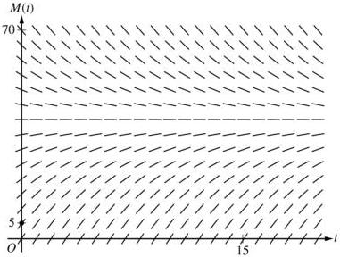
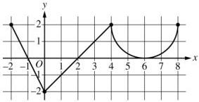

<!-- Page 1 -->

2023

# AP® Calculus AB
## Free-Response Questions

© 2023 College Board. College Board, Advanced Placement, AP, AP Central, and the acorn logo are registered trademarks of College Board. Visit College Board on the web: collegeboard.org.

AP Central is the official online home for the AP Program: apcentral.collegeboard.org.

<!-- Page 2 -->

AP® Calculus AB 2023 Free-Response Questions

# **CALCULUS AB**

# **SECTION II, Part A**

Time—30 minutes

2 Questions

**A GRAPHING CALCULATOR IS REQUIRED FOR THESE QUESTIONS.**

© 2023 College Board.  
Visit College Board on the web: collegeboard.org.

2

**GO ON TO THE NEXT PAGE.**

<!-- Page 3 -->

AP® Calculus AB 2023 Free-Response Questions

|  *t* (seconds) | 0 | 60 | 90 | 120 | 135 | 150  |
| --- | --- | --- | --- | --- | --- | --- |
|  *f(t)* (gallons per second) | 0 | 0.1 | 0.15 | 0.1 | 0.05 | 0  |

1. A customer at a gas station is pumping gasoline into a gas tank. The rate of flow of gasoline is modeled by a differentiable function $f$, where $f(t)$ is measured in gallons per second and $t$ is measured in seconds since pumping began. Selected values of $f(t)$ are given in the table.

(a) Using correct units, interpret the meaning of $\int_{60}^{135} f(t) \, dt$ in the context of the problem. Use a right Riemann sum with the three subintervals [60, 90], [90, 120], and [120, 135] to approximate the value of $\int_{60}^{135} f(t) \, dt$.

(b) Must there exist a value of $c$, for $60 < c < 120$, such that $f'(c) = 0$? Justify your answer.

(c) The rate of flow of gasoline, in gallons per second, can also be modeled by $g(t) = \left(\frac{t}{500}\right) \cos\left(\left(\frac{t}{120}\right)^2\right)$ for $0 \le t \le 150$. Using this model, find the average rate of flow of gasoline over the time interval $0 \le t \le 150$.

Show the setup for your calculations.

(d) Using the model $g$ defined in part (c), find the value of $g'(140)$. Interpret the meaning of your answer in the context of the problem.

Write your responses to this question only on the designated pages in the separate Free Response booklet. Write your solution to each part in the space provided for that part.

© 2023 College Board.

Visit College Board on the web: collegeboard.org.

3

GO ON TO THE NEXT PAGE.

<!-- Page 4 -->

AP® Calculus AB 2023 Free-Response Questions

2. Stephen swims back and forth along a straight path in a 50-meter-long pool for 90 seconds. Stephen's velocity is modeled by $v(t) = 2.38e^{-0.02t}\sin\left(\frac{\pi}{56}t\right)$, where $t$ is measured in seconds and $v(t)$ is measured in meters per second.

(a) Find all times $t$ in the interval $0 < t < 90$ at which Stephen changes direction. Give a reason for your answer.
(b) Find Stephen's acceleration at time $t = 60$ seconds. Show the setup for your calculations, and indicate units of measure. Is Stephen speeding up or slowing down at time $t = 60$ seconds? Give a reason for your answer.
(c) Find the distance between Stephen's position at time $t = 20$ seconds and his position at time $t = 80$ seconds. Show the setup for your calculations.
(d) Find the total distance Stephen swims over the time interval $0 \le t \le 90$ seconds. Show the setup for your calculations.

Write your responses to this question only on the designated pages in the separate Free Response booklet. Write your solution to each part in the space provided for that part.

© 2023 College Board.

Visit College Board on the web: collegeboard.org.

4

GO ON TO THE NEXT PAGE.

<!-- Page 5 -->

AP® Calculus AB 2023 Free-Response Questions

END OF PART A

© 2023 College Board.
Visit College Board on the web: collegeboard.org.

5

<!-- Page 6 -->

AP® Calculus AB 2023 Free-Response Questions

# CALCULUS AB

# SECTION II, Part B

Time—1 hour

4 Questions

NO CALCULATOR IS ALLOWED FOR THESE QUESTIONS.

© 2023 College Board.
Visit College Board on the web: collegeboard.org.

6

<!-- Page 7 -->

AP® Calculus AB 2023 Free-Response Questions

3. A bottle of milk is taken out of a refrigerator and placed in a pan of hot water to be warmed. The increasing function $M$ models the temperature of the milk at time $t$, where $M(t)$ is measured in degrees Celsius ($^\circ$C) and $t$ is the number of minutes since the bottle was placed in the pan. $M$ satisfies the differential equation $\frac{dM}{dt} = \frac{1}{4}(40 - M)$. At time $t = 0$, the temperature of the milk is $5^\circ$C. It can be shown that $M(t) < 40$ for all values of $t$.

(a) A slope field for the differential equation $\frac{dM}{dt} = \frac{1}{4}(40 - M)$ is shown. Sketch the solution curve through the point $(0, 5)$.

(b) Use the line tangent to the graph of \( M \) at \( t = 0 \) to approximate \( M(2) \), the temperature of the milk at time \( t = 2 \) minutes.
(c) Write an expression for \(\frac{d^2M}{dt^2}\) in terms of \(M\). Use \(\frac{d^2M}{dt^2}\) to determine whether the approximation from part (b) is an underestimate or an overestimate for the actual value of \(M(2)\). Give a reason for your answer.
(d) Use separation of variables to find an expression for \( M(t) \), the particular solution to the differential equation \( \frac{dM}{dt} = \frac{1}{4}(40 - M) \) with initial condition \( M(0) = 5 \).

Write your responses to this question only on the designated pages in the separate Free Response booklet. Write your solution to each part in the space provided for that part.

© 2023 College Board.

Visit College Board on the web: collegeboard.org.

7

GO ON TO THE NEXT PAGE.

<!-- Page 8 -->

AP® Calculus AB 2023 Free-Response Questions

Graph of $f'$

4. The function $f$ is defined on the closed interval $[-2, 8]$ and satisfies $f(2) = 1$. The graph of $f'$, the derivative of $f$, consists of two line segments and a semicircle, as shown in the figure.

(a) Does $f$ have a relative minimum, a relative maximum, or neither at $x = 6$? Give a reason for your answer.
(b) On what open intervals, if any, is the graph of $f$ concave down? Give a reason for your answer.
(c) Find the value of $\lim_{x \to 2} \frac{6f(x) - 3x}{x^2 - 5x + 6}$, or show that it does not exist. Justify your answer.
(d) Find the absolute minimum value of $f$ on the closed interval $[-2, 8]$. Justify your answer.

Write your responses to this question only on the designated pages in the separate Free Response booklet. Write your solution to each part in the space provided for that part.

© 2023 College Board.

Visit College Board on the web: collegeboard.org.

8

GO ON TO THE NEXT PAGE.

<!-- Page 9 -->

AP® Calculus AB 2023 Free-Response Questions

|  x | 0 | 2 | 4 | 7  |
| --- | --- | --- | --- | --- |
|  f(x) | 10 | 7 | 4 | 5  |
|  f'(x) | 3/2 | -8 | 3 | 6  |
|  g(x) | 1 | 2 | -3 | 0  |
|  g'(x) | 5 | 4 | 2 | 8  |

5. The functions f and g are twice differentiable. The table shown gives values of the functions and their first derivatives at selected values of x.

(a) Let h be the function defined by h(x) = f(g(x)). Find h'(7). Show the work that leads to your answer.
(b) Let k be a differentiable function such that k'(x) = (f(x))^2 · g(x). Is the graph of k concave up or concave down at the point where x = 4? Give a reason for your answer.
(c) Let m be the function defined by m(x) = 5x^3 + ∫_0^x f'(t) dt. Find m(2). Show the work that leads to your answer.
(d) Is the function m defined in part (c) increasing, decreasing, or neither at x = 2? Justify your answer.

Write your responses to this question only on the designated pages in the separate Free Response booklet. Write your solution to each part in the space provided for that part.

© 2023 College Board.

Visit College Board on the web: collegeboard.org.

9

GO ON TO THE NEXT PAGE.

<!-- Page 10 -->

AP® Calculus AB 2023 Free-Response Questions

6. Consider the curve given by the equation $6xy = 2 + y^3$.

(a) Show that $\frac{dy}{dx} = \frac{2y}{y^2 - 2x}$.
(b) Find the coordinates of a point on the curve at which the line tangent to the curve is horizontal, or explain why no such point exists.
(c) Find the coordinates of a point on the curve at which the line tangent to the curve is vertical, or explain why no such point exists.
(d) A particle is moving along the curve. At the instant when the particle is at the point $\left(\frac{1}{2}, -2\right)$, its horizontal position is increasing at a rate of $\frac{dx}{dt} = \frac{2}{3}$ unit per second. What is the value of $\frac{dy}{dt}$, the rate of change of the particle's vertical position, at that instant?

Write your responses to this question only on the designated pages in the separate Free Response booklet. Write your solution to each part in the space provided for that part.

© 2023 College Board.
Visit College Board on the web: collegeboard.org.

10

GO ON TO THE NEXT PAGE.

<!-- Page 11 -->

AP® Calculus AB 2023 Free-Response Questions

# **STOP**

# **END OF EXAM**

© 2023 College Board.
Visit College Board on the web: collegeboard.org.

11
