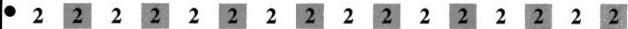
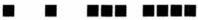
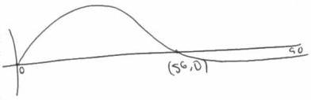
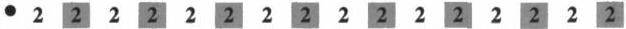
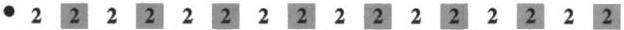

<!-- Page 1 -->

2023

AP®

# AP® Calculus AB
## Sample Student Responses and Scoring Commentary

### Inside:

Free-Response Question 2

- ☑ Scoring Guidelines
- ☑ Student Samples
- ☑ Scoring Commentary

© 2023 College Board. College Board, Advanced Placement, AP, AP Central, and the acorn logo are registered trademarks of College Board. Visit College Board on the web: collegeboard.org.

AP Central is the official online home for the AP Program: apcentral.collegeboard.org.

<!-- Page 2 -->

AP® Calculus AB/BC 2023 Scoring Guidelines

## Part A (AB): Graphing calculator required

### Question 2

9 points

#### General Scoring Notes

The model solution is presented using standard mathematical notation.

Answers (numeric or algebraic) need not be simplified. Answers given as a decimal approximation should be correct to three places after the decimal point. Within each individual free-response question, at most one point is not earned for inappropriate rounding.

Stephen swims back and forth along a straight path in a 50-meter-long pool for 90 seconds. Stephen's velocity is modeled by \( v(t) = 2.38e^{-0.02t}\sin \left(\frac{\pi}{56} t\right) \), where \( t \) is measured in seconds and \( v(t) \) is measured in meters per second.

|  Model Solution | Scoring  |   |
| --- | --- | --- |
|  (a) Find all times \( t \) in the interval \( 0 < t < 90 \) at which Stephen changes direction. Give a reason for your answer.  |   |   |
|  For \( 0 < t < 90 \), \( v(t) = 0 \Rightarrow t = 56 \). | Considers sign of \( v(t) \) | 1 point  |
|  Stephen changes direction when his velocity changes sign. This occurs at \( t = 56 \) seconds. | Answer with reason | 1 point  |

##### Scoring notes:

- A response that considers \( v(t) = 0 \) earns the first point.
- A response of “Stephen changes direction when his velocity changes sign” earns the first point for considering the sign of  \( v(t) \)  but must include the answer of t = 56 in order to earn the second point.
- A response of \( t = 56 \) with no supporting work does not earn either point.
- Any presented values of \( t \) outside the interval \( 0 < t < 90 \) will not affect scoring.

Total for part (a) 2 points

(b) Find Stephen's acceleration at time \( t = 60 \) seconds. Show the setup for your calculations, and indicate units of measure. Is Stephen speeding up or slowing down at time \( t = 60 \) seconds? Give a reason for your answer.

\[
v ^ {\prime} (6 0) = a (6 0) = - 0. 0 3 6 0 1 6 2
\]

Stephen's acceleration at time \( t = 60 \) seconds is -0.036 meter per second per second.

|  a(60) with setup | 1 point  |
| --- | --- |
|  Acceleration units | 1 point  |

© 2023 College Board

<!-- Page 3 -->

AP® Calculus AB/BC 2023 Scoring Guidelines

$$v(60) = -0.1595124 < 0$$

Speeding up with reason

1 point

Stephen is speeding up at time $t = 60$ seconds because Stephen's velocity and acceleration are both negative at that time.

**Scoring notes:**

- The minimum work needed to earn the first point is $v'(60) = -0.036$.
  - $a(60) = -0.0360162$ is not sufficient to earn the first point. The connection $v'(t) = a(t)$ or $v'(60) = a(60)$ must be explicitly shown.
- A response must declare a value for $a(60)$ to be eligible for the second point.
- In order to earn the third point the presented conclusion must be consistent with a negative velocity at time $t = 60$ and the presented value of $a(60)$.
- A response does not need to find the value of $v(60)$; an implied sign is sufficient.
  - The statement "Stephen is speeding up because $a(60)$ and $v(60)$ have the same sign" (or equivalent) earns the third point, provided a negative value is presented for $a(60)$.
- A response that reports an incorrect sign or value of $v(60)$ does not earn the third point. Any presented value of $v(60)$ must be correct for the number of digits presented, from one up to three decimal places in order to earn the third point.
- Degree mode: A response that presents answers obtained by using a calculator in degree mode does not earn the first point it would have otherwise earned. The response is eligible for all subsequent points (unless no answer is possible in degree mode or the question is made simpler by using degree mode).
  - In degree mode, there are two possible values for $v'(60)$. A response that declares $v'(60) = -0.000141$ does not earn the first point but would earn the third point in the presence of $v(60) = 0.042089$ or $v(60) > 0$ and the conclusion that Stephen is slowing down.
  - Similarly, a response that declares $v'(60) = 0.039304$ does not earn the first point but would earn the third point in the presence of $v(60) = 0.042089$ or $v(60) > 0$ and the conclusion that Stephen is speeding up.

**Total for part (b) 3 points**

(c) Find the distance between Stephen's position at time $t = 20$ seconds and his position at time $t = 80$ seconds. Show the setup for your calculations.

$$\int_{20}^{80} v(t) \, dt$$

$$= 23.383997$$

Integral

1 point

Answer

1 point

The distance between Stephen's positions at $t = 20$ seconds and $t = 80$ seconds is 23.384 (or 23.383) meters.

© 2023 College Board

<!-- Page 4 -->

AP® Calculus AB/BC 2023 Scoring Guidelines

# Scoring notes:

- The first point is earned only for $$\int_{20}^{80} v(t) \, dt$$ (or the equivalent) with or without the differential.
- The second point is earned only for an answer of 23.384 (or 23.383) regardless of whether the first point was earned.
- Degree mode: In degree mode, $$\int_{20}^{80} v(t) \, dt = 2.407982$$.

Total for part (c) 2 points

(d) Find the total distance Stephen swims over the time interval $$0 \le t \le 90$$ seconds. Show the setup for your calculations.

|  $$\int_{0}^{90} |v(t)| \, dt$$ | Integral | 1 point  |
| --- | --- | --- | --- | --- |
|  = 62.164216 | Answer | 1 point  |
|  The total distance Stephen swims over the time interval $$0 \le t \le 90$$ seconds is 62.164 meters. |  |   |

# Scoring notes:

- The first point is earned only for $$\int_{0}^{90} |v(t)| \, dt$$ or $$\int_{0}^{56} v(t) \, dt - \int_{56}^{90} v(t) \, dt$$ (or the equivalent), with or without the differential(s).
- The second point is earned only for an answer of 62.164 regardless of whether the first point was earned.
- Degree mode: In degree mode, $$\int_{0}^{90} |v(t)| \, dt = 3.127892$$.

Total for part (d) 2 points

Total for question 2 9 points

© 2023 College Board

<!-- Page 5 -->

1 of 2

Sample 2A

2 2 2 2 2 2 2 2 2 2 2 2 2 2 2 2 2 2 2

Answer QUESTION 2 parts (a) and (b) on this page.

Response for question 2(a)

Changes directions

$$V(t) = 0 \text{ and changes signs}$$

$$t = 56 \text{ second}$$

At t = 56 seconds Stephen changes

directions because V(t) = 0 and

changes signs.

Response for question 2(b)

$$V'(t) = a(t)$$

$$V'(t) \bigg|_{x=60} = -0.0360 \text{ meters/second}^2$$

$$a(60) = -0.0360 \text{ meters/second}^2$$

$$V(60) = -0.1595 \text{ meters/second}$$

Stephen is speeding up at t = 60 seconds because a(t) and V(t) have the same sign.

Page 6

Use a pencil or a pen with black or dark blue ink. Do NOT write your name. Do NOT write outside the box.

Q5216/6

<!-- Page 6 -->

2 of 2

Sample 2A

Answer QUESTION 2 parts (c) and (d) on this page.

Response for question 2(c)

$$\int_{20}^{80} v(t) \, dt = 23.384 \text{ meters}$$

The distance between stephens position at t=20 sec and position at t=80 sec. is 23.384 meters.

Response for question 2(d)

$$\int_{0}^{90} |v(t)| \, dt = 62.164 \text{ meters}$$

Stephen swims a total distance of 62.164 meters over the time interval $0 \le t \le 90$ seconds.

Page 7

Use a pencil or a pen with black or dark blue ink. Do NOT write your name. Do NOT write outside the box.

0031634

Q5218/7

<!-- Page 7 -->

1 of 2

Sample 2B

2 2 2 2 2 2 2 2 2 2 2 2 2 2 2 2 2 2

Answer QUESTION 2 parts (a) and (b) on this page.

Response for question 2(a)

The only time that stephen changes direction
is when t=56 wich means that stephen
changes his velocity from being positive
to being negative

Response for question 2(b)

$$V(t) = 2.38e^{-0.02t} \sin \left( \frac{k}{56} x \right)$$

$$V(60) = -0.159512^{m/s}$$

$$V'(60) = -0.036016^{m/s^2}$$

Stephen at the time of 60 second he is speeding
up towards the negative direction because V(60)
is negative and V'(60) is also negative

Page 6

Use a pencil or a pen with black or dark blue ink. Do NOT write your name. Do NOT write outside the box.

Q5171/6

<!-- Page 8 -->

2 of 2

Sample 2B

Answer QUESTION 2 parts (c) and (d) on this page.

Response for question 2(c)

$$\int_{0}^{20} v(t) \approx 18.5887 \int_{0}^{80} v(t) = 41.4437$$

$$\int_{0}^{20} v(t) \approx 18.5887 \text{ meters}$$ the position at time 20 is equal to 18.5887

$$\int_{0}^{80} v(t) \approx 41.4437$$ the position at time 80 is 41.4437 meters

the distance between those position is 23.0892 meters

Response for question 2(d)

The total distance

$$\int_{0}^{\infty} f(x) \, dx \text{ is } 37.2041 \text{ m}$$

Page 7

Use a pencil or a pen with black or dark blue ink. Do NOT write your name. Do NOT write outside the box.

0140107

Q8171/7

<!-- Page 9 -->

1 of 2

Sample 2C

2 2 2 2 2 2 2 2 2 2 2 2 2 2 2 2 2

Answer QUESTION 2 parts (a) and (b) on this page.

Response for question 2(a)

$$v(t) = 2.38e^{-0.02t} \sin(\frac{\pi}{56}t)$$

$$\phi = 52.273$$

$$t = \boxed{52.273}$$

v(t) changes from positive to negative

Response for question 2(b)

$$v'(t) = -0.467$$

Stephen is ~~speeding up~~ slowing down because his velocity is positive while his acceleration is negative.

Page 6

Use a pencil or a pen with black or dark blue ink. Do NOT write your name. Do NOT write outside the box.

Q5216/6

<!-- Page 10 -->

2 of 2

Sample 2C

Answer QUESTION 2 parts (c) and (d) on this page.

Response for question 2(c)

$$v(t) = 2.38e^{-0.02t} \sin(\frac{\pi}{56}t)$$

$$\int_{0}^{80} (2.38e^{-0.02t} \sin(\frac{\pi}{56}t)) dt - \int_{0}^{20} (2.38e^{-0.02t} \sin(\frac{\pi}{56}t)) dt$$

Response for question 2(d)

$$\int_{0}^{90} 2.38e^{-0.02t} \sin(\frac{\pi}{56}t)$$

Page 7

Use a pencil or a pen with black or dark blue ink. Do NOT write your name. Do NOT write outside the box.

0118433

Q8216/7

<!-- Page 11 -->

AP® Calculus AB 2023 Scoring Commentary

## Question 2

**Note:** Student samples are quoted verbatim and may contain spelling and grammatical errors.

### Overview

In this problem students were told that Stephen is swimming back and forth along a straight path in a 50-meter pool for 90 seconds with a velocity modeled by the function $v(t) = 2.38e^{-0.02t} \sin\left(\frac{\pi}{56}t\right)$. Here $t$ is measured in seconds and $v(t)$ is measured in meters per second.

In part (a) students were asked to find all times $t$ in the interval $0 < t < 90$ at which Stephen changes direction. A correct response will indicate understanding that Stephen changes direction when his velocity changes sign. Based on the model for velocity, it is clear that $v(56) = 0$, and a calculator could be used to confirm that $v(t)$ does change sign at this time.

In part (b) students were asked to find Stephen's acceleration at time $t = 60$ seconds and to indicate units of measure. Then students were asked to provide a reason for whether Stephen was speeding up or slowing down at this time. A correct response will communicate that Stephen's acceleration is the derivative of his velocity and will use a calculator to find $a(60) = v'(60) = -0.036$ meter per second per second. Then the response will evaluate the given velocity function at $t = 60$ in order to determine that $v(60)$ is also negative and conclude that, because the velocity and acceleration have the same sign at $t = 60$, Stephen must be speeding up.

In part (c) students were asked to find the distance between Stephen's position at time $t = 20$ seconds and his position at time $t = 80$ seconds. A correct response will show the calculator setup $\int_{20}^{80} v(t) \, dt$, with a numerical answer of 23.384 meters.

In part (d) students were asked to find the total distance Stephen swims over the time interval from $t = 0$ to $t = 90$ seconds. A correct response will provide the setup $\int_0^{90} |v(t)| \, dt$ and use a calculator to find the total distance is 62.164 meters.

### Sample: 2A

#### Score: 9

The response earned 9 points: 2 points in part (a), 3 points in part (b), 2 points in part (c), and 2 points in part (d).

In part (a) the response earned the first point with the equation $v(t) = 0$ in line 2. The statements, "changes directions," "$v(t) = 0$ and changes signs," and "$t = 56$," in lines 1, 2, 3, and 4 would have earned the second point; a summary statement is not required. In this case, the response correctly states, "At $t = 56$ seconds Stephen changes directions because $v(t) = 0$ and changes signs," so the second point was earned.

In part (b) the response earned the first point with the answer of $-0.0360$ in line 2, given that the response explicitly makes the connection $v'(t) = a(t)$ in line 1. The use of $x = 60$ instead of $t = 60$ in line 2 does not affect scoring.

The second point was earned with the acceleration units of meters/second$^2$ in line 2. The response would have earned the third point with the sentence, "Stephen is speeding up at $t = 60$ seconds because $a(t)$ and $v(t)$ have the

© 2023 College Board.

Visit College Board on the web: collegeboard.org.

<!-- Page 12 -->

AP® Calculus AB 2023 Scoring Commentary

## Question 2 (continued)

same sign,” without declaring a numerical value of $v(60)$. In this case, the response correctly declares $v(60) = -0.1595$ in line 4, so the third point was earned.

In part (c) the response earned the first point with the definite integral $\int_{20}^{80} v(t) \, dt$ in line 1. The answer of 23.384 in line 1 would have earned the second point; a summary statement is not required. In this case, the response correctly states, “The distance between Stephen’s position at $t = 20$ sec and position at $t = 80$ sec. is 23.384 meters,” so the second point was earned.

In part (d) the response earned the first point with the definite integral $\int_{0}^{90} |v(t)| \, dt$ in line 1. The response would have earned the second point with the answer of 62.164 in line 1; a summary statement is not required. In this case, the response correctly states, “Stephen swims a total distance of 62.164 meters over the time interval $0 \leq t \leq 90$ seconds,” so the second point was earned.

**Sample: 2B**

**Score: 5**

The response earned 5 points: 2 points in part (a), 3 points in part (b), no points in part (c), and no points in part (d).

In part (a) the response earned the first point for the statement, “Stephen changes his velocity from being positive to being negative,” in lines 2, 3, and 4. The second point was earned for the answer of $t = 56$ in the presence of correct reasoning.

In part (b) the response earned the first point with $v'(60) = -0.036016$ in line 3. The second point was earned for the correct acceleration units of $\frac{m}{s^2}$ in line 3. The response would have earned the third point with the statement, “he is speeding up towards the negative direction because $v(60)$ is negative and $v'(60)$ is also negative.” A declared value for $v(60)$ is not required; an implied sign is sufficient. In this case, the response correctly declares that $v(60) = -0.159512$ in line 2, so the third point was earned.

In part (c) the response did not earn the first point because the definite integral $\int_{20}^{80} v(t) \, dt$ (or the equivalent) is not presented, and the declared answer of 23.0842 in line 4 is not the difference of the two presented values $\int_{0}^{80} v(t) \, dt = 41.4437$ and $\int_{0}^{20} v(t) \, dt = 18.5887$ in line 1. If the answer presented were the difference of the presented values of $\int_{0}^{80} v(t) \, dt$ and $\int_{0}^{20} v(t) \, dt$, the response would have earned the first point. The second point was not earned because the answer 23.0892 in line 4 is incorrect.

In part (d) the response did not earn the first point because the presented definite integral is incorrect. The second point was not earned because the answer 37.2041 in line 1 is incorrect.

**Sample: 2C**

**Score: 2**

The response earned 2 points: 1 point in part (a), no points in part (b), 1 point in part (c), and no points in part (d).

© 2023 College Board.  
Visit College Board on the web: collegeboard.org.

<!-- Page 13 -->

AP® Calculus AB 2023 Scoring Commentary

## Question 2 (continued)

In part (a) the response earned the first point with the statement, “ $v(t)$ changes from positive to negative,” in line 4. The second point was not earned because the boxed answer of 52.273 is incorrect.

In part (b) the response did not earn the first point because the declared answer of $-0.467$ is incorrect. Even in the presence of the correct answer, the presentation of $v'(t)$ instead of $v'(60)$ would not have earned the first point. However, a response that reports a value for $v'(t)$ instead of $v'(60)$ is still eligible for both the second and third points. The second point was not earned because units for acceleration are not declared. The response incorrectly states that velocity is positive in line 3, so the third point was not earned.

In part (c) the response earned the first point with the expression:

$$\int_0^{80} \left( 2.38e^{-0.02t} \sin\left(\frac{\pi}{56}t\right) \right) dt - \int_0^{20} \left( 2.38e^{-0.02t} \sin\left(\frac{\pi}{56}t\right) \right) dt.$$ The response does not present an answer, so the second point was not earned.

In part (d) the response did not earn the first point because the integral presented is incorrect due to the absence of absolute value bars in the integrand. The missing differential in the integrand does not affect scoring. The response does not present an answer, so the second point was not earned.

© 2023 College Board.

Visit College Board on the web: collegeboard.org.
