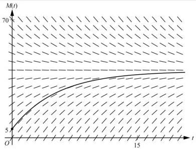
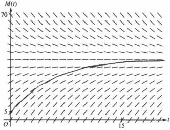
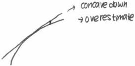
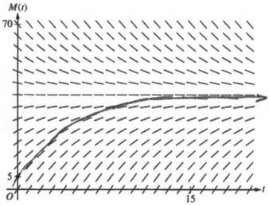
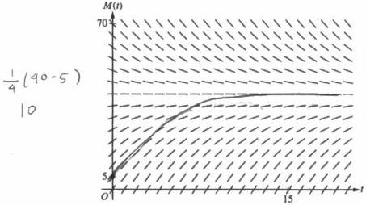

<!-- Page 1 -->

2023

AP®

# AP® Calculus AB
## Sample Student Responses and Scoring Commentary

### Inside:

Free-Response Question 3

- ☑ Scoring Guidelines
- ☑ Student Samples
- ☑ Scoring Commentary

© 2023 College Board. College Board, Advanced Placement, AP, AP Central, and the acorn logo are registered trademarks of College Board. Visit College Board on the web: collegeboard.org.

AP Central is the official online home for the AP Program: apcentral.collegeboard.org.

<!-- Page 2 -->

AP® Calculus AB/BC 2023 Scoring Guidelines

## Part B (AB or BC): Graphing calculator not allowed

### Question 3

9 points

#### General Scoring Notes

The model solution is presented using standard mathematical notation.

Answers (numeric or algebraic) need not be simplified. Answers given as a decimal approximation should be correct to three places after the decimal point. Within each individual free-response question, at most one point is not earned for inappropriate rounding.

A bottle of milk is taken out of a refrigerator and placed in a pan of hot water to be warmed. The increasing function $M$ models the temperature of the milk at time $t$, where $M(t)$ is measured in degrees Celsius ($^{\circ}\mathrm{C}$) and $t$ is the number of minutes since the bottle was placed in the pan. $M$ satisfies the differential equation $\frac{dM}{dt} = \frac{1}{4}(40 - M)$. At time $t = 0$, the temperature of the milk is $5^{\circ}\mathrm{C}$. It can be shown that $M(t) < 40$ for all values of $t$.

Model Solution

Scoring

(a)

A slope field for the differential equation $\frac{dM}{dt} = \frac{1}{4}(40 - M)$ is shown. Sketch the solution curve through the point $(0, 5)$.

Solution curve

1 point

Scoring notes:

- The solution curve must pass through the point $(0, 5)$, extend reasonably close to the left and right edges of the rectangle, and have no obvious conflicts with the given slope lines.
- Only portions of the solution curve within the given slope field are considered.
- The solution curve must lie entirely below the horizontal line segments at $M = 40$.

Total for part (a)

1 point

© 2023 College Board

<!-- Page 3 -->

AP® Calculus AB/BC 2023 Scoring Guidelines

(b) Use the line tangent to the graph of M at t = 0 to approximate M(2), the temperature of the milk at time t = 2 minutes.

|  $$\left. \frac{dM}{dt} \right|_{t=0} = \frac{1}{4}(40 - 5) = \frac{35}{4}$$ | $$\left. \frac{dM}{dt} \right|_{t=0}$$ | 1 point  |
| --- | --- | --- | --- | --- |
|  The tangent line equation is $$y = 5 + \frac{35}{4}(t - 0)$$. $$M(2) \approx 5 + \frac{35}{4} \cdot 2 = 22.5$$ The temperature of the milk at time t = 2 minutes is approximately 22.5° Celsius. | Approximation | 1 point  |

# Scoring notes:

- The value of the slope may appear in a tangent line equation or approximation.
- A response of $$5 + \frac{35}{4} \cdot 2$$ is the minimal response to earn both points.
- A response of $$\frac{1}{4}(40 - 5)$$ earns the first point. If there are any subsequent errors in simplification, the response does not earn the second point.
- In order to earn the second point the response must present an approximation found by using a tangent line that:
  - passes through the point (0, 5) and
  - has slope $$\frac{35}{4}$$ or a nonzero slope that is declared to be the value of $$\frac{dM}{dt}$$.
- An unsupported approximation does not earn the second point.
- The approximation need not be simplified, but the response does not earn the second point if the approximation is simplified incorrectly.

Total for part (b) 2 points

(c) Write an expression for $$\frac{d^2M}{dt^2}$$ in terms of M. Use $$\frac{d^2M}{dt^2}$$ to determine whether the approximation from part (b) is an underestimate or an overestimate for the actual value of M(2). Give a reason for your answer.

|  $$\frac{d^2M}{dt^2} = -\frac{1}{4} \frac{dM}{dt} = -\frac{1}{4} \left( \frac{1}{4}(40 - M) \right) = -\frac{1}{16}(40 - M)$$ | $$\frac{d^2M}{dt^2}$$ | 1 point  |
| --- | --- | --- |
|  Because M(t) < 40, $$\frac{d^2M}{dt^2} < 0$$, so the graph of M is concave down. Therefore, the tangent line approximation of M(2) is an overestimate. | Overestimate with reason | 1 point  |

© 2023 College Board

<!-- Page 4 -->

AP® Calculus AB/BC 2023 Scoring Guidelines

# Scoring notes:

- The first point is earned for either $$\frac{d^2M}{dt^2} = -\frac{1}{4}\left(\frac{1}{4}(40 - M)\right)$$ or $$\frac{d^2M}{dt^2} = -\frac{1}{16}(40 - M)$$ (or equivalent). A response that presents any subsequent simplification error does not earn the second point.
- A response that presents an expression for $$\frac{d^2M}{dt^2}$$ in terms of $$\frac{dM}{dt}$$ but fails to continue to an expression in terms of $$M$$ (i.e., $$\frac{d^2M}{dt^2} = -\frac{1}{4}\frac{dM}{dt}$$) does not earn the first point but is eligible for the second point.
- If the response presents an expression for $$\frac{d^2M}{dt^2}$$ that is incorrect, the response is eligible for the second point only if the expression is a nonconstant linear function that is negative for $$5 < M < 40$$.
  - Special case: A response that presents $$\frac{d^2M}{dt^2} = \frac{1}{16}(40 - M)$$ does not earn the first point but is eligible to earn the second point for a consistent answer and reason.
- To earn the second point a response must include $$\frac{d^2M}{dt^2} < 0$$, or $$\frac{dM}{dt}$$ is decreasing, or the graph of $$M$$ is concave down, as well as the conclusion that the approximation is an overestimate.
- A response that presents an argument based on $$\frac{d^2M}{dt^2}$$ or concavity at a single point does not earn the second point.

Total for part (c)

2 points

(d) Use separation of variables to find an expression for $$M(t)$$, the particular solution to the differential equation $$\frac{dM}{dt} = \frac{1}{4}(40 - M)$$ with initial condition $$M(0) = 5$$.

|  $$\frac{dM}{40 - M} = \frac{1}{4} dt$$ $$\int \frac{dM}{40 - M} = \int \frac{1}{4} dt$$ | Separates variables | 1 point  |
| --- | --- | --- |
|  $$-\ln|40 - M| = \frac{1}{4}t + C$$ | Finds antiderivatives | 1 point  |
|  $$-\ln|40 - 5| = 0 + C \Rightarrow C = -\ln 35$$ $$M(t) < 40 \Rightarrow 40 - M > 0 \Rightarrow |40 - M| = 40 - M$$ $$-\ln(40 - M) = \frac{1}{4}t - \ln 35$$ $$\ln(40 - M) = -\frac{1}{4}t + \ln 35$$ | Constant of integration and uses initial condition | 1 point  |

© 2023 College Board

<!-- Page 5 -->

AP® Calculus AB/BC 2023 Scoring Guidelines

$$40 - M = 35e^{-t/4}$$

$$M = 40 - 35e^{-t/4}$$

Solves for M

1 point

# Scoring notes:

- A response with no separation of variables earns 0 out of 4 points.
- A response that presents an antiderivative of $-\ln(40 - M)$ without absolute value symbols is eligible for all 4 points.
- A response with no constant of integration can earn at most the first 2 points.
- A response is eligible for the third point only if it has earned the first 2 points.

○ Special Case: A response that presents $+\ln(40 - M) = \frac{t}{4} + C$ (or equivalent) does not earn the second point, is eligible for the third point, but not eligible for the fourth.

- An eligible response earns the third point by correctly including the constant of integration in an equation and substituting 0 for t and 5 for M.
- A response is eligible for the fourth point only if it has earned the first 3 points.
- A response earns the fourth point only for an answer of $M = 40 - 35e^{-t/4}$ or equivalent.

|   | **Total for part (d)** | **4 points**  |
| --- | --- | --- |
|   | **Total for question 3** | **9 points**  |

© 2023 College Board

<!-- Page 6 -->

1 of 2

Sample 3A

3 3 3 3 3 NO CALCULATOR ALLOWED 3 3 3 3 3

Answer QUESTION 3 parts (a) and (b) on this page.

Response for question 3(a)

Response for question 3(b)

$$\left. \frac{dM}{dt} \right|_{t=0} = \frac{1}{4}(40 - 5) = \frac{35}{4}$$

$$(M - 5) = \frac{35}{4}(t - 0)$$

$$M = \frac{35}{4}t + 5$$

$$\begin{array}{l} M(2) \approx \frac{35}{4} \cdot 2 + 5 \\ = \frac{35}{2} + 5 \\ = \boxed{\frac{45}{2} \cdot C} \end{array}$$

Page 8

Use a pencil or a pen with black or dark blue ink. Do NOT write your name. Do NOT write outside the box.

Q5178/8

<!-- Page 7 -->

2 of 2

Sample 3A

3 3 3 3 3 NO CALCULATOR ALLOWED 3 3 3 3 3

Answer QUESTION 3 parts (c) and (d) on this page.

Response for question 3(c)

$$\frac{d^2M}{dt^2} = \frac{d}{dt} \left[ \frac{1}{4}(40-M) \right]$$
$$= \frac{1}{4} \left( 0 - \frac{dM}{dt} \right)$$
$$= \boxed{-\frac{1}{16}(40-M)}$$

Since $$\frac{d^2M}{dt^2}$$ value is always negative for all t ($$\because M(t) < 40$$ for all t), the graph is always concave down. Thus, the approximation is overestimate.

Response for question 3(d)

$$\int \frac{1}{40-M} dM = \int \frac{1}{4} dt$$

$$- \ln |40-M| = \frac{1}{4}t + C$$

$$40 - M = Ce^{-\frac{1}{4}t}$$

$$M = Ce^{-\frac{1}{4}t} + 40$$

$$5 = C \cdot e^0 + 40$$

$$\rightarrow C = -35$$

$$\therefore M = -35e^{-\frac{1}{4}t} + 40$$

Page 9

Use a pencil or a pen with black or dark blue ink. Do NOT write your name. Do NOT write outside the box.

Q5178/9

<!-- Page 8 -->

1 of 2

Sample 3B

3 3 3 3 3 NO CALCULATOR ALLOWED 3 3 3 3 3

Answer QUESTION 3 parts (a) and (b) on this page.

Response for question 3(a)

Response for question 3(b)

$$\frac{dM}{dt} = \frac{1}{4}(40 - M) \Rightarrow \frac{1}{4}(40 - 5) = \frac{35}{4}$$

$$M = 5 \text{ at } t = 0$$

$$5 + \frac{70}{4} = \boxed{\frac{90}{4} C^0}$$
$$5 + (\frac{35}{4} \cdot 2) =$$

Page 8

Use a pencil or a pen with black or dark blue ink. Do NOT write your name. Do NOT write outside the box.

● ● ●

●

●

●

●

●

Q5171/8

<!-- Page 9 -->

2 of 2

Sample 3B

3 3 3 3 3 NO CALCULATOR ALLOWED 3 3 3 3 3

Answer QUESTION 3 parts (c) and (d) on this page.

Response for question 3(c)

c) $$\frac{d^2M}{dt^2} = \frac{-M}{4} \rightarrow (-)$$ + therefore M(x) is always
conceive down

from port (b)
M(2) is on over estimation be actual

M(2) is less than $$\frac{90}{4} c^2 \rightarrow M(x)$$ is conceive

down and M'(x) is getting closer + closer

to 0. Therefore, a tangent line won't account
for the ever decreasing nature of M'(x) & will overestimate

Response for question 3(d)

$$\begin{array}{c} u = 40 - M \\ -dM = dM \end{array}$$

$$\int \frac{4}{40-M} dM = \int dt$$

$$-\ln|40-M| + c = t \rightarrow -\ln|40-5| + c = 0$$

$$t = -\ln|40-M| + \ln 36 \quad e^{-35 + e^c = 1}$$

$$\ln e^c = \ln 36$$

$$c = \ln 36$$

Page 9

Use a pencil or a pen with black or dark blue ink. Do NOT write your name. Do NOT write outside the box.

Q8171/9

<!-- Page 10 -->

1 of 2

Sample 3C

3 3 3 3 3 NO CALCULATOR ALLOWED 3 3 3 3 3

Answer QUESTION 3 parts (a) and (b) on this page.

Response for question 3(a)

Response for question 3(b)

\[
t = \text { min   size   bottle   placed }
\]

\[
M (t) = \text { milk   temp   at   time } t
\]

\[
\frac {d M}{d t} = \frac {1}{4} (4 0 - M)
\]

\[
\text { initial } t = 5 ^ {\circ} C
\]

\[
f ^ {\prime} (0) = \frac {1}{4} (4 0 - M)
\]

\[
= \frac {1}{4} (4 0 - 5)
\]

\[
= \frac {3 5}{9}
\]

\[
(f (a) + f ^ {\prime} (a) (x - a)
\]

\[
f (0) + f ^ {\prime} (0) (2 - 0) \approx M (2)
\]

\[
5 + \frac {3 5}{4} (2)
\]

\[
5 + \frac {3 5}{2}
\]

\[
\frac {1 0}{2} + \frac {3 5}{2}
\]

\[
\frac {4 5}{2}
\]

\[
2 3. 5 ^ {\circ} C \approx 4 \text {   supercule   }
\]

\[
o f m i l k a t t = 2
\]

Page 8

Use a pencil or a pen with black or dark blue ink. Do NOT write your name. Do NOT write outside the box.

Q5178/8

<!-- Page 11 -->

2 of 2

Sample 3C

3 3 3 3 NO CALCULATOR ALLOWED 3 3 3 3 3

Answer QUESTION 3 parts (c) and (d) on this page.

Response for question 3(c)

$$\frac{40-M}{4} \rightarrow \frac{4(-\frac{dM}{dt}) - (40-M)(0)}{16}$$

$$\frac{40-M}{16} \text{ at } t=2 \quad \frac{4(-\frac{dM}{dt})}{16} = \frac{4(\frac{40-M}{4})}{16} = \frac{40-M}{16} = \frac{d^2M}{dt^2}$$
$$\text{is positive at } t=2$$
$$\text{thus, the graph is concave down}$$
$$\text{recuring that it is an arc of arc of arc of arc of arc of arc of arc of arc of arc of arc of arc of arc of arc of arc of arc of arc of arc of arc of arc of arc of arc of arc of arc of arc of arc of arc of arc of arc of arc of arc of arc of arc of arc of arc of arc of arc of arc of arc of arc of arc of arc of arc of arc of arc of arc of arc of arc of arc of arc of arc of arc

Response for question 3(d)

$$M(t)$$

$$\frac{1}{4}(40-M) = \frac{dM}{dt}$$

$$40-M = \frac{4dM}{dt}$$

$$dt(40-M) = 4dM$$

$$dt = \frac{4dM}{40-M}$$

$$dt = dM \cdot \frac{1}{10-M}$$

$$t = -\ln(10-M) + C$$

$$0 = -\ln(10-5) + C$$

$$0 = \ln 5 + C$$
$$-\ln 5 = C$$

$$t = -\ln(10-M) - \ln 5$$

Page 9

Use a pencil or a pen with black or dark blue ink. Do NOT write your name. Do NOT write outside the box.

Q5178/9

<!-- Page 12 -->

AP® Calculus AB/BC 2023 Scoring Commentary

### Question 3

Note: Student samples are quoted verbatim and may contain spelling and grammatical errors.

### Overview

In this problem students were told that an increasing function $M$ models the temperature of a bottle of milk taken out of the refrigerator and placed in a pan of hot water to warm. The function $M$ satisfies the differential equation $\frac{dM}{dt} = \frac{1}{4}(40 - M)$, where $t$ is measured in minutes since the bottle was placed in the pan and $M$ is measured in degrees Celsius. At time $t = 0$, the temperature of the milk is $5^{\circ}\mathrm{C}$.

In part (a) students were given a slope field for the differential equation and asked to sketch the solution curve through the point $(0, 5)$. A correct response will draw a curve that passes through the point $(0, 5)$, follows the indicated slope segments, extends reasonably close to the left and right edges of the slope field, and lies entirely below the horizontal line segments at $M = 40$.

In part (b) students were asked to use the line tangent to the graph of $M$ at $t = 0$ to approximate $M(2)$. A correct response will find the slope of the tangent line when $t = 0$ is $\left.\frac{dM}{dt}\right|_{t=0} = \frac{35}{4}$ and then use the tangent line equation, $y = 5 + \frac{35}{4}t$, to find that $M(2) \approx 22.5$.

In part (c) students were asked to find an expression for $\frac{d^2M}{dt^2}$ in terms of $M$ and then to use $\frac{d^2M}{dt^2}$ to reason whether the approximation from part (b) is an underestimate or overestimate for the actual value of $M(2)$. A correct response will differentiate the given differential equation to obtain $\frac{d^2M}{dt^2} = -\frac{1}{4}\frac{dM}{dt} = -\frac{1}{16}(40 - M)$, then use the information that $M(t) < 40$ to determine that the second derivative of $M$ is negative and therefore the graph of $M$ is concave up and the approximation in part (b) is an overestimate.

In part (d) students were asked to use separation of variables to find an expression for the particular solution to the given differential equation with initial condition $M(0) = 5$. A correct response will separate the variables, integrate, use the initial condition to find the constant of integration, and arrive at a solution of $M = 40 - 35e^{-t/4}$.

### Sample: 3A

### Score: 9

The response earned 9 points: 1 point in part (a), 2 points in part (b), 2 points in part (c), and 4 points in part (d).

In part (a) the response earned the point for the solution curve.

In part (b) the response earned the first point by stating $\frac{1}{4}(40 - 5)$ on the first line. The response correctly simplifies this expression, but this simplification is not needed. The second point was earned for the expression $\frac{35}{4} \cdot 2 + 5$ on the fourth line. The response simplifies the expression correctly as $\frac{45}{2}$, however, this is not needed to earn the second point.

© 2023 College Board.

Visit College Board on the web: collegeboard.org.

<!-- Page 13 -->

AP® Calculus AB/BC 2023 Scoring Commentary

### Question 3 (continued)

In part (c) the response earned the first point for the boxed expression $-\frac{1}{16}(40 - M)$ on the third line on the left. The second point was earned for the explanation given on the fourth, fifth, and sixth lines.

In part (d) the response earned the first point for the correct separation on the first line. The second point was earned for the correct antiderivatives on the second line. The third point was earned on the fifth line on the left for the equation $5 = C \cdot e^0 + 40$. The fourth point was earned for solving for $M$ on the seventh line.

**Sample: 3B**

**Score: 6**

The response earned 6 points: 1 point in part (a), 2 points in part (b), 1 point in part (c), and 2 points in part (d).

In part (a) the response earned the point for the solution curve.

In part (b) the response earned the first point by stating $\frac{1}{4}(40 - 5)$ on the first line. The response then correctly simplifies this expression to $\frac{35}{4}$, but this simplification is not needed. The second point was earned for the expression $5 + \frac{70}{4}$ on the third line. The boxed expression, though correct, is not needed to earn the second point.

In part (c) the response did not earn the first point because the expression for $\frac{d^2M}{dt^2}$ is not correct. The response is eligible for the second point because the expression for $\frac{d^2M}{dt^2}$ is a nonconstant linear function that is negative for $5 < M < 40$. The second point was earned for the statement on the first through third lines. On the third through sixth lines, the response makes statements that are correct but not needed to earn the second point.

In part (d) the response earned the first point for the correct separation on the third line on the left. The second point was not earned because the antiderivative of $\frac{4}{40 - M}$ is not correct. However, the response is eligible to earn the third point. The third point was earned on the first line on the right for the equation $-\ln|40 - 5| + C = 0$. The response is not eligible for the fourth point because the response did not earn all of the first three points in this part.

**Sample: 3C**

**Score: 2**

The response earned 2 points: no points in part (a), 1 point in part (b), no points in part (c), and 1 point in part (d).

In part (a) the response did not earn the point because the solution curve does not lie entirely below the horizontal segments.

In part (b) the response earned the first point for the expression $\frac{1}{4}(40 - 5)$ on the sixth line on the left. The response did not earn the second point because the final approximation is not simplified correctly on the seventh line on the right.

© 2023 College Board.
Visit College Board on the web: collegeboard.org.

<!-- Page 14 -->

AP® Calculus AB/BC 2023 Scoring Commentary

### Question 3 (continued)

In part (c) the response did not earn the first point because the expression for $$\frac{d^2M}{dt^2}$$ is not correct. The response provides a form of the only positive second derivative that is eligible for the second point, but it did not earn the second point because both an incorrect conclusion and local argument are made.

In part (d) the response earned the first point for the correct separation in the fifth line on the left. The second point was not earned because the antiderivative is not correct due to a simplification error prior to integration. The presented antiderivative is not eligible to earn the third or fourth points.

© 2023 College Board.

Visit College Board on the web: collegeboard.org.
