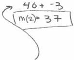

<!-- Page 1 -->

2023

AP®

# AP® Calculus AB
## Sample Student Responses and Scoring Commentary

### Inside:

Free-Response Question 5

- ☑ Scoring Guidelines
- ☑ Student Samples
- ☑ Scoring Commentary

© 2023 College Board. College Board, Advanced Placement, AP, AP Central, and the acorn logo are registered trademarks of College Board. Visit College Board on the web: collegeboard.org.

AP Central is the official online home for the AP Program: apcentral.collegeboard.org.

<!-- Page 2 -->

AP® Calculus AB/BC 2023 Scoring Guidelines

### Part B (AB): Graphing calculator not allowed

#### Question 5

9 points

#### General Scoring Notes

The model solution is presented using standard mathematical notation.

Answers (numeric or algebraic) need not be simplified. Answers given as a decimal approximation should be correct to three places after the decimal point. Within each individual free-response question, at most one point is not earned for inappropriate rounding.

|  x | 0 | 2 | 4 | 7  |
| --- | --- | --- | --- | --- |
|  f(x) | 10 | 7 | 4 | 5  |
|  f'(x) | \( \frac{3}{2} \) | -8 | 3 | 6  |
|  g(x) | 1 | 2 | -3 | 0  |
|  g'(x) | 5 | 4 | 2 | 8  |

The functions \( f \) and \( g \) are twice differentiable. The table shown gives values of the functions and their first derivatives at selected values of \( x \).

|  Model Solution | Scoring  |
| --- | --- |

(a) Let \( h \) be the function defined by \( h(x) = f(g(x)) \). Find \( h'(7) \). Show the work that leads to your answer.

|  \( h'(x) = f'(g(x)) \cdot g'(x) \) | Chain rule | 1 point  |
| --- | --- | --- |
|  \( h'(7) = f'(g(7)) \cdot g'(7) \) |  |   |
|  \( = f'(0) \cdot 8 = \frac{3}{2} \cdot 8 = 12 \) | Answer | 1 point  |

##### Scoring notes:

- The first point is earned for either \( h'(x) = f'(g(x)) \cdot g'(x) \) or \( h'(7) = f'(g(7)) \cdot g'(7) \).
- If the first point is earned, the second point is earned only for an answer of 12 (or equivalent).
- If the first point is not earned, the second point can be earned only for a response of either \( f'(0) \cdot 8 = 12 \) or \( \frac{3}{2} \cdot 8 \).
- A response of 12 with no supporting work does not earn either point.

Total for part (a) 2 points

(b) Let \( k \) be a differentiable function such that \( k'(x) = (f(x))^2 \cdot g(x) \). Is the graph of \( k \) concave up or concave down at the point where \( x = 4 \)? Give a reason for your answer.

|  \( k''(x) = 2f(x) \cdot f'(x) \cdot g(x) + (f(x))^2 \cdot g'(x) \) | Product or chain rule | 1 point  |
| --- | --- | --- |

© 2023 College Board

<!-- Page 3 -->

AP® Calculus AB/BC 2023 Scoring Guidelines

|  $$k''(4) = 2f(4) \cdot f'(4) \cdot g(4) + (f(4))^2 \cdot g'(4)$$ |  |   |
| --- | --- | --- |
|  $$= 2 \cdot 4 \cdot 3 \cdot (-3) + 4^2 \cdot 2 = -72 + 32 = -40$$ | $$k''(4)$$ | **1 point**  |
|  The graph of $$k$$ is concave down at the point where $$x = 4$$ because $$k''(4) < 0$$ and $$k''$$ is continuous. | Answer with reason | **1 point**  |

# **Scoring notes:**

- The first point is earned for either $$k''(x) = 2f(x) \cdot f'(x) \cdot g(x) + (f(x))^2 \cdot g'(x)$$ or

$$k''(4) = 2f(4) \cdot f'(4) \cdot g(4) + (f(4))^2 \cdot g'(4).$$

- The first point is also earned by any of the following incorrect expressions, each of which has a single error in the application of the product rule or the chain rule:

○ $$2f(x) \cdot g(x) + (f(x))^2 \cdot g'(x)$$ or $$2f(4) \cdot g(4) + (f(4))^2 \cdot g'(4)$$

○ $$2f'(x) \cdot g(x) + (f(x))^2 \cdot g'(x)$$ or $$2f'(4) \cdot g(4) + (f(4))^2 \cdot g'(4)$$

○ $$f'(x) \cdot g(x) + (f(x))^2 \cdot g'(x)$$ or $$f'(4) \cdot g(4) + (f(4))^2 \cdot g'(4)$$

○ $$2f(x) \cdot f'(x) \cdot g'(x)$$ or $$2f(4) \cdot f'(4) \cdot g'(4)$$

○ Note: A response that presents one of these expressions cannot earn the second point.

- To earn the second point a response must correctly find $$k''(4) = -40$$ (or equivalent) with supporting work.

- The third point is earned for an answer and reason that are consistent with any declared nonzero value of $$k''(4)$$.

**Total for part (b) 3 points**

(c)

Let $$m$$ be the function defined by $$m(x) = 5x^3 + \int_0^x f'(t) \, dt$$. Find $$m(2)$$. Show the work that leads to your answer.

$$\begin{array}{l} m(2) = 5 \cdot 8 + \int_0^2 f'(t) \, dt = 40 + (f(2) - f(0)) \\ = 40 + (7 - 10) = 37 \end{array}$$

Answer with supporting work

**1 point**

# **Scoring notes:**

- The point is earned only for an answer of 37 (or equivalent) with supporting work equivalent to $$5 \cdot 8 + (f(2) - f(0))$$, $$40 + (f(2) - f(0))$$, $$5 \cdot 8 + (7 - 10)$$, or $$40 + (7 - 10)$$.

- An answer of 37 with no supporting work does not earn the point.

**Total for part (c) 1 point**

(d)

Is the function $$m$$ defined in part (c) increasing, decreasing, or neither at $$x = 2$$? Justify your answer.

$$m'(x) = 15x^2 + f'(x)$$

Considers $$m'(x)$$

**1 point**

$$m'(2) = 15 \cdot 4 + f'(2) = 60 + (-8) = 52$$

$$m'(2)$$ with supporting work

**1 point**

© 2023 College Board

<!-- Page 4 -->

AP® Calculus AB/BC 2023 Scoring Guidelines

|  The graph of $m$ is increasing at $x = 2$ because $m'(2) > 0$. | Answer with justification | **1 point**  |
| --- | --- | --- |

# **Scoring notes:**

- The first point is earned for considering $m'(x)$, $m'(2)$, or $m'$. This consideration may appear in a justification statement.
- The second point is earned for $m'(2) = 15 \cdot 2^2 + f'(2)$, $m'(2) = 60 + f'(2)$, or $m'(2) = 60 - 8$ but is not earned for an unsupported response of $m'(2) = 52$.
- The third point is earned for an answer and justification consistent with any declared value of $m'(2)$.

|   | **Total for part (d)** | **3 points**  |
| --- | --- | --- |
|   | **Total for question 5** | **9 points**  |

© 2023 College Board

<!-- Page 5 -->

1 of 2

Sample 5A

5 5 5 5 5 NO CALCULATOR ALLOWED 5 5 5 5 5

Answer QUESTION 5 parts (a) and (b) on this page.

|  x | 0 | 2 | 4 | 7  |
| --- | --- | --- | --- | --- |
|  f(x) | 10 | 7 | 4 | 5  |
|  f'(x) | 3/2 | -8 | 3 | 6  |
|  g(x) | 1 | 2 | -3 | 0  |
|  g'(x) | 5 | 4 | 2 | 8  |

Response for question 5(a)

$$\begin{array}{l} h(x) = f(g(x)) \quad h'(x) = g'(x) \cdot f'(g(x)) \\ h'(7) = g'(7) \cdot f'(g(7)) = 8 \cdot f'(0) = 8 \cdot \frac{5}{2} \\ = \frac{24}{2} = 12 \quad h'(7) = 12 \end{array}$$

Response for question 5(b)

$$k'(x) = (f(x))^2 \cdot g(x)$$

$$k''(x) = 2f'(x)(f(x)) \cdot g(x) + g'(x)(f(x))^2$$

$$k''(4) = 2f'(4)f(4) \cdot g(4) + g'(4)(f(4))^2$$

$$= 2(3)(4)(-3) + 2(4)^2$$

$$= -72 + 32 = -40 \quad -40 < 0$$

The graph of k is concave down at x=4 because

$$k''(x) < 0.$$

Page 12

Use a pencil or a pen with black or dark blue ink. Do NOT write your name. Do NOT write outside the box.

0140676

Q5216/12

<!-- Page 6 -->

2 of 2

Sample 5A

5 5 5 5 5 NO CALCULATOR ALLOWED 5 5 5 5 5

Answer QUESTION 5 parts (c) and (d) on this page.

Response for question 5(c)

$$m(x) = 5x^3 + \int_{0}^{x} f'(t)dt$$

$$m(2) = 5(2)^3 + \int_{0}^{2} f'(t)dt = 5(8) + (f(2) - f(0))$$

$$= 40 + (7 - 10) = 40 - 3 = 37$$

$$m(2) = 37$$

Response for question 5(d)

$$m'(x) = 15x^2 + f'(x)$$

$$m'(2) = 15(2)^2 + f'(2) = 60 + (-8) = 52$$

$$52 > 0$$

The function m is increasing at x = 2

because m'(x) > 0 at x = 2.

Page 13

Use a pencil or a pen with black or dark blue ink. Do NOT write your name. Do NOT write outside the box.

Q2218/13

<!-- Page 7 -->

1 of 2

Sample 5B

5 5 5 5 5 NO CALCULATOR ALLOWED 5 5 5 5 5

Answer QUESTION 5 parts (a) and (b) on this page.

|  x | 0 | 2 | 4 | 7  |
| --- | --- | --- | --- | --- |
|  f(x) | 10 | 7 | 4 | 5  |
|  f'(x) | 3/2 | -8 | 3 | 6  |
|  g(x) | 1 | 2 | -3 | 0  |
|  g'(x) | 5 | 4 | 2 | 8  |

Response for question 5(a)

$$h(x) = f(g(x))$$

$$\begin{array}{l} h'(7) = f'(g(7)) \cdot (g'(7)) \\ = f'(0) \cdot 8 \\ = \frac{3}{2} \cdot 8 \\ = \frac{24}{2} = \boxed{12} \end{array}$$

Response for question 5(b)

$$\begin{array}{r} 2 \\ 3 \\ 2 \\ - 2 \\ 4 \\ \hline 7 \end{array}$$

$$k'(x) = (f(x))^2 \cdot g(x)$$

$$k''(4) = 2f(4) \cdot g(4) + (f(4))^2 \cdot g'(4)$$

$$= (2(4) \cdot (-3)) + (16 \cdot 2)$$

$$= -24 + 32$$

$$= 7$$

$$k'(4) = f(4)^2 \cdot g(4)$$

$$= 16 \cdot -3$$

$$= -$$

The graph is concave

down because the

second derivative is

Page 12 P.O.s but the first is neg

Use a pencil or a pen with black or dark blue ink. Do NOT write your name. Do NOT write outside the box.

0045736

Q5171/12

<!-- Page 8 -->

2 of 2

Sample 5B

5 5 5 5 5 NO CALCULATOR ALLOWED 5 5 5 5 5

Answer QUESTION 5 parts (c) and (d) on this page.

Response for question 5(c)

$$m(x) = 5x^3 + \int_0^x f'(t) dt$$

$$m(2) = 5(2)^3 + \int_0^2 f'(x) dx$$

$$= 40 + \int_0^2 f'(x) dx$$

$$f(x) \Big|_0^2$$

$$f(2) - f(0) = 7 - 10 = -3$$

Response for question 5(d)

$$m(0) = 5(0)^3 + \int_0^0 f'(x) dx$$

The function defined in part c is

increasing because the value @

m(2) is greater than @ m(0)

Page 13

Use a pencil or a pen with black or dark blue ink. Do NOT write your name. Do NOT write outside the box.

Q5171/13

<!-- Page 9 -->

1 of 2

Sample 5C

5 5 5 5 5 NO CALCULATOR ALLOWED 5 5 5 5 5

Answer QUESTION 5 parts (a) and (b) on this page.

|  x | 0 | 2 | 4 | 7  |
| --- | --- | --- | --- | --- |
|  f(x) | 10 | 7 | 4 | 5  |
|  f'(x) | 3/2 | -8 | 3 | 6  |
|  g(x) | 1 | 2 | -3 | 0  |
|  g'(x) | 5 | 4 | 2 | 8  |

Response for question 5(a)

$$h(x) = f(g(x)) \quad h'(x) = f'(g(x)) + g'(x)$$

$$h'(7) = f'(g(7)) + g'(7)$$

$$h'(7) = \frac{3}{2} + 8$$

$$h'(7) = \frac{19}{2}$$

Response for question 5(b)

$$k'(x) = (f(x))^2 \cdot g(x)$$

$$k'(2) = (f(2))^2 \cdot g(2) = 94$$

$$k'(7) = (f(7))^2 \cdot g(7) = 0$$

The graph of k is concave up at

x = 4 because the graph of k''(x)

is negative, and the graph of k'(x)

starts out positive.

Page 12

Use a pencil or a pen with black or dark blue ink. Do NOT write your name. Do NOT write outside the box.

0002218

Q5218/12

<!-- Page 10 -->

2 of 2

Sample 5C

5 5 5 5 5 NO CALCULATOR ALLOWED 5 5 5 5 5

Answer QUESTION 5 parts (c) and (d) on this page.

Response for question 5(c)

$$m(x) = 5x^3 + \int_0^x f'(t)dt$$

$$m(x) = 5x^3 + (f(x) - f(0))$$

$$m(2) = 5(2)^3 + (f(2) - f(0))$$

$$m(2) = 40 + (-3)$$

$$m(2) = 37$$

Response for question 5(d)

$$m'(x) = 15x^2 + f'(x) - f'(0)$$

$$m'(2) = 15(4) + f'(4) - f'(0)$$

$$m'(2) = \frac{123}{2}$$

The function m is increasing at x=2

because m'(2) is positive.

Page 13

Use a pencil or a pen with black or dark blue ink. Do NOT write your name. Do NOT write outside the box.

Q2215/13

<!-- Page 11 -->

AP® Calculus AB 2023 Scoring Commentary

# Question 5

Note: Student samples are quoted verbatim and may contain spelling and grammatical errors.

# Overview

In this problem students were given a table of selected values of the twice-differentiable functions $f$ and $g$ and of their first derivatives.

In part (a) students are asked to find $h'(7)$ for the function $h(x) = f(g(x))$. A correct response will use the chain rule to find $h'(x) = f'(g(x)) \cdot g'(x)$, then pull the appropriate values from the given table to find $h'(7) = 12$.

In part (b) students were told that $k$ is a differentiable function such that $k'(x) = (f(x))^2 \cdot g(x)$ and were asked whether $k$ is concave up or concave down at the point where $x = 4$. A correct response will use the product and chain rules to find $k''(x)$ and then evaluate $k''(4) = -40$ in order to determine that $k$ is concave down at this point.

In part (c) the function $m(x) = 5x^3 + \int_0^x f'(t) \, dt$ is defined and students were asked to find $m(2)$. A correct response will use the Fundamental Theorem of Calculus to find $\int_0^2 f'(t) \, dt = f(2) - f(0)$, then use the given table to find $f(2)$ and $f(0)$. Finally, a correct response will combine the difference of these values with $5 \cdot 2^3$ to obtain $m(2) = 37$.

In part (d) students were asked whether this function $m$ is increasing, decreasing, or neither at $x = 2$ and to provide a justification for their answer. A correct response will use the Fundamental Theorem of Calculus to find $m'(2) = 15 \cdot 2^2 + f'(2) = 52$ and realize that, because $m'(2)$ is positive, the function must be increasing in a neighborhood around $x = 2$.

# Sample: 5A

# Score: 9

The response earned 9 points: 2 points in part (a), 3 points in part (b), 1 point in part (c), and 3 points in part (d).

In part (a) the response earned the first point in line 1 on the right side with the correct chain rule. The numerical expression $8 \cdot \frac{3}{2}$ in line 2 on the right would have earned the second point with no simplification. In this case, correct simplification earned the point with $h'(7) = 12$.

In part (b) the response earned the first point in line 2 for the correct expression for $k''(x)$. The expression $2(3)(4)(-3) + 2(4)^2$ in line 4 would have earned the second point with no simplification. In this case, correct simplification to $-40$ in line 5 earned the point. The response earned the third point in line 6 for the correct answer and reason, "concave down at $x = 4$ because $k''(x) < 0$." This statement can be interpreted as $k''(4) < 0$ because $x = 4$ was stated in the stem of the question.

In part (c) the numerical expression $40 + (7 - 10)$ in line 3 would have earned the point with no simplification. In this case, correct simplification to 37 in line 3 earned the point.

© 2023 College Board.

Visit College Board on the web: collegeboard.org.

<!-- Page 12 -->

AP® Calculus AB 2023 Scoring Commentary

## Question 5 (continued)

In part (d) the response earned the first point in line 1 for considering $m'(x)$. The expression $15(2)^2 + f'(2)$ would have earned the second point with no simplification. In this case, correct simplification to 52 in line 2 earned the point. The response earned the third point in line 4 and line 5 for the correct conclusion with the correct reasoning.

**Sample: 5B**

**Score: 4**

The response earned 4 points: 2 points in part (a), 1 point in part (b), 1 point in part (c), and no points in part (d).

In part (a) the response earned the first point in line 2 with the correct chain rule. The second point could have been earned for the numeric expression $\frac{3}{2} \cdot 8$ in line 4 but was simplified and the point was earned for the boxed answer of 12.

In part (b) the expression for $k''(4)$ in the form of a product rule with no evidence of a chain rule in line 2 earned the first point but is not eligible for the second point. The response did not earn the third point because the reason given “because the second derivative is pos but the first is neg” implies that concavity is based on both the first and second derivatives.

In part (c) the point could have been earned for the numeric expression $40 + -3$ on the right but was simplified and the point was earned for the boxed answer $m(2) = 37$ with supporting work.

In part (d) no points were earned because the response never considers $m'(x)$ or $m'(2)$.

**Sample: 5C**

**Score: 3**

The response earned 3 points: no points in part (a), no points in part (b), 1 point in part (c), and 2 points in part (d).

In part (a) the response did not earn the first point because the expression presented in line 1 on the right $h'(x) = f'(g(x)) + g'(x)$ is not the correct chain rule. The second point was not earned because the boxed answer $h'(7) = \frac{19}{2}$ is incorrect.

In part (b) the response earned no points because no expression for $k''(x)$ or $k''(4)$ is present.

In part (c) the point could have been earned for the numeric expression $40 + (-3)$ in line 4 but was simplified and the point was earned for the boxed answer $m(2) = 37$ with supporting work.

In part (d) the first point was earned in line 1 for considering $m'(x)$ even though the expression presented for $m'(x)$ is incorrect. The response did not earn the second point because the declared value $m'(2) = \frac{123}{2}$ is incorrect. The response earned the third point in lines 4 and 5 for the conclusion and justification consistent with the incorrect value declared for $m'(2)$.

© 2023 College Board.
Visit College Board on the web: collegeboard.org.
