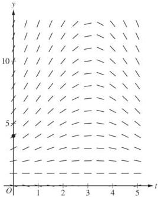
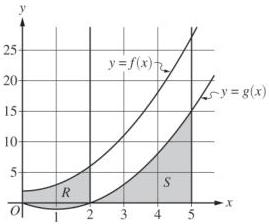

<!-- Page 1 -->

2024

# AP® Calculus AB
## Free-Response Questions

© 2024 College Board. College Board, Advanced Placement, AP, AP Central, and the acorn logo are registered trademarks of College Board. Visit College Board on the web: collegeboard.org.

AP Central is the official online home for the AP Program: apcentral.collegeboard.org.

<!-- Page 2 -->

AP® Calculus AB 2024 Free-Response Questions

# **CALCULUS AB**

# **SECTION II, Part A**

Time—30 minutes

2 Questions

**A GRAPHING CALCULATOR IS REQUIRED FOR THESE QUESTIONS.**

© 2024 College Board.  
Visit College Board on the web: collegeboard.org.

2

**GO ON TO THE NEXT PAGE.**

<!-- Page 3 -->

AP® Calculus AB 2024 Free-Response Questions

|  t(minutes) | 0 | 3 | 7 | 12  |
| --- | --- | --- | --- | --- |
|  C(t)(degrees Celsius) | 100 | 85 | 69 | 55  |

1. The temperature of coffee in a cup at time \( t \) minutes is modeled by a decreasing differentiable function \( C \), where \( C(t) \) is measured in degrees Celsius. For \( 0 \leq t \leq 12 \), selected values of \( C(t) \) are given in the table shown.

(a) Approximate \( C'(5) \) using the average rate of change of \( C \) over the interval \( 3 \leq t \leq 7 \). Show the work that leads to your answer and include units of measure.

(b) Use a left Riemann sum with the three subintervals indicated by the data in the table to approximate the value of \(\int_0^{12}C(t)dt\). Interpret the meaning of \(\frac{1}{12}\int_0^{12}C(t)dt\) in the context of the problem.

(c) For \(12 \leq t \leq 20\), the rate of change of the temperature of the coffee is modeled by \(C'(t) = \frac{-24.55e^{0.01t}}{t}\), where \(C'(t)\) is measured in degrees Celsius per minute. Find the temperature of the coffee at time \(t = 20\). Show the setup for your calculations.

(d) For the model defined in part (c), it can be shown that \( C''(t) = \frac{0.2455e^{0.01t}(100 - t)}{t^2} \). For \( 12 < t < 20 \), determine whether the temperature of the coffee is changing at a decreasing rate or at an increasing rate. Give a reason for your answer.

Write your responses to this question only on the designated pages in the separate Free Response booklet. Write your solution to each part in the space provided for that part.

© 2024 College Board.

Visit College Board on the web: collegeboard.org.

3

GO ON TO THE NEXT PAGE.

<!-- Page 4 -->

AP® Calculus AB 2024 Free-Response Questions

2. A particle moves along the $x$-axis so that its velocity at time $t \geq 0$ is given by $v(t) = \ln\left(t^2 - 4t + 5\right) - 0.2t$.

(a) There is one time, $t = t_R$, in the interval $0 < t < 2$ when the particle is at rest (not moving). Find $t_R$. For $0 < t < t_R$, is the particle moving to the right or to the left? Give a reason for your answer.
(b) Find the acceleration of the particle at time $t = 1.5$. Show the setup for your calculations. Is the speed of the particle increasing or decreasing at time $t = 1.5$? Explain your reasoning.
(c) The position of the particle at time $t$ is $x(t)$, and its position at time $t = 1$ is $x(1) = -3$. Find the position of the particle at time $t = 4$. Show the setup for your calculations.
(d) Find the total distance traveled by the particle over the interval $1 \leq t \leq 4$. Show the setup for your calculations.

Write your responses to this question only on the designated pages in the separate Free Response booklet. Write your solution to each part in the space provided for that part.

© 2024 College Board.

Visit College Board on the web: collegeboard.org.

4

GO ON TO THE NEXT PAGE.

<!-- Page 5 -->

AP® Calculus AB 2024 Free-Response Questions

END OF PART A

© 2024 College Board.
Visit College Board on the web: collegeboard.org.

5

<!-- Page 6 -->

AP® Calculus AB 2024 Free-Response Questions

# CALCULUS AB

## SECTION II, Part B

Time—1 hour

4 Questions

NO CALCULATOR IS ALLOWED FOR THESE QUESTIONS.

© 2024 College Board.

Visit College Board on the web: collegeboard.org.

6

<!-- Page 7 -->

AP® Calculus AB 2024 Free-Response Questions

3. The depth of seawater at a location can be modeled by the function $H$ that satisfies the differential equation $\frac{dH}{dt} = \frac{1}{2}(H - 1)\cos\left(\frac{t}{2}\right)$, where $H(t)$ is measured in feet and $t$ is measured in hours after noon ($t = 0$). It is known that $H(0) = 4$.

(a) A portion of the slope field for the differential equation is provided. Sketch the solution curve, $y = H(t)$, through the point $(0, 4)$.

(b) For $0 < t < 5$, it can be shown that $H(t) > 1$. Find the value of $t$, for $0 < t < 5$, at which $H$ has a critical point. Determine whether the critical point corresponds to a relative minimum, a relative maximum, or neither a relative minimum nor a relative maximum of the depth of seawater at the location. Justify your answer.

(c) Use separation of variables to find $y = H(t)$, the particular solution to the differential equation

$$\frac{dH}{dt} = \frac{1}{2}(H - 1)\cos\left(\frac{t}{2}\right) \text{ with initial condition } H(0) = 4.$$

Write your responses to this question only on the designated pages in the separate Free Response booklet. Write your solution to each part in the space provided for that part.

© 2024 College Board.

Visit College Board on the web: collegeboard.org.

7

GO ON TO THE NEXT PAGE.

<!-- Page 8 -->

AP® Calculus AB 2024 Free-Response Questions

4. The graph of the differentiable function $f$, shown for $-6 \leq x \leq 7$, has a horizontal tangent at $x = -2$ and is linear for $0 \leq x \leq 7$. Let $R$ be the region in the second quadrant bounded by the graph of $f$, the vertical line $x = -6$, and the $x$- and $y$-axes. Region $R$ has area 12.

(a) The function $g$ is defined by $g(x) = \int_0^x f(t) \, dt$. Find the values of $g(-6)$, $g(4)$, and $g(6)$.

(b) For the function $g$ defined in part (a), find all values of $x$ in the interval $0 \leq x \leq 6$ at which the graph of $g$ has a critical point. Give a reason for your answer.

(c) The function $h$ is defined by $h(x) = \int_{-6}^x f'(t) \, dt$. Find the values of $h(6)$, $h'(6)$, and $h''(6)$. Show the work that leads to your answers.

Write your responses to this question only on the designated pages in the separate Free Response booklet. Write your solution to each part in the space provided for that part.

© 2024 College Board.
Visit College Board on the web: collegeboard.org.

8

GO ON TO THE NEXT PAGE.

<!-- Page 9 -->

AP® Calculus AB 2024 Free-Response Questions

5. Consider the curve defined by the equation $$x^{2} + 3y + 2y^{2} = 48$$. It can be shown that $$\frac{dy}{dx} = \frac{-2x}{3 + 4y}$$.

(a) There is a point on the curve near (2, 4) with x-coordinate 3. Use the line tangent to the curve at (2, 4) to approximate the y-coordinate of this point.
(b) Is the horizontal line y = 1 tangent to the curve? Give a reason for your answer.
(c) The curve intersects the positive x-axis at the point ($$\sqrt{48}$$, 0). Is the line tangent to the curve at this point vertical? Give a reason for your answer.
(d) For time $$t \geq 0$$, a particle is moving along another curve defined by the equation $$y^{3} + 2xy = 24$$. At the instant the particle is at the point (4, 2), the y-coordinate of the particle's position is decreasing at a rate of 2 units per second. At that instant, what is the rate of change of the x-coordinate of the particle's position with respect to time?

Write your responses to this question only on the designated pages in the separate Free Response booklet. Write your solution to each part in the space provided for that part.

© 2024 College Board.

Visit College Board on the web: collegeboard.org.

9

GO ON TO THE NEXT PAGE.

<!-- Page 10 -->

AP® Calculus AB 2024 Free-Response Questions

6. The functions $f$ and $g$ are defined by $f(x) = x^2 + 2$ and $g(x) = x^2 - 2x$, as shown in the graph.

(a) Let $R$ be the region bounded by the graphs of $f$ and $g$, from $x = 0$ to $x = 2$, as shown in the graph. Write, but do not evaluate, an integral expression that gives the area of region $R$.
(b) Let $S$ be the region bounded by the graph of $g$ and the $x$-axis, from $x = 2$ to $x = 5$, as shown in the graph. Region $S$ is the base of a solid. For this solid, at each $x$ the cross section perpendicular to the $x$-axis is a rectangle with height equal to half its base in region $S$. Find the volume of the solid. Show the work that leads to your answer.
(c) Write, but do not evaluate, an integral expression that gives the volume of the solid generated when region $S$, as described in part (b), is rotated about the horizontal line $y = 20$.

Write your responses to this question only on the designated pages in the separate Free Response booklet. Write your solution to each part in the space provided for that part.

© 2024 College Board.

Visit College Board on the web: collegeboard.org.

10

GO ON TO THE NEXT PAGE.

<!-- Page 11 -->

AP® Calculus AB 2024 Free-Response Questions

# **STOP**

# **END OF EXAM**

© 2024 College Board.
Visit College Board on the web: collegeboard.org.

11
