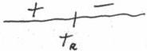

<!-- Page 1 -->

2024

AP

# AP® Calculus AB
## Sample Student Responses and Scoring Commentary

### Inside:

Free-Response Question 2

- ☑ Scoring Guidelines
- ☑ Student Samples
- ☑ Scoring Commentary

© 2024 College Board. College Board, Advanced Placement, AP, AP Central, and the acorn logo are registered trademarks of College Board. Visit College Board on the web: collegeboard.org.

AP Central is the official online home for the AP Program: apcentral.collegeboard.org.

<!-- Page 2 -->

AP® Calculus AB/BC 2024 Scoring Guidelines

## Part A (AB): Graphing calculator required

### Question 2

9 points

#### General Scoring Notes

The model solution is presented using standard mathematical notation.

Answers (numeric or algebraic) need not be simplified. Answers given as a decimal approximation should be correct to three places after the decimal point. Within each individual free-response question, at most one point is not earned for inappropriate rounding.

A particle moves along the \(x\)-axis so that its velocity at time \(t \geq 0\) is given by \(\nu(t) = \ln \left(t^2 - 4t + 5\right) - 0.2t\).

|  Model Solution | Scoring  |   |
| --- | --- | --- |
|  (a) There is one time, \( t = t_{R} \), in the interval \( 0 < t < 2 \) when the particle is at rest (not moving). Find \( t_{R} \). For \( 0 < t < t_{R} \), is the particle moving to the right or to the left? Give a reason for your answer.  |   |   |
|  \( v(t) = 0 \Rightarrow t = 1.425610 \)Therefore, the particle is at rest (not moving) at \( t_{R} = 1.426 \) (or 1.425). | \( t_{R} \) | 1 point  |
|  For \( 0 < t < t_{R} \), \( v(t) > 0 \). Therefore, the particle is moving to the right on that interval. | Direction with explanation | 1 point  |

##### Scoring notes:

- The first point is earned for considering \( v(t) = 0 \) and reporting the value \( t = 1.426 \) (or \( t = 1.425 \)).
- A response that finds no value or an incorrect value of \( t_R \) is not eligible to earn the second point.
- A response need not demonstrate an evaluation of \( v(t) \) at any value of \( t \), \( 0 < t < 1.426 \). The evaluations do not need to be presented with three correct decimal places, but they must be correct for the number of digits shown for one up to three digits after the decimal.

Total for part (a) 2 points

© 2024 College Board

<!-- Page 3 -->

AP® Calculus AB/BC 2024 Scoring Guidelines

(b) Find the acceleration of the particle at time t = 1.5. Show the setup for your calculations. Is the speed of the particle increasing or decreasing at time t = 1.5? Explain your reasoning.

|  $$a(1.5) = v'(1.5) = -1$$ The acceleration of the particle at time $$t = 1.5$$ is $$-1$$ (or $$-0.999$$). | Acceleration with setup | **1 point**  |
| --- | --- | --- |
|  $$v(1.5) = -0.076856 < 0$$ Because $$a(1.5)$$ and $$v(1.5)$$ have the same sign, the speed is increasing at time $$t = 1.5$$. | Answer with explanation | **1 point**  |

# **Scoring notes:**

- A response must demonstrate the relationship $$v' = a$$ in order to earn the first point. This relationship could be shown by “$$v'(1.5) = -1$$ (or $$-0.999$$)” or “$$v' = a$$ and $$a(1.5) = -1$$ (or $$-0.999$$).” A response of just “$$a(1.5) = -1$$ (or $$-0.999$$)” is not sufficient to earn the first point.
- A response must declare a value for $$a(1.5)$$ to be eligible for the second point.
- The second point can only be earned for a response that is consistent with a negative velocity at time $$t = 1.5$$ and the presented value of $$a(1.5)$$.
- Any presented value of $$v(1.5)$$ must be correct for the number of digits presented, from one up to three decimal places in order to earn the second point.
- A response does not need to report a value for $$v(1.5)$$; an implied sign is sufficient:
  - Any statement equivalent to “The speed of the particle is increasing because $$a(1.5)$$ and $$v(1.5)$$ have the same sign” will earn the second point, provided the presented value of $$a(1.5)$$ is negative.
- A response that presents or references an incorrect value or sign of $$v(1.5)$$ does not earn the second point.
- Alternate solution for the second point:
  Speed = $$|v(t)|$$ and its derivative is positive when $$t = 1.5$$, therefore the speed of the particle is increasing.

Total for part (b) 2 points

© 2024 College Board

<!-- Page 4 -->

AP® Calculus AB/BC 2024 Scoring Guidelines

(c) The position of the particle at time t is x(t), and its position at time t = 1 is x(1) = -3. Find the position of the particle at time t = 4. Show the setup for your calculations.

|  x(4) = x(1) + ∫₁⁴ v(t) dt | Integral | 1 point  |
| --- | --- | --- |
|   |  Uses initial condition | 1 point  |
|  = -3 + 0.197117 = -2.802883 | Answer | 1 point  |
|  The position of the particle at time t = 4 is -2.803 (or -2.802). |  |   |

# Scoring notes:

- The first point is earned for a definite integral with integrand v(t). If the limits of integration are incorrect, the response does not earn the third point.
- A response with a linkage error such as x(4) = ∫₁⁴ v(t) dt = -3 + 0.197 or ∫₁⁴ v(t) dt = 0.197 = -2.803 earns the first 2 points but does not earn the third point.
- Missing differential (dt):

○ Unambiguous responses of x(1) + ∫₁⁴ v(t) and -3 + ∫₁⁴ v(t) both earn the first 2 points and are eligible for the third point.
○ Ambiguous responses of ∫₁⁴ v(t) + x(1) and ∫₁⁴ v(t) - 3 do not earn the first point, earn the second point, and earn the third point if the given numeric answer is correct. If there is no numeric answer given, neither of these responses earn the third point.

- The second point is earned for either symbolically or numerically adding x(1) or -3 to a definite integral with a lower limit of 1.
- The third point is earned for an answer of -3 + 0.197 or 0.197 - 3 with no additional simplification, provided there is some supporting work for these values.
- An answer of just -2.803 (or -2.802) with no supporting work does not earn any points.

Total for part (c) 3 points

© 2024 College Board

<!-- Page 5 -->

AP® Calculus AB/BC 2024 Scoring Guidelines

(d) Find the total distance traveled by the particle over the interval 1 ≤ t ≤ 4. Show the setup for your calculations.

|  $$\int_{1}^{4}|v(t)| \, dt$$ | Integral | 1 point  |
| --- | --- | --- | --- | --- |
|  = 0.9581 | Answer | 1 point  |
|  The total distance traveled by the particle over the interval 1 ≤ t ≤ 4 is 0.958. |  |   |

# Scoring notes:

- The first point is earned for any one of the following:

  ○ $$\int_{1}^{4}|v(t)| \, dt$$
  ○ $$\int_{1}^{1.425} v(t) \, dt - \int_{1.425}^{2.883} v(t) \, dt + \int_{2.883}^{4} v(t) \, dt$$
  ○ $$\int_{1}^{1.426} v(t) \, dt - \int_{1.426}^{2.883} v(t) \, dt + \int_{2.883}^{4} v(t) \, dt$$

- Due to variations in numerical integration techniques on some calculators, responses of 0.958, 0.959, or 0.96 earn the second point.

Total for part (d) 2 points

Total for question 2 9 points

© 2024 College Board

<!-- Page 6 -->

1 of 2

Sample 2A

2 2 2 2 2 2 2 2 2 2 2 2 2 2 2 2 2

Answer QUESTION 2 parts (a) and (b) on this page.

Response for question 2(a)

particle at rest when V(t)=0

$$V(t) = (1(t^2 - 4t + 5) - 0.2t$$

$$0 = (1(t^2 - 4t + 5) - 0.2t$$

$$t_R = 1.4296097$$

$$t_R = 1.426$$

for $0 < t < t_R$, the particle is

moving to the right as

for $0 < t < t_R$, V(t) is greater

than zero (& is positive)

Response for question 2(b)

$$V'(t) = a(t) = \frac{2t - 4}{t^2 - 4t + 5} - 0.2$$

$$a(1.5) = \frac{2(1.5) - 4}{(1.5)^2 - 4(1.5) + 5} - 0.2 = \frac{3 - 4}{2.25 - 6 + 5} - 0.2 = \frac{-1}{1.25} - 0.2$$

$$a(1.5) = -1 \quad V(1.5) = -0.0768564$$

The speed of the particle

is increasing at t=1.5 as

both acceleration & velocity

are negative (they share

the same sign)

Page 6

Use a pencil or a pen with black or dark blue ink. Do NOT write your name. Do NOT write outside the box.

Q5224/6

<!-- Page 7 -->

2 of 2

Sample 2A

Answer QUESTION 2 parts (c) and (d) on this page.

Response for question 2(c)

$$X(1) = -3$$

$$X(4) = \frac{5^4}{1} X(4) = \frac{5^4}{1} V(4) d + -3$$

$$X(4) = \frac{5^4}{1} V(4) d + -3 = -2.802883232$$

$$X(4) \approx -2.803$$

Response for question 2(d)

$$\text{total distance} = \frac{5^4}{1} V(4) d +$$

$$\text{total distance} = 0.9581490742$$

$$\text{total distance} \approx 0.958$$

Page 7

Use a pencil or a pen with black or dark blue ink. Do NOT write your name. Do NOT write outside the box.

0036066

Q8224/7

<!-- Page 8 -->

1 of 2

Sample 2B

2 2 2 2 2 2 2 2 2 2 2 2 2 2 2 2 2

Answer QUESTION 2 parts (a) and (b) on this page.

Response for question 2(a)

$$t_R = 1.333 \quad t_R = 1.426$$

$$t_R = 1.333$$

The particle is moving to the left on

0 < t < 1.426 since it is moving towards

the origin and V(t) and X(t) have

different signs.

Response for question 2(b)

$$V'(1.5) = \ln((1.5)^2 - 4(1.5) + 5)) - 0.2(1.5)$$

$$V'(1.5) = -0.910$$

$$V(1.5) = -0.077$$

The speed of the particle at t = 1.5 is

increasing since V'(1.5) and V(1.5)

have the same sign.

Page 6

Use a pencil or a pen with black or dark blue ink. Do NOT write your name. Do NOT write outside the box.

Q5223/8

<!-- Page 9 -->

2 of 2

Sample 2B

Answer QUESTION 2 parts (c) and (d) on this page.

Response for question 2(c)

$$-3 + \int_{1}^{4} v(r) dr = -2.803$$

Response for question 2(d)

$$\int_{1}^{4} |v(r)| dr = 0.958$$

Page 7

Use a pencil or a pen with black or dark blue ink. Do NOT write your name. Do NOT write outside the box.

0068205

Q5229/7

<!-- Page 10 -->

1 of 2

Sample 2C

2 2 2 2 2 2 2 2 2 2 2 2 2 2 2 2 2

Answer QUESTION 2 parts (a) and (b) on this page.

Response for question 2(a)

$$v(t) = \ln(t^2 - 4t + 5) - 0.2t$$

$$v(t) = 0$$ is when the particle is at rest ($$t_R$$)

$$t_R = 2.101022$$

$$0 < t < 2.101022$$

Response for question 2(b)

$$v'(t) = a(t)$$

$$a(t) = \left( \frac{1}{(t^2 - 4t + 5)} \cdot (2t - 4) \right) - 0.2$$

$$a(1.5) = -1 \text{ units/second}^2$$

Page 6

Use a pencil or a pen with black or dark blue ink. Do NOT write your name. Do NOT write outside the box.

Q5223/6

<!-- Page 11 -->

2 of 2

Sample 2C

Answer QUESTION 2 parts (c) and (d) on this page.

Response for question 2(c)

$$t=1 \quad (1, -5)$$

$$x(t) = \int (\ln(t^2 - 4t + 5) - 0.2t) dt \quad u =$$

$$x(4) \text{ is the position at the particle at time } = 4$$

Response for question 2(d)

$$\text{total distance} = \int_1^4 |v(t)| dt = 0.95814 \text{ units traveled}$$

$$\text{over } 1 \le t \le 4$$

Page 7

Use a pencil or a pen with black or dark blue ink. Do NOT write your name. Do NOT write outside the box.

0051111

Q5223/7

<!-- Page 12 -->

AP® Calculus AB 2024 Scoring Commentary

## Question 2

**Note:** Student samples are quoted verbatim and may contain spelling and grammatical errors.

### Overview

In this question students were told that a particle is moving along the $x$-axis with a velocity for $t \geq 0$ given by $v(t) = \ln(t^2 - 4t + 5) - 0.2t$.

In part (a) students were asked to find the one time, $t_R$, in the interval $0 < t < 2$ when the particle is at rest (not moving). Students were also asked to determine whether the particle is moving to the right or to the left for $0 < t < t_R$. A correct response would find the value of $t_R$ by using a calculator to solve the equation $v(t) = 0$ for $t$. The response would continue by using the calculator to determine that the particle's velocity is positive for $0 < t < t_R$, which means the particle is moving to the right during this time interval.

In part (b) students were asked to find the acceleration of the particle at time $t = 1.5$ and to determine whether the speed of the particle is increasing or decreasing at this time. A correct response would indicate that the particle's acceleration is the derivative of the particle's velocity, $a(t) = v'(t)$, and would use a calculator to find the value $v'(1.5) = -1$. A correct response would continue by using the calculator to determine that $v(1.5) < 0$, so the particle's velocity and acceleration have the same sign when $t = 1.5$. Therefore, the speed of the particle is increasing then.

In part (c) students are asked to find the position of the particle at time $t = 4$, given that the position of the particle at time $t = 1$ is $x(1) = -3$. A correct response would provide the setup $x(4) = x(1) + \int_1^4 v(t) \, dt$ and use a calculator to find the value $-3 + 0.197 = -2.803$.

In part (d) students are asked to find the total distance traveled by the particle over the time interval $1 \leq t \leq 4$. A correct response would provide the setup $\int_1^4 |v(t)| \, dt$ and then use a calculator to find a total distance of 0.958.

### Sample: 2A

#### Score: 9

The response earned 9 points: 2 points in part (a), 2 points in part (b), 3 points in part (c), and 2 points in part (d).

In part (a) the response earned the first point with the equation $v(t) = 0$ in line 1 and the declared value $t_R = 1.426$ in line 4. The response earned the second point in last sentence with the correct response "the particle is moving to the right..." and the correct reason "for $0 < t < t_R$, $v(t)$ is greater than zero.".

In part (b) the response earned the first point with the equation $v'(t) = a(t)$ in line 1 and the calculation $a(1.5) = \frac{2(1.5) - 4}{(1.5)^2 - 4(1.5) + 5} - 0.2$ in line 2. Note that the expression did not need to be simplified, but any

simplification must be done correctly. The response earned the second point in the last sentence with the correct conclusion "The speed of the particle is increasing at $t = 1.5$" and the correct reason of "both acceleration & velocity are negative.".

In part (c) the response earned all three points in line 3 with the equation $x(4) = \int_1^4 v(t) \, dt - 3 = -2.802883232$.

© 2024 College Board.  
Visit College Board on the web: collegeboard.org.

<!-- Page 13 -->

AP® Calculus AB 2024 Scoring Commentary

## Question 2 (continued)

In part (d) the response earned the first point on line 1 with the definite integral $\int_1^4 |v(t)| \, dt$. The response earned the second point on line 2 with the correct declared value of 0.9581450742.

**Sample: 2B**

**Score: 6**

The response earned 6 points: no points in part (a), 1 point in part (b), 3 points in part (c), and 2 points in part (d).

In part (a) the response did not earn the first point as no consideration of $v(t) = 0$ was shown. The response did not earn the second point because the conclusion “The particle is moving to the left...” is incorrect.

In part (b) the response did not earn the first point because the value of $v'(1.5)$ is incorrect. The response earned the second point with the conclusion “The speed of the particle at $t = 1.5$ is increasing...” and the reason “...since $v'(1.5)$ and $v(1.5)$ have the same sign” consistent with the correctly declared value of $v(1.5)$.

In part (c) the response earned all three points with the equation $-3 + \int_1^4 v(t) \, dt = -2.803$ in line 1.

In part (d) the response earned both points with the equation $\int_1^4 |v(t)| \, dt = 0.958$ in line 1.

**Sample: 2C**

**Score: 3**

The response earned 3 points: no points in part (a), 1 point in part (b), no points in part (c), and 2 points in part (d).

In part (a) the response did not earn the first point because the declared value $t_R = 2.101022$ is not in our interval. The response was not eligible to earn the second point because the declared value of $t_R$ is incorrect.

In part (b) the response earned the first point with the equation $v'(t) = a(t)$ in line 1 and the correct value $a(1.5) = -1$ in line 3. The response did not earn the second point because there is no conclusion.

In part (c) the response did not earn the first point because there is no definite integral presented. The response did not earn the second point because the initial condition is not used. The response did not earn the third point because no value of the position is declared.

In part (d) the response earned both points with the equation $\int_1^4 |v(t)| \, dt = 0.95814$ in line 1.

© 2024 College Board.
Visit College Board on the web: collegeboard.org.
