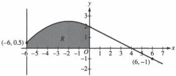

<!-- Page 1 -->

2024

AP

# AP® Calculus AB
## Sample Student Responses and Scoring Commentary

### Inside:

Free-Response Question 4

- ☑ Scoring Guidelines
- ☑ Student Samples
- ☑ Scoring Commentary

© 2024 College Board. College Board, Advanced Placement, AP, AP Central, and the acorn logo are registered trademarks of College Board. Visit College Board on the web: collegeboard.org.

AP Central is the official online home for the AP Program: apcentral.collegeboard.org.

<!-- Page 2 -->

AP® Calculus AB/BC 2024 Scoring Guidelines

## Part B (AB or BC): Graphing calculator not allowed

### Question 4

9 points

#### General Scoring Notes

The model solution is presented using standard mathematical notation.

Answers (numeric or algebraic) need not be simplified. Answers given as a decimal approximation should be correct to three places after the decimal point. Within each individual free-response question, at most one point is not earned for inappropriate rounding.

Graph of \(f\)

The graph of the differentiable function \( f \), shown for \( -6 \leq x \leq 7 \), has a horizontal tangent at \( x = -2 \) and is linear for \( 0 \leq x \leq 7 \). Let \( R \) be the region in the second quadrant bounded by the graph of \( f \), the vertical line \( x = -6 \), and the \( x \)- and \( y \)-axes. Region \( R \) has area 12.

|  Model Solution | Scoring  |   |
| --- | --- | --- |
|  The function \( g \) is defined by \( g(x) = \int_{0}^{x} f(t) dt \). Find the values of \( g(-6) \), \( g(4) \), and \( g(6) \).  |   |   |
|  \( g(-6) = \int_{0}^{-6} f(t) dt = -\int_{-6}^{0} f(t) dt = -12 \) | \( g(-6) \) | 1 point  |
|  \( g(4) = \int_{0}^{4} f(t) dt = \frac{1}{2} \cdot 4 \cdot 2 = 4 \) | \( g(4) \) | 1 point  |
|  \( g(6) = \int_{0}^{6} f(t) dt = \frac{1}{2} \cdot 4 \cdot 2 - \frac{1}{2} \cdot 2 \cdot 1 = 3 \) | \( g(6) \) | 1 point  |

© 2024 College Board

<!-- Page 3 -->

AP® Calculus AB/BC 2024 Scoring Guidelines

# **Scoring notes:**

- Supporting work is not required for any of these values. However, any supporting work that is shown must be correct to earn the corresponding point.
- Special case: A response that explicitly presents $g(x) = \int_{-6}^{x} f(t) \, dt$ does not earn the first point it would have otherwise earned. The response is eligible for all subsequent points for correct answers, or for consistent answers with supporting work.

○ Note: $\int_{-6}^{-6} f(t) \, dt = 0, \int_{-6}^{4} f(t) \, dt = 16, \int_{-6}^{6} f(t) \, dt = 15$

- Labeled values may be presented in any order. Unlabeled values are read from left to right and from top to bottom as $g(-6)$, $g(4)$, and $g(6)$, respectively. A response that presents only 1 or 2 values must label them to earn any points.

**Total for part (a) 3 points**

(b) For the function $g$ defined in part (a), find all values of $x$ in the interval $0 \le x \le 6$ at which the graph of $g$ has a critical point. Give a reason for your answer.

$g'(x) = f(x)$

$g'(x) = f(x) = 0 \Rightarrow x = 4$

Therefore, the graph of $g$ has a critical point at $x = 4$.

Fundamental 1 point

Theorem of Calculus

Answer with reason 1 point

# **Scoring notes:**

- The first point is earned for explicitly making the connection $g' = f$ in this part.

○ A response that writes $g'' = f'$ earns the first point but can only earn the second point by reasoning from $f = 0$.

- A response that does not earn the first point is eligible to earn the second point with an implied application of the FTC (e.g., “Because $g'(4) = 0$, $x = 4$ is a critical point”).

- A response that reports any additional critical points in $0 < x < 6$ does not earn the second point.

○ Any presented critical point outside the interval $0 < x < 6$ will not affect scoring.

**Total for part (b) 2 points**

© 2024 College Board

<!-- Page 4 -->

AP® Calculus AB/BC 2024 Scoring Guidelines

(c)

The function $h$ is defined by $h(x) = \int_{-6}^{x} f'(t) \, dt$. Find the values of $h(6)$, $h'(6)$, and $h''(6)$. Show the work that leads to your answers.

|  $h(6) = \int_{-6}^{6} f'(t) \, dt = f(6) - f(-6) = -1 - 0.5 = -1.5$ | Uses Fundamental Theorem of Calculus | **1 point**  |
| --- | --- | --- |
|   |  $h(6)$ with supporting work | **1 point**  |
|  $h'(x) = f'(x)$, so $h'(6) = f'(6) = -\frac{1}{2}$. | $h'(6)$ | **1 point**  |
|  $h''(x) = f''(x)$, so $h''(6) = f''(6) = 0$. | $h''(6)$ | **1 point**  |

# Scoring notes:

- Labeled values may be presented in any order.
- Unlabeled values are read from left to right and from top to bottom as $h(6)$, $h'(6)$, and $h''(6)$, respectively. A response that presents only 1 or 2 values must label them in order to earn any points.
- A response of $h(6) = -1.5$ does not earn either of the first 2 points. A response of $h(6) = f(6) - f(-6)$ earns the first point but not yet the second point.
- A response of $h(6) = -1 - 0.5$ is the minimum work required to earn both of the first 2 points.
- To earn the third point a response must state either $h'(x) = f'(x)$ or $h'(6) = f'(6)$, and provide an answer of $-\frac{1}{2}$.
- The fourth point is earned for a response of $h''(6) = 0$, with or without supporting work.
- A response that has one or more linkage errors does not earn the first point it would have otherwise earned. For example, $h'(x) = f'(6) = -\frac{1}{2}$ does not earn the third point but is eligible for the fourth point even in the presence of another linkage error, such as $h''(x) = f''(6) = 0$.

Total for part (c) 4 points

Total for question 4 9 points

© 2024 College Board

<!-- Page 5 -->

1 of 2

Sample 4A

4 4 4 4 4 NO CALCULATOR ALLOWED 4 4 4 4 4

Answer QUESTION 4 part (a) on this page.

Graph of f

Response for question 4(a)

$$g(-6) = \int_{0}^{6} f(t) dt = \boxed{-12}$$

$$g(4) = \int_{0}^{4} f(t) dt = \boxed{4}$$

$$g(6) = \int_{0}^{6} f(t) dt = \boxed{3}$$

Page 10

Use a pencil or a pen with black or dark blue ink. Do NOT write your name. Do NOT write outside the box.

0097317

Q5224/10

<!-- Page 6 -->

2 of 2

Sample 4A

4 4 4 4 4 NO CALCULATOR ALLOWED 4 4 4 4 4

Answer QUESTION 4 parts (b) and (c) on this page.

Response for question 4(b)

$$g'(x) = \frac{d}{dx} \int_{0}^{x} f(t) dt = f(x) \quad \begin{array}{l} \text{Fundamental} \\ \text{Theorem of Calculus II} \end{array}$$

$$g'(x) = f(x) = 0$$

$$\rightarrow x = \boxed{4}$$

g has a critical point at x = 4 because g'(x), the

slope of g(x), equals 0 at x = 4. We know this because

g'(x) = f(x) by the Fundamental Theorem of Calculus II, & f(4) = 0.

Response for question 4(c)

$$h(x) = \int_{-6}^{x} f'(t) dt = f(t)|_{-6}^{x}$$

$$h(6) = \int_{-6}^{6} f'(t) dt = f(t)|_{-6}^{6} = f(6) - f(-6) = -1 - 0.5 = \boxed{-1.5}$$

$$h'(x) = \frac{d}{dx} \int_{-6}^{x} f'(t) dt = f'(x)$$

$$h'(6) = f'(6) = \boxed{-\frac{1}{2}}$$

$$h''(6) = f''(6) = \boxed{0}$$

Page 11

Use a pencil or a pen with black or dark blue ink. Do NOT write your name. Do NOT write outside the box.

Q5234/11

<!-- Page 7 -->

1 of 2

Sample 4B

4 4 4 4 4 NO CALCULATOR ALLOWED 4 4 4 4 4

Answer QUESTION 4 part (a) on this page.

Graph of f

Response for question 4(a)

$$g(-6) = \int_{0}^{6} f(t) = \int_{-6}^{8} -f(x) \Rightarrow 12$$

$$g(4) = \int_{0}^{4} f(t) = \frac{1}{2}(4)(2) = 4$$

$$g(6) = \int_{0}^{6} f(t) = \int_{0}^{6} f(x) \Rightarrow 3$$

Page 10

Use a pencil or a pen with black or dark blue ink. Do NOT write your name. Do NOT write outside the box.

0003068

Q5228/10

<!-- Page 8 -->

2 of 2

Sample 4B

4

4

4

4

4

NO CALCULATOR ALLOWED

4

4

4

4

4

Answer QUESTION 4 parts (b) and (c) on this page.

Response for question 4(b)

$$g(x) = \int_{0}^{x} f(t) dt$$

$$g'(x) = f(t)$$

$$g'(x) = 0 \text{ where } f(t) = 0$$

$$at \ t = 4$$

$$g(x) \text{ has a critical point at } x=4 \text{ because}$$
$$g'(t) = f(x) \text{ and } f'(x) = 0 \text{ so } g'(t) = 0 \text{ at } x=4$$

Response for question 4(c)

$$h(6) = \int_{6}^{6} f'(t) \Rightarrow f'(6) - f'(-6) \Rightarrow \frac{-1}{2} - 0 \Rightarrow \frac{-1}{2}$$

$$h'(6) = f'(6) = \frac{-1}{2}$$

$$h''(6) = f''(6) \Rightarrow \textcircled{Q}$$

Page 11

Use a pencil or a pen with black or dark blue ink. Do NOT write your name. Do NOT write outside the box.

Q5228/11

<!-- Page 9 -->

1 of 2

Sample 4C

4 4 4 4 4 NO CALCULATOR ALLOWED 4 4 4 4 4

Answer QUESTION 4 part (a) on this page.

Graph of f

Response for question 4(a)

$$\int_{0}^{-6} f(t) = 12$$

$$\int_{0}^{4} f(t) = 4$$

$$\int_{0}^{6} f(t) = 4 + 1 = 9$$

Page 10

Use a pencil or a pen with black or dark blue ink. Do NOT write your name. Do NOT write outside the box.

0012183

Q5223/10

<!-- Page 10 -->

2 of 2

Sample 4C

Answer QUESTION 4 parts (b) and (c) on this page.

Response for question 4(b)

$$k = 4$$

Critical points match in sections when taking derivative equation

Response for question 4(c)

$$h'(6) = f'(6) - f'(-6)$$

$$-\frac{1}{2} - \frac{3}{8} \cdot -\frac{7}{8}$$

$$h''(6) = f''(6) - f''(-6)$$

$$h(6) \int_{-6}^{6} f'(t)$$

$$f(6) - f(-6)$$

$$-1 \cdot 5$$

$$-\frac{3}{2}$$

Page 11

Use a pencil or a pen with black or dark blue ink. Do NOT write your name. Do NOT write outside the box.

Q5223/11

<!-- Page 11 -->

AP® Calculus AB/BC 2024 Scoring Commentary

# Question 4

Note: Student samples are quoted verbatim and may contain spelling and grammatical errors.

# Overview

In this question the graph of a differentiable function $f$, for $-6 \leq x \leq 7$, and the shaded region $R$ in the second quadrant bounded by the graph of $f$, the vertical line $x = -6$ and the $x$- and $y$-axes are shown. Students are told that $f$ has a horizontal tangent at $x = -2$ and is linear for $0 \leq x \leq 7$. Students are also told that region $R$ has area 12.

In part (a) the function $g(x) = \int_0^x f(t) \, dt$, is defined and students are asked to find the values $g(-6)$, $g(4)$, and $g(6)$. A correct response would recognize that $g(-6) = \int_0^{-6} f(t) \, dt = -(\text{area of } R) = -12$. In addition, $g(4) = \int_0^4 f(t) \, dt$ is the area of a triangle of base 4 and height 2, so $g(4) = 4$. Finally,

$g(6) = g(4) + \int_4^6 f(t) \, dt$, where $g$ is the area of a triangle with base 2 and height $-1$. Thus, $g(6) = 4 - 1 = 3$. Throughout this part of the problem, students are asked to demonstrate knowledge of the properties of definite integrals.

In part (b) students are asked to find all values of $x$ in the interval $0 \leq x \leq 6$ at which the graph of $g$ has a critical point. A correct response would recognize that by the Fundamental Theorem of Calculus, the derivative of the function $g$ is the function $f(g' = f)$, and therefore the critical points of $g$ occur where $f(x) = 0$ or where $f(x)$ is undefined. Because $f(x)$ is differentiable, $f(x)$ is defined for all $x$ in the interval $[0,6]$. Therefore, $f(x) = 0 \Rightarrow x = 4$. Thus, the only critical point in this interval occurs at $x = 4$.

In part (c) a third function, $h$, is defined as $h(x) = \int_{-6}^x f'(t) \, dt$, and students are asked to evaluate this function and its first two derivatives at $x = 6$. A correct response will use the Fundamental Theorem of Calculus and the given graph of $f$ to find that $h(6) = \int_{-6}^6 f'(t) \, dt = f(6) - f(-6) = -1.5$. Applying the Fundamental Theorem of

Calculus again, a correct response would indicate that $h'(x) = f'(x)$ and use the fact that $f$ is linear for $0 \leq x \leq 7$ to find that $h'(6) = f'(6)$ equals the slope of $f$ at $x = 6$. Finally, a correct response would report that $h''(6) = f''(6) = 0$ because $f$ is linear for $0 \leq x \leq 7$.

Sample: 4A

Score: 9

The response earned 9 points: 3 points in part (a), 2 points in part (b), and 4 points in part (c).

In part (a) the response earned the first point on the first line with the conclusion $g(-6) = -12$. The response earned the second point on the second line with the conclusion $g(4) = 4$. The response then earned the third point on the third line with the conclusion $g(6) = 3$. Although supporting work was not required to earn any of these three points, any supporting work presented must be correct. The response has all correct corresponding work with the presentation of integrals on each of the three lines.

In part (b) the response earned the first point on the first two lines with the explicit application of the Fundamental Theorem of Calculus (FTC), with correct supporting work, resulting with the conclusion that $g'(x) = f(x)$. The response earned the second point on the last three lines with the conclusion that “$g$ has a critical point at $x = 4$

© 2024 College Board.

Visit College Board on the web: collegeboard.org.

<!-- Page 12 -->

AP® Calculus AB/BC 2024 Scoring Commentary

## Question 4 (continued)

because $g'(x)$, the slope of $g(x)$, equals 0 at $x = 4$." The response continues correctly to refer to the fact that $g'(x) = f(x)$ by the FTC.

In part (c) the response earned the first point on the second line with the intermediate step indicating that $h(6) = f(6) - f(-6)$. The response earned the second point by correctly linking the above work with the numerical value $-1 - 0.5 = -1.5$. Note that the expression $-1 - 0.5$ appropriately linked to $h(6)$ would have earned both the first two points. The response earned the third point on the third line with the conclusion on the penultimate line that $h'(6) = -\frac{1}{2}$ with the supporting work on the line above indicating that $h'(x) = f'(x)$. The response earned the fourth point on the last line with the conclusion $h''(6) = 0$.

**Sample: 4B**

**Score: 6**

The response earned 6 points: 2 points in part (a), 2 points in part (b), and 2 points in part (c).

In part (a) the response did not earn the first point as the answer presented for $g(-6)$ at the end of the first line is 12, which is incorrect. The response would have earned the second and third points with the 4 and 3, presented at the ends of lines two and three, unsupported. Because support is presented, that support must be correct to earn each point. The supporting work on lines two and three is correct, thus the second and third points were earned.

In part (b) the response earned the first point with the equation on the second line. This is then reinforced on the third line with the indication that $g'$ is 0 where $f$ is 0. Note that although there is a difference between the independent variables presented with the above functions, this point is earned for correctly identifying the relationship between $g$ and $f$ via the FTC, as this response has done. The response earned the second point with the conclusion on the last two lines that " $g(x)$ has a critical point at $x = 4$ " and the supporting reason that $g'$ is 0 at $x = 4$.

In part (c) the response did not earn the first point as the presentation on the first line that $h(6)$ is $f'(6) - f'(-6)$ is incorrect. The response did not earn the second point as the value presented for $h(6)$ is incorrect. The response earned the third point on the penultimate line with the conclusion that $h'(6) = f'(6) = -\frac{1}{2}$. Note here that the intermediate step $h'(6) = f'(6)$ is necessary to earn the third point. It would have also sufficed to present $h'(x) = f'(x)$ to justify a correct evaluation of $h'(6)$. The response earned the fourth point with the correct conclusion that $h''(6)$ is 0.

**Sample: 4C**

**Score: 3**

The response earned 3 points: 1 point in part (a), no points in part (b), and 2 points in part (c).

In part (a) the response did not earn the first point as the first statement that $\int_0^{-6} f(t) = 12$ is not true. Note that as this response does not label the three answers, it is assumed that they are in the order presented in the question. The response earned the second point on the second line with the statement $\int_0^4 f(t) = 4$. The response did not earn the third point as the answer of 5 presented is not correct.

© 2024 College Board.
Visit College Board on the web: collegeboard.org.

<!-- Page 13 -->

AP® Calculus AB/BC 2024 Scoring Commentary

### Question 4 (continued)

In part (b) the response did not earn the first point as no connection is presented between functions $f$ and $g$ via the FTC. Although the response presents the correct location of $x = 4$ for a critical point, the reasoning is that “Critical points match inflections when taking derivative equation.” is not correct.

In part (c) the response earned the first point on the second line in the work on the left, as the presented expression $f(6) - f(-6)$ provides evidence for the use of the FTC in evaluating $h(6)$. The response would have earned the second point on the third line on the left with the expression $-1 - .5$ without simplification. The simplification is correct, and the point was earned on the last line. The response did not earn the third point as the answer presented for $h'(6)$ is incorrect. The response did not earn the fourth point as no answer is presented for $h''(6)$.

© 2024 College Board.

Visit College Board on the web: collegeboard.org.
