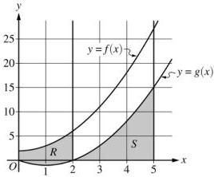
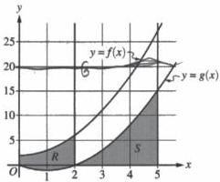
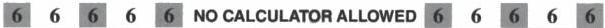
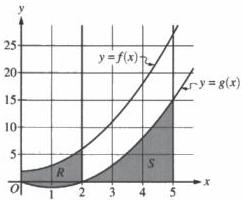
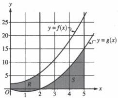
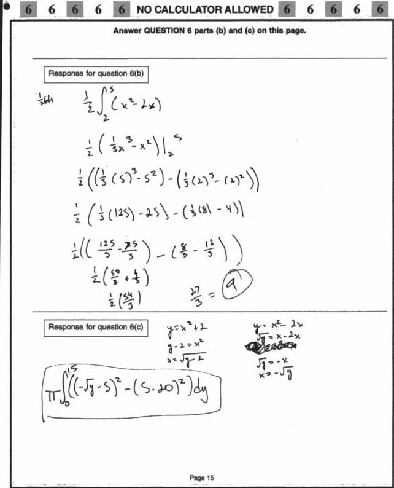

<!-- Page 1 -->

2024

AP

# AP® Calculus AB
## Sample Student Responses and Scoring Commentary

### Inside:

Free-Response Question 6

- ☑ Scoring Guidelines
- ☑ Student Samples
- ☑ Scoring Commentary

© 2024 College Board. College Board, Advanced Placement, AP, AP Central, and the acorn logo are registered trademarks of College Board. Visit College Board on the web: collegeboard.org.

AP Central is the official online home for the AP Program: apcentral.collegeboard.org.

<!-- Page 2 -->

AP® Calculus AB/BC 2024 Scoring Guidelines

## Part B (AB): Graphing calculator not allowed

### Question 6

9 points

#### General Scoring Notes

The model solution is presented using standard mathematical notation.

Answers (numeric or algebraic) need not be simplified. Answers given as a decimal approximation should be correct to three places after the decimal point. Within each individual free-response question, at most one point is not earned for inappropriate rounding.

The functions $f$ and $g$ are defined by $f(x) = x^2 + 2$ and $g(x) = x^2 - 2x$, as shown in the graph.

|  Model Solution | Scoring  |
| --- | --- |

(a) Let $R$ be the region bounded by the graphs of $f$ and $g$, from $x = 0$ to $x = 2$, as shown in the graph. Write, but do not evaluate, an integral expression that gives the area of region $R$.

|  Area = $\int_0^2 (f(x) - g(x)) \, dx$ | Integrand | 1 point  |
| --- | --- | --- |
|   |  Answer | 1 point  |

#### Scoring notes:

- The first point is earned for a response that presents an integrand of $f(x) - g(x)$, $|f(x) - g(x)|$, $g(x) - f(x)$, or $|g(x) - f(x)|$ in one or more definite integrals.
- The first point could also be earned for a difference of definite integrals with integrands $f(x)$ and $g(x)$.
- The second point is earned only for one or more integrals equivalent to $\int_0^2 (f(x) - g(x)) \, dx$, such as $\int_0^2 f(x) \, dx - \int_0^2 g(x) \, dx$, $\int_0^2 |f(x) - g(x)| \, dx$, $-\int_0^2 (g(x) - f(x)) \, dx$, or $\int_0^2 |g(x) - f(x)| \, dx$.

○ Note: $\int_0^2 f(x) \, dx + \left| \int_0^2 g(x) \, dx \right|$ would earn both points.

Total for part (a) 2 points

© 2024 College Board

<!-- Page 3 -->

AP® Calculus AB/BC 2024 Scoring Guidelines

(b) Let S be the region bounded by the graph of g and the x-axis, from x = 2 to x = 5, as shown in the graph. Region S is the base of a solid. For this solid, at each x the cross section perpendicular to the x-axis is a rectangle with height equal to half its base in region S. Find the volume of the solid. Show the work that leads to your answer.

|  Volume = $$\int_{2}^{5} \frac{1}{2}(g(x))^{2} dx = \int_{2}^{5} \frac{1}{2}(x^{2} - 2x)^{2} dx$$ | Integrand | 1 point  |
| --- | --- | --- |
|   |  Limits | 1 point  |
|  $$= \frac{1}{2} \int_{2}^{5} (x^{4} - 4x^{3} + 4x^{2}) dx$$ | Antiderivative | 1 point  |
|  $$= \frac{1}{2} \left[ \frac{x^{5}}{5} - x^{4} + \frac{4x^{3}}{3} \right]_{2}^{5}$$ |  |   |
|  $$= \frac{1}{2} \left[ \left( \frac{5^{5}}{5} - 5^{4} + \frac{500}{3} \right) - \left( \frac{32}{5} - 16 + \frac{32}{3} \right) \right]$$ | Answer | 1 point  |
|  $$= \frac{1}{2} \left( \frac{500}{3} - \frac{16}{15} \right) = \frac{414}{5}$$ |  |   |

# Scoring notes:

- The first point is earned only by a response with an integrand of the form $$k(g(x))^{2}$$ in a definite integral, where k is any nonzero constant.
- The second point is earned for limits of x = 2 and x = 5 in a definite integral with an integrand of the form $$a(x) \cdot g(x)$$ for any nonzero factor a(x).
- To earn the third point a response must provide a correct antiderivative of $$k(x^{2} - 2x)^{n}$$ for some integer $$n \geq 2$$.
- The fourth point is earned only for a numeric answer equivalent to $$\frac{1}{2}\left(\frac{500}{3} - \frac{16}{15}\right)$$.
- Special case: A response of Volume = $$\int_{2}^{5} \frac{1}{2}(f(x))^{2} dx$$ or Volume = $$\int_{2}^{5} \frac{1}{2}(x^{2} + 2)^{2} dx$$ earns the first 2 points and is not eligible for the last 2 points.

Total for part (b) 4 points

© 2024 College Board

<!-- Page 4 -->

AP® Calculus AB/BC 2024 Scoring Guidelines

(c) Write, but do not evaluate, an integral expression that gives the volume of the solid generated when region S, as described in part (b), is rotated about the horizontal line y = 20.

|  Volume = $$\pi \int_{2}^{5} \left[ (20^2) - (20 - g(x))^2 \right] dx$$ = $$\pi \int_{2}^{5} \left[ 400 - (20 - g(x))^2 \right] dx$$ = $$\pi \int_{2}^{5} \left[ 400 - \left( 20 - (x^2 - 2x) \right)^2 \right] dx$$ | Form of integrand | 1 point  |
| --- | --- | --- |
|   |  Integrand | 1 point  |
|   |  Limits and constant | 1 point  |

# Scoring notes:

- The first point is earned for a response that presents an integrand of $$20^2 - (20 - g(x))^2$$, $$20^2 - (g(x) - 20)^2$$, $$(20 - g(x))^2 - 20^2$$, $$(g(x) - 20)^2 - 20^2$$, or any mathematically equivalent expression, in one or more definite integrals.

- The second point is earned only for an integrand mathematically equivalent to $$20^2 - (20 - g(x))^2$$ or $$20^2 - (g(x) - 20)^2$$ in a definite integral. Note that $$\int_{a}^{b} \left| (20 - g(x))^2 - 400 \right| dx$$ or $$\left| \int_{a}^{b} \left( (20 - g(x))^2 - 400 \right) dx \right|$$ earns the first 2 points.

- The integral may be split into two integrals.

○ For example, Volume = $$\pi \int_{2}^{5} (20^2) dx - \pi \int_{2}^{5} (20 - g(x))^2 dx$$ or
Volume = $$\pi \cdot 20^2 \cdot 3 - \pi \int_{2}^{5} (20 - g(x))^2 dx$$.

- A response that presents an allowable integrand involving g(x), but continues and makes an error in using the expression for g(x), does not earn the second point.

○ For example, $$\pi \int_{2}^{5} \left[ 20^2 - (20 - g(x))^2 \right] dx = \pi \int_{2}^{5} \left[ 20^2 - (20 - x^2 - 2x)^2 \right] dx$$ earns the first point but does not earn the second point.

- To be eligible for the third point a response must have earned at least 1 of the first 2 points or must have presented an integrand involving g(x) of the form $$R^2 - r^2$$ in a definite integral.

- The third point is earned only by a definite integral including the constant $$\pi$$ and limits x = 2 to x = 5. A response that presents any other constant or limits (including x = 5 to x = 2, except in the note below) does not earn the third point.

○ Note: $$\pi \int_{5}^{2} \left[ (20 - g(x))^2 - 400 \right] dx$$ would earn all three points.

- Special case: A response of $$\pi \int_{2}^{5} \left[ 400 - (20 - f(x))^2 \right] dx$$ or equivalent earns 2 of the 3 points.

Total for part (c) 3 points

Total for question 6 9 points

© 2024 College Board

<!-- Page 5 -->

1 of 2

Sample 6A

6 6 6 6 6 NO CALCULATOR ALLOWED 6 6 6 6 6

Answer QUESTION 6 part (a) on this page.

$$f(x) = x^2 + 2$$

$$g(x) = x^2 - 2x$$

Response for question 6(a)

$$A_R = \int_0^2 [f(x) - g(x)] dx$$

Page 14

Use a pencil or a pen with black or dark blue ink. Do NOT write your name. Do NOT write outside the box.

0003703

Q5224/14

<!-- Page 6 -->

2 of 2

Sample 6A

6

6

6

6

6

NO CALCULATOR ALLOWED

6

6

6

6

6

Answer QUESTION 6 parts (b) and (c) on this page.

Response for question 6(b)

$$V = \int_{2}^{5} A(x) \, dx$$

$$\begin{array}{l} A = b - \frac{1}{2}b = \frac{1}{2}b^2 \\ \text{for example} \\ b = g(x) - 0 \\ = (x^2 - 2x) \end{array} \quad \rightarrow A = \frac{1}{2}(x^2 - 2x)^2$$

$$V = \frac{1}{2} \int_{2}^{5} (x^2 - 2x)^2 \, dx \quad (x^2 - 2x)(x^2 - 2x)$$

$$= \frac{1}{2} \int_{2}^{5} (x^4 - 4x^3 + 4x^2) \, dx$$

$$= \frac{1}{2} \left[ \frac{x^5}{5} - x^4 + \frac{4}{3}x^3 \right]_{2}^{5}$$

$$\frac{1}{2} \left( \left[ \frac{5}{5} - 5^4 + \frac{4}{3}(5)^3 \right] - \left[ \frac{25}{5} - 2^4 + \frac{4}{3}(2)^3 \right] \right)$$

Response for question 6(c)

$$R(x) = 20$$

$$r(x) = 20 - g(x)$$

$$V = \pi \int_{2}^{5} \left[ (20)^2 - (20 - g(x))^2 \right] dx$$

Page 15

Use a pencil or a pen with black or dark blue ink. Do NOT write your name. Do NOT write outside the box.

Q5224/15

<!-- Page 7 -->

1 of 2

Sample 6B

Answer QUESTION 6 part (a) on this page.

Response for question 6(a)

$$\int_{0}^{2} (x^2 + 2) - (x^2 - 2x) dx$$

Page 14

Use a pencil or a pen with black or dark blue ink. Do NOT write your name. Do NOT write outside the box.

0004719

Q5223/14

<!-- Page 8 -->

2 of 2

Sample 6B

6 6 6 6 6 NO CALCULATOR ALLOWED 6 6 6 6 6

Answer QUESTION 6 parts (b) and (c) on this page.

Response for question 6(b)

$$a = \frac{b}{2} \cdot b \quad b = x^2 - 2x - 0$$

$$\sum_{2}^{5} \left( \left( \frac{x^2 - 2x}{2} \right) \cdot (x^2 - 2x) \right) dx \quad U = \frac{1}{2} (x^2 - 2x)$$

$$\sum_{2}^{5}$$

Response for question 6(c)

$$\pi \sum_{2}^{5} \left( (x^2 - 2x - 20)^2 - (20)^2 \right) dx$$

Page 15

Use a pencil or a pen with black or dark blue ink. Do NOT write your name. Do NOT write outside the box.

Q8229/15

● ● ● ● ● ● ● ● ● ● ●

<!-- Page 9 -->

1 of 2

Sample 6C

6 6 6 6 6 NO CALCULATOR ALLOWED 6 6 6 6 6

Answer QUESTION 6 part (a) on this page.

Response for question 6(a)

$$\int_{0}^{2} ((x^2 + 2) - (x^2 - 2x)) dx$$

Page 14

Use a pencil or a pen with black or dark blue ink. Do NOT write your name. Do NOT write outside the box.

0160451

Q5220/14

<!-- Page 10 -->

2 of 2

Sample 6C

Use a pencil or a pen with black or dark blue ink. Do NOT write your name. Do NOT write outside the box.

Q5229/15

●●●●

● ●

●

● ●

● ● ●

<!-- Page 11 -->

AP® Calculus AB 2024 Scoring Commentary

# Question 6

Note: Student samples are quoted verbatim and may contain spelling and grammatical errors.

# Overview

In this problem a graph of functions $f(x) = x^2 + 2$ and $g(x) = x^2 - 2x$ for $0 \leq x \leq 5$ was shown.

In part (a) students were told that the shaded region $R$ is bounded by the graphs of $f$ and $g$, from $x = 0$ to $x = 2$. Students were asked to write, but not evaluate, an integral expression that gives the area of region $R$. A correct response will provide the integral $\int_0^2 (f(x) - g(x)) \, dx$, including the outer parentheses and differential.

In part (b) students were told that the shaded region $S$ is bounded by the graph of $g$ and the $x$-axis, from $x = 2$ to $x = 5$, and that this region is the base of a solid where for each $x$ the cross section perpendicular to the $x$-axis is a rectangle with height equal to half its base in region $S$. Students were asked to find the volume of this solid. A correct response will present the definite integral $\int_2^5 \frac{1}{2}(g(x))^2 \, dx = \int_2^5 \frac{1}{2}(x^2 - 2x)^2 \, dx$, recognize the need to expand $(g(x))^2$, find an antiderivative for $\frac{1}{2}(x^4 - 4x^3 + 4x^2)$, and compute the difference of the antiderivative evaluated at $x = 5$ and at $x = 2$.

In part (c) students were asked to write, but not evaluate, an integral expression that gives the volume of the solid that is generated when the region $S$ is rotated about the horizontal line $y = 20$. A correct answer will present the definite integral $\pi \int_2^5 [20^2 - (20 - g(x))^2] \, dx$, including the outer brackets or parentheses and the differential.

Sample: 6A

Score: 9

The response earned 9 points: 2 points in part (a), 4 points in part (b), and 3 points in part (c).

In part (a) the response earned the first and second points with the definite integral $\int_0^2 [f(x) - g(x)] \, dx$ in line 1.

In part (b) the response earned the first and second points with the integral $\int_2^5 A(x) \, dx$ in line 1 on the left in the presence of $A = \frac{1}{2}(x^2 - 2x)^2$ in line 1 on the right. The response earned the third point with the correct antiderivative in line 4. The boxed answer in line 5 earned the fourth point (numerical simplification is not required).

In part (c) the response earned the first and second points for the integrand $[(20)^2 - (20 - g(x))^2]$ in a definite integral in the boxed answer on the left. The response presents the correct constant and the correct limits of integration in the boxed answer, so the third point was earned.

© 2024 College Board.

Visit College Board on the web: collegeboard.org.

<!-- Page 12 -->

AP® Calculus AB 2024 Scoring Commentary

### Question 6 (continued)

**Sample: 6B**

**Score: 6**

The response earned 6 points: 2 points in part (a), 2 points in part (b), and 2 points in part (c).

In part (a) the response earned the first and second points with the integral $$\int_0^2 (x^2 + 2) - (x^2 - 2x) \, dx$$.

In part (b) the response presents a definite integral with the integrand $$\left(\left(\frac{x^2 - 2x}{2}\right) \cdot (x^2 - 2x)\right)$$ in line 2 on the left, so the first point is earned. The second point was earned for the correct limits of integration in the definite integral in line 2. The response does not present an antiderivative, so the third and fourth points were not earned.

In part (c) the response presents an integrand in a definite integral that is mathematically equivalent to $$(g(x) - 20)^2 - (20)^2$$, so the first point is earned. The integrand $$(x^2 - 2x - 20)^2 - (20)^2$$ is not mathematically equivalent to $$20^2 - (20 - g(x))^2$$, so the second point was not earned. The response presents the correct constant and the correct limits of integration as part of an integrand involving $$g(x)$$ of the form $$R^2 - r^2$$, so the third point was earned.

**Sample: 6C**

**Score: 3**

The response earned 3 points: 2 points in part (a), 1 point in part (b), and no points in part (c).

In part (a) the response earned the first and second points with the definite integral $$\int_0^2 \left((x^2 + 2) - (x^2 - 2x)\right) \, dx$$.

In part (b) the response did not earn the first point because the integrand $$x^2 - 2x$$ in line 1 is not of the form $$k(g(x))^2$$. The response earned the second point for the limits of $$x = 2$$ and $$x = 5$$ in line 1 because the presented integrand is of the form $$a(x) \cdot g(x)$$, where $$a(x)$$ is nonzero. The response did not earn the third or fourth points. A response that presents the integrand $$x^2 - 2x$$, which is not of the form $$k(x^2 - 2x)^n$$ where $$n \ge 2$$, is not eligible for the third or fourth points.

In part (c) the response did not earn the first point because the presented integrand $$(-\sqrt{y} - 5)^2 - (5 - 20)^2$$ in line 4 is not an eligible form. The response did not earn the second point because the integrand is incorrect. The boxed integral expression does not involve $$g(x)$$, so the response is not eligible for the third point.

© 2024 College Board.

Visit College Board on the web: collegeboard.org.
