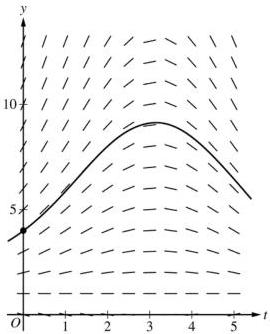
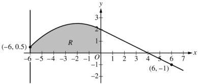

<!-- Page 1 -->

2024

# AP® Calculus AB
## Scoring Guidelines

© 2024 College Board. College Board, Advanced Placement, AP, AP Central, and the acorn logo are registered trademarks of College Board. Visit College Board on the web: collegeboard.org.

AP Central is the official online home for the AP Program: apcentral.collegeboard.org.

<!-- Page 2 -->

AP® Calculus AB/BC 2024 Scoring Guidelines

## Part A (AB or BC): Graphing calculator required

### Question 1

9 points

#### General Scoring Notes

The model solution is presented using standard mathematical notation.

Answers (numeric or algebraic) need not be simplified. Answers given as a decimal approximation should be correct to three places after the decimal point. Within each individual free-response question, at most one point is not earned for inappropriate rounding.

|  \( t \)(minutes) | 0 | 3 | 7 | 12  |
| --- | --- | --- | --- | --- |
|  \( C(t) \)(degrees Celsius) | 100 | 85 | 69 | 55  |

The temperature of coffee in a cup at time t minutes is modeled by a decreasing differentiable function C, where  \( C(t) \)  is measured in degrees Celsius. For  \( 0 \leq t \leq 12 \) , selected values of  \( C(t) \)  are given in the table shown.

|  Model Solution | Scoring  |   |
| --- | --- | --- |
|  (a) Approximate \( C'(5) \) using the average rate of change of \( C \) over the interval \( 3 \leq t \leq 7 \). Show the work that leads to your answer and include units of measure.  |   |   |
|  \( C'(5) \approx \frac{C(7) - C(3)}{7 - 3} = \frac{69 - 85}{4} = -4 \) degrees Celsius per minute | Estimate with supporting work | 1 point  |
|   |  Units | 1 point  |

##### Scoring notes:

• To earn the first point a response must include a difference and a quotient as the supporting work.
- \(\frac{-16}{7 - 3}, \frac{69 - 85}{7 - 3}\), or \(\frac{69 - 85}{4}\) is sufficient to earn the first point.
- A response that presents only units without a numerical approximation for \( C'(5) \) does not earn the second point.
- The second point is also earned for “degrees per minute” attached to a numerical value.

Total for part (a) 2 points

© 2024 College Board

<!-- Page 3 -->

AP® Calculus AB/BC 2024 Scoring Guidelines

(b) Use a left Riemann sum with the three subintervals indicated by the data in the table to approximate the value of $$\int_{0}^{12} C(t) \, dt$$. Interpret the meaning of $$\frac{1}{12} \int_{0}^{12} C(t) \, dt$$ in the context of the problem.

|  $$\int_{0}^{12} C(t) \, dt \approx (3 - 0) \cdot C(0) + (7 - 3) \cdot C(3) + (12 - 7) \cdot C(7)$$ $$= 3 \cdot 100 + 4 \cdot 85 + 5 \cdot 69 = 985$$ | Form of left Riemann sum | 1 point  |
| --- | --- | --- |
|   |  Estimate | 1 point  |
|  $$\frac{1}{12} \int_{0}^{12} C(t) \, dt$$ is the average temperature of the coffee (in degrees Celsius) over the interval from $$t = 0$$ to $$t = 12$$. | Interpretation | 1 point  |

# Scoring notes:

- Read “=” as “≈” for the first point.
- To earn the first point at least five of the six factors in the Riemann sum must be correct. If any of the six factors is incorrect, the response does not earn the second point.
- A response of $$(3 - 0) \cdot C(0) + (7 - 3) \cdot C(3) + (12 - 7) \cdot C(7)$$ earns the first point. Values must be pulled from the table to earn the second point.
- A response of $$3 \cdot 100 + 4 \cdot 85 + 5 \cdot 69$$ earns both the first and second points, unless there is a subsequent error in simplification, in which case the response would earn only the first point.
- A completely correct right Riemann sum (e.g., $$3 \cdot 85 + 4 \cdot 69 + 5 \cdot 55$$) earns 1 of the first 2 points. An unsupported answer of 806 does not earn either of the first 2 points.
- Units will not affect scoring for the second point.
- To earn the third point the interpretation must include both “average temperature” and the time interval. The response need not include a reference to units. However, if incorrect units are given in the interpretation, the response does not earn the third point.

Total for part (b) 3 points

(c) For $$12 \leq t \leq 20$$, the rate of change of the temperature of the coffee is modeled by

$$C'(t) = \frac{-24.55e^{0.01t}}{t}$$, where $$C'(t)$$ is measured in degrees Celsius per minute. Find the temperature of the coffee at time $$t = 20$$. Show the setup for your calculations.

|  $$C(20) = C(12) + \int_{12}^{20} C'(t) \, dt$$ | Integral | 1 point  |
| --- | --- | --- |
|   |  Uses initial condition | 1 point  |
|  $$= 55 - 14.670812 = 40.329188$$ | Answer | 1 point  |
|  The temperature of the coffee at time $$t = 20$$ is 40.329 degrees Celsius. |  |   |

© 2024 College Board

<!-- Page 4 -->

AP® Calculus AB/BC 2024 Scoring Guidelines

# Scoring notes:

- The first point is earned for a definite integral with integrand $C'(t)$. If the limits of integration are incorrect, the response does not earn the third point.
- A linkage error such as $C(20) = \int_{12}^{20} C'(t) \, dt = 55 - 14.670812$ or
$\int_{12}^{20} C'(t) \, dt = -14.670812 = 40.329188$ earns the first 2 points but does not earn the third point.
- Missing differential ($dt$):

○ Unambiguous responses of $C(20) = C(12) + \int_{12}^{20} C'(t)$ or $C(20) = 55 + \int_{12}^{20} C'(t)$ earn the first 2 points and are eligible for the third point.
○ Ambiguous responses of $C(20) = \int_{12}^{20} C'(t) + C(12)$ or $C(20) = \int_{12}^{20} C'(t) + 55$ do not earn the first point, earn the second point, and earn the third point if the given numeric answer is correct. If there is no numeric answer given, these responses do not earn the third point.

- The second point is earned for adding $C(12)$ or 55 to a definite integral with a lower limit of 12, either symbolically or numerically.
- The third point is earned for an answer of $55 - 14.671$ or $-14.671 + 55$ with no additional simplification, provided there is some supporting work for these values.
- An answer of just 40.329 with no supporting work does not earn any points.

Total for part (c) 3 points

(d)

For the model defined in part (c), it can be shown that $C''(t) = \frac{0.2455e^{0.01t}(100 - t)}{t^2}$. For

$12 < t < 20$, determine whether the temperature of the coffee is changing at a decreasing rate or at an increasing rate. Give a reason for your answer.

Because $C''(t) > 0$ on the interval $12 < t < 20$, the rate of change in the temperature of the coffee, $C'(t)$, is increasing on this interval.

That is, on the interval $12 < t < 20$, the temperature of the coffee is changing at an increasing rate.

Answer with reason 1 point

# Scoring notes:

- This point is earned only for a correct answer with a correct reason that references the sign of the second derivative of $C$.
- A response that provides a reason based on the evaluation of $C''(t)$ at a single point does not earn this point.
- A response that uses ambiguous pronouns (such as “It is positive, so increasing”) does not earn this point.
- A response does not need to reference the interval $12 < t < 20$ to earn the point.

Total for part (d) 1 point

Total for question 1 9 points

© 2024 College Board

<!-- Page 5 -->

AP® Calculus AB/BC 2024 Scoring Guidelines

## Part A (AB): Graphing calculator required

### Question 2

9 points

#### General Scoring Notes

The model solution is presented using standard mathematical notation.

Answers (numeric or algebraic) need not be simplified. Answers given as a decimal approximation should be correct to three places after the decimal point. Within each individual free-response question, at most one point is not earned for inappropriate rounding.

A particle moves along the \(x\)-axis so that its velocity at time \(t \geq 0\) is given by \(\nu(t) = \ln \left(t^2 - 4t + 5\right) - 0.2t\).

|  Model Solution | Scoring  |   |
| --- | --- | --- |
|  (a) There is one time, \( t = t_{R} \), in the interval \( 0 < t < 2 \) when the particle is at rest (not moving). Find \( t_{R} \). For \( 0 < t < t_{R} \), is the particle moving to the right or to the left? Give a reason for your answer.  |   |   |
|  \( v(t) = 0 \Rightarrow t = 1.425610 \)Therefore, the particle is at rest (not moving) at \( t_{R} = 1.426 \) (or 1.425). | \( t_{R} \) | 1 point  |
|  For \( 0 < t < t_{R} \), \( v(t) > 0 \). Therefore, the particle is moving to the right on that interval. | Direction with explanation | 1 point  |

##### Scoring notes:

- The first point is earned for considering \( v(t) = 0 \) and reporting the value \( t = 1.426 \) (or \( t = 1.425 \)).
- A response that finds no value or an incorrect value of \( t_R \) is not eligible to earn the second point.
- A response need not demonstrate an evaluation of \( v(t) \) at any value of \( t \), \( 0 < t < 1.426 \). The evaluations do not need to be presented with three correct decimal places, but they must be correct for the number of digits shown for one up to three digits after the decimal.

Total for part (a) 2 points

© 2024 College Board

<!-- Page 6 -->

AP® Calculus AB/BC 2024 Scoring Guidelines

(b) Find the acceleration of the particle at time t = 1.5. Show the setup for your calculations. Is the speed of the particle increasing or decreasing at time t = 1.5? Explain your reasoning.

|  $$a(1.5) = v'(1.5) = -1$$ The acceleration of the particle at time $$t = 1.5$$ is $$-1$$ (or $$-0.999$$). | Acceleration with setup | **1 point**  |
| --- | --- | --- |
|  $$v(1.5) = -0.076856 < 0$$ Because $$a(1.5)$$ and $$v(1.5)$$ have the same sign, the speed is increasing at time $$t = 1.5$$. | Answer with explanation | **1 point**  |

# **Scoring notes:**

- A response must demonstrate the relationship $$v' = a$$ in order to earn the first point. This relationship could be shown by “$$v'(1.5) = -1$$ (or $$-0.999$$)” or “$$v' = a$$ and $$a(1.5) = -1$$ (or $$-0.999$$).” A response of just “$$a(1.5) = -1$$ (or $$-0.999$$)” is not sufficient to earn the first point.
- A response must declare a value for $$a(1.5)$$ to be eligible for the second point.
- The second point can only be earned for a response that is consistent with a negative velocity at time $$t = 1.5$$ and the presented value of $$a(1.5)$$.
- Any presented value of $$v(1.5)$$ must be correct for the number of digits presented, from one up to three decimal places in order to earn the second point.
- A response does not need to report a value for $$v(1.5)$$; an implied sign is sufficient:
  - Any statement equivalent to “The speed of the particle is increasing because $$a(1.5)$$ and $$v(1.5)$$ have the same sign” will earn the second point, provided the presented value of $$a(1.5)$$ is negative.
- A response that presents or references an incorrect value or sign of $$v(1.5)$$ does not earn the second point.
- Alternate solution for the second point:
  Speed = $$|v(t)|$$ and its derivative is positive when $$t = 1.5$$, therefore the speed of the particle is increasing.

Total for part (b) 2 points

© 2024 College Board

<!-- Page 7 -->

AP® Calculus AB/BC 2024 Scoring Guidelines

(c) The position of the particle at time t is x(t), and its position at time t = 1 is x(1) = -3. Find the position of the particle at time t = 4. Show the setup for your calculations.

|  x(4) = x(1) + ∫₁⁴ v(t) dt | Integral | 1 point  |
| --- | --- | --- |
|   |  Uses initial condition | 1 point  |
|  = -3 + 0.197117 = -2.802883 | Answer | 1 point  |
|  The position of the particle at time t = 4 is -2.803 (or -2.802). |  |   |

# Scoring notes:

- The first point is earned for a definite integral with integrand v(t). If the limits of integration are incorrect, the response does not earn the third point.
- A response with a linkage error such as x(4) = ∫₁⁴ v(t) dt = -3 + 0.197 or ∫₁⁴ v(t) dt = 0.197 = -2.803 earns the first 2 points but does not earn the third point.
- Missing differential (dt):

○ Unambiguous responses of x(1) + ∫₁⁴ v(t) and -3 + ∫₁⁴ v(t) both earn the first 2 points and are eligible for the third point.
○ Ambiguous responses of ∫₁⁴ v(t) + x(1) and ∫₁⁴ v(t) - 3 do not earn the first point, earn the second point, and earn the third point if the given numeric answer is correct. If there is no numeric answer given, neither of these responses earn the third point.

- The second point is earned for either symbolically or numerically adding x(1) or -3 to a definite integral with a lower limit of 1.
- The third point is earned for an answer of -3 + 0.197 or 0.197 - 3 with no additional simplification, provided there is some supporting work for these values.
- An answer of just -2.803 (or -2.802) with no supporting work does not earn any points.

Total for part (c) 3 points

© 2024 College Board

<!-- Page 8 -->

AP® Calculus AB/BC 2024 Scoring Guidelines

(d) Find the total distance traveled by the particle over the interval 1 ≤ t ≤ 4. Show the setup for your calculations.

|  $$\int_{1}^{4}|v(t)| \, dt$$ | Integral | 1 point  |
| --- | --- | --- | --- | --- |
|  = 0.9581 | Answer | 1 point  |
|  The total distance traveled by the particle over the interval 1 ≤ t ≤ 4 is 0.958. |  |   |

# Scoring notes:

- The first point is earned for any one of the following:

  ○ $$\int_{1}^{4}|v(t)| \, dt$$
  ○ $$\int_{1}^{1.425} v(t) \, dt - \int_{1.425}^{2.883} v(t) \, dt + \int_{2.883}^{4} v(t) \, dt$$
  ○ $$\int_{1}^{1.426} v(t) \, dt - \int_{1.426}^{2.883} v(t) \, dt + \int_{2.883}^{4} v(t) \, dt$$

- Due to variations in numerical integration techniques on some calculators, responses of 0.958, 0.959, or 0.96 earn the second point.

Total for part (d) 2 points

Total for question 2 9 points

© 2024 College Board

<!-- Page 9 -->

AP® Calculus AB/BC 2024 Scoring Guidelines

## Part B (AB or BC): Graphing calculator not allowed

### Question 3

9 points

#### General Scoring Notes

The model solution is presented using standard mathematical notation.

Answers (numeric or algebraic) need not be simplified. Answers given as a decimal approximation should be correct to three places after the decimal point. Within each individual free-response question, at most one point is not earned for inappropriate rounding.

The depth of seawater at a location can be modeled by the function \( H \) that satisfies the differential equation \( \frac{dH}{dt} = \frac{1}{2}(H - 1)\cos \left(\frac{t}{2}\right) \), where \( H(t) \) is measured in feet and \( t \) is measured in hours after noon (\( t = 0 \)). It is known that \( H(0) = 4 \).

|  Model Solution | Scoring  |
| --- | --- |

(a) A portion of the slope field for the differential equation is provided. Sketch the solution curve, \( y = H(t) \), through the point (0, 4).

Solution curve

1 point

#### Scoring notes:

- The solution curve must pass through the point  \( (0, 4) \) , extend to at least t = 4.5, and have no obvious conflicts with the given slope lines.
- Only portions of the solution curve within the given slope field are considered.

Total for part (a) 1 point

© 2024 College Board

<!-- Page 10 -->

AP® Calculus AB/BC 2024 Scoring Guidelines

(b) For 0 < t < 5, it can be shown that H(t) > 1. Find the value of t, for 0 < t < 5, at which H has a critical point. Determine whether the critical point corresponds to a relative minimum, a relative maximum, or neither a relative minimum nor a relative maximum of the depth of seawater at the location. Justify your answer.

|  Because H(t) > 1, then dH/dt = 0 implies cos(t/2) = 0. This implies that t = π is a critical point. | Considers sign of dH/dt | 1 point  |
| --- | --- | --- |
|   |  Identifies t = π | 1 point  |
|  For 0 < t < π, dH/dt > 0 and for π < t < 5, dH/dt < 0. Therefore, t = π is the location of a relative maximum value of H. | Answer with justification | 1 point  |

# Scoring notes:

- The first point is earned for considering dH/dt = 0, dH/dt > 0, dH/dt < 0, cos(t/2) = 0, cos(t/2) > 0, or cos(t/2) < 0.
- The second point is earned for identifying t = π, with or without supporting work. A response may consider H = 1 or t = 1 as potential critical points without penalty.
- The third point cannot be earned without the first point. The third point is earned only for a correct justification and a correct answer of “relative maximum.”
- The justification can be shown by determining the sign of dH/dt (or cos(t/2)) at a single value in 0 < t < π and at a single value in π < t < 5. It is not necessary to state that dH/dt does not change sign on these intervals.
- The third point can also be earned by using the Second Derivative Test. For example:

$$\frac{d^2H}{dt^2} = \frac{1}{2}(H - 1)\left(-\frac{1}{2}\sin\left(\frac{t}{2}\right)\right) + \cos\left(\frac{t}{2}\right) \cdot \frac{1}{2} \cdot \frac{dH}{dt}$$

$$\left. \frac{d^2H}{dt^2} \right|_{t=\pi} < 0$$

Therefore, t = π is the location of a relative maximum value of H.

Total for part (b) 3 points

© 2024 College Board

<!-- Page 11 -->

AP® Calculus AB/BC 2024 Scoring Guidelines

(c) Use separation of variables to find $y = H(t)$, the particular solution to the differential equation

$$\frac{dH}{dt} = \frac{1}{2}(H - 1)\cos\left(\frac{t}{2}\right) \text{ with initial condition } H(0) = 4.$$

|  $$\frac{dH}{H - 1} = \frac{1}{2}\cos\left(\frac{t}{2}\right)dt$$ | Separation of variables | 1 point  |
| --- | --- | --- |
|  $$\int \frac{dH}{H - 1} = \int \frac{1}{2}\cos\left(\frac{t}{2}\right)dt$$ $$\Rightarrow \ln|H - 1| = \sin\left(\frac{t}{2}\right) + C$$ | One antiderivative | 1 point  |
|   |  Second antiderivative | 1 point  |
|  $$\ln|4 - 1| = \sin\left(\frac{0}{2}\right) + C \Rightarrow C = \ln 3$$ Because $H(0) = 4$, $H > 1$, so $|H - 1| = H - 1$. $$\ln(H - 1) = \sin\left(\frac{t}{2}\right) + \ln 3$$ | Constant of integration and uses initial condition | 1 point  |
|  $$H - 1 = e^{\sin(t/2) + \ln 3} = 3e^{\sin(t/2)}$$ $$H(t) = 1 + 3e^{\sin(t/2)}$$ | Solves for $H$ | 1 point  |

# Scoring notes:

- A response with no separation of variables earns 0 out of 5 points.
- A response that presents $\int \frac{dH}{H - 1} = \ln(H - 1)$ without absolute value symbols earns that antiderivative point.
- A response with no constant of integration can earn at most the first 3 points.
- A response is eligible for the fourth point only if it has earned the first point and at least 1 of the 2 antiderivative points.
- An eligible response earns the fourth point by correctly including the constant of integration in an equation and substituting 0 for $t$ and 4 for $H$.
- A response is eligible for the fifth point only if it has earned the first 4 points.
- A response earns the fifth point only for an answer of $H(t) = 1 + 3e^{\sin(t/2)}$ or a mathematically equivalent expression for $H(t)$ such as $H(t) = 1 + e^{\sin(t/2) + \ln 3}$.
- A response does not need to argue that $|H - 1| = H - 1$ in order to earn the fifth point.
- Special case: A response that presents an incorrect separation of variables of $\frac{1}{2} \cdot \frac{dH}{H - 1} = \cos\left(\frac{t}{2}\right)dt$ does not earn the first point or the fifth point but is eligible for the 2 antiderivative points. If the response earns at least 1 of the 2 antiderivative points, then the response is eligible for the fourth point.

Total for part (c) 5 points

Total for question 3 9 points

© 2024 College Board

<!-- Page 12 -->

AP® Calculus AB/BC 2024 Scoring Guidelines

## Part B (AB or BC): Graphing calculator not allowed

### Question 4

9 points

#### General Scoring Notes

The model solution is presented using standard mathematical notation.

Answers (numeric or algebraic) need not be simplified. Answers given as a decimal approximation should be correct to three places after the decimal point. Within each individual free-response question, at most one point is not earned for inappropriate rounding.

Graph of \(f\)

The graph of the differentiable function \( f \), shown for \( -6 \leq x \leq 7 \), has a horizontal tangent at \( x = -2 \) and is linear for \( 0 \leq x \leq 7 \). Let \( R \) be the region in the second quadrant bounded by the graph of \( f \), the vertical line \( x = -6 \), and the \( x \)- and \( y \)-axes. Region \( R \) has area 12.

|  Model Solution | Scoring  |   |
| --- | --- | --- |
|  (a) The function \( g \) is defined by \( g(x) = \int_{0}^{x} f(t) dt \). Find the values of \( g(-6) \), \( g(4) \), and \( g(6) \).  |   |   |
|  \( g(-6) = \int_{0}^{-6} f(t) dt = -\int_{-6}^{0} f(t) dt = -12 \) | \( g(-6) \) | 1 point  |
|  \( g(4) = \int_{0}^{4} f(t) dt = \frac{1}{2} \cdot 4 \cdot 2 = 4 \) | \( g(4) \) | 1 point  |
|  \( g(6) = \int_{0}^{6} f(t) dt = \frac{1}{2} \cdot 4 \cdot 2 - \frac{1}{2} \cdot 2 \cdot 1 = 3 \) | \( g(6) \) | 1 point  |

© 2024 College Board

<!-- Page 13 -->

AP® Calculus AB/BC 2024 Scoring Guidelines

# **Scoring notes:**

- Supporting work is not required for any of these values. However, any supporting work that is shown must be correct to earn the corresponding point.
- Special case: A response that explicitly presents $g(x) = \int_{-6}^{x} f(t) \, dt$ does not earn the first point it would have otherwise earned. The response is eligible for all subsequent points for correct answers, or for consistent answers with supporting work.

Note: $\int_{-6}^{-6} f(t) \, dt = 0, \int_{-6}^{4} f(t) \, dt = 16, \int_{-6}^{6} f(t) \, dt = 15$

- Labeled values may be presented in any order. Unlabeled values are read from left to right and from top to bottom as $g(-6)$, $g(4)$, and $g(6)$, respectively. A response that presents only 1 or 2 values must label them to earn any points.

**Total for part (a) 3 points**

(b) For the function $g$ defined in part (a), find all values of $x$ in the interval $0 \le x \le 6$ at which the graph of $g$ has a critical point. Give a reason for your answer.

$g'(x) = f(x)$

$g'(x) = f(x) = 0 \Rightarrow x = 4$

Therefore, the graph of $g$ has a critical point at $x = 4$.

Fundamental 1 point

Theorem of Calculus

Answer with reason 1 point

# **Scoring notes:**

- The first point is earned for explicitly making the connection $g' = f$ in this part.
  - A response that writes $g'' = f'$ earns the first point but can only earn the second point by reasoning from $f = 0$.
- A response that does not earn the first point is eligible to earn the second point with an implied application of the FTC (e.g., “Because $g'(4) = 0$, $x = 4$ is a critical point”).
- A response that reports any additional critical points in $0 < x < 6$ does not earn the second point.
  - Any presented critical point outside the interval $0 < x < 6$ will not affect scoring.

**Total for part (b) 2 points**

© 2024 College Board

<!-- Page 14 -->

AP® Calculus AB/BC 2024 Scoring Guidelines

(c)

The function $h$ is defined by $h(x) = \int_{-6}^{x} f'(t) \, dt$. Find the values of $h(6)$, $h'(6)$, and $h''(6)$. Show the work that leads to your answers.

|  $h(6) = \int_{-6}^{6} f'(t) \, dt = f(6) - f(-6) = -1 - 0.5 = -1.5$ | Uses Fundamental Theorem of Calculus | **1 point**  |
| --- | --- | --- |
|   |  $h(6)$ with supporting work | **1 point**  |
|  $h'(x) = f'(x)$, so $h'(6) = f'(6) = -\frac{1}{2}$. | $h'(6)$ | **1 point**  |
|  $h''(x) = f''(x)$, so $h''(6) = f''(6) = 0$. | $h''(6)$ | **1 point**  |

# Scoring notes:

- Labeled values may be presented in any order.
- Unlabeled values are read from left to right and from top to bottom as $h(6)$, $h'(6)$, and $h''(6)$, respectively. A response that presents only 1 or 2 values must label them in order to earn any points.
- A response of $h(6) = -1.5$ does not earn either of the first 2 points. A response of $h(6) = f(6) - f(-6)$ earns the first point but not yet the second point.
- A response of $h(6) = -1 - 0.5$ is the minimum work required to earn both of the first 2 points.
- To earn the third point a response must state either $h'(x) = f'(x)$ or $h'(6) = f'(6)$, and provide an answer of $-\frac{1}{2}$.
- The fourth point is earned for a response of $h''(6) = 0$, with or without supporting work.
- A response that has one or more linkage errors does not earn the first point it would have otherwise earned. For example, $h'(x) = f'(6) = -\frac{1}{2}$ does not earn the third point but is eligible for the fourth point even in the presence of another linkage error, such as $h''(x) = f''(6) = 0$.

Total for part (c) 4 points

Total for question 4 9 points

© 2024 College Board

<!-- Page 15 -->

AP® Calculus AB/BC 2024 Scoring Guidelines

## Part B (AB): Graphing calculator not allowed

### Question 5

9 points

#### General Scoring Notes

The model solution is presented using standard mathematical notation.

Answers (numeric or algebraic) need not be simplified. Answers given as a decimal approximation should be correct to three places after the decimal point. Within each individual free-response question, at most one point is not earned for inappropriate rounding.

Consider the curve defined by the equation $$x^{2} + 3y + 2y^{2} = 48$$. It can be shown that $$\frac{dy}{dx} = \frac{-2x}{3 + 4y}$$.

Model Solution

Scoring

(a) There is a point on the curve near (2, 4) with x-coordinate 3. Use the line tangent to the curve at (2, 4) to approximate the y-coordinate of this point.

$$\left. \frac {d y}{d x} \right| _ {(x, y) = (2, 4)} = \frac {- 2 (2)}{3 + 4 (4)} = - \frac {4}{1 9}$$

$$y \approx 4 - \frac {4}{1 9} (3 - 2) = \frac {7 2}{1 9}$$

Slope of tangent line

1 point

Approximation

1 point

Scoring notes:

- A response earns the first point for finding $$\left.\frac{dy}{dx}\right|_{(x,y)=(2,4)}=-\frac{4}{19}$$, even if this is not labeled or used as the slope of a tangent line.
- A response that does not explicitly find the value of $$\left.\frac{dy}{dx}\right|_{(x,y)=(2,4)}$$ but uses a slope of $$-\frac{4}{19}$$ in a linear approximation also earns the first point.
- A response that declares $$\left.\frac{dy}{dx}\right|_{(x,y)=(2,4)}$$ equal to any nonzero value other than $$-\frac{4}{19}$$ does not earn the first point but is eligible for the second point for a linear approximation at x = 3 through the point (2, 4) with a slope of the declared value.

The second point cannot be earned with a linear approximation using a slope other than $$-\frac{4}{19}$$ if that slope has not been declared to be the value of $$\left.\frac{dy}{dx}\right|_{(x,y)=(2,4)}$$.

- The second point cannot be earned for an approximation at any value of x other than 3.
- A response does not have to write the tangent line equation but must clearly demonstrate its use at x = 3 in finding the requested approximation in order to earn both points.
- The minimal work required to earn both points is $$4 - \frac{4}{19}(3 - 2)$$.

Total for part (a) 2 points

© 2024 College Board

<!-- Page 16 -->

AP® Calculus AB/BC 2024 Scoring Guidelines

(b) Is the horizontal line $y = 1$ tangent to the curve? Give a reason for your answer.

|  $$\frac{dy}{dx} = \frac{-2x}{3 + 4y} = 0 \Rightarrow x = 0$$ | Considers $$\frac{dy}{dx} = 0$$ | **1 point**  |
| --- | --- | --- |
|  And so, if the horizontal line $y = 1$ is tangent to the curve, the point of tangency must be $(0, 1)$. However, the point $(0, 1)$ is not on the curve, because $0^2 + 3 \cdot 1 + 2 \cdot 1^2 = 5 \neq 48$. Therefore, the horizontal line $y = 1$ is not tangent to the curve. | Answer with reason | **1 point**  |

# Scoring notes:

- The first point can be earned with a response of $$\frac{dy}{dx} = 0$$, $$-2x = 0$$, or $$x = 0$$, OR by identifying the point $$(0, 1)$$.
- To earn the second point a response must provide a reason that the line $$y = 1$$ is not tangent to the curve. Merely stating “(0, 1) does not lie on the curve” is not sufficient to earn the second point.
- Alternate solution:

If $$y = 1$$, then $$x^2 + 3 \cdot 1 + 2 \cdot 1^2 = 48 \Rightarrow x = \pm\sqrt{43}$$.

$$\left. \frac{dy}{dx} \right|_{(x, y) = (\pm\sqrt{43}, 1)} = \frac{\pm 2\sqrt{43}}{7} \neq 0$$

Therefore, the horizontal line $$y = 1$$ is not tangent to the curve.

○ A response that uses this method earns the first point by using $$y = 1$$ in $$x^2 + 3y + 2y^2 = 48$$.
○ A response that fails to consider both $$x = +\sqrt{43}$$ and $$x = -\sqrt{43}$$ does not earn the second point.

Total for part (b) 2 points

© 2024 College Board

<!-- Page 17 -->

AP® Calculus AB/BC 2024 Scoring Guidelines

(c) The curve intersects the positive $x$-axis at the point $(\sqrt{48}, 0)$. Is the line tangent to the curve at this point vertical? Give a reason for your answer.

At the point $(\sqrt{48}, 0)$, the slope of the line tangent to the curve is $\frac{dy}{dx} = \frac{-2\sqrt{48}}{3 + 4(0)}$.

The denominator of $\frac{dy}{dx}$ is $3 + 4(0)$, which does not equal 0.

Therefore, the line tangent to the curve at this point is not vertical.

Answer with reason

1 point

# Scoring notes:

- A response does not need to consider the numerator of $\left.\frac{dy}{dx}\right|_{(x, y)=(\sqrt{48}, 0)}$ in order to earn this point; considering the denominator is sufficient.

- To earn this point a response must clearly demonstrate that the slope of the tangent line at the point $(\sqrt{48}, 0)$ is defined and answer “no.”

○ Such demonstrations include, but are not limited to, the following:

- $3 + 4(0) \neq 0$
- At $(\sqrt{48}, 0)$, $\frac{dy}{dx} = \frac{-2\sqrt{48}}{3}$.
- $\frac{-2\sqrt{48}}{3}$
- When $3 + 4y = 0$, $y \neq 0$.

Total for part (c) 1 point

© 2024 College Board

<!-- Page 18 -->

AP® Calculus AB/BC 2024 Scoring Guidelines

(d)

For time $t \geq 0$, a particle is moving along another curve defined by the equation $y^3 + 2xy = 24$. At the instant the particle is at the point $(4, 2)$, the $y$-coordinate of the particle's position is decreasing at a rate of 2 units per second. At that instant, what is the rate of change of the $x$-coordinate of the particle's position with respect to time?

|  $3y^2 \frac{dy}{dt} + 2x \frac{dy}{dt} + 2y \frac{dx}{dt} = 0$ | Attempts implicit differentiation | 1 point  |
| --- | --- | --- |
|   |  $3y^2 \frac{dy}{dt} + 2x \frac{dy}{dt} + 2y \frac{dx}{dt} = 0$ | 1 point  |
|  $\frac{dy}{dt} = -2$ | Uses $\frac{dy}{dt} = \pm 2$ | 1 point  |
|  $3(2)^2(-2) + 2(4)(-2) + 2(2)\frac{dx}{dt} = 0 \Rightarrow \frac{dx}{dt} = \frac{40}{4} = 10$ | Answer | 1 point  |
|  The rate of change with respect to time in the $x$-coordinate is 10 units per second. |  |   |

# Scoring notes:

- The first point is earned for implicitly differentiating $y^3 + 2xy = 24$ with respect to $t$ with at most one error.

o The first point can also be earned by correctly differentiating with respect to $x$:

$$3y^2 \frac{dy}{dx} + 2x \frac{dy}{dx} + 2y = 0.$$

- The second point is earned for an equation equivalent to $3y^2 \frac{dy}{dt} + 2x \frac{dy}{dt} + 2y \frac{dx}{dt} = 0$.

- A response does not need to explicitly declare $\frac{dy}{dt} = -2$ or $\frac{dy}{dt} = 2$ in order to earn the third point; this point may be earned by correctly substituting $\frac{dy}{dt} = -2$ or $\frac{dy}{dt} = 2$ in the implicitly differentiated equation. However, a response that uses both $\frac{dy}{dt} = -2$ and $\frac{dy}{dt} = 2$ in the implicitly differentiated equation does not earn the third point.

- The fourth point cannot be earned without the first 3 points. The fourth point is earned only for the value of 10 with no mistakes in supporting work.

o Note that a response that uses $\frac{dy}{dt} = 2$ and then mishandles subtracting 40 from both sides of the equation, e.g., $3(2)^2(2) + 2(4)(2) + 2(2)\frac{dx}{dt} = 0 \Rightarrow \frac{dx}{dt} = \frac{40}{4}$, does not earn the fourth point.

Total for part (d) 4 points

Total for question 5 9 points

© 2024 College Board

<!-- Page 19 -->

AP® Calculus AB/BC 2024 Scoring Guidelines

## Part B (AB): Graphing calculator not allowed

### Question 6

9 points

#### General Scoring Notes

The model solution is presented using standard mathematical notation.

Answers (numeric or algebraic) need not be simplified. Answers given as a decimal approximation should be correct to three places after the decimal point. Within each individual free-response question, at most one point is not earned for inappropriate rounding.

The functions $f$ and $g$ are defined by $f(x) = x^2 + 2$ and $g(x) = x^2 - 2x$, as shown in the graph.

|  Model Solution | Scoring  |
| --- | --- |

(a) Let $R$ be the region bounded by the graphs of $f$ and $g$, from $x = 0$ to $x = 2$, as shown in the graph. Write, but do not evaluate, an integral expression that gives the area of region $R$.

$$\text{Area} = \int_{0}^{2} (f(x) - g(x)) \, dx$$

|  Integrand | 1 point  |
| --- | --- |
|  Answer | 1 point  |

#### Scoring notes:

- The first point is earned for a response that presents an integrand of $f(x) - g(x)$, $|f(x) - g(x)|$, $g(x) - f(x)$, or $|g(x) - f(x)|$ in one or more definite integrals.
- The first point could also be earned for a difference of definite integrals with integrands $f(x)$ and $g(x)$.
- The second point is earned only for one or more integrals equivalent to $\int_{0}^{2} (f(x) - g(x)) \, dx$, such as $\int_{0}^{2} f(x) \, dx - \int_{0}^{2} g(x) \, dx$, $\int_{0}^{2} |f(x) - g(x)| \, dx$, $-\int_{0}^{2} (g(x) - f(x)) \, dx$, or $\int_{0}^{2} |g(x) - f(x)| \, dx$.

○ Note: $\int_{0}^{2} f(x) \, dx + \left| \int_{0}^{2} g(x) \, dx \right|$ would earn both points.

Total for part (a) 2 points

© 2024 College Board

<!-- Page 20 -->

AP® Calculus AB/BC 2024 Scoring Guidelines

(b) Let S be the region bounded by the graph of g and the x-axis, from x = 2 to x = 5, as shown in the graph. Region S is the base of a solid. For this solid, at each x the cross section perpendicular to the x-axis is a rectangle with height equal to half its base in region S. Find the volume of the solid. Show the work that leads to your answer.

|  Volume = $$\int_{2}^{5} \frac{1}{2}(g(x))^{2} dx = \int_{2}^{5} \frac{1}{2}(x^{2} - 2x)^{2} dx$$ | Integrand | 1 point  |
| --- | --- | --- |
|   |  Limits | 1 point  |
|  $$= \frac{1}{2} \int_{2}^{5} (x^{4} - 4x^{3} + 4x^{2}) dx$$ | Antiderivative | 1 point  |
|  $$= \frac{1}{2} \left[ \frac{x^{5}}{5} - x^{4} + \frac{4x^{3}}{3} \right]_{2}^{5}$$ |  |   |
|  $$= \frac{1}{2} \left[ \left( \frac{5^{5}}{5} - 5^{4} + \frac{500}{3} \right) - \left( \frac{32}{5} - 16 + \frac{32}{3} \right) \right]$$ | Answer | 1 point  |
|  $$= \frac{1}{2} \left( \frac{500}{3} - \frac{16}{15} \right) = \frac{414}{5}$$ |  |   |

# Scoring notes:

- The first point is earned only by a response with an integrand of the form $$k(g(x))^{2}$$ in a definite integral, where k is any nonzero constant.
- The second point is earned for limits of x = 2 and x = 5 in a definite integral with an integrand of the form $$a(x) \cdot g(x)$$ for any nonzero factor a(x).
- To earn the third point a response must provide a correct antiderivative of $$k(x^{2} - 2x)^{n}$$ for some integer $$n \geq 2$$.
- The fourth point is earned only for a numeric answer equivalent to $$\frac{1}{2}\left(\frac{500}{3} - \frac{16}{15}\right)$$.
- Special case: A response of Volume = $$\int_{2}^{5} \frac{1}{2}(f(x))^{2} dx$$ or Volume = $$\int_{2}^{5} \frac{1}{2}(x^{2} + 2)^{2} dx$$ earns the first 2 points and is not eligible for the last 2 points.

Total for part (b) 4 points

© 2024 College Board

<!-- Page 21 -->

AP® Calculus AB/BC 2024 Scoring Guidelines

(c) Write, but do not evaluate, an integral expression that gives the volume of the solid generated when region S, as described in part (b), is rotated about the horizontal line y = 20.

|  Volume = $$\pi \int_{2}^{5} \left[ (20^2) - (20 - g(x))^2 \right] dx$$ = $$\pi \int_{2}^{5} \left[ 400 - (20 - g(x))^2 \right] dx$$ = $$\pi \int_{2}^{5} \left[ 400 - \left( 20 - (x^2 - 2x) \right)^2 \right] dx$$ | Form of integrand | 1 point  |
| --- | --- | --- |
|   |  Integrand | 1 point  |
|   |  Limits and constant | 1 point  |

# Scoring notes:

- The first point is earned for a response that presents an integrand of $$20^2 - (20 - g(x))^2$$, $$20^2 - (g(x) - 20)^2$$, $$(20 - g(x))^2 - 20^2$$, $$(g(x) - 20)^2 - 20^2$$, or any mathematically equivalent expression, in one or more definite integrals.

- The second point is earned only for an integrand mathematically equivalent to $$20^2 - (20 - g(x))^2$$ or $$20^2 - (g(x) - 20)^2$$ in a definite integral. Note that $$\int_{a}^{b} \left| (20 - g(x))^2 - 400 \right| dx$$ or $$\left| \int_{a}^{b} \left( (20 - g(x))^2 - 400 \right) dx \right|$$ earns the first 2 points.

- The integral may be split into two integrals.

○ For example, Volume = $$\pi \int_{2}^{5} (20^2) dx - \pi \int_{2}^{5} (20 - g(x))^2 dx$$ or
Volume = $$\pi \cdot 20^2 \cdot 3 - \pi \int_{2}^{5} (20 - g(x))^2 dx$$.

- A response that presents an allowable integrand involving g(x), but continues and makes an error in using the expression for g(x), does not earn the second point.

○ For example, $$\pi \int_{2}^{5} \left[ 20^2 - (20 - g(x))^2 \right] dx = \pi \int_{2}^{5} \left[ 20^2 - (20 - x^2 - 2x)^2 \right] dx$$ earns the first point but does not earn the second point.

- To be eligible for the third point a response must have earned at least 1 of the first 2 points or must have presented an integrand involving g(x) of the form $$R^2 - r^2$$ in a definite integral.

- The third point is earned only by a definite integral including the constant $$\pi$$ and limits x = 2 to x = 5. A response that presents any other constant or limits (including x = 5 to x = 2, except in the note below) does not earn the third point.

○ Note: $$\pi \int_{5}^{2} \left[ (20 - g(x))^2 - 400 \right] dx$$ would earn all three points.

- Special case: A response of $$\pi \int_{2}^{5} \left[ 400 - (20 - f(x))^2 \right] dx$$ or equivalent earns 2 of the 3 points.

Total for part (c) 3 points

Total for question 6 9 points

© 2024 College Board
