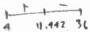

<!-- Page 1 -->

2025

AP

# AP® Calculus AB
## Sample Student Responses and Scoring Commentary

**Inside:**

Free-Response Question 1

- ☑ Scoring Guidelines
- ☑ Student Samples
- ☑ Scoring Commentary

© 2025 College Board. College Board, Advanced Placement, AP, AP Central, and the acorn logo are registered trademarks of College Board. Visit College Board on the web: collegeboard.org.

AP Central is the official online home for the AP Program: apcentral.collegeboard.org.

<!-- Page 2 -->

AP® Calculus AB/BC 2025 Scoring Guidelines

### Part A (AB or BC): Graphing calculator required

#### Question 1

9 points

##### General Scoring Notes

- The model solution is presented using standard mathematical notation.
- Answers (numeric or algebraic) need not be simplified. Answers given as a decimal approximation should be accurate to three places after the decimal point. Within each individual free-response question, at most one point is not earned for inappropriate rounding.

An invasive species of plant appears in a fruit grove at time \( t = 0 \) and begins to spread. The function \( C \) defined by \( C(t) = 7.6\arctan (0.2t) \) models the number of acres in the fruit grove affected by the species \( t \) weeks after the species appears. It can be shown that \( C'(t) = \frac{38}{25 + t^2} \).

(Note: Your calculator should be in radian mode.)

|   | Model Solution | Scoring  |   |
| --- | --- | --- | --- |
|  A | Find the average number of acres affected by the invasive species from time \( t = 0 \) to time \( t = 4 \) weeks.Show the setup for your calculations.  |   |   |
|   |  \( \frac{1}{4-0}\int_{0}^{4}C(t)dt \) | Average value formula | Point 1 (P1)  |
|   |  \( =\frac{1}{4}(11.112896)=2.778224 \)From time \( t = 0 \) to \( t = 4 \) weeks, the average number of acres affected by the invasive species was 2.778 acres. | Answer | Point 2 (P2)  |

© 2025 College Board

<!-- Page 3 -->

AP® Calculus AB/BC 2025 Scoring Guidelines

### Scoring Notes for Part A

- **P1** is earned for the correct integral, with or without the differential, along with evidence of division by 4. In the presence of the correct integral, the correct answer will suffice as evidence of division by 4. These may appear all in one step, as in the model solution, or in multiple steps.
- **P2** is earned for the correct answer, with or without supporting work. A reported answer should be accurate to three places after the decimal point, rounded or truncated. An inappropriately rounded answer does not earn the point.
- Incorrect or unclear communication between the correct integral and the correct answer is treated as scratch work and is not considered in scoring. For example:

○ $$\int_{0}^{4} C(t) \, dt = 11.112896$$ so the average velocity is 2.778224.

Note: This response earns **P1** for the correct integral with the correct answer as evidence of division by 4. It also earns **P2** for the correct answer.

○ $$\int_{0}^{4} C(t) \, dt = \frac{11.112896}{4} = 2.778224$$

Note: This response earns **P1** for the correct integral with the correct answer as evidence of division by 4. It also earns **P2** for the correct answer. (In this instance, incorrect linkage is not considered in scoring.)

○ $$\int_{0}^{4} C(t) \, dt = 2.778224$$

Note: This response earns **P1** for the correct integral with the correct answer as evidence of division by 4. It also earns **P2** for the correct answer. (In this instance, incorrect linkage is not considered in scoring.)

- Note that the values $$\frac{1}{4}(11.112)$$ and $$\frac{1}{4}(11.113)$$ are accurate to three digits after the decimal and therefore earn **P2**.

© 2025 College Board

<!-- Page 4 -->

AP® Calculus AB/BC 2025 Scoring Guidelines

B

Find the time $t$ when the instantaneous rate of change of $C$ equals the average rate of change of $C$ over the time interval $0 \leq t \leq 4$. Show the setup for your calculations.

$$\frac{C(4) - C(0)}{4 - 0} = 1.282008$$

$$C'(t) = \frac{38}{25 + t^2} = 1.282008 \Rightarrow t = 2.154298$$

The instantaneous rate of change of $C$ equals the average rate of change of $C$ over the interval $0 \leq t \leq 4$ at time $t = 2.154$.

Uses average rate of change

Point 3 (P3)

Answer with supporting work

Point 4 (P4)

### Scoring Notes for Part B

- P3 may be earned by presenting the expression or value for the average rate of change. Note that

because $C(0) = 0$ and the interval is $0 \leq t \leq 4$, any of the following will earn P3: $\frac{\int_0^4 C'(t) \, dt}{4}$, $\frac{C(4) - C(0)}{4 - 0}$, $\frac{C(4)}{4}$, $\frac{5.128 - 0}{4 - 0}$, $\frac{5.128}{4}$, or 1.282. However, neither P3 nor P4 is earned by just presenting $t = 1.282$.

- P4 is earned for the correct answer supported by the appropriate equation. A reported answer should be accurate to three places after the decimal point, rounded or truncated. An inappropriately rounded answer does not earn the point, unless an earlier point was not earned due to inappropriate rounding.

The following response, for example, earns both P3 and P4: $C'(t) = \frac{C(4) - C(0)}{4}$ when $t = 2.154$.

C

Assume that the invasive species continues to spread according to the given model for all times $t > 0$. Write a limit expression that describes the end behavior of the rate of change in the number of acres affected by the species. Evaluate this limit expression.

$$\lim_{t \to \infty} C'(t) = \lim_{t \to \infty} \frac{38}{25 + t^2}$$

$$= 0$$

Limit expression

Point 5 (P5)

Value

Point 6 (P6)

### Scoring Notes for Part C

- P5 can be earned for either $\lim_{t \to \infty} C'(t)$ or $\lim_{t \to \infty} C(t)$.

- A response that includes $\lim_{t \to \infty} C(t)$ is not eligible to earn P6.

- For P6, arithmetic with infinity, e.g., $\frac{38}{25 + \infty^2} = 0$, will be considered as scratch work and will not be considered in scoring.

© 2025 College Board

<!-- Page 5 -->

AP® Calculus AB/BC 2025 Scoring Guidelines

D

At time $t = 4$ weeks after the invasive species appears in the fruit grove, measures are taken to counter the spread of the species. The function $A$, defined by $A(t) = C(t) - \int_{4}^{t} 0.1 \cdot \ln(x) \, dx$, models the number of acres affected by the species over the time interval $4 \leq t \leq 36$. At what time $t$, for $4 \leq t \leq 36$, does $A$ attain its maximum value? Justify your answer.

$$A'(t) = C'(t) - 0.1 \cdot \ln t$$

Considers $A'(t) = 0$

Point 7 (P7)

For $4 \leq t \leq 36$, the maximum value of $A(t)$ occurs when $A'(t) = 0$ or at an endpoint.

$$A'(t) = C'(t) - 0.1 \cdot \ln t = 0 \Rightarrow C'(t) = 0.1 \cdot \ln t$$

$$\Rightarrow t = 11.441700$$

Justification

Point 8 (P8)

|  t | A(t)  |
| --- | --- |
|  4 | 5.128031  |
|  11.441700 | 7.316978  |
|  36 | 1.743056  |

Therefore, the number of acres affected by the species is a maximum at time $t = 11.442$ (or 11.441) weeks.

Answer with supporting work

Point 9 (P9)

### Scoring Notes for Part D

- P7 is earned for considering $A'(t) = 0$, $C'(t) - 0.1 \cdot \ln t = 0$, or $C'(t) = 0.1 \cdot \ln t$. P7 is not earned by just presenting $t = 11.441700$.

A response that discusses the sign of $A'(t)$ changing or uses the phrase “critical points of $A$” also earns P7.

- To earn P8 using a candidates test, a response must make a global argument by correctly evaluating $A(t)$ at $t = 4$, $t = 11.441700$, and $t = 36$. The evaluations must be correct to the first digit after the decimal, rounded or truncated.

- Alternate justifications:

  - $A'(t) > 0$ for $4 < t < 11.442$, and $A'(t) < 0$ for $11.442 < t < 36$. Therefore, $t = 11.442$ is the location of the absolute maximum for $A$ on the interval $4 \leq t \leq 36$.

  - Because $A'(t)$ changes sign from positive to negative at $t = 11.442$ (this might be presented as “$A'(t) > 0$ for $t < 11.442$, and $A'(t) < 0$ for $t > 11.442$”), it is the location of a relative maximum for $A$. And because $t = 11.442$ is the only critical point of $A$ in the interval $4 \leq t \leq 36$, it is the location of the absolute maximum for $A$ on the interval.

- A response that presents a local argument (such as a First Derivative Test or a Second Derivative Test) or an incorrect global argument does not earn P8 but is eligible for P9 with the correct answer. A reported answer should be accurate to three places after the decimal point, rounded or truncated. An inappropriately rounded answer does not earn the point, unless an earlier point was not earned due to inappropriate rounding.

© 2025 College Board

<!-- Page 6 -->

Sample 1A 1 of 2

Q1 Q1 Q1 Q1 Q1 Q1 Q1 Q1 Q1 Q1 Q1

Answer QUESTION 1 PARTS A and B on this page.

PART A

$$\frac{1}{4-0} \int_{0}^{4} C(t) dt \approx 2.778 \text{ acres}$$

PART B

$$\frac{C(4) - C(0)}{4 - 0} \approx 1.282 \text{ acres/week}$$

$$C'(t) = \frac{38}{2s + t^2} = 1.282 \text{ at } t = 2.154$$

Page 4

Use a pencil or a pen with black or dark blue ink. Do NOT write your name. Do NOT write outside the box.

Q5685/04

<!-- Page 7 -->

Sample 1A 2 of 2

Q1 Q1 Q1 Q1 Q1 Q1 Q1 Q1 Q1 Q1 Q1

Answer QUESTION 1 PARTS C and D on this page.

PART C

$$\lim_{t \to \infty} C'(t) = \lim_{t \to \infty} \frac{38}{25 + t^2} = 0$$

PART D

$$A'(t) = 0 \text{ at } t = 11.442$$

|  t | A(t)  |
| --- | --- |
|  4 | 5.128  |
|  11.442 | 7.317  |
|  36 | 1.743  |

A attains its maximum value at t = 11.442 for 4 ≤ t ≤ 36.

Page 5

Use a pencil or a pen with black or dark blue ink. Do NOT write your name. Do NOT write outside the box.

0018635

Q5525/05

<!-- Page 8 -->

Sample 1B 1 of 2

Q1

Q1

Q1

Q1

Q1

Q1

Q1

Q1

Q1

Q1

Q1

Q1

Answer QUESTION 1 PARTS A and B on this page.

PART A

$$\frac{1}{4} \int_{0}^{4} 7 \cdot \text{barrier}(0.2t) dt \approx 2.778 \text{ acres}$$

PART B

$$f'(t) = \frac{(4)-(10)}{4-0} = 1.282$$

$$f'(t) = 1.282 \text{ @ } t = 0.851$$

Page 4

Use a pencil or a pen with black or dark blue ink. Do NOT write your name. Do NOT write outside the box.

Q5526/04

<!-- Page 9 -->

Sample 1B 2 of 2

Q1 Q1 Q1 Q1 Q1 Q1 Q1 Q1 Q1 Q1 Q1

Answer QUESTION 1 PARTS C and D on this page.

PART C

$$\lim_{t \to \infty} \frac{38}{25t^2} = 0$$

PART D

$$A' = C'(t) - 0.1(\ln t) = 0$$

$$t = 11.442$$

∴ A attains its maximum value at t = 11.442 weeks because A' changes from positive to negative.

Page 5

Use a pencil or a pen with black or dark blue ink. Do NOT write your name. Do NOT write outside the box.

0003629

Q5525/05

<!-- Page 10 -->

Sample 1C 1 of 2

Q1 Q1 Q1 Q1 Q1 Q1 Q1 Q1 Q1 Q1 Q1

Answer QUESTION 1 PARTS A and B on this page.

PART A

$$\frac{1}{4-0} \int_{0}^{4} \left( \frac{38}{25+t^2} \right) dt = 1.282 \text{ average number of cases from}$$
$$\text{time} = 0 \text{ to time} = 4$$

PART B

$$C'(t) = \frac{C(4) - C(0)}{4-0} = \frac{5.128 - 0}{4} = 1.282$$

$$C'(t) = 1.282$$

$$\frac{38}{25+t^2} = 1.282$$

$$t = 2.154 \text{ weeks}$$

Page 4

Use a pencil or a pen with black or dark blue ink. Do NOT write your name. Do NOT write outside the box.

Q5522/04

<!-- Page 11 -->

Sample 1C 2 of 2

Q1 Q1 Q1 Q1 Q1 Q1 Q1 Q1 Q1 Q1 Q1

Answer QUESTION 1 PARTS C and D on this page.

PART C

$$\lim_{t \to \infty} 7.6 \arctan(.2t) \Bigg|_{\substack{7.6 \cdot \infty = \\ t = \infty}} \boxed{\infty}$$

PART D

$$A(t) = C(t) - \sum_{k=1}^{t} (1.1 \ln x) dx$$

$$A'(t) = C'(t) - (.1 \ln t) = 0$$

$$\frac{38}{25 + t^2} = .1 \ln t$$

$$\boxed{t = 11.442 \text{ weeks}}$$
$$\begin{array}{c} 11.442 \\ + \\ \hline \text{rd max} \end{array}$$

Page 5

Use a pencil or a pen with black or dark blue ink. Do NOT write your name. Do NOT write outside the box.

0271086

Q5622/05

<!-- Page 12 -->

AP CALCULUS AB 2025 • SCORING COMMENTARY

# Question 1

**Note:** Student samples are quoted verbatim and may contain spelling and grammatical errors.

## Overview

**NEW for 2025:** The question overviews can be found in the *Chief Reader Report on Student Responses* on AP Central.

### Sample: 1A

**Score: 9 (1-1-1-1-1-1-1-1-1)**

The response earned 9 points: 2 points in part A, 2 points in part B, 2 points in part C, and 3 points in part D.

In part A the response earned **P1** with the expression $$\frac{1}{4-0} \int_0^4 C(t) \, dt$$. The response earned **P2** with the correct answer 2.778. Units are not scored.

In part B the response earned **P3** with the expression $$\frac{C(4) - C(0)}{4-0}$$ in line 1. Units are not scored. The response earned **P4** with both the correct answer $$t = 2.154$$ in line 2 and the equation $$\frac{38}{25 + t^2} = 1.282$$ in line 2.

In part C the response earned **P5** with the expression $$\lim_{t \to \infty} C'(t)$$. The response earned **P6** with the correct answer 0.

In part D the response earned **P7** in line 1 with $$A'(t) = 0$$. The response earned **P8** using a global argument with the correct values of $$A(t)$$ at $$t = 4$$, $$t = 11.442$$, and $$t = 36$$ shown in the table. The response earned **P9** with both the correct answer $$t = 11.442$$ to the right and a correct global argument.

### Sample: 1B

**Score: 7 (1-1-1-0-1-1-1-0-1)**

The response earned 7 points: 2 points in part A, 1 point in part B, 2 points in part C, and 2 points in part D.

In part A the response earned **P1** with the expression $$\frac{1}{4} \int_0^4 7.6 \arctan(0.2t) \, dt$$. The response earned **P2** with the correct answer 2.778. Units are not scored.

In part B the response earned **P3** with the expression $$\frac{C(4) - C(0)}{4-0}$$ in line 1. The response did not earn **P4** because the boxed answer is incorrect.

In part C the response earned **P5** with the expression $$\lim_{t \to \infty} \frac{38}{25 + t^2}$$. The response earned **P6** with the correct answer 0.

In part D the response earned **P7** in line 1 with $$A' = C'(t) - 0.1(\ln t) = 0$$. The response did not earn **P8** because a local argument is given. The response earned **P9** because both the correct answer $$t = 11.442$$ and the supporting work “$$A'$$ changes from positive to negative” are presented. Units are not scored.

© 2025 College Board.

Visit College Board on the web: collegeboard.org.

<!-- Page 13 -->

AP CALCULUS AB 2025 • SCORING COMMENTARY

## Question 1 (continued)

**Sample: 1C**

**Score: 3 (0-0-1-1-0-0-1-0-0)**

The response earned 3 points: 0 points in part A, 2 points in part B, 0 points in part C, and 1 point in part D.

In part A the response did not earn **P1** because the expression in line 1 computes the average rate of change of $C(t)$ instead of the average value of $C(t)$. The response did not earn **P2** because the answer is incorrect.

In part B the response earned **P3** in line 1 with $\frac{C(4) - C(0)}{4 - 0}$. The response earned **P4** with both the correct answer $t = 2.154$ in line 4 and the appropriate equation $C'(t) = \frac{C(4) - C(0)}{4 - 0}$ in line 1. Units are not scored.

In part C the response did not earn **P5** because the given limit expression is neither $\lim_{t \to \infty} C(t)$ nor $\lim_{t \to \infty} C'(t)$. The response did not earn **P6** because the expression is not eligible for the answer point.

In part D, the response earned **P7** with $A'(t) = C'(t) - (.1 \ln t) = 0$ in line 2. The response did not earn **P8** because no global argument for the existence of a maximum is provided. The response did not earn **P9**. Although the correct value of $t$ is presented, evidence of a calculus-based justification is not presented.

© 2025 College Board.

Visit College Board on the web: collegeboard.org.
