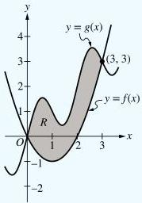
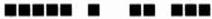

<!-- Page 1 -->

2025

AP

# AP® Calculus AB
## Sample Student Responses and Scoring Commentary

**Inside:**

**Free-Response Question 2**

- ☑ Scoring Guidelines
- ☑ Student Samples
- ☑ Scoring Commentary

© 2025 College Board. College Board, Advanced Placement, AP, AP Central, and the acorn logo are registered trademarks of College Board. Visit College Board on the web: collegeboard.org.

AP Central is the official online home for the AP Program: apcentral.collegeboard.org.

<!-- Page 2 -->

AP® Calculus AB/BC 2025 Scoring Guidelines

## Part A (AB): Graphing calculator required

### Question 2

9 points

#### General Scoring Notes

- The model solution is presented using standard mathematical notation.
- Answers (numeric or algebraic) need not be simplified. Answers given as a decimal approximation should be accurate to three places after the decimal point. Within each individual free-response question, at most one point is not earned for inappropriate rounding.

The shaded region R is bounded by the graphs of the functions f and g, where  \( f(x) = x^{2} - 2x \)  and  \( g(x) = x + \sin(\pi x) \) , as shown in the figure.

(Note: Your calculator should be in radian mode.)

© 2025 College Board

<!-- Page 3 -->

AP® Calculus AB/BC 2025 Scoring Guidelines

|  Model Solution |   | Scoring  |   |
| --- | --- | --- | --- |
|  A | Find the area of R. Show the setup for your calculations.  |   |   |
|   | $$\int_{0}^{3}(g(x) - f(x)) \, dx$$ | Form of integrand | **Point 1 (P1)**  |
|   | = 5.136620 | Answer | **Point 2 (P2)**  |
|   | The area is 5.137 (or 5.136). |  |   |
|  **Scoring Notes for Part A**  |   |   |   |
|  - **P1** is earned for a response that presents an integrand of $$g(x) - f(x)$$, $$|g(x) - f(x)|$$, $$f(x) - g(x)$$, or $$|f(x) - g(x)|$$ in a definite integral, with or without the differential $$dx$$. - **P1** could also be earned for a difference of definite integrals with integrands $$g(x)$$ and $$f(x)$$. - **P2** is earned for the correct answer, with or without supporting work. A reported answer should be accurate to three places after the decimal point, rounded or truncated. An inappropriately rounded answer does not earn the point. - Incorrect communication between the integral and the correct answer is treated as scratch work and is not considered in scoring. - $$\int_{0}^{3}(f(x) - g(x)) \, dx = -5.137$$ so the area is 5.137. Note: This response earns **P1** for the integral. It also earns **P2** for the correct answer. - $$\int_{0}^{3}(f(x) - g(x)) \, dx = 5.137$$ Note: This response earns **P1** for the integral. It also earns **P2** for the correct answer. (In this instance, incorrect linkage is not considered in scoring.) - The exact answer is $$\frac{4 + 9\pi}{2\pi}$$.  |   |   |   |

© 2025 College Board

<!-- Page 4 -->

AP® Calculus AB/BC 2025 Scoring Guidelines

B

Region R is the base of a solid. For this solid, at each x the cross section perpendicular to the x-axis is a rectangle with height x and base in region R. Find the volume of the solid. Show the setup for your calculations.

$$\int_{0}^{3} x(g(x) - f(x)) \, dx$$

$$= 7.704930$$

The volume of the solid is 7.705 (or 7.704).

Form of integrand

Point 3 (P3)

Answer

Point 4 (P4)

### Scoring Notes for Part B

- P3 is earned for a definite integral with an integrand presented as a product of two nonconstant factors, with one of the factors equal to x, g(x) - f(x), or f(x) - g(x).
- The presence or absence of the differential dx will not be considered in scoring P3 or P4.
- P4 is earned for the correct answer, with or without supporting work. A reported answer should be accurate to three places after the decimal point, rounded or truncated. An inappropriately rounded answer does not earn the point, unless an earlier point was not earned due to inappropriate rounding.
- Incorrect or unclear communication between the integral and the correct answer is treated as scratch work and is not considered in scoring. For example:

$$\int_{0}^{3} x(f(x) - g(x)) \, dx = -7.705$$ so the volume is 7.705.

Note: This response earns P3 for the integral. It also earns P4 for the correct answer.

$$\int_{0}^{3} x(f(x) - g(x)) \, dx = 7.705$$

Note: This response earns P3 for the integral. It also earns P4 for the correct answer. (In this instance, incorrect linkage is not considered in scoring.)

- The exact answer is $$\frac{12 + 27\pi}{4\pi}$$.

© 2025 College Board

<!-- Page 5 -->

AP® Calculus AB/BC 2025 Scoring Guidelines

C

Write, but do not evaluate, an integral expression for the volume of the solid generated when the region R is rotated about the horizontal line y = -2.

$$\text{Volume} = \pi \int_{0}^{3} \left( (g(x) - (-2))^2 - (f(x) - (-2))^2 \right) dx$$

|  Form of integrand | Point 5 (P5)  |
| --- | --- |
|  Integrand | Point 6 (P6)  |
|  Limits, constant, and differential | Point 7 (P7)  |

### Scoring Notes for Part C

- P5 is earned for a definite integral with an integrand of $R^2 - r^2$ or $|R^2 - r^2|$, where one of $\{R, r\}$ is correct or a difference between $g$ and a nonzero constant, and the other is correct or a difference between $f$ and a nonzero constant.
- P6 is earned for the integral $\int_{0}^{3} \left( (g(x) + 2)^2 - (f(x) + 2)^2 \right) dx$, $\int_{0}^{3} \left( (f(x) + 2)^2 - (g(x) + 2)^2 \right) dx$, or a mathematically equivalent expression.
- Note P5 and P6 could be earned for a difference of definite integrals.
- A response that presents an integral expression that does not include the constant $\pi$ is eligible for P5 and P6 but does not earn P7.
- To be eligible for P7, a response must have earned P5.
- A response that reverses the difference of squares must resolve the reversal with either the constant or the limits of integration AND include the differential to earn P7. For example:
  - A response of $-\pi \int_{0}^{3} \left( (f(x) + 2)^2 - (g(x) + 2)^2 \right) dx$ or $\pi \int_{3}^{0} \left( (f(x) + 2)^2 - (g(x) + 2)^2 \right) dx$ earns P5, P6, and P7.
  - A response of $\pi \int_{0}^{3} \left( (f(x) + 2)^2 - (g(x) + 2)^2 \right) dx$ earns P5 and P6 but does not earn P7.
- A response of only $\pi \int_{0}^{3} \left( (g(x) - (-2))^2 - (f(x) - (-2))^2 \right) dx$ earns P5, P6, and P7.

© 2025 College Board

<!-- Page 6 -->

AP® Calculus AB/BC 2025 Scoring Guidelines

|  **D** | It can be shown that $g'(x) = 1 + \pi \cos(\pi x)$. Find the value of $x$, for $0 < x < 1$, at which the line tangent to the graph of $f$ is parallel to the line tangent to the graph of $g$.  |   |   |
| --- | --- | --- | --- |
|   |  $f'(x) = g'(x) \Rightarrow 2x - 2 = 1 + \pi \cos(\pi x)$ | $f'(x) = g'(x)$ | **Point 8 (P8)**  |
|   |  $\Rightarrow x = 0.675819$ | Answer | **Point 9 (P9)**  |
|   |  The lines tangent to the graphs of $f$ and $g$ are parallel at $x = 0.676$ (or 0.675). |  |   |
|  **Scoring Notes for Part D**  |   |   |   |
|  - **P8** is earned for a general statement, such as $f'(x) = g'(x)$, or for any correct equation formed by substituting $2x - 2$ for $f'(x)$, $1 + \pi \cos(\pi x)$ for $g'(x)$, or both. - **P9** is earned for the correct answer, with or without supporting work. A reported answer should be accurate to three places after the decimal point, rounded or truncated. An inappropriately rounded answer does not earn the point, unless an earlier point was not earned due to inappropriate rounding.  |   |   |   |

© 2025 College Board

<!-- Page 7 -->

Sample 2A 1 of 2

Q2 Q2 Q2 Q2 Q2 Q2 Q2 Q2 Q2 Q2 Q2

Answer QUESTION 2 PARTS A and B on this page.

PART A

$$\int_{0}^{3} (g(x) - f(x)) \, dx = 5.137$$

$$\int_{x}^{x} (\text{Top - Bottom}) \, dx$$

PART B

$$\int_{0}^{3} (g(x) - f(x)) \, (x) \, dx = 7.705$$

Page 6

Use a pencil or a pen with black or dark blue ink. Do NOT write your name. Do NOT write outside the box.

Q5522/02

<!-- Page 8 -->

Sample 2A 2 of 2

Q2 Q2 Q2 Q2 Q2 Q2 Q2 Q2 Q2 Q2 Q2

Answer QUESTION 2 PARTS C and D on this page.

PART C

$$\pi \int_{0}^{3} (g(x) + 2)^2 - (f(x) + 2)^2 dx$$

$$\pi \int_{x}^{x} (R(x))^2 - (r(x))^2 dx$$
larger radius smaller radius

PART D

same slope = parallel

$$g'(x) = f'(x)$$

$$0 = f'(x) - g'(x)$$

$$x = 0.676$$

Page 7

Use a pencil or a pen with black or dark blue ink. Do NOT write your name. Do NOT write outside the box.

0052407

Q5522/07

<!-- Page 9 -->

Sample 2B 1 of 2

Q2 Q2 Q2 Q2 Q2 Q2 Q2 Q2 Q2 Q2 Q2

Answer QUESTION 2 PARTS A and B on this page.

PART A

$$\int_{0}^{3} (g(x) - f(x)) dx = 5.137$$

PART B

$$\int_{0}^{3} (g(x) - f(x))^2 dx = 9.858$$

Page 6

Use a pencil or a pen with black or dark blue ink. Do NOT write your name. Do NOT write outside the box.

Q5522/06

<!-- Page 10 -->

Sample 2B 2 of 2

Q2 Q2 Q2 Q2 Q2 Q2 Q2 Q2 Q2 Q2 Q2

Answer QUESTION 2 PARTS C and D on this page.

PART C

$$\pi \int_{0}^{3} (g(x) - (-2))^2 - (f(x) - (-2))^2 dx$$

PART D

$$g(x) = \int_{0}^{1} 1 + \pi \cos(\pi x) = 1$$

Page 7

Use a pencil or a pen with black or dark blue ink. Do NOT write your name. Do NOT write outside the box.

0030303

Q5522/07

<!-- Page 11 -->

Sample 2C 1 of 2

Q2

Q2

Q2

Q2

Q2

Q2

Q2

Q2

Q2

Q2

Q2

Q2

Answer QUESTION 2 PARTS A and B on this page.

PART A

$$\int_{0}^{3} (g(x) - f(x)) dx = \boxed{-5.137}$$

PART B

42 41

$$\pi \int_{0}^{3} (g(x)^2 - f(x)^2) dx = \boxed{27.677}$$

Page 6

Use a pencil or a pen with black or dark blue ink. Do NOT write your name. Do NOT write outside the box.

Q5522/06

<!-- Page 12 -->

Sample 2C 2 of 2

Q2 Q2 Q2 Q2 Q2 Q2 Q2 Q2 Q2 Q2 Q2

Answer QUESTION 2 PARTS C and D on this page.

PART C

$$\int_{0}^{3} (-2 - g(x)) - (-2 - f(x)) dx$$

PART D

$$\begin{array}{l} g'(x) = f'(x) \\ 1 + \pi \cos(\pi x) = 2x - 2 \\ \pi \cos \pi x = 2x - 3 \\ \cos \pi x = \frac{2x - 3}{\pi} \end{array}$$

graphs of
$$g'(x)$$ and $$f'(x)$$
intersect at (0.6758, -0.6483)

at $$x = 0.676$$ the line
tangent to the graph of
f is parallel to line tangent
to graph of g

Use a pencil or a pen with black or dark blue ink. Do NOT write your name. Do NOT write outside the box.

0287493

Q5522/07

■ ■

■ ■

■ ■

■

● ●

●

<!-- Page 13 -->

AP CALCULUS AB 2025 • SCORING COMMENTARY

## Question 2

**Note:** Student samples are quoted verbatim and may contain spelling and grammatical errors.

### Overview

**NEW for 2025:** The question overviews can be found in the *Chief Reader Report on Student Responses* on AP Central.

### Sample: 2A

**Score: 9 (1-1-1-1-1-1-1-1-1)**

The response earned 9 points: 2 points in part A, 2 points in part B, 3 points in part C, and 2 points in part D.

In part A the response earned **P1** with the correct integrand $g(x) - f(x)$ in a definite integral. The response earned **P2** with the correct, rounded answer 5.137.

In part B the response earned **P3** with the correct form of the integrand $(g(x) - f(x))(x)$ in a definite integral. The response earned **P4** with the correct, rounded answer 7.705.

In part C the response earned **P5** with a definite integral of the form $R^2 - r^2$ that includes the correct terms $(g(x) + 2)^2$ and $(f(x) + 2)^2$. The response earned **P6** with the correct integral $\int_0^3 ((g(x) + 2)^2 - (f(x) + 2)^2) \, dx$. The response earned **P7** with the correct limits of 0 and 3, the constant $\pi$, and the differential $dx$.

In part D the response earned **P8** with the general statement $g'(x) = f'(x)$ in line 2. The response earned **P9** with the correct, rounded answer 0.676.

### Sample: 2B

**Score: 6 (1-1-1-0-1-1-1-0-0)**

The response earned 6 points: 2 points in part A, 1 point in part B, 3 points in part C, and 0 points in part D.

In part A the response earned **P1** with a correct form of the integrand $g(x) - f(x)$ in a definite integral. The response earned **P2** with the correct, rounded answer 5.137.

In part B the response earned **P3** because the definite integral has an integrand that is a product of two factors, one of which is $g(x) - f(x)$. The response did not earn **P4**. The response 9.858 is incorrect.

In part C the response earned **P5** with a correct integral of the form $R^2 - r^2$ that includes the correct terms $(g(x) - (-2))^2$ and $(f(x) - (-2))^2$. The response earned **P6** with the correct integral $\int_0^3 (g(x) - (-2))^2 - (f(x) - (-2))^2 \, dx$. The response earned **P7** with correct limits of integration 0 to 3, constant $\pi$, and differential $dx$.

In part D the response did not earn **P8** because there is no presentation of equating the derivatives of $f(x)$ and $g(x)$. The response did not earn **P9** because there is no presentation of the correct answer.

© 2025 College Board.

Visit College Board on the web: collegeboard.org.

<!-- Page 14 -->

AP CALCULUS AB 2025 • SCORING COMMENTARY

## Question 2 (continued)

**Sample: 2C**

**Score: 3 (1-0-0-0-0-0-1-1)**

The response earned 3 points: 1 point in part A, 0 points in part B, 0 points in part C, and 2 points in part D.

In part A the response earned **P1** with presentation of the correct form of the integrand $g(x) - f(x)$ in a definite integral. The response did not earn **P2** because the answer $-5.137$ is incorrect.

In part B the response did not earn **P3** because the integral presented is not a product of eligible factors. The response did not earn **P4** because the answer $27.677$ is incorrect.

In part C the response did not earn **P5** because the integrand is not of the form $R^2 - r^2$. The response did not earn **P6** because the integral is not equal to $\int_0^3 \left( (g(x) + 2)^2 - (f(x) + 2)^2 \right) dx$ or $\int_0^3 \left( (f(x) + 2)^2 - (g(x) + 2)^2 \right) dx$ or a mathematically equivalent form. The response is not eligible to earn **P7** because **P5** was not earned.

In part D the response earned **P8** with the general statement $g'(x) = f'(x)$. The response earned **P9** with the correct, rounded answer $0.676$.

© 2025 College Board.

Visit College Board on the web: collegeboard.org.
