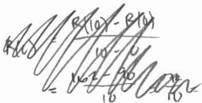

<!-- Page 1 -->

2025

AP

# AP® Calculus AB
## Sample Student Responses and Scoring Commentary

**Inside:**

**Free-Response Question 3**

- ☑ Scoring Guidelines
- ☑ Student Samples
- ☑ Scoring Commentary

© 2025 College Board. College Board, Advanced Placement, AP, AP Central, and the acorn logo are registered trademarks of College Board. Visit College Board on the web: collegeboard.org.

AP Central is the official online home for the AP Program: apcentral.collegeboard.org.

<!-- Page 2 -->

AP® Calculus AB/BC 2025 Scoring Guidelines

## Part B (AB or BC): Graphing calculator not allowed

### Question 3

9 points

#### General Scoring Notes

- The model solution is presented using standard mathematical notation.
- Answers (numeric or algebraic) need not be simplified. Answers given as a decimal approximation should be accurate to three places after the decimal point. Within each individual free-response question, at most one point is not earned for inappropriate rounding.

A student starts reading a book at time t = 0 minutes and continues reading for the next 10 minutes. The rate at which the student reads is modeled by the differentiable function R, where  \( R(t) \)  is measured in words per minute. Selected values of  \( R(t) \)  are given in the table shown.

|  t (minutes) | 0 | 2 | 8 | 10  |
| --- | --- | --- | --- | --- |
|  R(t) (words per minute) | 90 | 100 | 150 | 162  |

#### Model Solution

#### Scoring

A Approximate \( R'(1) \) using the average rate of change of \( R \) over the interval \( 0 \leq t \leq 2 \). Show the work that leads to your answer. Indicate units of measure.

\[
R ^ {\prime} (1) \approx \frac {R (2) - R (0)}{2 - 0}
\]

\[
= \frac {1 0 0 - 9 0}{2} = \frac {1 0}{2} = 5 \text { words   per   minute   per   minute }
\]

Answer with setup Point 1 (P1)

Units Point 2 (P2)

#### Scoring Notes for Part A

- To earn P1, a response must present the answer along with the supporting work of a difference and a quotient using values from the table.

\(\frac{100 - 90}{2 - 0}, \frac{10}{2 - 0}, \frac{100 - 90}{2}\), or \(\frac{R(2) - R(0)}{2 - 0} = 5\) is sufficient to earn P1.

\(\frac{R(2) - R(0)}{2 - 0}\) by itself is not sufficient to earn P1.

- P2 is earned for correct units, whether or not they are attached to a numerical value for the average rate of change.

- P2 is also earned for the units “words/minute\( ^{2} \).”

© 2025 College Board

<!-- Page 3 -->

AP® Calculus AB/BC 2025 Scoring Guidelines

|  **B** | Must there be a value $c$, for $0 < c < 10$, such that $R(c) = 155$? Justify your answer.  |   |   |
| --- | --- | --- | --- |
|   | $R$ is differentiable implies $R$ is continuous. | Differentiable implies continuous | **Point 3 (P3)**  |
|   | $R(0) = 90 < 155 < R(10) = 162$ | Answer with justification | **Point 4 (P4)**  |
|   | Therefore, by the Intermediate Value Theorem, there must be a value $c$, with $0 < c < 10$, such that $R(c) = 155$.  |   |   |
|  **Scoring Notes for Part B**  |   |   |   |
|  - To earn **P3**, a response must state that $R$ is continuous because $R$ is differentiable (or equivalent). A response that simply states “$R$ is continuous” without justification does not earn **P3**. - A response does not need to earn **P3** to be eligible for **P4**. - To earn **P4**, a response must indicate that $R(0) < 155$ (or $R(2) < 155$ or $R(8) < 155$) and $R(10) > 155$, state that “$R$ is continuous,” and answer “yes” in some way. - To earn **P4**, a response need not explicitly name the Intermediate Value Theorem, but if a theorem is named, it must be correct.  |   |   |   |

© 2025 College Board

<!-- Page 4 -->

AP® Calculus AB/BC 2025 Scoring Guidelines

C

Use a trapezoidal sum with the three subintervals indicated by the data in the table to approximate the value of $$\int_{0}^{10} R(t) \, dt$$. Show the work that leads to your answer.

$$\int_{0}^{10} R(t) \, dt$$

$$\approx \frac{R(0) + R(2)}{2}(2 - 0) + \frac{R(2) + R(8)}{2}(8 - 2) + \frac{R(8) + R(10)}{2}(10 - 8)$$

$$= \frac{90 + 100}{2}(2 - 0) + \frac{100 + 150}{2}(8 - 2) + \frac{150 + 162}{2}(10 - 8) = \frac{190}{2}(2) + \frac{250}{2}(6) + \frac{312}{2}(2) = 190 + 750 + 312 = 1252$$

Form of trapezoidal sum

Point 5 (P5)

Answer with supporting work

Point 6 (P6)

### Scoring Notes for Part C

- Read “=” as “≈” for P5.

- The form of a trapezoidal sum includes three terms, each of which includes a product of two factors, where one of the factors incorporates the $$\frac{1}{2}$$ as part of the product. To earn P5, at least five of the six factors must be correct. If any of the six factors is incorrect, the response does not earn P6. Consider the following examples:

- $$\frac{90 + 100}{2}(2 - 0) + \frac{100 + 150}{2}(8 - 2) + \frac{150 + 162}{2}(10 - 8)$$ earns P5 and is sufficient to earn P6.
- $$\frac{190}{2}(2) + \frac{250}{2}(6) + \frac{312}{2}(2)$$ earns P5 and is sufficient to earn P6.
- $$\frac{1}{2}((R(0) + R(2))(2) + (R(2) + R(8))(6) + (R(8) + R(10))(2))$$ earns P5 and is eligible for P6.
- $$\frac{90 + 100}{2}(2) + \frac{100 + 150}{2}(2) + \frac{150 + 162}{2}(2)$$ earns P5 but is not eligible for P6.

(Note that the factor of 2 in the second term of this expression is incorrect.)

- Special case: A response of $$(90 + 100) + (100 + 150)3 + (150 + 162)$$ earns both P5 and P6.
- To be eligible for P6, a response must have earned P5.

Special case: A response of $$95 \cdot 2 + 125 \cdot 6 + 156 \cdot 2$$ earns P6 but does not earn P5.

- A response of $$\frac{90 + 100}{2}(2 - 0) + \frac{100 + 150}{2}(8 - 2) + \frac{150 + 162}{2}(10 - 8)$$ or equivalent banks P6 (i.e., subsequent errors in simplification will not be considered in scoring for P6).
- A response of $$\frac{(90 \cdot 2 + 100 \cdot 6 + 150 \cdot 2) + (100 \cdot 2 + 150 \cdot 6 + 162 \cdot 2)}{2}$$ or equivalent earns both P5 and P6. (Note that the average of the left Riemann sum and right Riemann sum is equivalent to the trapezoidal sum.)
- A completely correct left Riemann sum (e.g., $$90 \cdot 2 + 100 \cdot 6 + 150 \cdot 2 = 1080$$) or a completely correct right Riemann sum (e.g., $$100 \cdot 2 + 150 \cdot 6 + 162 \cdot 2 = 1424$$) earns P5 but does not earn P6.

© 2025 College Board

<!-- Page 5 -->

AP® Calculus AB/BC 2025 Scoring Guidelines

D

A teacher also starts reading at time t = 0 minutes and continues reading for the next 10 minutes. The rate at which the teacher reads is modeled by the function W defined by  \( W(t) = -\frac{3}{10}t^{2} + 8t + 100 \) , where  \( W(t) \)  is measured in words per minute. Based on the model, how many words has the teacher read by the end of the 10 minutes? Show the work that leads to your answer.

\[
\int_ {0} ^ {1 0} W (t) d t = \int_ {0} ^ {1 0} \left(- \frac {3}{1 0} t ^ {2} + 8 t + 1 0 0\right) d t
\]

\[
= \left(- \frac {1}{1 0} t ^ {3} + 4 t ^ {2} + 1 0 0 t\right) \bigg | _ {0} ^ {1 0}
\]

\[
\begin{array}{l} = \left(- \frac {1}{1 0} \cdot 1 0 0 0 + 4 \cdot 1 0 0 + 1 0 0 \cdot 1 0\right) - \left(- \frac {1}{1 0} \cdot 0 + 4 \cdot 0 + 1 0 0 \cdot 0\right) \\ = 1 3 0 0 \end{array}
\]

Based on the model, the teacher has read 1300 words by the end of the 10 minutes.

Integrand

Point 7 (P7)

Antiderivative

Point 8 (P8)

Answer

Point 9 (P9)

### Scoring Notes for Part D

- P7 is earned for an indefinite or definite integral with integrand \( W(t) \), with or without the differential \( dt \).
- P8 is earned for the correct antiderivative, with or without the constant of integration.
• To be eligible for P9, a response must have earned P8.
- A response of \(\left(-\frac{1}{10} \cdot 1000 + 4 \cdot 100 + 100 \cdot 10\right) - \left(-\frac{1}{10} \cdot 0 + 4 \cdot 0 + 100 \cdot 0\right)\) or equivalent banks P9 (i.e., subsequent errors in simplification will not be considered in scoring for P9).

© 2025 College Board

<!-- Page 6 -->

Sample 3A 1 of 2

Q3

NO CALCULATOR ALLOWED

Q3

Answer QUESTION 3 PARTS A and B on this page.

PART A

$$R'(1) = \frac{R(2) - R(0)}{2 - 0} = \frac{100 - 90}{2} \text{ words/min}^2$$

PART B

R(t) is differentiable and therefore continuous

$$R(0) = 90 \quad R(10) = 162 \quad 90 < 155 < 162 \dots \text{ by the}$$

IVT, there must exist at least one c such that

$$R(c) = 155 \text{ on the interval } 0 \le c \le 10.$$

Page 8

Use a pencil or a pen with black or dark blue ink. Do NOT write your name. Do NOT write outside the box.

Q5522/08

<!-- Page 7 -->

Sample 3A 2 of 2

Q3

# ☒ NO CALCULATOR ALLOWED

Q3

Answer QUESTION 3 PARTS C and D on this page.

PART C

$$\int_{0}^{10} R(t) dt \approx \frac{1}{2} [2(90+100) + 6(100+150) + 2(150+162)]$$

PART D

$$W(t) = -\frac{3}{10}t^2 + 8t + 100$$
$$\int_{0}^{10} W(t) dt = -\frac{1}{10}t^3 + 4t^2 + 100t \Bigg|_{0}^{10}$$
$$= \left[ \frac{-1}{10}(10^3 + 4(10)^2 + 100(10)) \right] - [0] \text{ words}$$

Page 9

Use a pencil or a pen with black or dark blue ink. Do NOT write your name. Do NOT write outside the box.

Q5522/09

<!-- Page 8 -->

Sample 3B 1 of 2

Q3

☑

# NO CALCULATOR ALLOWED

Q3

Answer QUESTION 3 PARTS A and B on this page.

PART A

$$R'(1) \approx \frac{R(2) - R(0)}{2 - 0}$$

$$= \frac{100 - 90}{2 - 0} = \frac{10}{2} = 5$$

$$R'(1) \approx 5 \text{ words/min}$$

PART B

By the IVT, there must

be a time t = c in

that, R(c) = 155 in the

interval (0, 10) because

$$R(0) = 90 < 155 < 162 = R(10)$$

Page 8

Use a pencil or a pen with black or dark blue ink. Do NOT write your name. Do NOT write outside the box.

Q5626/08

<!-- Page 9 -->

Sample 3B 2 of 2

Q3

# NO CALCULATOR ALLOWED

Q3

Answer QUESTION 3 PARTS C and D on this page.

# PART C

$$\int_{0}^{10} 4000t^2 = 2(\frac{90+100}{2}) + 6(\frac{100+150}{2}) + 2(\frac{150+162}{2})$$
$$= 2(95) + 6(125) + 2(156)$$
$$= 190 + 750 + 312$$
$$= 940 + 3122$$
$$= 1252 \text{ words}$$

# PART D

$$\int_{0}^{10} -\frac{3}{10}t^2 + 8t + 100dt$$
$$= -\frac{1}{10}t^3 + 4t^2 + 100t \cdot \int_{0}^{10} 10$$
$$= -\frac{1}{10}(10)^3 + 4(10^2) + 600(10) - 0$$
$$= -100 + 400 + 1000$$
$$= 1300 \text{ words}$$

Page 9

Use a pencil or a pen with black or dark blue ink. Do NOT write your name. Do NOT write outside the box.

Q5625/09

<!-- Page 10 -->

Sample 3C 1 of 2

Q3

NO CALCULATOR ALLOWED

Q3

Answer QUESTION 3 PARTS A and B on this page.

PART A

$$AROC = \frac{100-90}{2-0} = \frac{10}{2}$$

ROC ≈ 5 words per minute

PART B

Yes there would be a value C, for which R(C)) = 155,
There is an infinality possibility of numbers
between 8-10, where R(t) would end up at 150.

Page 8

Use a pencil or a pen with black or dark blue ink. Do NOT write your name. Do NOT write outside the box.

Q5522/08

<!-- Page 11 -->

Sample 3C 2 of 2

Q3

☑

# NO CALCULATOR ALLOWED

Q3

Answer QUESTION 3 PARTS C and D on this page.

PART C

$$2(\frac{10}{2}) + 6(\frac{50}{6}) + 2(\frac{162}{2})$$

$$2(5) + 6(25) + 2(81)$$

$$10 + 150 + 162$$

$$322$$

$$2\sqrt{\frac{81}{162}}$$

$$6\sqrt{\frac{25}{150}}$$

$$\begin{array}{r} 162 \\ 150 \\ + 10 \\ \hline 322 \end{array}$$

$$\begin{array}{r} 25 \\ \times 6 \\ \hline 150 \end{array}$$

$$\begin{array}{r} 81 \\ \times 2 \\ \hline 162 \end{array}$$

The approximate value is 322

PART D

$$\int_{0}^{10} -\frac{3}{10} + 2 + 81 + 100$$

Page 9

Use a pencil or a pen with black or dark blue ink. Do NOT write your name. Do NOT write outside the box.

Q5522/09

<!-- Page 12 -->

AP CALCULUS AB 2025 • SCORING COMMENTARY

### Question 3

**Note:** Student samples are quoted verbatim and may contain spelling and grammatical errors.

#### Overview

**NEW for 2025:** The question overviews can be found in the *Chief Reader Report on Student Responses* on AP Central.

#### Sample: 3A

**Score: 9 (1-1-1-1-1-1-1-1-1)**

The response earned 9 points: 2 points in part A, 2 points in part B, 2 points in part C, and 3 points in part D.

In part A the response earned **P1** with the expression $$\frac{100 - 90}{2}$$. The response earned **P2** with the units words / min$^2$.

In part B the response earned **P3** with the statement “ $R(t)$ is differentiable and therefore continuous” in line 1. The response earned **P4**. The response establishes the hypotheses of the Intermediate Value Theorem by stating that $R(t)$ is continuous and indicating that “ $90 < 155 < 162$ ” in lines 1 and 2. The response states “by the IVT, there must exist at least one $c$ such that $R(c) = 155$ on the interval $0 \leq c \leq 10$ ” in lines 2, 3, and 4. This is the required conclusion of the Intermediate Value Theorem. The response may state the correct hypotheses and conclusion of the Intermediate Value Theorem without explicitly stating the theorem’s name in order to earn the point.

In part C the response earned **P5** and **P6** with the expression $$\frac{1}{2}[2(90 + 100) + 6(100 + 150) + 2(150 + 162)]$$.

In part D the response earned **P7** with the definite integral $$\int_0^{10} W(t) \, dt$$ in line 2 on the left. The response earned **P8** with the correct antiderivative $$-\frac{1}{10}t^3 + 4t^2 + 100t$$ in line 2 on the right. The response earned **P9** with the correct answer $$\left[\frac{-1}{10}(10)^3 + 4(10)^2 + 100(10)\right] - [0]$$ in line 3.

#### Sample: 3B

**Score: 6 (1-0-0-0-1-1-1-1-1)**

The response earned 6 points: 1 point in part A, 0 points in part B, 2 points in part C, and 3 points in part D.

In part A the response earned **P1** with the correct answer of 5 with supporting work. Numerical simplification is not required. The response would have also earned the point with the expression $$\frac{100 - 90}{2 - 0}$$ in line 2. The response did not earn **P2** because the units words / min in line 3 are incorrect.

In part B the response did not earn **P3** because there is no statement that $R$ must be continuous because $R$ is differentiable. The response did not earn **P4**. A response that does not state that $R$ is continuous is not eligible to earn **P4**.

© 2025 College Board.

Visit College Board on the web: collegeboard.org.

<!-- Page 13 -->

AP CALCULUS AB 2025 • SCORING COMMENTARY

### Question 3 (continued)

In part C the response earned **P5** and **P6** with the expression $2\left(\frac{90+100}{2}\right) + 6\left(\frac{100+150}{2}\right) + 2\left(\frac{150+162}{2}\right)$ in line 1. Numerical simplification is not required and any subsequent errors in simplification are not considered in scoring **P6**. In this case, the response correctly simplifies to 1252 in lines 2, 3, 4, and 5.

In part D the response earned **P7** with the definite integral in line 1. The response earned **P8** with the correct antiderivative in line 2. The response earned **P9** with the answer $-\frac{1}{10}(10)^3 + 4(10^2) + 100(10) - 0$ in line 3. Numerical simplification is not required and any subsequent errors in simplification are not considered in scoring for **P9**. In this case, the response correctly simplifies to 1300 in lines 4 and 5.

#### Sample: 3C

#### Score: 2 (1-0-0-0-0-1-0-0)

The response earned 2 points: 1 point in part A, 0 points in part B, 0 points in part C, and 1 point in part D.

In part A the point earned **P1** with the correct answer of 5 in line 2, with the supporting work in line 1. Numerical simplification is not required. The response would have earned the point with the expression $\frac{100-90}{2-0}$ in line 1. The response did not earn **P2** because the presented units are incorrect.

In part B the response did not earn **P3** because there is no indication that $R$ is continuous because $R$ is differentiable. The response did not earn **P4** because there is no indication that $R$ is continuous nor that 155 is between $R(0)$ and $R(10)$.

In part C the response did not earn **P5** because the expression $2\left(\frac{10}{2}\right) + 6\left(\frac{150}{6}\right) + 2\left(\frac{162}{2}\right)$ presented in line 1 is not the form of a trapezoidal sum. The response did not earn **P6** because the answer presented in line 1 is incorrect.

In part D the response earned **P7** with the definite integral $\int_0^{10} -\frac{3}{10}t^2 + 8t + 100$. The lack of the differential $dt$ does not impact earning this point. The response did not earn **P8** because no antiderivative is presented. The response did not earn **P9**. The response is not eligible to earn **P9** because **P8** was not earned.

© 2025 College Board.

Visit College Board on the web: collegeboard.org.
