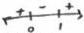

<!-- Page 1 -->

2025

AP

# AP® Calculus AB
## Sample Student Responses and Scoring Commentary

**Inside:**

**Free-Response Question 5**

- ☑ Scoring Guidelines
- ☑ Student Samples
- ☑ Scoring Commentary

© 2025 College Board. College Board, Advanced Placement, AP, AP Central, and the acorn logo are registered trademarks of College Board. Visit College Board on the web: collegeboard.org.

AP Central is the official online home for the AP Program: apcentral.collegeboard.org.

<!-- Page 2 -->

AP® Calculus AB/BC 2025 Scoring Guidelines

### Part B (AB): Graphing calculator not allowed

#### Question 5

9 points

##### General Scoring Notes

- The model solution is presented using standard mathematical notation.
- Answers (numeric or algebraic) need not be simplified. Answers given as a decimal approximation should be accurate to three places after the decimal point. Within each individual free-response question, at most one point is not earned for inappropriate rounding.

Two particles, \( H \) and \( J \), are moving along the \( x \)-axis. For \( 0 \leq t \leq 5 \), the position of particle \( H \) at time \( t \) is given by \( x_{H}(t) = e^{t^{2} - 4t} \) and the velocity of particle \( J \) at time \( t \) is given by \( v_{J}(t) = 2t\left(t^{2} - 1\right)^{3} \).

|   | Model Solution | Scoring  |   |
| --- | --- | --- | --- |
|  A | Find the velocity of particle \( H \) at time \( t = 1 \). Show the work that leads to your answer.  |   |   |
|   |  \( x_{H}^{\prime}(t) = v_{H}(t) = (2t - 4)e^{t^{2} - 4t} \) | Considers \( x_{H}^{\prime} \) | Point 1 (P1)  |
|   |  \( x_{H}^{\prime}(1) = v_{H}(1) = -2e^{-3} \) | Answer | Point 2 (P2)  |
|   |  Scoring Notes for Part A  |   |   |
|   | P1 can be earned by presenting \( x_{H}^{\prime}(t), x_{H}^{\prime}(1), x^{\prime}(t), x^{\prime}(1), (2t - 4)e^{t^{2} - 4t} \), or \( (2 \cdot 1 - 4)e^{t^{2} - 4 \cdot 1} \).An unsupported answer of \( -2e^{-3} \) earns P2 but not P1.  |   |   |

© 2025 College Board

<!-- Page 3 -->

AP® Calculus AB/BC 2025 Scoring Guidelines

B

During what open intervals of time t, for 0 < t < 5, are particles H and J moving in opposite directions? Give a reason for your answer.

From part A, $$x_H'(t) = v_H(t) = (2t - 4)e^{t^2 - 4t}$$.

$$x_H'(t) = (2t - 4)e^{t^2 - 4t} = 0 \Rightarrow t = 2$$

$$x_H'(t) < 0$$ for $$0 < t < 2$$, and $$x_H'(t) > 0$$ for $$2 < t < 5$$.

Thus, particle H is moving to the left for 0 < t < 2 and moving to the right for 2 < t < 5.

$$v_J(t) = 2t(t^2 - 1)^3 = 0$$ for $$0 < t < 5 \Rightarrow t = 1$$

$$v_J(t) < 0$$ for $$0 < t < 1$$, and $$v_J(t) > 0$$ for $$1 < t < 5$$.

Thus, particle J is moving to the left for 0 < t < 1 and moving to the right for 1 < t < 5.

Therefore, particles H and J are moving in opposite directions for 1 < t < 2.

Considers sign of $$x_H'(t)$$ or $$v_J(t)$$

Point 3 (P3)

Analysis for one particle

Point 4 (P4)

Answer with reason

Point 5 (P5)

### Scoring Notes for Part B

- To earn P3, a response can do one of the following:

- Set $$x_H'(t) = 0$$, $$v_H(t) = 0$$, or $$(2t - 4)e^{t^2 - 4t} = 0$$
- Set $$v_J(t) = 0$$ or $$2t(t^2 - 1)^3 = 0$$
- Identify t = 2 for particle H and no other values in the interval 0 < t < 5
- Identify t = 1 for particle J and no other values in the interval 0 < t < 5
- Identify the interval 1 < t < 2

- To earn P4, a response can provide an analysis of signs of velocity or direction of motion on the interval 0 < t < 5 for either particle H or particle J.
- To be eligible for P5, a response must provide correct analyses of signs of velocity or direction of motion on the interval 0 < t < 5 for both particles.
- Only analysis within the interval 0 < t < 5 will be considered in scoring.

© 2025 College Board

<!-- Page 4 -->

AP® Calculus AB/BC 2025 Scoring Guidelines

C

It can be shown that $v_J'(2) > 0$. Is the speed of particle $J$ increasing, decreasing, or neither at time $t = 2$? Give a reason for your answer.

$$v_J(2) > 0 \text{ and } v_J'(2) > 0.$$

Answer with reason

Point 6 (P6)

Because $v_J(2)$ and $v_J'(2)$ have the same sign, the speed of particle $J$ is increasing at $t = 2$.

### Scoring Notes for Part C

- An evaluation of $v_J(2)$ is not necessary, but if a value is presented, it must be correct. The correct value is $v_J(2) = 108$.
- An evaluation of $v_J'(2)$ is not necessary, but if a value is presented, it must be correct. The correct value is $v_J'(2) = 486$.
- A response can either import the analysis for the sign of $v_J(2)$ from part B or restart.
- A response that stated “$v_J(t) > 0$ for $1 < t < 5$” in part B does not need to restate $v_J(2) > 0$ and earns P6 for “$v_J(2)$ and $v_J'(2)$ have the same sign, so the speed is increasing.”

D

Particle $J$ is at position $x = 7$ at time $t = 0$. Find the position of particle $J$ at time $t = 2$. Show the work that leads to your answer.

$$\begin{array}{l} x_J(2) = x_J(0) + \int_0^2 v_J(t) \, dt = 7 + \int_0^2 2t(t^2 - 1)^3 \, dt \\ = 7 + \left[ \frac{1}{4}(t^2 - 1)^4 \right]_0^2 \\ = 7 + \frac{1}{4}((3)^4 - (-1)^4) = 7 + \frac{1}{4}(80) = 27 \end{array}$$

Integrand

Point 7 (P7)

Antiderivative

Point 8 (P8)

Answer

Point 9 (P9)

### Scoring Notes for Part D

- To earn P7, a response must present an indefinite or definite integral with an integrand of $v_J(t)$ or $2t(t^2 - 1)^3$. (See below for notes on how to handle a missing differential $dt$.)
- P8 is earned for an antiderivative of the form $k(t^2 - 1)^4$ or equivalent, for $k > 0$. If $k \neq \frac{1}{4}$, then the response is not eligible to earn P9.
- A response of $7 + \frac{1}{4}((3)^4 - (-1)^4)$ or equivalent banks P9 (i.e., subsequent errors in simplification will not be considered in scoring for P9).

Note: An ambiguous response, such as $7 + \frac{1}{4}((3)^4 - (-1)^4)$, does not bank P9 and therefore must go on to resolve the ambiguity with a correct final answer (e.g., $7 + \frac{1}{4}(80)$ or 27) to earn P9.

© 2025 College Board

<!-- Page 5 -->

AP® Calculus AB/BC 2025 Scoring Guidelines

- If the differential $dt$ is missing:

  ○ Writing $\int_0^2 v_J(t)$ earns **P7** and is eligible to earn **P8** and **P9**.
  ○ Writing $7 + \int_0^2 v_J(t)$ earns **P7** and is eligible to earn **P8** and **P9**.
  ○ Writing $\int_0^2 v_J(t) + 7$ introduces an ambiguity for the intended integrand.

▪ $\int_0^2 v_J(t) + 7 = \left[\frac{1}{4}(t^2 - 1)^4\right]_0^2 + 7$ resolves the ambiguity.

Therefore, this earns **P7** and **P8** and is eligible for **P9**.

▪ $\int_0^2 v_J(t) + 7 = \left[\frac{1}{4}(t^2 - 1)^4 + 7t\right]_0^2$ confirms that an incorrect integrand was used.

Therefore, this does not earn **P7**, earns **P8**, and is not eligible for **P9**.

▪ If the ambiguity is not resolved, this does not earn **P7**, **P8**, or **P9**.

- Alternate solution using $u$-substitution:

Let $u = t^2 - 1$, then $du = 2t \, dt$.

$$t = 0 \Rightarrow u = -1$$

$$t = 2 \Rightarrow u = 3$$

$$x_J(2) = x_J(0) + \int_0^2 v_J(t) \, dt = 7 + \int_0^2 2t(t^2 - 1)^3 \, dt$$

$$= 7 + \int_{-1}^3 u^3 \, du = 7 + \left[\frac{1}{4}u^4\right]_{-1}^3$$

$$= 7 + \frac{1}{4}\left((3)^4 - (-1)^4\right) = 7 + \frac{1}{4}(80) = 27$$

- Alternate solution using indefinite integral:

$$\int 2t(t^2 - 1)^3 \, dt = \frac{1}{4}(t^2 - 1)^4 + C$$

$$x_J(0) = 7 = \frac{1}{4}(0^2 - 1)^4 + C \Rightarrow C = \frac{27}{4}$$

$$x_J(t) = \frac{1}{4}(t^2 - 1)^4 + \frac{27}{4}$$

$$x_J(2) = \frac{1}{4}(2^2 - 1)^4 + \frac{27}{4} = \frac{108}{4} = 27$$

© 2025 College Board

<!-- Page 6 -->

Sample 5A 1 of 2

Q5

# ☒ NO CALCULATOR ALLOWED

Q5

Answer QUESTION 5 PARTS A and B on this page.

PART A

$$X_H(t) = e^{+2-4t}$$

$$V_H(t) = (2t-4) \cdot e^{+2-4t}$$

$$V_H(1) = (2(1)-4) \cdot e^{1-4}$$

$$\boxed{V_H(1) = -2e^{-3}}$$

$$\begin{array}{c} X_H(t) = e^{+2-4t} \\ V_H(t) = (2t-4) \cdot e^{+2-4t} \\ V_H(1) = (2-4) \cdot e^{1-4} \\ \phantom{V_H(1)} = -2e^{-3} \end{array}$$

PART B

$$V_H(t) = (2t-4) \cdot e^{+2-4t} ; V_H(t) = 0$$

$$0 = (2t-4) \cdot e^{+2-4t}$$

$$t = 2 \xleftarrow{-1} t$$

$$V_J(t) = 2t + (t^2-1)^3 ; V_J(t) = 0$$

$$0 = 2t + (t^2-1)^3$$

$$t = 0, 1, -1$$

H moves left from 0 to 2
right from 2 to 5

J moves left from 0 to 1
right from 1 to 5

H and J move in

opposite directions

from 1 < t < 2; they

have opposite sign velocity
at this interval

Page 12

Use a pencil or a pen with black or dark blue ink. Do NOT write your name. Do NOT write outside the box.

0053842

Q5522/12

<!-- Page 7 -->

Sample 5A 2 of 2

Q5

☒

# NO CALCULATOR ALLOWED

Q5

Answer QUESTION 5 PARTS C and D on this page.

PART C

$$\begin{array}{l} V_{J}(2) = 2(2)((2)^{2}-1)^{3} \\ V_{J}(2) = 4(3)^{3} \end{array}$$

$$V_{J}(2) \text{ is positive } (V_{J}(2) > 0)$$

$$V_{J}'(2) \text{ is positive } (V_{J}'(2) > 0)$$

Since velocity and acceleration have the same sign, the particle is speeding up at t=2.

PART D

$$X_{J}(t) = \int V_{J}(t) dt$$

$$(t^{2}-1)(t^{2}-1)$$

$$(t^{4}-2t^{2}+1)(t^{2}-1)$$

$$X_{J}(t) = \int 2t(t^{2}-1)^{3} dt$$

$$t^{6}-t^{4}-2t^{4}+2t^{2}+t^{2}-1$$

$$X_{J}(t) = \int 2t(t^{6}-3t^{4}+3t^{2}-1)$$

$$X_{J}(t) = \int 2t^{7}-6t^{5}+6t^{3}-2t$$

$$X_{J}(t) = \frac{1}{4}t^{6}-t^{6}+\frac{3}{2}t^{4}-t^{2}+C$$

$$T = 0+C$$

$$C = 7$$

$$X_{J}(2) = \frac{1}{4}(2)^{8}-(2)^{6}+\frac{3}{2}(2)^{4}-(2^{2})+7$$

Page 13

Use a pencil or a pen with black or dark blue ink. Do NOT write your name. Do NOT write outside the box.

Q5522/13

<!-- Page 8 -->

Sample 5B 1 of 2

Q5

# NO CALCULATOR ALLOWED

Q5

Answer QUESTION 5 PARTS A and B on this page.

PART A

$$X_H(t) = e^{t^2 - 4t}$$

$$J$$

$$V_J(t) = 2t(t^2 - 1)^3$$

Find $$V_{H(1)}$$

$$X_{H(t)} = e^{t^2 - 4t}$$

$$V_{H(t)} = e^{t^2 - 4t}$$

$$V_{H(1)} = e^{1 - 4} \cdot (2t - 4)$$

$$V_{H(1)} = e^{-3} - 2$$

$$V_{H(1)} = -2e^{-3}$$

PART B

During what open intervals for $$0 < t < 5$$ are it and

J moving in opposite directions

$$-V_H(t) = V_J(t)$$

Page 12

Use a pencil or a pen with black or dark blue ink. Do NOT write your name. Do NOT write outside the box.

0109932

Q5022/12

<!-- Page 9 -->

Sample 5B 2 of 2

Q5

# NO CALCULATOR ALLOWED

Q5

Answer QUESTION 5 PARTS C and D on this page.

# PART C

the speed of particle J is increasing at

time t=2. VJ'(2) describes the

particles acceleration, and it is said to

be >0. If acceleration is positive,

Speed is increasing.

# PART D

$$X_{J}(0)=7 \quad \text{Find } X_{J}(2)$$

$$V_{J}(t)=2t(t^{2}-1)^{3}$$

$$S 2t(t^{2}-1)^{3}$$

$$X_{J}(t)=\frac{1}{4}(t^{2}-1)^{4}$$

$$X_{J}(2)=\frac{1}{4}(4-1)^{4}$$

$$X_{J}(2)=4(3)^{4}$$

$$X_{J}(2)=\frac{3}{4}$$

Page 13

Use a pencil or a pen with black or dark blue ink. Do NOT write your name. Do NOT write outside the box.

Q5022/13

<!-- Page 10 -->

Sample 5C 1 of 2

Q5

# NO CALCULATOR ALLOWED

Q5

Answer QUESTION 5 PARTS A and B on this page.

PART A

$$X'_H(t) = e^{t^2 - 4t} \cdot 2t - 4$$

$$X'_H(1) = e^{1^2 - 4(1)} \cdot 2(1) - 4$$

PART B

$$U_j(t) = 2t(t^2 - 1)^3 = 0 \quad X'_H(t) =$$

$$2t = 0 \quad t^2 = 1$$

$$t = 0 \quad t = 1, -1$$

on the interval (0, 1) the particles

are moving in opposite

directions !!

Page 12

Use a pencil or a pen with black or dark blue ink. Do NOT write your name. Do NOT write outside the box.

0034008

Q5522/12

<!-- Page 11 -->

Sample 5C 2 of 2

Q5

☑

# NO CALCULATOR ALLOWED

Q5

Answer QUESTION 5 PARTS C and D on this page.

PART C

$$U_j'(2) > 0$$ : the speed of the particle is increasing at $$t=2$$

PART D

$$\int_0^2 2t(t^2-1)^3 dt \quad U = t^2 - 1 \\ dt = \frac{dU}{2t}$$

$$\int_0^2 2t(u)^3 \frac{du}{2t}$$
$$\frac{1}{4}(t^2-1)^3 \int_0^2 = \frac{1}{4}(2^2-1)^3 - \frac{1}{4}(D^2-1)^3$$

Page 13

Use a pencil or a pen with black or dark blue ink. Do NOT write your name. Do NOT write outside the box.

Q5522/13

<!-- Page 12 -->

AP CALCULUS AB 2025 • SCORING COMMENTARY

# Question 5

**Note:** Student samples are quoted verbatim and may contain spelling and grammatical errors.

## Overview

**NEW for 2025:** The question overviews can be found in the *Chief Reader Report on Student Responses* on AP Central.

## Sample: 5A

**Score: 9 (1-1-1-1-1-1-1-1-1)**

The response earned 9 points: 2 points in part A, 3 points in part B, 1 point in part C, and 3 points in part D.

In part A the response earned **P1** with the presentation of $(2t - 4) \cdot e^{t^2 - 4t}$ in line 2. The response earned **P2** with the numerical expression $(2(1) - 4) \cdot e^{1 - 4}$ in line 3.

In part B the response earned **P3** with the presentation of $v_H(t) = 0$ in line 1 on the right. The response earned **P4** with a correct analysis of motion of $H$ on the interval $0 < t < 5$ in lines 2 and 3 on the right. The response earned **P5** with a correct analysis of motion of $J$ on the interval $0 < t < 5$ in lines 4 and 5 on the right and the correct boxed conclusion in lines 6–10 on the right.

In part C the response earned **P6** with a correct answer of “$v_J(2)$ is positive” in line 3, “$v_J'(2)$ is positive” in line 4, and the correct conclusion in lines 5 and 6.

In part D the response earned **P7** on the left with $\int v_J(t) \, dt$ in line 1. The response earned **P8** with $\frac{1}{4}t^8 - t^6 + \frac{3}{2}t^4 - t^2$ in line 5. The response earned **P9** with the boxed answer $\frac{1}{4}(2)^8 - (2)^6 + \frac{3}{2}(2)^4 - (2^2) + 7$.

## Sample: 5B

**Score: 4 (1-1-0-0-0-0-1-1-0)**

The response earned 4 points: 2 points in part A, 0 points in part B, 0 points in part C, and 2 points in part D.

In part A the response earned **P1** with the presentation of $e^{t^2 - 4t} \cdot (2t - 4)$ in line 4. The response earned **P2** with the numerical expression $e^{1 - 4} \cdot (2 - 4)$ in line 5.

In part B the response did not earn **P3**. The response did not consider the sign of $x_H'(t)$ or $v_J(t)$. The response did not earn **P4** because there was no analysis of signs of velocity or direction of motion for either particle on the interval $0 < t < 5$. The response did not earn **P5** because it was not eligible without earning **P4**.

In part C the response did not earn **P6** because only acceleration is considered.

In part D the response earned **P7** with $\int 2t(t^2 - 1)^3$ in line 3. The response earned **P8** with $\frac{1}{4}(t^2 - 1)^4$ in line 4. The response did not earn **P9** because the stated answer of $\frac{1}{4}(4 - 1)^4$ in line 5 is incorrect.

© 2025 College Board.

Visit College Board on the web: collegeboard.org.

<!-- Page 13 -->

AP CALCULUS AB 2025 • SCORING COMMENTARY

## Question 5 (continued)

**Sample: 5C**

**Score: 3 (1-0-1-0-0-0-1-0-0)**

The response earned 3 points: 1 point in part A, 1 point in part B, 0 points in part C, and 1 point in part D.

In part A the response earned **P1** with the presentation of $x_H'(t)$ in line 1. The response did not earn **P2** because the numerical expression $e^{t^2 - 4(1)} \cdot 2(1) - 4$ in line 2 is missing parentheses and the error is not resolved.

In part B the response earned **P3** with the equation $2t(t^2 - 1)^3 = 0$. The response did not earn **P4** because there was no analysis of signs of velocity or direction of motion for either particle on the interval $0 < t < 5$. The response did not earn **P5** because it was not eligible without earning **P4**.

In part C the response did not earn **P6** because only acceleration is considered.

In part D the response earned **P7** with $\int_0^2 2t(t^2 - 1)^3 \, dt$ in line 1. The response did not earn **P8**. The exponent in the expression $\frac{1}{4}(t^2 - 1)^3$ in line 3 on the right is incorrect. The response did not earn **P9** because the stated answer of $\frac{1}{4}(2^2 - 1)^3 - \frac{1}{4}(0^2 - 1)^3$ in line 3 on the right is incorrect.

© 2025 College Board.

Visit College Board on the web: collegeboard.org.
