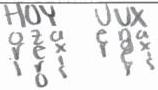

<!-- Page 1 -->

2025

AP

# AP® Calculus AB
## Sample Student Responses and Scoring Commentary

**Inside:**

**Free-Response Question 6**

- ☑ Scoring Guidelines
- ☑ Student Samples
- ☑ Scoring Commentary

© 2025 College Board. College Board, Advanced Placement, AP, AP Central, and the acorn logo are registered trademarks of College Board. Visit College Board on the web: collegeboard.org.

AP Central is the official online home for the AP Program: apcentral.collegeboard.org.

<!-- Page 2 -->

AP® Calculus AB/BC 2025 Scoring Guidelines

### Part B (AB): Graphing calculator not allowed

### Question 6

9 points

### General Scoring Notes

- The model solution is presented using standard mathematical notation.
- Answers (numeric or algebraic) need not be simplified. Answers given as a decimal approximation should be accurate to three places after the decimal point. Within each individual free-response question, at most one point is not earned for inappropriate rounding.

Consider the curve G defined by the equation  \( y^{3}-y^{2}-y+\frac{1}{4}x^{2}=0 \) .

|   | Model Solution | Scoring  |   |
| --- | --- | --- | --- |
|  A | Show that \( \frac{dy}{dx} = \frac{-x}{2(3y^2 - 2y - 1)} \). |   |   |
|   |  \( \frac{d}{dx}\left(y^3 - y^2 - y + \frac{1}{4}x^2\right) = \frac{d}{dx}(0) \)\( \Rightarrow 3y^2 \cdot \frac{dy}{dx} - 2y \cdot \frac{dy}{dx} - \frac{dy}{dx} + \frac{x}{2} = 0 \) | Implicit differentiation | Point 1 (P1)  |
|   |  \( \Rightarrow (3y^2 - 2y - 1)\frac{dy}{dx} = -\frac{x}{2} \)\( \Rightarrow \frac{dy}{dx} = \frac{-x}{2(3y^2 - 2y - 1)} \) | Verification | Point 2 (P2)  |

### Scoring Notes for Part A

- P1 is earned only for the correct implicit differentiation of \( y^3 - y^2 - y + \frac{1}{4} x^2 = 0 \). Responses may use alternative notations for \( \frac{dy}{dx} \), such as \( y' \).
• To be eligible for P2, a response must have earned P1.
- It is sufficient to present \(\left(3y^{2} - 2y - 1\right)\frac{dy}{dx} = -\frac{x}{2}\) to earn P2, provided there are no subsequent errors.

© 2025 College Board

<!-- Page 3 -->

AP® Calculus AB/BC 2025 Scoring Guidelines

B

There is a point P on the curve G near (2, -1) with x-coordinate 1.6. Use the line tangent to the curve at (2, -1) to approximate the y-coordinate of point P.

$$\left. \frac{dy}{dx} \right|_{(x, y)=(2, -1)} = \frac{-2}{2(3 + 2 - 1)} = -\frac{1}{4}$$

Slope of tangent line

Point 3 (P3)

$$y \approx -1 - \frac{1}{4}(1.6 - 2) = -0.9$$

Tangent line approximation

Point 4 (P4)

### Scoring Notes for Part B

- A response can earn P3 with $\left. \frac{dy}{dx} \right|_{(x, y)=(2, -1)} = -\frac{1}{4}$, $\frac{dy}{dx} = -\frac{1}{4}$, “slope is $-\frac{1}{4}$,” or equivalent.
- A response that presents a linear approximation with a slope of $-\frac{1}{4}$ also earns P3.
- A response that declares $\left. \frac{dy}{dx} \right|_{(x, y)=(2, -1)}$ (or the slope) equal to any nonzero value $k \neq -\frac{1}{4}$ does not earn P3. Such a response earns P4 for a presented approximation mathematically equivalent to $-1 + k(-0.4)$.
- P4 cannot be earned with a linear approximation using a slope other than $-\frac{1}{4}$ if that slope has not been declared to be the value of $\left. \frac{dy}{dx} \right|_{(x, y)=(2, -1)}$.
- A response does not have to present the tangent line equation but must clearly demonstrate its use at $x = 1.6$ in finding the requested approximation to be eligible for P4.
- A response of $-1 - \frac{1}{4}(-0.4)$ earns both P3 and P4.
- A response of $-1 - \frac{1}{4}(1.6 - 2)$ or equivalent banks P4 (i.e., subsequent errors in simplification will not be considered in scoring for P4).

Note: An ambiguous response, such as $-1 - \frac{1}{4}(1.6 - 2)$, does not bank P4 and therefore must go on to resolve the ambiguity with a correct final answer (e.g., -0.9) to earn P4.

© 2025 College Board

<!-- Page 4 -->

AP® Calculus AB/BC 2025 Scoring Guidelines

C For x > 0 and y > 0, there is a point S on the curve G at which the line tangent to the curve at that point is vertical. Find the y-coordinate of point S. Show the work that leads to your answer.

For x > 0, the curve G has a vertical tangent line when
$$2(3y^2 - 2y - 1) = 0$$.

$$2(3y^2 - 2y - 1) = 0 \Rightarrow 2(3y + 1)(y - 1) = 0$$

Because y > 0, it follows that y = 1.

The line tangent to the curve is vertical at the point on the curve where y = 1.

Sets denominator equal to 0
Point 5 (P5)

Answer
Point 6 (P6)

# Scoring Notes for Part C

- P5 is earned with any of $$2(3y^2 - 2y - 1) = 0$$, $$3y^2 - 2y - 1 = 0$$, $$2(3y \pm 1)(y \pm 1) = 0$$, or $$(3y \pm 1)(y \pm 1) = 0$$.
- To be eligible for P6, a response must have earned P5.
- A response does not need to consider the numerator of $$\frac{dy}{dx} = \frac{-x}{2(3y^2 - 2y - 1)}$$ to earn P5 or P6; considering the denominator is sufficient.
- A response that states solutions of $$y = -\frac{1}{3}$$ and y = 1, but does not clearly identify that y = 1 is the only solution to the prompt, does not earn P6.
- In the presence of algebraic work to find the value of y, P6 is earned only if the algebraic work is correct.
- A response of “$$2(3y^2 - 2y - 1) = 0$$, y = 1” earns both P5 and P6.

© 2025 College Board

<!-- Page 5 -->

AP® Calculus AB/BC 2025 Scoring Guidelines

D

A particle moves along the curve H defined by the equation 2xy + ln y = 8. At the instant when the particle is at the point (4, 1), dx/dt = 3. Find dy/dt at that instant. Show the work that leads to your answer.

$$\frac{d}{dt}(2xy + \ln y) = \frac{d}{dt}(8)$$

$$2\frac{dx}{dt}y + 2x\frac{dy}{dt} + \frac{1}{y}\frac{dy}{dt} = 0$$

Attempts implicit differentiation with respect to t

Point 7 (P7)

$$2\frac{dx}{dt}y + 2x\frac{dy}{dt} + \frac{1}{y}\frac{dy}{dt} = 0$$

Point 8 (P8)

$$2(3)(1) + 2(4)\frac{dy}{dt} + \frac{1}{1}\frac{dy}{dt} = 0$$

$$\Rightarrow 6 + 9\frac{dy}{dt} = 0 \Rightarrow \frac{dy}{dt} = -\frac{2}{3}$$

Answer

Point 9 (P9)

### Scoring Notes for Part D

- P7 is earned for implicitly differentiating 2xy + ln y = 8 with respect to t with at most one error.
- P8 is earned for an equation equivalent to 2 dx/dt y + 2x dy/dt + 1 dy/dt = 0.
- To be eligible for P9, a response must have earned P7 and P8, with no errors in implicit differentiation.
- P9 is earned only for the value of -2/3.
- Alternate solution:

$$\frac{dy}{dt} = \frac{dy}{dx} \cdot \frac{dx}{dt}$$

$$\frac{d}{dx}(2xy + \ln y) = \frac{d}{dx}(8) \Rightarrow 2y + 2x\frac{dy}{dx} + \frac{1}{y}\frac{dy}{dx} = 0 \Rightarrow \frac{dy}{dx} = \frac{-2y}{2x + \frac{1}{y}}$$

$$\left.\frac{dy}{dx}\right|_{(x, y)=(4, 1)} = \frac{-2(1)}{2(4) + \frac{1}{1}} = -\frac{2}{9}$$

$$\left.\frac{dy}{dt}\right|_{(x, y)=(4, 1)} = \left.\frac{dy}{dx} \cdot \frac{dx}{dt}\right|_{(x, y)=(4, 1)} = -\frac{2}{9} \cdot 3 = -\frac{2}{3}$$

- P7 is earned for an implicit differentiation with respect to x with at most one error, as long as dy/dx is eventually correctly linked to dx/dt.
- P8 is earned for finding dy/dx and multiplying the result by dx/dt = 3.
- P8 can be earned for a stated incorrect dy/dx, as long as it is multiplied by 3.
- P9 is only earned for a correct value of -2/3 or equivalent.
- Stating dy/dt = dy/dx · dx/dt alone does not earn any points.

© 2025 College Board

<!-- Page 6 -->

Sample 6A 1 of 2

Q6

# NO CALCULATOR ALLOWED

Q6

Answer QUESTION 6 PARTS A and B on this page.

# PART A

$$y^3 - y^2 - y + \frac{1}{4}x^2 = 0$$

$$y^3 - y^2 - y = -\frac{1}{4}x^2$$

$$3y^2 \frac{dy}{dx} - 2y \frac{dy}{dx} - \frac{dy}{dx} = -\frac{1}{2}x$$

$$\frac{dy}{dx}(3y^2 - 2y - 1) = -\frac{1}{2}x$$

$$\frac{dy}{dx} = \frac{-x}{2(3y^2 - 2y - 1)} \checkmark$$

# PART B

$$\frac{dy}{dx} = \frac{-x}{2(3y^2 - 2y - 1)} = \frac{-2}{2(3(-1)^2 - 2(-1) - 1)} = \frac{-2}{2(3+2-1)} = \frac{-2}{8} = \frac{-1}{4}$$

$$y - 1 = -\frac{1}{4}(x - 2)$$

$$y + 1 = -\frac{1}{4}x + \frac{1}{2}$$

$$y = -\frac{1}{4}x - \frac{1}{2}$$

$$y \approx \frac{-1}{4} \left(\frac{15}{10}\right) - \frac{1}{2}$$

$$y \approx \frac{-4}{10} - \frac{1}{2}$$

$$\approx \frac{-4}{10} - \frac{5}{10} \approx \boxed{\frac{-9}{10}} \text{ or } \boxed{-0.9}$$

Page 14

Use a pencil or a pen with black or dark blue ink. Do NOT write your name. Do NOT write outside the box.

0129349

Q5522/14

<!-- Page 7 -->

Sample 6A 2 of 2

Q6

# NO CALCULATOR ALLOWED

Q6

Answer QUESTION 6 PARTS C and D on this page.

# PART C

$$2(3y^2 - 2y - 1) = 0$$

$$3y^2 - 2y - 1 = 0$$

$$3y^2 - 3y + y - 1 = 0$$

$$3y(y - 1) + 1(y - 1) = 0$$

$$(3y + 1)(y - 1) = 0$$

$$3y + 1 = 0$$

$$y = \frac{-1}{3}$$

$$y = 1 = 0$$

$$y = 1$$

The y-coordinate is 1 → y = 1

# PART D

$$(2x)(\frac{dy}{dt}) + (2\frac{dt}{dt})(y) + \frac{1}{y}\frac{dy}{dt} = 0$$

$$2(4)\frac{dy}{dt} + 2(3)(1) + \frac{1}{1}\frac{dy}{dt} = 0$$

$$8\frac{dy}{dt} + 6 + \frac{dy}{dt} = 0$$

$$8\frac{dy}{dt} + \frac{dy}{dt} = -6$$

$$\frac{dy}{dt}(8 + 1) = -6$$

$$\frac{dy}{dt} = -\frac{6}{9} = \boxed{-\frac{2}{3}}$$

Page 15

Use a pencil or a pen with black or dark blue ink. Do NOT write your name. Do NOT write outside the box.

Q5522/15

<!-- Page 8 -->

Sample 6B 1 of 2

Q6

# NO CALCULATOR ALLOWED

Q6

Answer QUESTION 6 PARTS A and B on this page.

PART A

$$y^3 - y^2 - y + \frac{1}{4}x^2 = 0$$

$$3y^2 \frac{dy}{dx} - 2y \frac{dy}{dx} - \frac{dy}{dx} + \frac{1}{2}x = 0$$

$$(3y^2 - 2y - 1) \frac{dy}{dx} = -\frac{x}{2}$$

$$\frac{dy}{dx} = \frac{-x}{2(3y^2 - 2y - 1)}$$

PART B

$$y + 1 = -\frac{1}{4}(x - 2)$$

$$\frac{dy}{dx} = \frac{-2}{2(3(-1)^2) - 2(-1) - 1} = \frac{-2}{2(3+2-1)} - \frac{2}{8} = -\frac{1}{4}$$

$$-\frac{1}{4}x + \frac{1}{2} - \frac{2}{2} = (-\frac{1}{4}x - \frac{1}{2})^4 - 1.6 - 2 = \boxed{-3.6}$$
$$-x - 2 =$$

Page 14

Use a pencil or a pen with black or dark blue ink. Do NOT write your name. Do NOT write outside the box.

0196176

Q5522/14

<!-- Page 9 -->

Sample 6B 2 of 2

Q6

☑

# NO CALCULATOR ALLOWED

Q6

Answer QUESTION 6 PARTS C and D on this page.

PART C

$$\frac{dy}{dx} = \frac{-x}{2(3y^2 - 2y - 1)} \times \frac{1}{0}$$

$$2(3y^2 - 2y - 1) = 0$$

$$6y^2 - 4y - 2 = 0$$

$$2(3y^2 - 2y - 1)$$

$$3y^2 - 3y + y - 1$$

$$3y(y - 1) + 1(y - 1)$$

$$3y + 1 \quad y - 1$$

$$y = -\frac{1}{3} \quad y = 1$$

PART D

$$2xy + 6ny = 8$$

$$\begin{array}{l} y = 1 \\ x = 4 \end{array} \quad \frac{dx}{dt} = 3$$

$$2x \frac{dy}{dt} \cdot y \frac{2dx}{dt} + \frac{1}{y} \frac{dy}{dt} = 0$$

$$\frac{dy}{dt} (2x + \frac{1}{y}) \cdot 2(1)(3)$$

$$\frac{dy}{dt} (2(4) + 1) \cdot 2(1)(3)$$

$$\frac{dy}{dx} = \left(\frac{1}{54}\right)$$

Page 15

Use a pencil or a pen with black or dark blue ink. Do NOT write your name. Do NOT write outside the box.

Q5522/15

<!-- Page 10 -->

Sample 6C 1 of 2

Q6

# ☒ NO CALCULATOR ALLOWED

Q6

Answer QUESTION 6 PARTS A and B on this page.

PART A

$$3y^2 \frac{dy}{dx} - 2y \frac{dy}{dx} - 1 \frac{dy}{dx} + \frac{1}{2}x = 0$$

$$\frac{dy}{dx} \left( \frac{3y^2 - 2y - 1}{3y^2 - 2y - 1} \right) = \frac{-\frac{1}{2}x}{\frac{3y^2 - 2y - 1}}{}$$

$$\frac{dy}{dx} = \frac{-x}{2(3y^2 - 2y - 1)}$$

PART B

$$(x, y)$$

$$(2, -1)$$

$$y - y_1 = m(x - x_1)$$

$$y + 1 = m(x - 2)$$

$$y + 1 = 8(x - 2)$$

$$y = 8(x - 2) + 1$$

$$8(1.6 - 2) + 1$$

$$8(-4) + 1$$

$$-3.2 + 1$$

$$= -2.2$$

$$\begin{array}{r} -\frac{1}{3}(1)^2 - (1) + \frac{1}{4}(2)^2 \\ -1 - 1 + 1 + \frac{1}{4}(4) \\ -1 + \frac{1}{4}(4) \\ -1 + \\ \hline \end{array}$$

$$\begin{array}{r} -2 \\ \hline 2(3+1)^2 - 2(4) - 1 \\ (3 + 2 - 1) \\ 2(4) = 8 \end{array}$$

Page 14

Use a pencil or a pen with black or dark blue ink. Do NOT write your name. Do NOT write outside the box.

0207358

Q5522/14

<!-- Page 11 -->

Sample 6C 2 of 2

Q6

# NO CALCULATOR ALLOWED

Q6

Answer QUESTION 6 PARTS C and D on this page.

PART C

$$2(3y^2 - 2y - 1) = 0$$

$$6y^2 - 4y - 2 = 0$$

$$6y^2 - 4y = 2 \quad \text{point } s = \frac{2}{3}$$

$$2y(3y - 2) = 0$$

PART D

$$2y + 2x \frac{dy}{dx} + e^y \frac{dy}{dt}$$

$$\frac{dy}{dt} = \frac{2x + e^y}{2x + e^y} = \frac{-2y}{2x + e^y}$$

$$\frac{dy}{dt} \left| \frac{-2(1)}{(4,1)2(4) + e^y} \right| = \frac{-2}{8} = -\frac{1}{4}$$

Page 15

Use a pencil or a pen with black or dark blue ink. Do NOT write your name. Do NOT write outside the box.

Q5522/15

<!-- Page 12 -->

AP CALCULUS AB 2025 • SCORING COMMENTARY

# Question 6

**Note:** Student samples are quoted verbatim and may contain spelling and grammatical errors.

## Overview

**NEW for 2025:** The question overviews can be found in the *Chief Reader Report on Student Responses* on AP Central.

### Sample: 6A

**Score: 9 (1-1-1-1-1-1-1-1-1)**

The response earned 9 points: 2 points in part A, 2 points in part B, 2 points in part C, and 3 points in part D.

In part A the response earned **P1** in the third line with a correct implicit differentiation equation. The response earned **P2** with appropriate work in line 4 leading to the correct equation for $\frac{dy}{dx}$ in line 5.

In part B the response earned **P3** with correct simplification of $\frac{-1}{4}$ at the end of line 1. The response would have earned the point in line 1 with $\frac{-2}{2(3(-1)^2 - 2(-1) - 1)}$ without simplification. The response earned **P4** in line 2 on the right with the expression $y \approx \frac{-1}{4}\left(\frac{16}{10}\right) - \frac{1}{2}$. All further simplification presented is correct but unnecessary.

In part C the response earned **P5** with the equation $2(3y^2 - 2y - 1) = 0$ in line 1 on the left. The response earned **P6** with algebra in lines 2 through 7 on the left and the correct value of $y$ in line 1 on the right.

In part D the response earned **P7** in line 1 with the implicit differentiation with respect to $t$ with at most one error. The response earned **P8** in line 1 because the implicit differentiation contains no errors. The response earned **P9** with the correct value of $\frac{-2}{3}$. The response would have earned the point with the unsimplified form $\frac{dy}{dt} = \frac{-6}{9}$.

### Sample: 6B

**Score: 6 (1-1-1-0-1-1-1-0-0)**

The response earned 6 points: 2 points in part A, 1 point in part B, 2 points in part C, and 1 point in part D.

In part A the response earned **P1** with the correct implicit differentiation in line 2. The response earned **P2** with appropriate work in line 3 leading to the correct equation in line 4.

In part B the response earned **P3** in line 1 with $y + 1 = -\frac{1}{4}(x - 2)$, which is a linear approximation with a slope of $-\frac{1}{4}$. The response could also have earned the point with the correct declaration of $\frac{dy}{dx}$ in line 2. The response did not earn **P4** because the correct answer is not given.

In part C the response earned **P5** with the equation $2(3y^2 - 2y - 1) = 0$ in line 1 on the right. The response earned **P6** with subsequent algebra in lines 2 through 6 and with the circled $y = 1$ in line 7 on the right.

© 2025 College Board.

Visit College Board on the web: collegeboard.org.

<!-- Page 13 -->

AP CALCULUS AB 2025 • SCORING COMMENTARY

## Question 6 (continued)

In part D the response earned **P7** with $2x \frac{dy}{dt} \cdot y^2 \frac{dx}{dt} + \frac{1}{y} \frac{dy}{dt} = 0$, which is an attempt at implicit differentiation with respect to $t$ with at most one error. The response did not earn **P8** because the implicit differentiation has one error. The multiplication indicated with the “ · ” should have been addition. The response did not earn **P9** because it did not earn both **P7** and **P8** and is therefore ineligible for **P9**.

**Sample: 6C**

**Score: 3 (1-1-0-0-1-0-0-0-0)**

The response earned 3 points: 2 points in part A, 0 points in part B, 1 point in part C, and 0 points in part D.

In part A the response earned **P1** in the first line with correct implicit differentiation. The response earned **P2** with appropriate work in line 2 leading to the correct equation in line 3.

In part B the response did not earn **P3** because the slope used in the linear approximation is not $\frac{-1}{4}$. The response did not earn **P4** because the linear approximation in line 5 on the left, $8(1.6 - 2) + 1$, is not of the form $-1 + k(-0.4)$ where $k$ is a slope other than $-\frac{1}{4}$ and connected to a declared value of $\frac{dy}{dx}$ at the given point.

In part C the response earned **P5** in the first algebraic line with the equation $2(3y^2 - 2y - 1) = 0$. The response did not earn **P6** because the correct answer is not given.

In part D the response did not earn **P7** because the presented implicit differentiation expression in line 1 has more than one error. The response did not earn **P8** because the presented implicit differentiation expression in line 1 has more than one error. The response did not earn **P9** because it did not earn **P7** and **P8** and is therefore ineligible for **P9**.

© 2025 College Board.

Visit College Board on the web: collegeboard.org.
