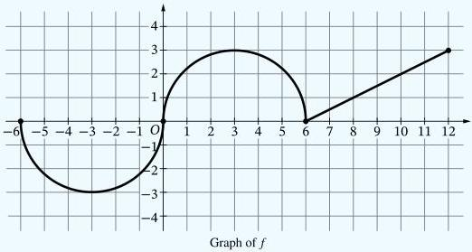

<!-- Page 1 -->

2025

# AP® Calculus AB
## Scoring Guidelines

© 2025 College Board. College Board, Advanced Placement, AP, AP Central, and the acorn logo are registered trademarks of College Board. Visit College Board on the web: collegeboard.org.

AP Central is the official online home for the AP Program: apcentral.collegeboard.org.

<!-- Page 2 -->

AP® Calculus AB/BC 2025 Scoring Guidelines

### Part A (AB or BC): Graphing calculator required

#### Question 1

9 points

##### General Scoring Notes

- The model solution is presented using standard mathematical notation.
- Answers (numeric or algebraic) need not be simplified. Answers given as a decimal approximation should be accurate to three places after the decimal point. Within each individual free-response question, at most one point is not earned for inappropriate rounding.

An invasive species of plant appears in a fruit grove at time \( t = 0 \) and begins to spread. The function \( C \) defined by \( C(t) = 7.6\arctan (0.2t) \) models the number of acres in the fruit grove affected by the species \( t \) weeks after the species appears. It can be shown that \( C'(t) = \frac{38}{25 + t^2} \).

(Note: Your calculator should be in radian mode.)

|   | Model Solution | Scoring  |   |
| --- | --- | --- | --- |
|  A | Find the average number of acres affected by the invasive species from time \( t = 0 \) to time \( t = 4 \) weeks.Show the setup for your calculations.  |   |   |
|   |  \( \frac{1}{4-0}\int_{0}^{4}C(t)dt \) | Average value formula | Point 1 (P1)  |
|   |  \( =\frac{1}{4}(11.112896)=2.778224 \)From time \( t = 0 \) to \( t = 4 \) weeks, the average number of acres affected by the invasive species was 2.778 acres. | Answer | Point 2 (P2)  |

© 2025 College Board

<!-- Page 3 -->

AP® Calculus AB/BC 2025 Scoring Guidelines

### Scoring Notes for Part A

- **P1** is earned for the correct integral, with or without the differential, along with evidence of division by 4. In the presence of the correct integral, the correct answer will suffice as evidence of division by 4. These may appear all in one step, as in the model solution, or in multiple steps.
- **P2** is earned for the correct answer, with or without supporting work. A reported answer should be accurate to three places after the decimal point, rounded or truncated. An inappropriately rounded answer does not earn the point.
- Incorrect or unclear communication between the correct integral and the correct answer is treated as scratch work and is not considered in scoring. For example:

○ $$\int_{0}^{4} C(t) \, dt = 11.112896$$ so the average velocity is 2.778224.

Note: This response earns **P1** for the correct integral with the correct answer as evidence of division by 4. It also earns **P2** for the correct answer.

○ $$\int_{0}^{4} C(t) \, dt = \frac{11.112896}{4} = 2.778224$$

Note: This response earns **P1** for the correct integral with the correct answer as evidence of division by 4. It also earns **P2** for the correct answer. (In this instance, incorrect linkage is not considered in scoring.)

○ $$\int_{0}^{4} C(t) \, dt = 2.778224$$

Note: This response earns **P1** for the correct integral with the correct answer as evidence of division by 4. It also earns **P2** for the correct answer. (In this instance, incorrect linkage is not considered in scoring.)

- Note that the values $$\frac{1}{4}(11.112)$$ and $$\frac{1}{4}(11.113)$$ are accurate to three digits after the decimal and therefore earn **P2**.

© 2025 College Board

<!-- Page 4 -->

AP® Calculus AB/BC 2025 Scoring Guidelines

B

Find the time $t$ when the instantaneous rate of change of $C$ equals the average rate of change of $C$ over the time interval $0 \leq t \leq 4$. Show the setup for your calculations.

$$\frac{C(4) - C(0)}{4 - 0} = 1.282008$$

$$C'(t) = \frac{38}{25 + t^2} = 1.282008 \Rightarrow t = 2.154298$$

The instantaneous rate of change of $C$ equals the average rate of change of $C$ over the interval $0 \leq t \leq 4$ at time $t = 2.154$.

Uses average rate of change

Point 3 (P3)

Answer with supporting work

Point 4 (P4)

### Scoring Notes for Part B

- P3 may be earned by presenting the expression or value for the average rate of change. Note that

because $C(0) = 0$ and the interval is $0 \leq t \leq 4$, any of the following will earn P3: $\frac{\int_0^4 C'(t) \, dt}{4}$, $\frac{C(4) - C(0)}{4 - 0}$, $\frac{C(4)}{4}$, $\frac{5.128 - 0}{4 - 0}$, $\frac{5.128}{4}$, or 1.282. However, neither P3 nor P4 is earned by just presenting $t = 1.282$.

- P4 is earned for the correct answer supported by the appropriate equation. A reported answer should be accurate to three places after the decimal point, rounded or truncated. An inappropriately rounded answer does not earn the point, unless an earlier point was not earned due to inappropriate rounding.

The following response, for example, earns both P3 and P4: $C'(t) = \frac{C(4) - C(0)}{4}$ when $t = 2.154$.

C

Assume that the invasive species continues to spread according to the given model for all times $t > 0$. Write a limit expression that describes the end behavior of the rate of change in the number of acres affected by the species. Evaluate this limit expression.

$$\lim_{t \to \infty} C'(t) = \lim_{t \to \infty} \frac{38}{25 + t^2}$$

$$= 0$$

Limit expression

Point 5 (P5)

Value

Point 6 (P6)

### Scoring Notes for Part C

- P5 can be earned for either $\lim_{t \to \infty} C'(t)$ or $\lim_{t \to \infty} C(t)$.

- A response that includes $\lim_{t \to \infty} C(t)$ is not eligible to earn P6.

- For P6, arithmetic with infinity, e.g., $\frac{38}{25 + \infty^2} = 0$, will be considered as scratch work and will not be considered in scoring.

© 2025 College Board

<!-- Page 5 -->

AP® Calculus AB/BC 2025 Scoring Guidelines

D

At time $t = 4$ weeks after the invasive species appears in the fruit grove, measures are taken to counter the spread of the species. The function $A$, defined by $A(t) = C(t) - \int_{4}^{t} 0.1 \cdot \ln(x) \, dx$, models the number of acres affected by the species over the time interval $4 \leq t \leq 36$. At what time $t$, for $4 \leq t \leq 36$, does $A$ attain its maximum value? Justify your answer.

$$A'(t) = C'(t) - 0.1 \cdot \ln t$$

Considers $A'(t) = 0$

Point 7 (P7)

For $4 \leq t \leq 36$, the maximum value of $A(t)$ occurs when $A'(t) = 0$ or at an endpoint.

$$A'(t) = C'(t) - 0.1 \cdot \ln t = 0 \Rightarrow C'(t) = 0.1 \cdot \ln t$$

$$\Rightarrow t = 11.441700$$

Justification

Point 8 (P8)

|  t | A(t)  |
| --- | --- |
|  4 | 5.128031  |
|  11.441700 | 7.316978  |
|  36 | 1.743056  |

Therefore, the number of acres affected by the species is a maximum at time $t = 11.442$ (or 11.441) weeks.

Answer with supporting work

Point 9 (P9)

### Scoring Notes for Part D

- P7 is earned for considering $A'(t) = 0$, $C'(t) - 0.1 \cdot \ln t = 0$, or $C'(t) = 0.1 \cdot \ln t$. P7 is not earned by just presenting $t = 11.441700$.

A response that discusses the sign of $A'(t)$ changing or uses the phrase “critical points of $A$” also earns P7.

- To earn P8 using a candidates test, a response must make a global argument by correctly evaluating $A(t)$ at $t = 4$, $t = 11.441700$, and $t = 36$. The evaluations must be correct to the first digit after the decimal, rounded or truncated.

- Alternate justifications:

  - $A'(t) > 0$ for $4 < t < 11.442$, and $A'(t) < 0$ for $11.442 < t < 36$. Therefore, $t = 11.442$ is the location of the absolute maximum for $A$ on the interval $4 \leq t \leq 36$.

  - Because $A'(t)$ changes sign from positive to negative at $t = 11.442$ (this might be presented as “$A'(t) > 0$ for $t < 11.442$, and $A'(t) < 0$ for $t > 11.442$”), it is the location of a relative maximum for $A$. And because $t = 11.442$ is the only critical point of $A$ in the interval $4 \leq t \leq 36$, it is the location of the absolute maximum for $A$ on the interval.

- A response that presents a local argument (such as a First Derivative Test or a Second Derivative Test) or an incorrect global argument does not earn P8 but is eligible for P9 with the correct answer. A reported answer should be accurate to three places after the decimal point, rounded or truncated. An inappropriately rounded answer does not earn the point, unless an earlier point was not earned due to inappropriate rounding.

© 2025 College Board

<!-- Page 6 -->

AP® Calculus AB/BC 2025 Scoring Guidelines

## Part A (AB): Graphing calculator required

### Question 2

9 points

#### General Scoring Notes

- The model solution is presented using standard mathematical notation.
- Answers (numeric or algebraic) need not be simplified. Answers given as a decimal approximation should be accurate to three places after the decimal point. Within each individual free-response question, at most one point is not earned for inappropriate rounding.

The shaded region R is bounded by the graphs of the functions f and g, where  \( f(x) = x^{2} - 2x \)  and  \( g(x) = x + \sin(\pi x) \) , as shown in the figure.

(Note: Your calculator should be in radian mode.)

© 2025 College Board

<!-- Page 7 -->

AP® Calculus AB/BC 2025 Scoring Guidelines

|  Model Solution |   | Scoring  |   |
| --- | --- | --- | --- |
|  A | Find the area of R. Show the setup for your calculations.  |   |   |
|   | $$\int_{0}^{3}(g(x) - f(x)) \, dx$$ | Form of integrand | **Point 1 (P1)**  |
|   | = 5.136620 | Answer | **Point 2 (P2)**  |
|   | The area is 5.137 (or 5.136). |  |   |
|  **Scoring Notes for Part A**  |   |   |   |
|  - **P1** is earned for a response that presents an integrand of $$g(x) - f(x)$$, $$|g(x) - f(x)|$$, $$f(x) - g(x)$$, or $$|f(x) - g(x)|$$ in a definite integral, with or without the differential $$dx$$. - **P1** could also be earned for a difference of definite integrals with integrands $$g(x)$$ and $$f(x)$$. - **P2** is earned for the correct answer, with or without supporting work. A reported answer should be accurate to three places after the decimal point, rounded or truncated. An inappropriately rounded answer does not earn the point. - Incorrect communication between the integral and the correct answer is treated as scratch work and is not considered in scoring. - $$\int_{0}^{3}(f(x) - g(x)) \, dx = -5.137$$ so the area is 5.137. Note: This response earns **P1** for the integral. It also earns **P2** for the correct answer. - $$\int_{0}^{3}(f(x) - g(x)) \, dx = 5.137$$ Note: This response earns **P1** for the integral. It also earns **P2** for the correct answer. (In this instance, incorrect linkage is not considered in scoring.) - The exact answer is $$\frac{4 + 9\pi}{2\pi}$$.  |   |   |   |

© 2025 College Board

<!-- Page 8 -->

AP® Calculus AB/BC 2025 Scoring Guidelines

B

Region R is the base of a solid. For this solid, at each x the cross section perpendicular to the x-axis is a rectangle with height x and base in region R. Find the volume of the solid. Show the setup for your calculations.

$$\int_{0}^{3} x(g(x) - f(x)) \, dx$$

$$= 7.704930$$

The volume of the solid is 7.705 (or 7.704).

Form of integrand

Point 3 (P3)

Answer

Point 4 (P4)

### Scoring Notes for Part B

- P3 is earned for a definite integral with an integrand presented as a product of two nonconstant factors, with one of the factors equal to x, g(x) - f(x), or f(x) - g(x).
- The presence or absence of the differential dx will not be considered in scoring P3 or P4.
- P4 is earned for the correct answer, with or without supporting work. A reported answer should be accurate to three places after the decimal point, rounded or truncated. An inappropriately rounded answer does not earn the point, unless an earlier point was not earned due to inappropriate rounding.
- Incorrect or unclear communication between the integral and the correct answer is treated as scratch work and is not considered in scoring. For example:

$$\int_{0}^{3} x(f(x) - g(x)) \, dx = -7.705$$ so the volume is 7.705.

Note: This response earns P3 for the integral. It also earns P4 for the correct answer.

$$\int_{0}^{3} x(f(x) - g(x)) \, dx = 7.705$$

Note: This response earns P3 for the integral. It also earns P4 for the correct answer. (In this instance, incorrect linkage is not considered in scoring.)

- The exact answer is $$\frac{12 + 27\pi}{4\pi}$$.

© 2025 College Board

<!-- Page 9 -->

AP® Calculus AB/BC 2025 Scoring Guidelines

C

Write, but do not evaluate, an integral expression for the volume of the solid generated when the region R is rotated about the horizontal line y = -2.

$$\text{Volume} = \pi \int_{0}^{3} \left( (g(x) - (-2))^2 - (f(x) - (-2))^2 \right) dx$$

|  Form of integrand | Point 5 (P5)  |
| --- | --- |
|  Integrand | Point 6 (P6)  |
|  Limits, constant, and differential | Point 7 (P7)  |

### Scoring Notes for Part C

- P5 is earned for a definite integral with an integrand of $R^2 - r^2$ or $|R^2 - r^2|$, where one of $\{R, r\}$ is correct or a difference between $g$ and a nonzero constant, and the other is correct or a difference between $f$ and a nonzero constant.
- P6 is earned for the integral $\int_{0}^{3} \left( (g(x) + 2)^2 - (f(x) + 2)^2 \right) dx$, $\int_{0}^{3} \left( (f(x) + 2)^2 - (g(x) + 2)^2 \right) dx$, or a mathematically equivalent expression.
- Note P5 and P6 could be earned for a difference of definite integrals.
- A response that presents an integral expression that does not include the constant $\pi$ is eligible for P5 and P6 but does not earn P7.
- To be eligible for P7, a response must have earned P5.
- A response that reverses the difference of squares must resolve the reversal with either the constant or the limits of integration AND include the differential to earn P7. For example:
  - A response of $-\pi \int_{0}^{3} \left( (f(x) + 2)^2 - (g(x) + 2)^2 \right) dx$ or $\pi \int_{3}^{0} \left( (f(x) + 2)^2 - (g(x) + 2)^2 \right) dx$ earns P5, P6, and P7.
  - A response of $\pi \int_{0}^{3} \left( (f(x) + 2)^2 - (g(x) + 2)^2 \right) dx$ earns P5 and P6 but does not earn P7.
- A response of only $\pi \int_{0}^{3} \left( (g(x) - (-2))^2 - (f(x) - (-2))^2 \right) dx$ earns P5, P6, and P7.

© 2025 College Board

<!-- Page 10 -->

AP® Calculus AB/BC 2025 Scoring Guidelines

|  **D** | It can be shown that $g'(x) = 1 + \pi \cos(\pi x)$. Find the value of $x$, for $0 < x < 1$, at which the line tangent to the graph of $f$ is parallel to the line tangent to the graph of $g$.  |   |   |
| --- | --- | --- | --- |
|   |  $f'(x) = g'(x) \Rightarrow 2x - 2 = 1 + \pi \cos(\pi x)$ | $f'(x) = g'(x)$ | **Point 8 (P8)**  |
|   |  $\Rightarrow x = 0.675819$ | Answer | **Point 9 (P9)**  |
|   |  The lines tangent to the graphs of $f$ and $g$ are parallel at $x = 0.676$ (or 0.675). |  |   |
|  **Scoring Notes for Part D**  |   |   |   |
|  - **P8** is earned for a general statement, such as $f'(x) = g'(x)$, or for any correct equation formed by substituting $2x - 2$ for $f'(x)$, $1 + \pi \cos(\pi x)$ for $g'(x)$, or both. - **P9** is earned for the correct answer, with or without supporting work. A reported answer should be accurate to three places after the decimal point, rounded or truncated. An inappropriately rounded answer does not earn the point, unless an earlier point was not earned due to inappropriate rounding.  |   |   |   |

© 2025 College Board

<!-- Page 11 -->

AP® Calculus AB/BC 2025 Scoring Guidelines

## Part B (AB or BC): Graphing calculator not allowed

### Question 3

9 points

#### General Scoring Notes

- The model solution is presented using standard mathematical notation.
- Answers (numeric or algebraic) need not be simplified. Answers given as a decimal approximation should be accurate to three places after the decimal point. Within each individual free-response question, at most one point is not earned for inappropriate rounding.

A student starts reading a book at time t = 0 minutes and continues reading for the next 10 minutes. The rate at which the student reads is modeled by the differentiable function R, where  \( R(t) \)  is measured in words per minute. Selected values of  \( R(t) \)  are given in the table shown.

|  t (minutes) | 0 | 2 | 8 | 10  |
| --- | --- | --- | --- | --- |
|  R(t) (words per minute) | 90 | 100 | 150 | 162  |

#### Model Solution

#### Scoring

A Approximate \( R'(1) \) using the average rate of change of \( R \) over the interval \( 0 \leq t \leq 2 \). Show the work that leads to your answer. Indicate units of measure.

\[
R ^ {\prime} (1) \approx \frac {R (2) - R (0)}{2 - 0}
\]

\[
= \frac {1 0 0 - 9 0}{2} = \frac {1 0}{2} = 5 \text { words   per   minute   per   minute }
\]

Answer with setup Point 1 (P1)

Units Point 2 (P2)

#### Scoring Notes for Part A

- To earn P1, a response must present the answer along with the supporting work of a difference and a quotient using values from the table.

\(\frac{100 - 90}{2 - 0}, \frac{10}{2 - 0}, \frac{100 - 90}{2}\), or \(\frac{R(2) - R(0)}{2 - 0} = 5\) is sufficient to earn P1.

\(\frac{R(2) - R(0)}{2 - 0}\) by itself is not sufficient to earn P1.

- P2 is earned for correct units, whether or not they are attached to a numerical value for the average rate of change.

- P2 is also earned for the units “words/minute\( ^{2} \).”

© 2025 College Board

<!-- Page 12 -->

AP® Calculus AB/BC 2025 Scoring Guidelines

|  **B** | Must there be a value $c$, for $0 < c < 10$, such that $R(c) = 155$? Justify your answer.  |   |   |
| --- | --- | --- | --- |
|   | $R$ is differentiable implies $R$ is continuous. | Differentiable implies continuous | **Point 3 (P3)**  |
|   | $R(0) = 90 < 155 < R(10) = 162$ | Answer with justification | **Point 4 (P4)**  |
|   | Therefore, by the Intermediate Value Theorem, there must be a value $c$, with $0 < c < 10$, such that $R(c) = 155$.  |   |   |
|  **Scoring Notes for Part B**  |   |   |   |
|  - To earn **P3**, a response must state that $R$ is continuous because $R$ is differentiable (or equivalent). A response that simply states “$R$ is continuous” without justification does not earn **P3**. - A response does not need to earn **P3** to be eligible for **P4**. - To earn **P4**, a response must indicate that $R(0) < 155$ (or $R(2) < 155$ or $R(8) < 155$) and $R(10) > 155$, state that “$R$ is continuous,” and answer “yes” in some way. - To earn **P4**, a response need not explicitly name the Intermediate Value Theorem, but if a theorem is named, it must be correct.  |   |   |   |

© 2025 College Board

<!-- Page 13 -->

AP® Calculus AB/BC 2025 Scoring Guidelines

C

Use a trapezoidal sum with the three subintervals indicated by the data in the table to approximate the value of $$\int_{0}^{10} R(t) \, dt$$. Show the work that leads to your answer.

$$\int_{0}^{10} R(t) \, dt$$

$$\approx \frac{R(0) + R(2)}{2}(2 - 0) + \frac{R(2) + R(8)}{2}(8 - 2) + \frac{R(8) + R(10)}{2}(10 - 8)$$

$$= \frac{90 + 100}{2}(2 - 0) + \frac{100 + 150}{2}(8 - 2) + \frac{150 + 162}{2}(10 - 8) = \frac{190}{2}(2) + \frac{250}{2}(6) + \frac{312}{2}(2) = 190 + 750 + 312 = 1252$$

Form of trapezoidal sum

Point 5 (P5)

Answer with supporting work

Point 6 (P6)

### Scoring Notes for Part C

- Read “=” as “≈” for P5.

- The form of a trapezoidal sum includes three terms, each of which includes a product of two factors, where one of the factors incorporates the $$\frac{1}{2}$$ as part of the product. To earn P5, at least five of the six factors must be correct. If any of the six factors is incorrect, the response does not earn P6. Consider the following examples:

- $$\frac{90 + 100}{2}(2 - 0) + \frac{100 + 150}{2}(8 - 2) + \frac{150 + 162}{2}(10 - 8)$$ earns P5 and is sufficient to earn P6.
- $$\frac{190}{2}(2) + \frac{250}{2}(6) + \frac{312}{2}(2)$$ earns P5 and is sufficient to earn P6.
- $$\frac{1}{2}((R(0) + R(2))(2) + (R(2) + R(8))(6) + (R(8) + R(10))(2))$$ earns P5 and is eligible for P6.
- $$\frac{90 + 100}{2}(2) + \frac{100 + 150}{2}(2) + \frac{150 + 162}{2}(2)$$ earns P5 but is not eligible for P6.

(Note that the factor of 2 in the second term of this expression is incorrect.)

- Special case: A response of $$(90 + 100) + (100 + 150)3 + (150 + 162)$$ earns both P5 and P6.
- To be eligible for P6, a response must have earned P5.

Special case: A response of $$95 \cdot 2 + 125 \cdot 6 + 156 \cdot 2$$ earns P6 but does not earn P5.

- A response of $$\frac{90 + 100}{2}(2 - 0) + \frac{100 + 150}{2}(8 - 2) + \frac{150 + 162}{2}(10 - 8)$$ or equivalent banks P6 (i.e., subsequent errors in simplification will not be considered in scoring for P6).
- A response of $$\frac{(90 \cdot 2 + 100 \cdot 6 + 150 \cdot 2) + (100 \cdot 2 + 150 \cdot 6 + 162 \cdot 2)}{2}$$ or equivalent earns both P5 and P6. (Note that the average of the left Riemann sum and right Riemann sum is equivalent to the trapezoidal sum.)
- A completely correct left Riemann sum (e.g., $$90 \cdot 2 + 100 \cdot 6 + 150 \cdot 2 = 1080$$) or a completely correct right Riemann sum (e.g., $$100 \cdot 2 + 150 \cdot 6 + 162 \cdot 2 = 1424$$) earns P5 but does not earn P6.

© 2025 College Board

<!-- Page 14 -->

AP® Calculus AB/BC 2025 Scoring Guidelines

D

A teacher also starts reading at time t = 0 minutes and continues reading for the next 10 minutes. The rate at which the teacher reads is modeled by the function W defined by  \( W(t) = -\frac{3}{10}t^{2} + 8t + 100 \) , where  \( W(t) \)  is measured in words per minute. Based on the model, how many words has the teacher read by the end of the 10 minutes? Show the work that leads to your answer.

\[
\int_ {0} ^ {1 0} W (t) d t = \int_ {0} ^ {1 0} \left(- \frac {3}{1 0} t ^ {2} + 8 t + 1 0 0\right) d t
\]

\[
= \left(- \frac {1}{1 0} t ^ {3} + 4 t ^ {2} + 1 0 0 t\right) \bigg | _ {0} ^ {1 0}
\]

\[
\begin{array}{l} = \left(- \frac {1}{1 0} \cdot 1 0 0 0 + 4 \cdot 1 0 0 + 1 0 0 \cdot 1 0\right) - \left(- \frac {1}{1 0} \cdot 0 + 4 \cdot 0 + 1 0 0 \cdot 0\right) \\ = 1 3 0 0 \end{array}
\]

Based on the model, the teacher has read 1300 words by the end of the 10 minutes.

Integrand

Point 7 (P7)

Antiderivative

Point 8 (P8)

Answer

Point 9 (P9)

### Scoring Notes for Part D

- P7 is earned for an indefinite or definite integral with integrand \( W(t) \), with or without the differential \( dt \).
- P8 is earned for the correct antiderivative, with or without the constant of integration.
• To be eligible for P9, a response must have earned P8.
- A response of \(\left(-\frac{1}{10} \cdot 1000 + 4 \cdot 100 + 100 \cdot 10\right) - \left(-\frac{1}{10} \cdot 0 + 4 \cdot 0 + 100 \cdot 0\right)\) or equivalent banks P9 (i.e., subsequent errors in simplification will not be considered in scoring for P9).

© 2025 College Board

<!-- Page 15 -->

AP® Calculus AB/BC 2025 Scoring Guidelines

## Part A (AB or BC): Graphing calculator not allowed

### Question 4

9 points

#### General Scoring Notes

- The model solution is presented using standard mathematical notation.
- Answers (numeric or algebraic) need not be simplified. Answers given as a decimal approximation should be accurate to three places after the decimal point. Within each individual free-response question, at most one point is not earned for inappropriate rounding.

The continuous function \( f \) is defined on the closed interval \( -6 \leq x \leq 12 \). The graph of \( f \), consisting of two semicircles and one line segment, is shown in the figure.

Let \( g \) be the function defined by \( g(x) = \int_{6}^{x} f(t) dt \).

© 2025 College Board

<!-- Page 16 -->

AP® Calculus AB/BC 2025 Scoring Guidelines

|   | Model Solution | Scoring  |
| --- | --- | --- |
|  A | Find $g'(8)$. Give a reason for your answer.  |   |
|   | $g'(x) = f(x)$ | Considers $g'(x) = f(x)$ **Point 1 (P1)**  |
|   | $g'(8) = f(8) = 1$ | Answer **Point 2 (P2)**  |
|  **Scoring Notes for Part A**  |   |   |
|  - **P1** is earned for $g' = f$, $g'(x) = f(x)$, or $g'(8) = f(8)$ in part A. - A response of $g'(8) = f(8) = 1$ earns both **P1** and **P2**. - A response that does not earn **P1** can earn **P2** with an implied application of the Fundamental Theorem of Calculus (e.g., $g'(8) = 1$ or $f(8) = 1$). - A response of $g'(8) = f(8) - f(6) = 1$ earns **P2** but not **P1**.  |   |   |

© 2025 College Board

<!-- Page 17 -->

AP® Calculus AB/BC 2025 Scoring Guidelines

B

Find all values of x in the open interval -6 < x < 12 at which the graph of g has a point of inflection. Give a reason for your answer.

The graph of g has a point of inflection where g'' = f' changes sign, which is where g' = f changes from decreasing to increasing or vice versa.

The graph of g has points of inflection at x = -3 and x = 6 because f changes from decreasing to increasing there.

The graph of g also has a point of inflection at x = 3 because f changes from increasing to decreasing there.

Answer

Point 3 (P3)

Reason

Point 4 (P4)

# Scoring Notes for Part B

- P3 is earned only for an answer of x = -3, x = 3, and x = 6. If any other/additional values of x in -6 < x < 12 are declared to be points of inflection, the response does not earn either P3 or P4. Consideration of x = -6 or of x = 12 does not impact scoring.

- To earn P4, a response must tie the reason to the given graph of f.

- A response of “g has a point of inflection at x = -3, x = 3, and x = 6 because f changes from increasing to decreasing or decreasing to increasing there” earns both P3 and P4.
- A response of “g has a point of inflection at x = -3, x = 3, and x = 6 because the slope of f changes sign there” earns both P3 and P4.
- A response of “g has a point of inflection at x = -3, x = 3, and x = 6 because f attains relative extrema there” earns both P3 and P4.
- A response of “g has a point of inflection at x = -3, x = 3, and x = 6 because g changes concavity there” earns P3 but not P4.
- A response of “g has a point of inflection at x = -3, x = 3, and x = 6 because g'' = f' changes sign there” earns P3 but not P4.
- A response that relies upon an ambiguous term such as “the function” or “the graph” does not earn P4.

- Special case: A response with two of the three correct x-values with correct reasoning and no other/additional values of x declared to be points of inflection earns P4 but not P3.

© 2025 College Board

<!-- Page 18 -->

AP® Calculus AB/BC 2025 Scoring Guidelines

C Find g(12) and g(0). Label your answers.

$$g(12) = \int_{6}^{12} f(t) \, dt = \frac{1}{2} \cdot 6 \cdot 3 = 9$$

g(12)

Point 5 (P5)

$$g(0) = \int_{6}^{0} f(x) \, dx = -\int_{0}^{6} f(x) \, dx = -\frac{\pi}{2} 3^2 = -\frac{9\pi}{2}$$

g(0)

Point 6 (P6)

### Scoring Notes for Part C

- Unlabeled values do not earn either P5 or P6.
- P5 is earned for a response of g(12) = 9, with or without supporting work.
- P6 is earned for a response of g(0) = -9π/2, with or without supporting work.

Note: Incorrect communication between the label “g(0)” and the answer will be treated as scratch work and will not impact scoring. For example, g(0) = ∫₀⁶ f(x) dx = -9π/2 earns P6.

© 2025 College Board

<!-- Page 19 -->

AP® Calculus AB/BC 2025 Scoring Guidelines

D

Find the value of x at which g attains an absolute minimum on the closed interval -6 ≤ x ≤ 12. Justify your answer.

For -6 ≤ x ≤ 12, g attains a minimum either when g'(x) = f(x) = 0 or at an endpoint.

g'(x) = f(x) = 0

⇒ x = 0, x = 6

|  x | g(x)  |
| --- | --- |
|  -6 | 0  |
|  0 | -9π/2  |
|  6 | 0  |
|  12 | 9  |

Considers g'(x) = 0 Point 7 (P7)

Justification Point 8 (P8)

Therefore, on the closed interval -6 ≤ x ≤ 12, g attains an absolute minimum value at x = 0.

Answer Point 9 (P9)

### Scoring Notes for Part D

- P7 is earned for considering g'(x) = 0 or f(x) = 0. P7 is not earned by just presenting x = 0 and x = 6.

A response that discusses the sign of g'(x) or f(x) changing OR uses the phrase “critical points of g” also earns P7.

- To earn P8 using a candidates test, a response must make a global argument by providing evaluations or reasoning for each of g(-6), g(0), g(6), and g(12) (and no other x-values).

- Alternate justification and answer:

Because g'(x) ≤ 0 (or f(x) ≤ 0) for -6 ≤ x < 0 and g'(x) ≥ 0 (or f(x) ≥ 0) for 0 < x ≤ 12, the absolute minimum of g occurs at x = 0.

- A response that presents a local argument (such as a First Derivative Test or a Second Derivative Test) or an incorrect global argument does not earn P8 but is eligible for P9 with the correct answer of x = 0.

- For P8, values of g(0) and g(12) can be imported from part C. A response can earn P9 with an answer that is consistent with the imported values.

© 2025 College Board

<!-- Page 20 -->

AP® Calculus AB/BC 2025 Scoring Guidelines

### Part B (AB): Graphing calculator not allowed

#### Question 5

9 points

##### General Scoring Notes

- The model solution is presented using standard mathematical notation.
- Answers (numeric or algebraic) need not be simplified. Answers given as a decimal approximation should be accurate to three places after the decimal point. Within each individual free-response question, at most one point is not earned for inappropriate rounding.

Two particles, \( H \) and \( J \), are moving along the \( x \)-axis. For \( 0 \leq t \leq 5 \), the position of particle \( H \) at time \( t \) is given by \( x_{H}(t) = e^{t^{2} - 4t} \) and the velocity of particle \( J \) at time \( t \) is given by \( v_{J}(t) = 2t\left(t^{2} - 1\right)^{3} \).

|   | Model Solution | Scoring  |   |
| --- | --- | --- | --- |
|  A | Find the velocity of particle \( H \) at time \( t = 1 \). Show the work that leads to your answer.  |   |   |
|   |  \( x_{H}^{\prime}(t) = v_{H}(t) = (2t - 4)e^{t^{2} - 4t} \) | Considers \( x_{H}^{\prime} \) | Point 1 (P1)  |
|   |  \( x_{H}^{\prime}(1) = v_{H}(1) = -2e^{-3} \) | Answer | Point 2 (P2)  |
|   |  Scoring Notes for Part A  |   |   |
|   | P1 can be earned by presenting \( x_{H}^{\prime}(t), x_{H}^{\prime}(1), x^{\prime}(t), x^{\prime}(1), (2t - 4)e^{t^{2} - 4t} \), or \( (2 \cdot 1 - 4)e^{t^{2} - 4 \cdot 1} \).An unsupported answer of \( -2e^{-3} \) earns P2 but not P1.  |   |   |

© 2025 College Board

<!-- Page 21 -->

AP® Calculus AB/BC 2025 Scoring Guidelines

B

During what open intervals of time t, for 0 < t < 5, are particles H and J moving in opposite directions? Give a reason for your answer.

From part A, $$x_H'(t) = v_H(t) = (2t - 4)e^{t^2 - 4t}$$.

$$x_H'(t) = (2t - 4)e^{t^2 - 4t} = 0 \Rightarrow t = 2$$

$$x_H'(t) < 0$$ for $$0 < t < 2$$, and $$x_H'(t) > 0$$ for $$2 < t < 5$$.

Thus, particle H is moving to the left for 0 < t < 2 and moving to the right for 2 < t < 5.

$$v_J(t) = 2t(t^2 - 1)^3 = 0$$ for $$0 < t < 5 \Rightarrow t = 1$$

$$v_J(t) < 0$$ for $$0 < t < 1$$, and $$v_J(t) > 0$$ for $$1 < t < 5$$.

Thus, particle J is moving to the left for 0 < t < 1 and moving to the right for 1 < t < 5.

Therefore, particles H and J are moving in opposite directions for 1 < t < 2.

Considers sign of $$x_H'(t)$$ or $$v_J(t)$$

Point 3 (P3)

Analysis for one particle

Point 4 (P4)

Answer with reason

Point 5 (P5)

### Scoring Notes for Part B

- To earn P3, a response can do one of the following:

- Set $$x_H'(t) = 0$$, $$v_H(t) = 0$$, or $$(2t - 4)e^{t^2 - 4t} = 0$$
- Set $$v_J(t) = 0$$ or $$2t(t^2 - 1)^3 = 0$$
- Identify t = 2 for particle H and no other values in the interval 0 < t < 5
- Identify t = 1 for particle J and no other values in the interval 0 < t < 5
- Identify the interval 1 < t < 2

- To earn P4, a response can provide an analysis of signs of velocity or direction of motion on the interval 0 < t < 5 for either particle H or particle J.
- To be eligible for P5, a response must provide correct analyses of signs of velocity or direction of motion on the interval 0 < t < 5 for both particles.
- Only analysis within the interval 0 < t < 5 will be considered in scoring.

© 2025 College Board

<!-- Page 22 -->

AP® Calculus AB/BC 2025 Scoring Guidelines

C

It can be shown that $v_J'(2) > 0$. Is the speed of particle $J$ increasing, decreasing, or neither at time $t = 2$? Give a reason for your answer.

$$v_J(2) > 0 \text{ and } v_J'(2) > 0.$$

Answer with reason

Point 6 (P6)

Because $v_J(2)$ and $v_J'(2)$ have the same sign, the speed of particle $J$ is increasing at $t = 2$.

### Scoring Notes for Part C

- An evaluation of $v_J(2)$ is not necessary, but if a value is presented, it must be correct. The correct value is $v_J(2) = 108$.
- An evaluation of $v_J'(2)$ is not necessary, but if a value is presented, it must be correct. The correct value is $v_J'(2) = 486$.
- A response can either import the analysis for the sign of $v_J(2)$ from part B or restart.
- A response that stated “$v_J(t) > 0$ for $1 < t < 5$” in part B does not need to restate $v_J(2) > 0$ and earns P6 for “$v_J(2)$ and $v_J'(2)$ have the same sign, so the speed is increasing.”

D

Particle $J$ is at position $x = 7$ at time $t = 0$. Find the position of particle $J$ at time $t = 2$. Show the work that leads to your answer.

$$\begin{array}{l} x_J(2) = x_J(0) + \int_0^2 v_J(t) \, dt = 7 + \int_0^2 2t(t^2 - 1)^3 \, dt \\ = 7 + \left[ \frac{1}{4}(t^2 - 1)^4 \right]_0^2 \\ = 7 + \frac{1}{4}((3)^4 - (-1)^4) = 7 + \frac{1}{4}(80) = 27 \end{array}$$

Integrand

Point 7 (P7)

Antiderivative

Point 8 (P8)

Answer

Point 9 (P9)

### Scoring Notes for Part D

- To earn P7, a response must present an indefinite or definite integral with an integrand of $v_J(t)$ or $2t(t^2 - 1)^3$. (See below for notes on how to handle a missing differential $dt$.)
- P8 is earned for an antiderivative of the form $k(t^2 - 1)^4$ or equivalent, for $k > 0$. If $k \neq \frac{1}{4}$, then the response is not eligible to earn P9.
- A response of $7 + \frac{1}{4}((3)^4 - (-1)^4)$ or equivalent banks P9 (i.e., subsequent errors in simplification will not be considered in scoring for P9).

Note: An ambiguous response, such as $7 + \frac{1}{4}((3)^4 - (-1)^4)$, does not bank P9 and therefore must go on to resolve the ambiguity with a correct final answer (e.g., $7 + \frac{1}{4}(80)$ or 27) to earn P9.

© 2025 College Board

<!-- Page 23 -->

AP® Calculus AB/BC 2025 Scoring Guidelines

- If the differential $dt$ is missing:

  ○ Writing $\int_0^2 v_J(t)$ earns **P7** and is eligible to earn **P8** and **P9**.
  ○ Writing $7 + \int_0^2 v_J(t)$ earns **P7** and is eligible to earn **P8** and **P9**.
  ○ Writing $\int_0^2 v_J(t) + 7$ introduces an ambiguity for the intended integrand.

▪ $\int_0^2 v_J(t) + 7 = \left[\frac{1}{4}(t^2 - 1)^4\right]_0^2 + 7$ resolves the ambiguity.

Therefore, this earns **P7** and **P8** and is eligible for **P9**.

▪ $\int_0^2 v_J(t) + 7 = \left[\frac{1}{4}(t^2 - 1)^4 + 7t\right]_0^2$ confirms that an incorrect integrand was used.

Therefore, this does not earn **P7**, earns **P8**, and is not eligible for **P9**.

▪ If the ambiguity is not resolved, this does not earn **P7**, **P8**, or **P9**.

- Alternate solution using $u$-substitution:

Let $u = t^2 - 1$, then $du = 2t \, dt$.

$$t = 0 \Rightarrow u = -1$$

$$t = 2 \Rightarrow u = 3$$

$$x_J(2) = x_J(0) + \int_0^2 v_J(t) \, dt = 7 + \int_0^2 2t(t^2 - 1)^3 \, dt$$

$$= 7 + \int_{-1}^3 u^3 \, du = 7 + \left[\frac{1}{4}u^4\right]_{-1}^3$$

$$= 7 + \frac{1}{4}\left((3)^4 - (-1)^4\right) = 7 + \frac{1}{4}(80) = 27$$

- Alternate solution using indefinite integral:

$$\int 2t(t^2 - 1)^3 \, dt = \frac{1}{4}(t^2 - 1)^4 + C$$

$$x_J(0) = 7 = \frac{1}{4}(0^2 - 1)^4 + C \Rightarrow C = \frac{27}{4}$$

$$x_J(t) = \frac{1}{4}(t^2 - 1)^4 + \frac{27}{4}$$

$$x_J(2) = \frac{1}{4}(2^2 - 1)^4 + \frac{27}{4} = \frac{108}{4} = 27$$

© 2025 College Board

<!-- Page 24 -->

AP® Calculus AB/BC 2025 Scoring Guidelines

### Part B (AB): Graphing calculator not allowed

### Question 6

9 points

### General Scoring Notes

- The model solution is presented using standard mathematical notation.
- Answers (numeric or algebraic) need not be simplified. Answers given as a decimal approximation should be accurate to three places after the decimal point. Within each individual free-response question, at most one point is not earned for inappropriate rounding.

Consider the curve G defined by the equation  \( y^{3}-y^{2}-y+\frac{1}{4}x^{2}=0 \) .

|   | Model Solution | Scoring  |   |
| --- | --- | --- | --- |
|  A | Show that \( \frac{dy}{dx} = \frac{-x}{2(3y^2 - 2y - 1)} \). |   |   |
|   |  \( \frac{d}{dx}\left(y^3 - y^2 - y + \frac{1}{4}x^2\right) = \frac{d}{dx}(0) \)\( \Rightarrow 3y^2 \cdot \frac{dy}{dx} - 2y \cdot \frac{dy}{dx} - \frac{dy}{dx} + \frac{x}{2} = 0 \) | Implicit differentiation | Point 1 (P1)  |
|   |  \( \Rightarrow (3y^2 - 2y - 1)\frac{dy}{dx} = -\frac{x}{2} \)\( \Rightarrow \frac{dy}{dx} = \frac{-x}{2(3y^2 - 2y - 1)} \) | Verification | Point 2 (P2)  |

### Scoring Notes for Part A

- P1 is earned only for the correct implicit differentiation of \( y^3 - y^2 - y + \frac{1}{4} x^2 = 0 \). Responses may use alternative notations for \( \frac{dy}{dx} \), such as \( y' \).
• To be eligible for P2, a response must have earned P1.
- It is sufficient to present \(\left(3y^{2} - 2y - 1\right)\frac{dy}{dx} = -\frac{x}{2}\) to earn P2, provided there are no subsequent errors.

© 2025 College Board

<!-- Page 25 -->

AP® Calculus AB/BC 2025 Scoring Guidelines

B

There is a point P on the curve G near (2, -1) with x-coordinate 1.6. Use the line tangent to the curve at (2, -1) to approximate the y-coordinate of point P.

$$\left. \frac{dy}{dx} \right|_{(x, y)=(2, -1)} = \frac{-2}{2(3 + 2 - 1)} = -\frac{1}{4}$$

Slope of tangent line

Point 3 (P3)

$$y \approx -1 - \frac{1}{4}(1.6 - 2) = -0.9$$

Tangent line approximation

Point 4 (P4)

### Scoring Notes for Part B

- A response can earn P3 with $\left. \frac{dy}{dx} \right|_{(x, y)=(2, -1)} = -\frac{1}{4}$, $\frac{dy}{dx} = -\frac{1}{4}$, “slope is $-\frac{1}{4}$,” or equivalent.
- A response that presents a linear approximation with a slope of $-\frac{1}{4}$ also earns P3.
- A response that declares $\left. \frac{dy}{dx} \right|_{(x, y)=(2, -1)}$ (or the slope) equal to any nonzero value $k \neq -\frac{1}{4}$ does not earn P3. Such a response earns P4 for a presented approximation mathematically equivalent to $-1 + k(-0.4)$.
- P4 cannot be earned with a linear approximation using a slope other than $-\frac{1}{4}$ if that slope has not been declared to be the value of $\left. \frac{dy}{dx} \right|_{(x, y)=(2, -1)}$.
- A response does not have to present the tangent line equation but must clearly demonstrate its use at $x = 1.6$ in finding the requested approximation to be eligible for P4.
- A response of $-1 - \frac{1}{4}(-0.4)$ earns both P3 and P4.
- A response of $-1 - \frac{1}{4}(1.6 - 2)$ or equivalent banks P4 (i.e., subsequent errors in simplification will not be considered in scoring for P4).

Note: An ambiguous response, such as $-1 - \frac{1}{4}(1.6 - 2)$, does not bank P4 and therefore must go on to resolve the ambiguity with a correct final answer (e.g., -0.9) to earn P4.

© 2025 College Board

<!-- Page 26 -->

AP® Calculus AB/BC 2025 Scoring Guidelines

C For x > 0 and y > 0, there is a point S on the curve G at which the line tangent to the curve at that point is vertical. Find the y-coordinate of point S. Show the work that leads to your answer.

For x > 0, the curve G has a vertical tangent line when
$$2(3y^2 - 2y - 1) = 0$$.

$$2(3y^2 - 2y - 1) = 0 \Rightarrow 2(3y + 1)(y - 1) = 0$$

Because y > 0, it follows that y = 1.

The line tangent to the curve is vertical at the point on the curve where y = 1.

Sets denominator equal to 0
Point 5 (P5)

Answer
Point 6 (P6)

# Scoring Notes for Part C

- P5 is earned with any of $$2(3y^2 - 2y - 1) = 0$$, $$3y^2 - 2y - 1 = 0$$, $$2(3y \pm 1)(y \pm 1) = 0$$, or $$(3y \pm 1)(y \pm 1) = 0$$.
- To be eligible for P6, a response must have earned P5.
- A response does not need to consider the numerator of $$\frac{dy}{dx} = \frac{-x}{2(3y^2 - 2y - 1)}$$ to earn P5 or P6; considering the denominator is sufficient.
- A response that states solutions of $$y = -\frac{1}{3}$$ and y = 1, but does not clearly identify that y = 1 is the only solution to the prompt, does not earn P6.
- In the presence of algebraic work to find the value of y, P6 is earned only if the algebraic work is correct.
- A response of “$$2(3y^2 - 2y - 1) = 0$$, y = 1” earns both P5 and P6.

© 2025 College Board

<!-- Page 27 -->

AP® Calculus AB/BC 2025 Scoring Guidelines

D

A particle moves along the curve H defined by the equation 2xy + ln y = 8. At the instant when the particle is at the point (4, 1), dx/dt = 3. Find dy/dt at that instant. Show the work that leads to your answer.

$$\frac{d}{dt}(2xy + \ln y) = \frac{d}{dt}(8)$$

$$2\frac{dx}{dt}y + 2x\frac{dy}{dt} + \frac{1}{y}\frac{dy}{dt} = 0$$

Attempts implicit differentiation with respect to t

Point 7 (P7)

$$2\frac{dx}{dt}y + 2x\frac{dy}{dt} + \frac{1}{y}\frac{dy}{dt} = 0$$

Point 8 (P8)

$$2(3)(1) + 2(4)\frac{dy}{dt} + \frac{1}{1}\frac{dy}{dt} = 0$$

$$\Rightarrow 6 + 9\frac{dy}{dt} = 0 \Rightarrow \frac{dy}{dt} = -\frac{2}{3}$$

Answer

Point 9 (P9)

### Scoring Notes for Part D

- P7 is earned for implicitly differentiating 2xy + ln y = 8 with respect to t with at most one error.
- P8 is earned for an equation equivalent to 2 dx/dt y + 2x dy/dt + 1 dy/dt = 0.
- To be eligible for P9, a response must have earned P7 and P8, with no errors in implicit differentiation.
- P9 is earned only for the value of -2/3.
- Alternate solution:

$$\frac{dy}{dt} = \frac{dy}{dx} \cdot \frac{dx}{dt}$$

$$\frac{d}{dx}(2xy + \ln y) = \frac{d}{dx}(8) \Rightarrow 2y + 2x\frac{dy}{dx} + \frac{1}{y}\frac{dy}{dx} = 0 \Rightarrow \frac{dy}{dx} = \frac{-2y}{2x + \frac{1}{y}}$$

$$\left.\frac{dy}{dx}\right|_{(x, y)=(4, 1)} = \frac{-2(1)}{2(4) + \frac{1}{1}} = -\frac{2}{9}$$

$$\left.\frac{dy}{dt}\right|_{(x, y)=(4, 1)} = \left.\frac{dy}{dx} \cdot \frac{dx}{dt}\right|_{(x, y)=(4, 1)} = -\frac{2}{9} \cdot 3 = -\frac{2}{3}$$

- P7 is earned for an implicit differentiation with respect to x with at most one error, as long as dy/dx is eventually correctly linked to dx/dt.
- P8 is earned for finding dy/dx and multiplying the result by dx/dt = 3.
- P8 can be earned for a stated incorrect dy/dx, as long as it is multiplied by 3.
- P9 is only earned for a correct value of -2/3 or equivalent.
- Stating dy/dt = dy/dx · dx/dt alone does not earn any points.

© 2025 College Board
