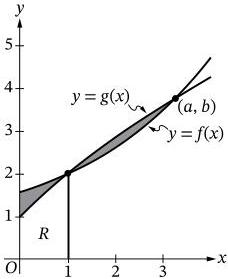
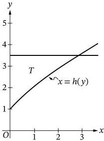
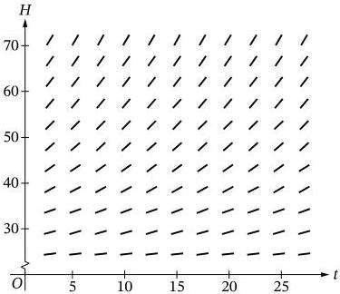
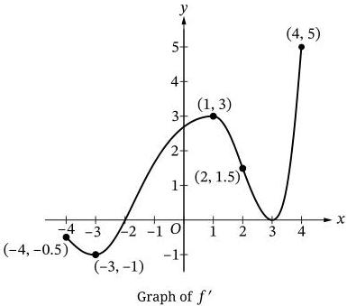
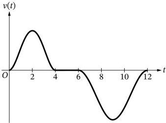

<!-- Page 1 -->

2026

# AP® Calculus AB
## Free-Response Questions

© 2026 College Board. College Board, Advanced Placement, AP, AP Central, and the acorn logo are registered trademarks of College Board. Visit College Board on the web: collegeboard.org.

AP Central is the official online home for the AP Program: apcentral.collegeboard.org.

<!-- Page 2 -->

AP CALCULUS AB 2026 • FREE-RESPONSE QUESTIONS

## CALCULUS AB
## SECTION II PART A
## TIME – 30 MINUTES

### Directions:

Section II, Part A has 2 free-response questions and lasts 30 minutes.

**A graphing calculator is required for the questions on this part of the exam.** You may use a handheld graphing calculator or the calculator available in this application. **Make sure your calculator is in radian mode.**

You may use the available paper for scratch work and planning, but only work written in the free-response booklet will be scored. Any work done on scratch paper will not be scored. In the free-response booklet, write your solution to each part of each question in the space provided for that part. For questions that have sub-parts, be sure to label those clearly in your solution. Use a pencil or a pen with black or dark blue ink.

You are permitted to use your calculator to solve an equation, find the derivative of a function at a point, or calculate the value of a definite integral. However, you must clearly indicate the setup of your question, namely the equation, function, or integral you are using. If you use other built-in features or programs, you must show the mathematical steps necessary to produce your results.

Show all of your work, even though a question may not explicitly remind you to do so. Clearly label any functions, graphs, tables, or other objects that you use. Justifications require that you give mathematical reasons and that you verify the needed conditions under which relevant theorems, properties, definitions, or tests are applied. Your work will be scored on the correctness and completeness of your methods as well as your answers. Answers without supporting work will usually not receive credit.

Your work must be expressed in standard mathematical notation rather than calculator syntax. For example, $\int_1^5 x^2 dx$ may not be written as $\text{fnInt}(X^2, X, 1, 5)$.

Unless otherwise specified, answers (numeric or algebraic) need not be simplified. If you use decimal approximations in calculations, your work will be scored on accuracy. Unless otherwise specified, your final answers should be accurate to three places after the decimal point.

Unless otherwise specified, the domain of a function $f$ is assumed to be the set of all real numbers $x$ for which $f(x)$ is a real number.

You can go back and forth between questions in this part until time expires. The clock will turn red when 5 minutes remain—**the proctor will not give you any time updates or warnings.**

Note: This exam was originally administered digitally. It is presented here in a format optimized for teacher and student use in the classroom.

© 2026 College Board.

Visit College Board on the web: collegeboard.org.

2

<!-- Page 3 -->

AP CALCULUS AB 2026 • FREE-RESPONSE QUESTIONS

1. Male birds of a certain species arrive at a nesting area over a thirty-day period. The rate at which the male birds arrive at the nesting area at time $t$ days is modeled by a differentiable function $M$, where $M(t)$ is measured in number of birds per day. Selected values of $M(t)$ are shown in the table.

|  $t$ (days) | 0 | 5 | 10 | 15 | 20 | 25 | 30  |
| --- | --- | --- | --- | --- | --- | --- | --- |
|  $M(t)$ (birds per day) | 2 | 7 | 16 | 6 | 5 | 2 | 0  |

(Note: Your calculator should be in radian mode.)

### Part A

Approximate $M'(7.5)$ using the average rate of change of $M$ over the interval $5 \leq t \leq 10$. Show the work that leads to your answer, and indicate units of measure.

### Part B

i. Use a midpoint Riemann sum with the three subintervals $[0, 10]$, $[10, 20]$, and $[20, 30]$ to approximate $\int_0^{30} M(t) dt$. Show the work that leads to your answer.
ii. Interpret the meaning of $\int_0^{30} M(t) dt$ in the context of the problem.

### Part C

The rate at which female birds of the same species arrive at the same nesting area, in birds per day, is modeled by the function $F$ defined as follows.

$$F(t) = \begin{cases} 0 & \text{for } 0 \leq t < 15 \\ 18 + 16 \sin\left(\frac{\pi}{20}(t+15)\right) & \text{for } 15 \leq t \leq 45 \end{cases}$$

How many female birds of this species arrive at the nesting area from $t = 15$ to $t = 45$? Show the setup for your calculations, and round your answer to the nearest integer.

### Part D

On the interval $15 < t < 30$, the difference in the rates at which male and female birds of this species arrive at the nesting area can be modeled by the differentiable function $D(t) = M(t) - F(t)$, where $F$ is the function defined in part C. Is there a time $t$ in the interval $15 < t < 20$ when $D(t) = 0$? Justify your answer.

© 2026 College Board.

Visit College Board on the web: collegeboard.org.

3

<!-- Page 4 -->

AP CALCULUS AB 2026 • FREE-RESPONSE QUESTIONS

2. The function $f$ is defined by $f(x) = 1.43^x + 0.57$, and the function $g$ is defined by $g(x) = \frac{14x + 12}{x + 12}$. The graphs of $f$ and $g$ intersect at the points $(1, 2)$ and $(a, b)$, as shown in Figure 1.

Figure 1

For $x \geq 0$, the equation $y = g(x)$ can be rewritten as $x = h(y) = \frac{12y - 12}{14 - y}$, where $h$ is a function of $y$. The graph of $x = h(y)$ and the horizontal line $y = 3.5$ are shown in Figure 2.

Figure 2

© 2026 College Board.
Visit College Board on the web: collegeboard.org.

4

<!-- Page 5 -->

AP CALCULUS AB 2026 • FREE-RESPONSE QUESTIONS

# **Part A**

Let $R$ be the region bounded by the graph of $g$, the $x$-axis, the $y$-axis, and the vertical line $x = 1$, as shown in Figure 1. Find the area of region $R$. Show the setup for your calculations.

# **Part B**

Region $R$, described in part A, is the base of a solid. For this solid, each cross section perpendicular to the $x$-axis is a rectangle whose height is $\frac{1}{3}$ times the length of its base in region $R$. Write, but do not evaluate, an integral expression that gives the volume of the solid.

# **Part C**

The shaded region in Figure 1 is bounded by the graphs of $f$ and $g$ on the interval from $x = 0$ to $x = a$. Find the area of the shaded region. Show the setup for your calculations.

# **Part D**

Let $T$ be the region bounded by the graph of $x = h(y)$, the $y$-axis, and the horizontal line $y = 3.5$, as shown in Figure 2. Write, but do not evaluate, an integral expression that gives the volume of the solid generated when region $T$ is revolved about the $y$-axis.

**END OF PART A**

© 2026 College Board.

Visit College Board on the web: collegeboard.org.

5

<!-- Page 6 -->

AP CALCULUS AB 2026 • FREE-RESPONSE QUESTIONS

# **CALCULUS AB  
SECTION II PART B  
TIME – 1 HOUR**

# **Directions:**

Section II, Part B has 4 free-response questions and lasts 1 hour.

# **A calculator is not allowed for this part of the exam.**

You may use the available paper for scratch work and planning, but only work written in the free-response booklet will be scored. Any work done on scratch paper will not be scored. In the free-response booklet, write your solution to each part of each question in the space provided for that part. For questions that have sub-parts, be sure to label those clearly in your solution. Use a pencil or a pen with black or dark blue ink.

Show all of your work, even though a question may not explicitly remind you to do so. Clearly label any functions, graphs, tables, or other objects that you use. Justifications require that you give mathematical reasons and that you verify the needed conditions under which relevant theorems, properties, definitions, or tests are applied. Your work will be scored on the correctness and completeness of your methods as well as your answers. Answers without supporting work will usually not receive credit.

Your work must be expressed in standard mathematical notation rather than calculator syntax. For example, $$\int_1^5 x^2 dx$$ may not be written as $$\text{fnInt}(X^2, X, 1, 5)$$.

Unless otherwise specified, answers (numeric or algebraic) need not be simplified. If you use decimal approximations in calculations, your work will be scored on accuracy. Unless otherwise specified, your final answers should be accurate to three places after the decimal point.

Unless otherwise specified, the domain of a function $$f$$ is assumed to be the set of all real numbers $$x$$ for which $$f(x)$$ is a real number.

You can go back and forth between questions in this part until time expires. The clock will turn red when 5 minutes remain—**the proctor will not give you any time updates or warnings.**

© 2026 College Board.

Visit College Board on the web: collegeboard.org.

6

<!-- Page 7 -->

AP CALCULUS AB 2026 • FREE-RESPONSE QUESTIONS

3. A pie is taken from a hot oven and put on a table. The internal temperature of the pie at time $t$ minutes can be modeled by the function $H$ that satisfies the differential equation $\frac{dH}{dt} = -\frac{1}{15}(H - 20)$, where $H(t)$ is measured in degrees Celsius and $H(0) = 75$. For $t > 0$, it is known that $20 < H(t) < 75$.

### Part A

Explain why the following could not be a slope field for the differential equation

$$\frac{dH}{dt} = -\frac{1}{15}(H - 20).$$

### Part B

Find the slope of the line tangent to the graph of $H$ at time $t = 0$. Show the work that leads to your answer.

### Part C

It can be shown that $\frac{d^2H}{dt^2} = \frac{1}{225}(H - 20)$. The line tangent to the graph of $H$ at time $t = 0$ is used to approximate $H(5)$, the internal temperature of the pie at time $t = 5$. Is this approximation an overestimate or an underestimate for the actual value of $H(5)$? Give a reason for your answer.

### Part D

Use separation of variables to find an expression for $H(t)$, the particular solution to the given differential equation with initial condition $H(0) = 75$.

© 2026 College Board.

Visit College Board on the web: collegeboard.org.

7

<!-- Page 8 -->

AP CALCULUS AB 2026 • FREE-RESPONSE QUESTIONS

4. Let $f$ be a twice-differentiable function on the closed interval $[-4, 4]$ with $f(2) = 3$. The graph of $f'$, the derivative of $f$, is shown.

**Part A**

For $x > 0$, the function $g$ is defined by $g(x) = f(x) - \ln x$. Find $g'(2)$. Show the work that leads to your answer.

**Part B**

Find all values of $x$ on the open interval $0 < x < 3$ at which the graph of $f$ has a point of inflection. Give a reason for your answer.

**Part C**

For $-4 \leq x \leq 4$, on what open intervals, if any, is the graph of $f$ both increasing and concave down? Give a reason for your answer.

**Part D**

For $-4 \leq x \leq 4$, find the value of $x$ at which $f$ has an absolute minimum and the value of $x$ at which $f$ has an absolute maximum. Give reasons for your answers.

© 2026 College Board.

Visit College Board on the web: collegeboard.org.

8

<!-- Page 9 -->

AP CALCULUS AB 2026 • FREE-RESPONSE QUESTIONS

5. A remote-controlled toy car moves back and forth along a straight path so that its velocity at time $t$ is given by the function $v$, where $v(t)$ is measured in feet per second and $t$ is measured in seconds.

$$v(t) = \begin{cases} t^4 - 8t^3 + 16t^2 & \text{for } 0 \le t \le 4 \\ 0 & \text{for } 4 < t < 6 \\ 10 \cos\left(\frac{\pi}{3}t\right) - 10 & \text{for } 6 \le t \le 12 \end{cases}$$

The graph of $v(t)$ is shown.

#### Part A

Find the acceleration of the car at time $t = 1$ second. Show the work that leads to your answer.

#### Part B

Is the car speeding up or slowing down at time $t = 1$ second? Give a reason for your answer.

#### Part C

Find the distance, in feet, that the car traveled over the time interval $0 \le t \le 4$ seconds. Show the work that leads to your answer.

#### Part D

Find the average velocity of the car over the time interval $6 \le t \le 12$ seconds. Show the work that leads to your answer.

© 2026 College Board.

Visit College Board on the web: collegeboard.org.

9

<!-- Page 10 -->

AP CALCULUS AB 2026 • FREE-RESPONSE QUESTIONS

6. The function $f$ is twice differentiable. The table gives values of $f$ and its derivative $f'$ at selected values of $x$.

|  $x$ | 0 | 2 | 3 | 6  |
| --- | --- | --- | --- | --- |
|  $f(x)$ | -1 | 3 | 8 | 5  |
|  $f'(x)$ | -5 | 4 | 9 | -2  |

**Part A**

Find $\lim_{x \rightarrow 2} \frac{f(x)}{x}$, or state that the limit does not exist.

**Part B**

Let $g(x) = f(f(x))$. Find $g'(2)$. Show the work that leads to your answer.

**Part C**

Let $h$ be a differentiable function such that $h(0) = 10$ and $h'(x) = f'(3x)$. Find $h(2)$. Show the work that leads to your answer.

**Part D**

Let $k$ be the function defined by $k(x) = \int_0^x t^2 f(t) dt$.

i. Find $k'(x)$.
ii. Find $k''(3)$. Show the work that leads to your answer.

**STOP**
**END OF EXAM**

© 2026 College Board.

Visit College Board on the web: collegeboard.org.

10
