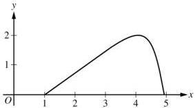
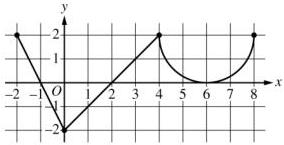
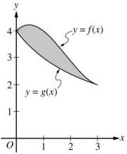

<!-- Page 1 -->

2023

# AP® Calculus BC
## Free-Response Questions

© 2023 College Board. College Board, Advanced Placement, AP, AP Central, and the acorn logo are registered trademarks of College Board. Visit College Board on the web: collegeboard.org.

AP Central is the official online home for the AP Program: apcentral.collegeboard.org.

<!-- Page 2 -->

AP® Calculus BC 2023 Free-Response Questions

# **CALCULUS BC**

# **SECTION II, Part A**

Time—30 minutes

2 Questions

**A GRAPHING CALCULATOR IS REQUIRED FOR THESE QUESTIONS.**

© 2023 College Board.  
Visit College Board on the web: collegeboard.org.

2

**GO ON TO THE NEXT PAGE.**

<!-- Page 3 -->

AP® Calculus BC 2023 Free-Response Questions

|  *t* (seconds) | 0 | 60 | 90 | 120 | 135 | 150  |
| --- | --- | --- | --- | --- | --- | --- |
|  *f(t)* (gallons per second) | 0 | 0.1 | 0.15 | 0.1 | 0.05 | 0  |

1. A customer at a gas station is pumping gasoline into a gas tank. The rate of flow of gasoline is modeled by a differentiable function $f$, where $f(t)$ is measured in gallons per second and $t$ is measured in seconds since pumping began. Selected values of $f(t)$ are given in the table.

(a) Using correct units, interpret the meaning of $\int_{60}^{135} f(t) \, dt$ in the context of the problem. Use a right Riemann sum with the three subintervals [60, 90], [90, 120], and [120, 135] to approximate the value of $\int_{60}^{135} f(t) \, dt$.

(b) Must there exist a value of $c$, for $60 < c < 120$, such that $f'(c) = 0$? Justify your answer.

(c) The rate of flow of gasoline, in gallons per second, can also be modeled by $g(t) = \left(\frac{t}{500}\right) \cos\left(\left(\frac{t}{120}\right)^2\right)$ for $0 \le t \le 150$. Using this model, find the average rate of flow of gasoline over the time interval $0 \le t \le 150$.

Show the setup for your calculations.

(d) Using the model $g$ defined in part (c), find the value of $g'(140)$. Interpret the meaning of your answer in the context of the problem.

Write your responses to this question only on the designated pages in the separate Free Response booklet. Write your solution to each part in the space provided for that part.

© 2023 College Board.

Visit College Board on the web: collegeboard.org.

3

GO ON TO THE NEXT PAGE.

<!-- Page 4 -->

AP® Calculus BC 2023 Free-Response Questions

2. For $0 \leq t \leq \pi$, a particle is moving along the curve shown so that its position at time $t$ is $(x(t), y(t))$, where $x(t)$ is not explicitly given and $y(t) = 2 \sin t$. It is known that $\frac{dx}{dt} = e^{\cos t}$. At time $t = 0$, the particle is at position $(1, 0)$.

(a) Find the acceleration vector of the particle at time $t = 1$. Show the setup for your calculations.
(b) For $0 \leq t \leq \pi$, find the first time $t$ at which the speed of the particle is 1.5. Show the work that leads to your answer.
(c) Find the slope of the line tangent to the path of the particle at time $t = 1$. Find the $x$-coordinate of the position of the particle at time $t = 1$. Show the work that leads to your answers.
(d) Find the total distance traveled by the particle over the time interval $0 \leq t \leq \pi$. Show the setup for your calculations.

Write your responses to this question only on the designated pages in the separate Free Response booklet. Write your solution to each part in the space provided for that part.

© 2023 College Board.

Visit College Board on the web: collegeboard.org.

4

GO ON TO THE NEXT PAGE.

<!-- Page 5 -->

AP® Calculus BC 2023 Free-Response Questions

END OF PART A

© 2023 College Board.
Visit College Board on the web: collegeboard.org.

5

<!-- Page 6 -->

AP® Calculus BC 2023 Free-Response Questions

# CALCULUS BC

# SECTION II, Part B

Time—1 hour

4 Questions

NO CALCULATOR IS ALLOWED FOR THESE QUESTIONS.

© 2023 College Board.
Visit College Board on the web: collegeboard.org.

6

<!-- Page 7 -->

AP® Calculus BC 2023 Free-Response Questions

3. A bottle of milk is taken out of a refrigerator and placed in a pan of hot water to be warmed. The increasing function $M$ models the temperature of the milk at time $t$, where $M(t)$ is measured in degrees Celsius ($^\circ$C) and $t$ is the number of minutes since the bottle was placed in the pan. $M$ satisfies the differential equation $\frac{dM}{dt} = \frac{1}{4}(40 - M)$. At time $t = 0$, the temperature of the milk is $5^\circ$C. It can be shown that $M(t) < 40$ for all values of $t$.

(a) A slope field for the differential equation $\frac{dM}{dt} = \frac{1}{4}(40 - M)$ is shown. Sketch the solution curve through the point $(0, 5)$.

(b) Use the line tangent to the graph of \( M \) at \( t = 0 \) to approximate \( M(2) \), the temperature of the milk at time \( t = 2 \) minutes.
(c) Write an expression for \(\frac{d^2M}{dt^2}\) in terms of \(M\). Use \(\frac{d^2M}{dt^2}\) to determine whether the approximation from part (b) is an underestimate or an overestimate for the actual value of \(M(2)\). Give a reason for your answer.
(d) Use separation of variables to find an expression for \( M(t) \), the particular solution to the differential equation \( \frac{dM}{dt} = \frac{1}{4}(40 - M) \) with initial condition \( M(0) = 5 \).

Write your responses to this question only on the designated pages in the separate Free Response booklet. Write your solution to each part in the space provided for that part.

© 2023 College Board.

Visit College Board on the web: collegeboard.org.

7

GO ON TO THE NEXT PAGE.

<!-- Page 8 -->

AP® Calculus BC 2023 Free-Response Questions

Graph of $f'$

4. The function $f$ is defined on the closed interval $[-2, 8]$ and satisfies $f(2) = 1$. The graph of $f'$, the derivative of $f$, consists of two line segments and a semicircle, as shown in the figure.

(a) Does $f$ have a relative minimum, a relative maximum, or neither at $x = 6$? Give a reason for your answer.
(b) On what open intervals, if any, is the graph of $f$ concave down? Give a reason for your answer.
(c) Find the value of $\lim_{x \to 2} \frac{6f(x) - 3x}{x^2 - 5x + 6}$, or show that it does not exist. Justify your answer.
(d) Find the absolute minimum value of $f$ on the closed interval $[-2, 8]$. Justify your answer.

Write your responses to this question only on the designated pages in the separate Free Response booklet. Write your solution to each part in the space provided for that part.

© 2023 College Board.

Visit College Board on the web: collegeboard.org.

8

GO ON TO THE NEXT PAGE.

<!-- Page 9 -->

AP® Calculus BC 2023 Free-Response Questions

5. The graphs of the functions $f$ and $g$ are shown in the figure for $0 \leq x \leq 3$. It is known that $g(x) = \frac{12}{3 + x}$ for $x \geq 0$. The twice-differentiable function $f$, which is not explicitly given, satisfies $f(3) = 2$ and

$$\int_{0}^{3} f(x) \, dx = 10.$$

(a) Find the area of the shaded region enclosed by the graphs of $f$ and $g$.
(b) Evaluate the improper integral $\int_{0}^{\infty} (g(x))^2 \, dx$, or show that the integral diverges.
(c) Let $h$ be the function defined by $h(x) = x \cdot f'(x)$. Find the value of $\int_{0}^{3} h(x) \, dx$.

Write your responses to this question only on the designated pages in the separate Free Response booklet. Write your solution to each part in the space provided for that part.

© 2023 College Board.

Visit College Board on the web: collegeboard.org.

9

GO ON TO THE NEXT PAGE.

<!-- Page 10 -->

AP® Calculus BC 2023 Free-Response Questions

6. The function $f$ has derivatives of all orders for all real numbers. It is known that $f(0) = 2$, $f'(0) = 3$,

$$f''(x) = -f\left(x^2\right), \text{ and } f'''(x) = -2x \cdot f'\left(x^2\right).$$

(a) Find $f^{(4)}(x)$, the fourth derivative of $f$ with respect to $x$. Write the fourth-degree Taylor polynomial for $f$ about $x = 0$. Show the work that leads to your answer.

(b) The fourth-degree Taylor polynomial for $f$ about $x = 0$ is used to approximate $f(0.1)$. Given that $\left|f^{(5)}(x)\right| \le 15$ for $0 \le x \le 0.5$, use the Lagrange error bound to show that this approximation is within $\frac{1}{10^5}$ of the exact value of $f(0.1)$.

(c) Let $g$ be the function such that $g(0) = 4$ and $g'(x) = e^x f(x)$. Write the second-degree Taylor polynomial for $g$ about $x = 0$.

Write your responses to this question only on the designated pages in the separate Free Response booklet. Write your solution to each part in the space provided for that part.

© 2023 College Board.

Visit College Board on the web: collegeboard.org.

10

GO ON TO THE NEXT PAGE.

<!-- Page 11 -->

AP® Calculus BC 2023 Free-Response Questions

# **STOP**

# **END OF EXAM**

© 2023 College Board.
Visit College Board on the web: collegeboard.org.

11
