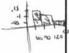

<!-- Page 1 -->

2023

AP®

# AP® Calculus BC
## Sample Student Responses and Scoring Commentary

### Inside:

Free-Response Question 1

- ☑ Scoring Guidelines
- ☑ Student Samples
- ☑ Scoring Commentary

© 2023 College Board. College Board, Advanced Placement, AP, AP Central, and the acorn logo are registered trademarks of College Board. Visit College Board on the web: collegeboard.org.

AP Central is the official online home for the AP Program: apcentral.collegeboard.org.

<!-- Page 2 -->

AP® Calculus AB/BC 2023 Scoring Guidelines

## Part A (AB or BC): Graphing calculator required

### Question 1

9 points

#### General Scoring Notes

The model solution is presented using standard mathematical notation.

Answers (numeric or algebraic) need not be simplified. Answers given as a decimal approximation should be correct to three places after the decimal point. Within each individual free-response question, at most one point is not earned for inappropriate rounding.

|  \( t \)(seconds) | 0 | 60 | 90 | 120 | 135 | 150  |
| --- | --- | --- | --- | --- | --- | --- |
|  \( f(t) \)(gallons per second) | 0 | 0.1 | 0.15 | 0.1 | 0.05 | 0  |

A customer at a gas station is pumping gasoline into a gas tank. The rate of flow of gasoline is modeled by a differentiable function f, where  \( f(t) \)  is measured in gallons per second and t is measured in seconds since pumping began. Selected values of  \( f(t) \)  are given in the table.

|  Model Solution | Scoring  |   |
| --- | --- | --- |
|  (a) Using correct units, interpret the meaning of \( \int_{60}^{135} f(t) dt \) in the context of the problem. Use a right Riemann sum with the three subintervals [60, 90], [90, 120], and [120, 135] to approximate the value of \( \int_{60}^{135} f(t) dt \).  |   |   |
|  \( \int_{60}^{135} f(t) dt \) represents the total number of gallons of gasoline pumped into the gas tank from time \( t = 60 \) seconds to time \( t = 135 \) seconds. | Interpretation with units | 1 point  |
|  \( \int_{60}^{135} f(t) dt \)\( \approx f(90)(90 - 60) + f(120)(120 - 90) + f(135)(135 - 120) \)\( = (0.15)(30) + (0.1)(30) + (0.05)(15) = 8.25 \) | Form of Riemann sum | 1 point  |
|   |  Answer | 1 point  |

##### Scoring notes:

- To earn the first point the response must reference gallons of gasoline added/pumped and the time interval \( t = 60 \) to \( t = 135 \).
- To earn the second point at least five of the six factors in the Riemann sum must be correct.
- If there is any error in the Riemann sum, the response does not earn the third point.
- A response of \((0.15)(30) + (0.1)(30) + (0.05)(15)\) earns both the second and third points, unless there is a subsequent error in simplification, in which case the response would earn only the second point.

© 2023 College Board

<!-- Page 3 -->

AP® Calculus AB/BC 2023 Scoring Guidelines

- A response that presents a correct value with accompanying work that shows the three products in the Riemann sum but does not show all six of the factors and/or the sum process, does not earn the second point but does earn the third point. For example, responses of either 4.5 + 3.0 + 0.75 or (0.15)(30), 0.1(30), 0.05(15) → 8.25 earn the third point but not the second.
- A response of f(90)(90 - 60) + f(120)(120 - 90) + f(135)(135 - 120) = 8.25 earns both the second and the third points.
- A response that presents an answer of only 8.25 does not earn either the second or third point.
- A response that provides a completely correct left Riemann sum with accompanying work, f(60)(30) + f(90)(30) + f(120)(15) = 9, or (0.1)(30) + (0.15)(30) + (0.1)(15) earns 1 of the last 2 points. A response with any errors or missing factors in a left Riemann sum earns neither of the last 2 points.

Total for part (a) 3 points

(b) Must there exist a value of c, for 60 < c < 120, such that f'(c) = 0? Justify your answer.

f is differentiable. ⇒ f is continuous on [60, 120].

$$\frac{f(120) - f(60)}{120 - 60} = \frac{0.1 - 0.1}{60} = 0$$

By the Mean Value Theorem, there must exist a c, for 60 < c < 120, such that f'(c) = 0.

f(120) - f(60) = 0 1 point

Answer with justification 1 point

# Scoring notes:

- To earn the first point a response must present either f(120) - f(60) = 0, 0.1 - 0.1 = 0 (perhaps as the numerator of a quotient), or f(60) = f(120).
- To earn the second point a response must:
  - have earned the first point,
  - state that f is continuous because f is differentiable (or equivalent), and
  - answer “yes” in some way.
- A response may reference either the Mean Value Theorem or Rolle’s Theorem.
- A response that references the Intermediate Value Theorem cannot earn the second point.

Total for part (b) 2 points

(c) The rate of flow of gasoline, in gallons per second, can also be modeled by

$$g(t) = \left(\frac{t}{500}\right) \cos\left(\left(\frac{t}{120}\right)^2\right)$$ for 0 ≤ t ≤ 150. Using this model, find the average rate of flow of gasoline over the time interval 0 ≤ t ≤ 150. Show the setup for your calculations.

$$\frac{1}{150 - 0} \int_{0}^{150} g(t) \, dt$$

$$= 0.0959967$$

Average value formula 1 point

Answer 1 point

© 2023 College Board

<!-- Page 4 -->

AP® Calculus AB/BC 2023 Scoring Guidelines

The average rate of flow of gasoline, in gallons per second, is 0.096 (or 0.095).

# Scoring notes:

The exact value of \(\frac{1}{150}\int_0^{150}g(t)dt\) is \(\frac{12}{125}\sin \left(\frac{25}{16}\right)\)
- A response may present the average value formula in single or multiple steps. For example, the following response earns both points: \(\int_0^{150} g(t) dt = 14.399504\) so the average rate is 0.0959967.
- A response that presents the average value formula in multiple steps but provides incorrect or incomplete communication (e.g., \(\int_0^{150} g(t) dt = \frac{14.399504}{150} = 0.0959967\)) earns 1 out of 2 points.
- A response of \(\int_0^{150} g(t) dt = 0.0959967\) does not earn either point.
- Degree mode: A response that presents answers obtained by using a calculator in degree mode does not earn the first point it would have otherwise earned. The response is generally eligible for all subsequent points (unless no answer is possible in degree mode or the question is made simpler by using degree mode). In degree mode, \(\frac{1}{150}\int_0^{150}g(t)dt = 0.149981\) or 0.002618.

Total for part (c) 2 points

(d) Using the model g defined in part (c), find the value of g'(140). Interpret the meaning of your answer in the context of the problem.

|  g'(140) ≈ -0.004908 | g'(140) | 1 point  |
| --- | --- | --- |
|  g'(140) = -0.005 (or -0.004) |  |   |
|  The rate at which gasoline is flowing into the tank is decreasing at a rate of 0.005 (or 0.004) gallon per second per second at time t = 140 seconds. | Interpretation | 1 point  |

# Scoring notes:

The exact value of \( g^{\prime}(140) \) is \( \frac{1}{500}\cos \left(\frac{49}{36}\right) - \frac{49}{9000}\sin \left(\frac{49}{36}\right) \).
The value of \( g^{\prime}(140) \) may appear only in the interpretation.
To be eligible for the second point a response must present some numerical value for \( g^{\prime}(140) \).
- To earn the second point the interpretation must include "the rate of flow of gasoline is changing at a rate of [the declared value of \( g'(140) \)]" and "at \( t = 140 \)" (or equivalent).
- An interpretation of "decreasing at a rate of \(-0.005\) or "increasing at a rate of \(0.005\) does not earn the second point.
- Degree mode: In degree mode, \( g'(140) = 0.001997 \) or 0.00187.

Total for part (d) 2 points

Total for question 1 9 points

© 2023 College Board

<!-- Page 5 -->

1 of 2

Sample 1A

1 1 1 1 1 1 1 1 1 1 1 1 1 1 1 1 1 1

Answer QUESTION 1 parts (a) and (b) on this page.

|  t (seconds) | 0 | 60 | 90 | 120 | 135 | 150  |
| --- | --- | --- | --- | --- | --- | --- |
|  f(t) (gallons per second) | 0 | 0.1 | 0.15 | 0.1 | 0.05 | 0  |

Response for question 1(a)

$$(90-60)(.15) + (120-90)(.1) + (135-120)(.05) = 8.25 \text{ gallons}$$

$$\int_{60}^{135} f(t) dt$$ represents the amount of gas pumped, in gallons, from t=60 to t=135 seconds.

Response for question 1(b)

$$f(t)$$ is always differentiable, and therefore it must be continuous on $$[a, b]$$ $$a=60$$ & $$b=120$$.

According to Rolle's Theorem, if $$f(a) = f(b)$$ which is true because $$f(60) = .1 = f(120)$$, there must be some x value, "c", at which $$f'(x) = 0$$. Therefore, there must be a value of c such that $$f'(c) = 0$$

Page 4

Use a pencil or a pen with black or dark blue ink. Do NOT write your name. Do NOT write outside the box.

Q5217/4

<!-- Page 6 -->

2 of 2

Sample 1A

Answer QUESTION 1 parts (c) and (d) on this page.

Response for question 1(c)

$$avg = \frac{1}{150 - 0} \int_{0}^{150} g(t) \, dt = .096 \text{ gallons/second}$$

Response for question 1(d)

$$g'(140) = -0.005 \text{ gallons/second/second}$$

↑
math 8

$$g'(140) = -.005 \text{ means that at } t = 140$$
$$\text{seconds, the rate of flow of gasoline}$$
$$\text{is changing at a rate of } -.005.$$

Page 5

Use a pencil or a pen with black or dark blue ink. Do NOT write your name. Do NOT write outside the box.

0048547

Q5217/5

<!-- Page 7 -->

1 of 2

Sample 1B

1 1 1 1 1 1 1 1 1 1 1 1 1 1 1 1 1 1

Answer QUESTION 1 parts (a) and (b) on this page.

|  t (seconds) | 0 | 60 | 90 | 120 | 135 | 150  |
| --- | --- | --- | --- | --- | --- | --- |
|  f(t) (gallons per second) | 0 | 0.1 | 0.15 | 0.1 | 0.05 | 0  |

# Response for question 1(a)

$$\int_{60}^{135} f(t) dt$$ in the context of the problem means / establishes the time frame (from 60 to 135 seconds) in which a certain amount of gallons of gasoline are pumped into a gas tank.

$$(30 \cdot .15) + (80 \cdot .1) + (30 \cdot .05)$$
$$4.5 + 3 + 1.5 = 9 \text{ gallons}$$

# Response for question 1(b)

Yes, there must exist a value of c for 60<C<120 such that f'(c)=0 because in that time, the f(t) fluctuates from .1 galls, to .15 gall/sec, and back to .1 galls. Given this, at at least 1 instantaneous point in that timeframe, f'(c) must = 0 as the rate increases and then decreases.

Page 4

Use a pencil or a pen with black or dark blue ink. Do NOT write your name. Do NOT write outside the box.

Q5216/4

<!-- Page 8 -->

2 of 2

Sample 1B

Answer QUESTION 1 parts (c) and (d) on this page.

Response for question 1(c)

$$\frac{b}{b-a} \int_{a}^{b} f(t) dt$$

$$\frac{150}{150-0} \int_{0}^{150} \frac{t}{500} \cos\left(\left(\frac{t}{120}\right)^2\right) dt$$

$$\frac{1}{150} \int_{0}^{150} \frac{t}{500} \cos\left(\left(\frac{t}{120}\right)^2\right) dt$$
$$= 0.0060 \text{ gal/sec}$$

Response for question 1(d)

$$g'(140) = ?$$

$$g(t) = \left(\frac{t}{500}\right) \cos\left(\left(\frac{t}{120}\right)^2\right)$$

$$\frac{d}{dt} g(t) = \frac{d}{dt} \left(\frac{t}{500}\right) \cos\left(\left(\frac{t}{120}\right)^2\right)_{t=140}$$

$$= -0.00491 \text{ gal/s}^2$$

This figure represents the acceleration at which the gasoline's velocity into the gas tank is functioning - so as the gas is pumped, the velocity at which it is pumped decelerates by -0.00491 gal/s².

Page 5

Use a pencil or a pen with black or dark blue ink. Do NOT write your name. Do NOT write outside the box.

0023451

Q5215/5

<!-- Page 9 -->

1 of 2

Sample 1C

1 1 1 1 1 1 1 1 1 1 1 1 1 1 1 1 1 1 1

Answer QUESTION 1 parts (a) and (b) on this page.

|  t (seconds) | 0 | 60 | 90 | 120 | 135 | 150  |
| --- | --- | --- | --- | --- | --- | --- |
|  f(t) (gallons per second) | 0 | 0.1 | 0.15 | 0.1 | 0.05 | 0  |

Response for question 1(a)

$$\int_{60}^{135} f(t)dt \rightarrow 15(0.05) + 30(0.1) + 30(0.15) = 8.25 \text{ g/s}$$

Response for question 1(b)

Yes because e lies in the integral 60<<120 on the graph

Page 4

Use a pencil or a pen with black or dark blue ink. Do NOT write your name. Do NOT write outside the box.

Q5171/4

<!-- Page 10 -->

2 of 2

Sample 1C

Answer QUESTION 1 parts (c) and (d) on this page.

Response for question 1(c)

$$g(b) = \left[ \frac{b}{500} \right] \cos \left( \left( \frac{b}{120} \right)^2 \right)$$

$$0 \le b \le 150$$

$$\int_{0}^{150} \left( \frac{b}{500} \right) \cos \left( \left( \frac{b}{120} \right)^2 \right) dt = 14.399 \quad 9/5$$

Response for question 1(d)

$$\int_{0}^{150} \left( \frac{140}{500} \right) \cos \left( \left( \frac{140}{120} \right)^2 \right) dt = 8.742$$

Page 5

Use a pencil or a pen with black or dark blue ink. Do NOT write your name. Do NOT write outside the box.

0128128

Q8171/8

<!-- Page 11 -->

AP® Calculus AB/BC 2023 Scoring Commentary

# Question 1

Note: Student samples are quoted verbatim and may contain spelling and grammatical errors.

# Overview

In this problem students were given a table of times $t$ in seconds and values of a function $f(t)$, which models the rate of flow of gallons of gasoline pumped into a gas tank.

In part (a) students were asked to interpret the meaning of $\int_{60}^{135} f(t) \, dt$ using correct units. Then students were asked to use a right Riemann sum with three subintervals to approximate the value of this integral. A correct response will indicate that the integral represents the accumulated gallons of gasoline pumped into the tank during the time interval from $t = 60$ to time $t = 135$ seconds. The approximation is found using the following expression: $(90 - 60) \cdot f(90) + (120 - 90) \cdot f(120) + (135 - 120) \cdot f(135)$.

In part (b) students were asked to justify whether there must be a value of $c$, with $60 < c < 120$, such that $f'(c) = 0$. Students are expected to note that because the function $f$ is known to be differentiable on the interval $(0, 150)$, it must be continuous on the subinterval $[60, 120]$. Therefore, because the average rate of change of $f$ on the interval $[60, 120]$ is equal to 0, such a value of $c$ is guaranteed by the Mean Value Theorem.

In part (c) the function $g(t) = \left(\frac{t}{500}\right)\cos\left(\left(\frac{t}{120}\right)^2\right)$ was introduced as a second function that modeled the rate of flow of the gasoline. Students were asked to use the model $g$ to find the average rate of flow of the gasoline over the time interval $0 \le t \le 150$. A correct response will show the setup $\frac{1}{150 - 0} \cdot \int_{0}^{150} g(t) \, dt$ and then use a calculator to find the value 0.096 gallon per second.

In part (d) students were asked to find the value of $g'(140)$ and interpret the meaning of this value in the context of the problem. A correct response will use a calculator to find $g'(140) = -0.005$ and report that at time $t = 140$ seconds the rate at which gasoline is flowing into the tank is decreasing at a rate of 0.005 gallon per second per second.

# Sample: 1A

# Score: 9

The response earned 9 points: 3 points in part (a), 2 points in part (b), 2 points in part (c), and 2 points in part (d).

In part (a) the response earned the first point with the statement “the amount of gas pumped, in gallons, from $t = 60$ to $t = 135$ seconds.” The response earned the second point for the correct form of the Riemann sum. The response earned the third point for the correct answer.

In part (b) the response earned the first point for “$f(60) = .1 = f(120)$.” The response earned the second point because it earned the first point, states that “$f(t)$ is always differentiable, and therefore it must be continuous on $[a, b]$ $a = 60$ & $b = 120$,” and states the correct conclusion.

In part (c) the response earned the first point with the inclusion of the average value formula. The response earned the second point with the correct answer.

© 2023 College Board.

Visit College Board on the web: collegeboard.org.

<!-- Page 12 -->

AP® Calculus AB/BC 2023 Scoring Commentary

## Question 1 (continued)

In part (d) the response earned the first point for the correct value of $g'(140)$. The response earned the second point with the statement “at $t = 140$ seconds, the rate of flow of gasoline is changing at a rate of $-.005$.”

**Sample: 1B**

**Score: 5**

The response earned 5 points: 2 points in part (a), no points in part (b), 2 points in part (c), and 1 point in part (d).

In part (a) the response earned the first point with the statement “the time frame (from 60 to 135 seconds) in which a certain amount of gallons of gasoline are pumped into a gas tank.” The response earned the second point for the correct form of the Riemann sum with five of the six factors correct. The third point was not earned because the response contains an error in the Riemann sum.

In part (b) the response did not earn the first point because the expression $f(120) - f(60) = 0$ is not included. Because the first point was not earned, the response is not eligible for the second point. In addition, the response did not earn the second point because the response does not state that $f$ is continuous because $f$ is differentiable.

In part (c) the response earned the first point because the response includes the average value formula. The response earned the second point with the correct answer.

In part (d) the response earned the first point with the presence of the correct value of $g'(140)$. The response did not earn the second point because the response does not interpret the declared value of $g'(140)$ correctly (it needs to discuss a rate of a rate). The words acceleration and velocity should be used to refer to an object in motion.

**Sample: 1C**

**Score: 2**

The response earned 2 points: 2 points in part (a), no points in part (b), no points in part (c), and no points in part (d).

In part (a) the response did not earn the first point. The response earned the second point for the correct form of the Riemann sum. The response earned the third point for the correct answer.

In part (b) the response did not earn the first point because the response does not include $f(120) - f(60) = 0$. Because the first point was not earned, the response is not eligible for the second point. In addition, the response did not earn the second point because the response does not state that $f$ is continuous because $f$ is differentiable.

In part (c) the response did not earn the first point because the response does not include the average value formula. The response did not earn the second point because the response does not include the correct answer.

In part (d) the response did not earn the first point because the response does not include the value of $g'(140)$. The response did not earn the second point because the response does not include the correct interpretation.

© 2023 College Board.  
Visit College Board on the web: collegeboard.org.
