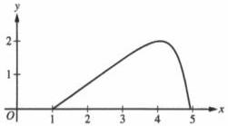
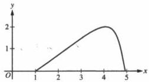
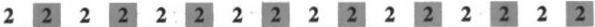
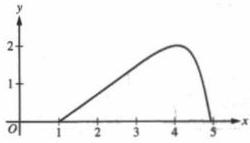
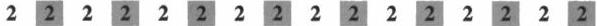

<!-- Page 1 -->

2023

AP®

# AP® Calculus BC
## Sample Student Responses and Scoring Commentary

### Inside:

Free-Response Question 2

- ☑ Scoring Guidelines
- ☑ Student Samples
- ☑ Scoring Commentary

© 2023 College Board. College Board, Advanced Placement, AP, AP Central, and the acorn logo are registered trademarks of College Board. Visit College Board on the web: collegeboard.org.

AP Central is the official online home for the AP Program: apcentral.collegeboard.org.

<!-- Page 2 -->

AP® Calculus AB/BC 2023 Scoring Guidelines

## Part A (BC): Graphing calculator required

### Question 2

9 points

#### General Scoring Notes

The model solution is presented using standard mathematical notation.

Answers (numeric or algebraic) need not be simplified. Answers given as a decimal approximation should be correct to three places after the decimal point. Within each individual free-response question, at most one point is not earned for inappropriate rounding.

For \(0 \leq t \leq \pi\), a particle is moving along the curve shown so that its position at time \(t\) is \((x(t), y(t))\), where \(x(t)\) is not explicitly given and \(y(t) = 2\sin t\). It is known that \(\frac{dx}{dt} = e^{\cos t}\). At time \(t = 0\), the particle is at position \((1, 0)\).

|  Model Solution | Scoring  |   |
| --- | --- | --- |
|  (a) Find the acceleration vector of the particle at time \( t = 1 \). Show the setup for your calculations.  |   |   |
|  \( x''(1) = \frac{d}{dt} \left( e^{\cos t} \right) \bigg|_{t=1} = -1.444407 \)\( y(t) = 2\sin t \Rightarrow y'(t) = 2\cos t \)\( y''(1) = \frac{d}{dt} (2\cos t) \bigg|_{t=1} = -1.682942 \)The acceleration vector at time \( t = 1 \) is\( a(1) = \langle -1.444, -1.683 \text{ (or } -1.682 \rangle \). | \( x''(1) \) with setup | 1 point  |
|   |  \( y''(1) \) with setup | 1 point  |

##### Scoring notes:

• The exact answer is  \( \langle x''(1), y''(1)\rangle = \left\langle -e^{\cos 1} \sin 1, -2 \sin 1 \right\rangle \) .
- \(\left\langle -e^{\cos t} \sin t, -2 \sin t \right\rangle\) together with an incorrect or missing evaluation at \(t = 1\) earns 1 of the 2 points.

© 2023 College Board

<!-- Page 3 -->

AP® Calculus AB/BC 2023 Scoring Guidelines

- A response of $\left\langle -e^{\cos t} \sin t, -2 \sin t \right\rangle = \left\langle -e^{\cos 1} \sin 1, -2 \sin 1 \right\rangle$ or equivalent earns only 1 of the 2 points because it equates an expression to a numerical value.
- An unsupported correct acceleration vector earns 1 of the 2 points.
- The acceleration vector may be presented with other symbols, for example ( , ) or [ , ].
- The components may be listed separately, as long as they are labeled.
- Degree mode: A response that presents answers obtained by using a calculator in degree mode does not earn the first point it would have otherwise earned. The response is generally eligible for all subsequent points (unless no answer is possible in degree mode or the question is made simpler by using degree mode). In degree mode, $x''(1) = -0.000828$ or $-0.047433$ and $y''(1) = -0.000609$ or $-0.034905$. A response that presents one of these values with correct setups earns 1 of the 2 points.

Total for part (a) 2 points

(b) For $0 \le t \le \pi$, find the first time $t$ at which the speed of the particle is 1.5. Show the work that leads to your answer.

$$\text{Speed} = \sqrt{\left(\frac{dx}{dt}\right)^2 + \left(\frac{dy}{dt}\right)^2} = \sqrt{\left(e^{\cos t}\right)^2 + (2 \cos t)^2}$$

$$0 \le t \le \pi \text{ and } \sqrt{\left(e^{\cos t}\right)^2 + (2 \cos t)^2} = 1.5$$

$$\Rightarrow t = 1.254472, t = 2.358077$$

The first time at which the speed of the particle is 1.5 is $t = 1.254$.

$$\sqrt{\left(e^{\cos t}\right)^2 + (2 \cos t)^2} = 1.5 \quad \text{1 point}$$

Answer 1 point

# Scoring notes:

- A response with an implied equation is eligible for both points. For example, a response of “Speed $= \sqrt{\left(e^{\cos t}\right)^2 + (2 \cos t)^2}$ and is first equal to 1.5 at $t = 1.254$” earns both points.

- $\sqrt{\left(\frac{dx}{dt}\right)^2 + \left(\frac{dy}{dt}\right)^2} = 1.5$ earns the first point. Speed $= 1.5$ by itself does not earn the first point. Both of these responses are eligible to earn the second point.

- A response need not consider the value $t = 2.358077$.

- A response of $t = 1.254$ alone does not earn either point.

- A response with a parenthesis error(s) in either $\left(e^{\cos t}\right)^2$ or $(2 \cos t)^2$ does not earn the first point but does earn the second point for the correct answer. Note: $\sqrt{\frac{dx^2}{dt} + \frac{dy^2}{dt}}$ is not considered a parenthesis error.

© 2023 College Board

<!-- Page 4 -->

AP® Calculus AB/BC 2023 Scoring Guidelines

- Degree mode: In degree mode, $$\sqrt{\left(e^{\cos t}\right)^2 + (2\cos t)^2} = 1.5$$ has no solution for $$0 \leq t \leq \pi$$.

A response that finds no time $$t$$ at which the speed of the particle is 1.5 cannot be assumed to be working in degree mode.

Total for part (b)

2 points

(c) Find the slope of the line tangent to the path of the particle at time $$t = 1$$. Find the $$x$$-coordinate of the position of the particle at time $$t = 1$$. Show the work that leads to your answers.

$$\frac{dy}{dx} = \frac{dy/dt}{dx/dt} = \frac{2\cos t}{e^{\cos t}}$$

$$\left. \frac{dy}{dx} \right|_{t=1} = \frac{2\cos 1}{e^{\cos 1}} = 0.629530$$

The slope of the line tangent to the curve at $$t = 1$$ is 0.630 (or 0.629).

$$x(1) = x(0) + \int_0^1 \frac{dx}{dt} dt = 1 + \int_0^1 e^{\cos t} dt = 3.341575$$

The $$x$$-coordinate of the position at $$t = 1$$ is 3.342 (or 3.341).

Slope with supporting work

1 point

$$\int_0^1 e^{\cos t} dt$$

1 point

$$x(1)$$

1 point

# Scoring notes:

- To earn the first point, the response must communicate $$\frac{dy}{dx} = \frac{dy/dt}{dx/dt}$$; for example:

$$\circ \quad \frac{dy}{dx} = \frac{2\cos 1}{e^{\cos 1}}$$

$$\circ \quad \frac{dy/dt}{dx/dt} = 0.63$$

$$\circ \quad x'(1) = 1.716526, \ y'(1) = 1.080605, \text{slope} = 0.63$$

$$\circ \quad \frac{dy}{dt} = 2\cos t, \text{slope} = 0.63$$

- A response may import an incorrect expression for $$y'(t)$$ or value of $$y'(1)$$ from part (a), provided it was declared in part (a).
- The second point is earned for a response that presents the definite integral $$\int_0^1 e^{\cos t} dt$$ or $$\int_0^1 \frac{dx}{dt} dt$$ with or without the initial condition.

© 2023 College Board

<!-- Page 5 -->

AP® Calculus AB/BC 2023 Scoring Guidelines

- For the second point, if the differential is missing:

○ $$\int_{0}^{1} e^{\cos t}$$ earns the second point and is eligible for the third point.

○ $$x(1) = \int_{0}^{1} e^{\cos t}$$ earns the second point but is not eligible for the third point.

○ $$x(1) = 1 + \int_{0}^{1} e^{\cos t}$$ earns the second point and is eligible for the third point.

○ $$x(1) = \int_{0}^{1} e^{\cos t} + 1$$ does not earn the second point but earns the third point for the correct answer.

- The third point is not earned for a response that presents an incorrect statement, such as

$$x(1) = \int_{0}^{1} e^{\cos t} dt = 1 + 2.342.$$

- Degree mode: In degree mode, $$\frac{dy}{dx} = 0.735759$$ or 0.012841 and $$1 + \int_{0}^{1} e^{\cos t} dt = 3.718144$$.

Total for part (c) 3 points

(d) Find the total distance traveled by the particle over the time interval $$0 \leq t \leq \pi$$. Show the setup for your calculations.

|  $$\int_{0}^{\pi} \sqrt{(e^{\cos t})^2 + (2\cos t)^2} \, dt$$ | Integral | 1 point  |
| --- | --- | --- |
|  = 6.034611 | Answer | 1 point  |
|  The total distance traveled by the particle over $$0 \leq t \leq \pi$$ is 6.035 (or 6.034). |  |   |

# Scoring notes:

- The first point is earned for presenting the correct integrand in a definite integral.
- Parentheses errors were assessed in part (b) and, therefore, will not affect the scoring in part (d).
- If the integrand is an incorrect speed function imported from part (b), the response earns the first point and does not earn the second point.
- An unsupported answer of 6.035 (or 6.034) does not earn either point.
- Degree mode: In degree mode, the total distance is 10.596835 or 8.536161.

Total for part (d) 2 points

Total for question 2 9 points

© 2023 College Board

<!-- Page 6 -->

1 of 2

Sample 2A

2 2 2 2 2 2 2 2 2 2 2 2 2 2 2 2 2

Answer QUESTION 2 parts (a) and (b) on this page.

Response for question 2(a)

$$v(t) = \langle e^{cost}, y'(t) \rangle$$

$$y'(t) = 2\sin t$$

$$y'(t) = 2\cos t$$

$$a(t) = a$$

$$v(t) = \langle e^{cost}, 2\cos t \rangle$$

$$a(1) = \langle \frac{d}{dx}[e^{cost}], \frac{d}{dx}t_1[2\cos t] \rangle$$

$$a(1) = \langle -1.444, -1.683 \rangle$$

Response for question 2(b)

$$|v(t)| = \sqrt{(x'(t))^2 + (y'(t))^2}$$

$$1.5 = \sqrt{(e^{cost})^2 + (2\cos t)^2}$$

$$t = 1.254$$

Page 6

Use a pencil or a pen with black or dark blue ink. Do NOT write your name. Do NOT write outside the box.

Q5178/6

<!-- Page 7 -->

2 of 2

Sample 2A

2 2 2 2 2 2 2 2 2 2 2 2 2 2 2 2

Answer QUESTION 2 parts (c) and (d) on this page.

Response for question 2(c)

$$\frac{du}{dx} = \frac{2cost}{e^{cost}} \quad \frac{du}{dx}|_{t=1} \neq \left[ \frac{2cost}{e^{cost}} \right] = \boxed{-0.451}$$

$$\int_0^1 e^{cost} dt = x(1) - x(0)$$

$$\begin{array}{r l} 2.342 & = x(1) - 1 \\ \hline x(1) & = 3.342 \end{array}$$

Response for question 2(d)

$$\begin{array}{l} distance = \int_0^\infty \sqrt{(x'(t))^2 + (y'(t))^2} dt \\ = \boxed{6.035} \end{array}$$

Page 7

Use a pencil or a pen with black or dark blue ink. Do NOT write your name. Do NOT write outside the box.

0003428

Q5178/7

<!-- Page 8 -->

1 of 2

Sample 2B

2 2 2 2 2 2 2 2 2 2 2 2 2 2 2 2 2

Answer QUESTION 2 parts (a) and (b) on this page.

Response for question 2(a)

$$\frac{dy}{dt} = 2 \cos t \cdot \frac{d^2y}{dt^2} = -2 \sin t$$

$$\frac{dx}{dt} = \frac{e^{\cos(t)} - e^{\cos(t)}}{e^{\cos(t)}} \cdot \frac{d^2x}{dt^2} = e^{\cos t} - \sin t$$

$$\frac{d^2y}{dx} = \langle e^{\cos(t)} \sin(t), -2 \sin(t) \rangle \quad \text{at } t=1: \langle e^{\cos(t)} \sin(1), -2 \sin(1) \rangle \\ \langle -1.444, -1.083 \rangle$$

Response for question 2(b)

$$\sqrt{(2 \cos t)^2 + (e^{\cos t})^2} = 1.5$$

$$t = 1.254$$

Page 6

Use a pencil or a pen with black or dark blue ink. Do NOT write your name. Do NOT write outside the box.

Q52176

<!-- Page 9 -->

2 of 2

Sample 2B

Answer QUESTION 2 parts (c) and (d) on this page.

Response for question 2(c)

$$\frac{dy}{dt} = 2cost$$

$$\frac{dx}{dt} = e^{cost}$$

$$\frac{dy}{dx} = \frac{2cost}{e^{cost}} \quad \left. \frac{dy}{dx} \right|_{t=0} = 0.7357$$

$$\left. \frac{dy}{dx} \right|_{t=1} = \frac{2cos(1)}{e^{cos(1)}} = 0.629$$

$$y - 0 = 0.7357(x - 1)$$

$$y = 0.7357x - 0.7357$$

$$y(1) = 0.7357x - 0.7357$$

$$1.6829 = 0.7357x - 0.7357 \Rightarrow x = 3.287$$

Response for question 2(d)

$$\frac{dy}{dx} = \frac{2cost}{e^{cost}}$$

$$\int_{0}^{\pi} \frac{2cost}{e^{cost}} dt = -3.551$$

Page 7

Use a pencil or a pen with black or dark blue ink. Do NOT write your name. Do NOT write outside the box.

0004531

Q5217/7

<!-- Page 10 -->

1 of 2

Sample 2C

Answer QUESTION 2 parts (a) and (b) on this page.

# Response for question 2(a)

$$(x(t), y(t)) = (?, 2\sin t)$$

$$(x'(t), y'(t)) = (e^{\cos t}, 2\cos t)$$

$$(x''(t), y''(t)) = (\cos t e^{\sin t}, 2 - \sin t)$$

$$t = 1 \quad j \quad (.2329, -1.6829)$$

# Response for question 2(b)

$$a_b = 1.5$$

$$2\sin t = 1.5$$

$$\sin t = .75$$

$$t = .85$$

Page 6

Use a pencil or a pen with black or dark blue ink. Do NOT write your name. Do NOT write outside the box.

Q5217/6

<!-- Page 11 -->

2 of 2

Sample 2C

Answer QUESTION 2 parts (c) and (d) on this page.

Response for question 2(c)

$$\left\{ \begin{array}{l} e^{\text{cost}} \quad 2\text{cost} \\ \frac{1.0806}{1.7165} = \frac{y}{x} = m \end{array} \right.$$

$$.62953$$

Response for question 2(d)

$$X'(t) = e^{\cos(t)}$$

$$X(t) = ?$$

Page 7

Use a pencil or a pen with black or dark blue ink. Do NOT write your name. Do NOT write outside the box.

0053400

Q8217/7

<!-- Page 12 -->

1 of 2

Sample 2A

2 2 2 2 2 2 2 2 2 2 2 2 2 2 2 2 2

Answer QUESTION 2 parts (a) and (b) on this page.

Response for question 2(a)

$$v(t) = \langle e^{cost}, y'(t) \rangle$$

$$y'(t) = 2\sin t$$

$$y'(t) = 2\cos t$$

$$a(t) = 0$$

$$v(t) = \langle e^{cost}, 2\cos t \rangle$$

$$a(1) = \langle \frac{d}{dx}[e^{cost}], \frac{d}{dx}t_1[2\cos t] \rangle$$

$$a(1) = \langle -1.444, -1.683 \rangle$$

Response for question 2(b)

$$|v(t)| = \sqrt{(x'(t))^2 + (y'(t))^2}$$

$$1.5 = \sqrt{(e^{cost})^2 + (2\cos t)^2}$$

$$t = 1.254$$

Page 6

Use a pencil or a pen with black or dark blue ink. Do NOT write your name. Do NOT write outside the box.

Q5178/6

<!-- Page 13 -->

2 of 2

Sample 2A

2 2 2 2 2 2 2 2 2 2 2 2 2 2 2 2

Answer QUESTION 2 parts (c) and (d) on this page.

Response for question 2(c)

$$\frac{du}{dx} = \frac{2cost}{e^{cost}} \quad \frac{du}{dx}|_{t=1} \neq \left[ \frac{2cost}{e^{cost}} \right] = \boxed{-0.451}$$

$$\int_0^1 e^{cost} dt = x(1) - x(0)$$

$$\begin{array}{r l} 2.342 & = x(1) - 1 \\ \hline x(1) & = 3.342 \end{array}$$

Response for question 2(d)

$$\begin{array}{l} distance = \int_0^\infty \sqrt{(x'(t))^2 + (y'(t))^2} dt \\ = \boxed{6.035} \end{array}$$

Page 7

Use a pencil or a pen with black or dark blue ink. Do NOT write your name. Do NOT write outside the box.

0003428

Q5178/7

<!-- Page 14 -->

1 of 2

Sample 2B

2 2 2 2 2 2 2 2 2 2 2 2 2 2 2 2 2

Answer QUESTION 2 parts (a) and (b) on this page.

Response for question 2(a)

$$\frac{dy}{dt} = 2 \cos t \cdot \frac{d^2y}{dt^2} = -2 \sin t$$

$$\frac{dx}{dt} = \frac{e^{\cos(t)} - e^{\cos(t)}}{e^{\cos(t)}} \cdot \frac{d^2x}{dt^2} = e^{\cos t} - \sin t$$

$$\frac{d^2y}{dx} = \langle e^{\cos(t)} \sin(t), -2 \sin(t) \rangle \quad \text{at } t=1: \langle e^{\cos(t)} \sin(1), -2 \sin(1) \rangle \\ \langle -1.444, -1.083 \rangle$$

Response for question 2(b)

$$\sqrt{(2 \cos t)^2 + (e^{\cos t})^2} = 1.5$$

$$t = 1.254$$

Page 6

Use a pencil or a pen with black or dark blue ink. Do NOT write your name. Do NOT write outside the box.

Q52176

<!-- Page 15 -->

2 of 2

Sample 2B

Answer QUESTION 2 parts (c) and (d) on this page.

Response for question 2(c)

$$\frac{dy}{dt} = 2cost$$
$$\frac{dx}{dt} = e^{cost}$$

$$\frac{dy}{dx} = \frac{2cost}{e^{cost}} \quad \left. \frac{dy}{dx} \right|_{t=0} = 0.7357$$

$$\left. \frac{dy}{dx} \right|_{t=1} = \frac{2cos(1)}{e^{cos(1)}} = 0.629$$

$$y-0 = 0.7357(x-1)$$

$$y = 0.7357x - 0.7357$$

$$y(1) = 0.7357x - 0.7357$$

$$1.6829 = 0.7357x - 0.7357 \Rightarrow x = 3.287$$

Response for question 2(d)

$$\frac{dy}{dx} = \frac{2cost}{e^{cost}}$$

$$\int_{0}^{\pi} \frac{2cost}{e^{cost}} dt = -3.551$$

Page 7

Use a pencil or a pen with black or dark blue ink. Do NOT write your name. Do NOT write outside the box.

0004531

Q5217/7

<!-- Page 16 -->

1 of 2

Sample 2C

Answer QUESTION 2 parts (a) and (b) on this page.

# Response for question 2(a)

$$(x(t), y(t)) = (?, 2\sin t)$$

$$(x'(t), y'(t)) = (e^{\cos t}, 2\cos t)$$

$$(x''(t), y''(t)) = (\cos t e^{\sin t}, 2 - \sin t)$$

$$t = 1 \quad j \quad (.2329, -1.6829)$$

# Response for question 2(b)

$$a_b = 1.5$$

$$2\sin t = 1.5$$

$$\sin t = .75$$

$$t = .85$$

Page 6

Use a pencil or a pen with black or dark blue ink. Do NOT write your name. Do NOT write outside the box.

Q5217/6

<!-- Page 17 -->

2 of 2

Sample 2C

Answer QUESTION 2 parts (c) and (d) on this page.

Response for question 2(c)

$$\left\{ \begin{array}{l} e^{\text{cost}} \quad 2\text{cost} \\ \frac{1.0806}{1.7165} = \frac{y}{x} = m \end{array} \right.$$

$$.62953$$

Response for question 2(d)

$$X'(t) = e^{\cos(t)}$$

$$X(t) = ?$$

Page 7

Use a pencil or a pen with black or dark blue ink. Do NOT write your name. Do NOT write outside the box.

0053400

Q8217/7

<!-- Page 18 -->

AP® Calculus BC 2023 Scoring Commentary

## Question 2

**Note:** Student samples are quoted verbatim and may contain spelling and grammatical errors.

### Overview

In this problem students were told that a particle is moving along a curve so that its position at time $t$ is $(x(t), y(t))$, with $y(t) = 2 \sin t$, $\frac{dx}{dt} = e^{\cos t}$, and $0 \leq t \leq \pi$. Students were also told that at time $t = 0$, the particle is at position $(1, 0)$.

In part (a) students were asked to find the acceleration vector of the particle at time $t = 1$. This requires using a calculator to find the values $\left. \frac{d^2x}{dt^2} \right|_{t=1} = -1.444$ and $\left. \frac{d^2y}{dt^2} \right|_{t=1} = -1.683$.

In part (b) students were asked to find the first time $t$ at which the speed of the particle is 1.5. A correct response will show the setup $\sqrt{(e^{\cos t})^2 + (2 \cos t)^2} = 1.5$ and then use a calculator to find the first time $t$ in $[0, \pi]$ that satisfies this equation ($t = 1.254$).

In part (c) students were asked to find the slope of the line tangent to the particle's path at time $t = 1$ and then to find the position of the particle at this time. A correct response will indicate that the slope of the line tangent to the particle's path is $\frac{dy}{dx} = \frac{dy/dt}{dx/dt}$, then will use a calculator to find $\left. \frac{dy}{dx} \right|_{t=1} = 0.630$. The response will continue by noting that the $x$-coordinate of the position of the particle at time $t = 1$ is $x(0) + \int_0^1 \frac{dx}{dt} dt$ and will use a calculator to find that this value is 3.342.

In part (d) students were asked to find the total distance traveled by the particle over the time interval $0 \leq t \leq \pi$. A correct response will show the calculator setup of the integral of the particle's speed over this time interval, then evaluate the integral to find a total distance of 6.035.

**Sample: 2A**

**Score: 8**

The response earned 8 points: 2 points in part (a), 2 points in part (b), 2 points in part (c), and 2 points in part (d).

In part (a) the response earned both points with the last two lines.

In part (b) the response earned the first point with the second line and earned the second point with the last line.

In part (c) the response did not earn the first point due to an incorrect evaluation of a correct derivative expression. The response earned the second point in the second line and earned the third point in the last line.

In part (d) the response earned the first point with the first line and earned the second point with the last line.

© 2023 College Board.

Visit College Board on the web: collegeboard.org.

<!-- Page 19 -->

AP® Calculus BC 2023 Scoring Commentary

## Question 2 (continued)

**Sample: 2B**

**Score: 5**

The response earned 5 points: 2 points in part (a), 2 points in part (b), 1 point in part (c), and no points in part (d).

In part (a) the setup for both second derivatives occurs in the first two lines. The response earned both points with the work in the third line. Note also that the last line gives the correct decimal approximations.

In part (b) the response earned the first point with the first line. The response earned the second point with the second line.

In part (c) the response earned the first point with the second line. The response did not earn the second point because no definite integral is presented. The response did not earn the third point due to an incorrect value in the last line. (Note that the response attempts to approximate the position of $x$ at time $t = 1$ using a tangent line instead of finding the exact position using an integral.)

In part (d) the response did not earn the first point due to an incorrect integrand. The response did not earn the second point due to an incorrect value.

**Sample: 2C**

**Score: 2**

The response earned 2 points: 1 point in part (a), no points in part (b), 1 point in part (c), and no points in part (d).

In part (a) the response did not earn the first point because it presents an incorrect value of $x''(1)$. The response earned the second point with a correct setup and value of $y''(1)$.

In part (b) the response did not earn the first point because it presents an incorrect equation. The response did not earn the second point because it presents an incorrect solution for $t$.

In part (c) the response earned the first point with the work presented. The response did not earn any further points because no additional work is presented.

In part (d) the response did not earn the first point because there is no integral presented. The response did not earn the second point because it does not present a value for the total distance traveled.

© 2023 College Board.

Visit College Board on the web: collegeboard.org.
