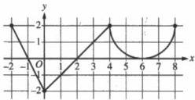
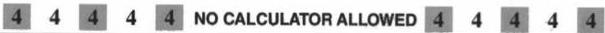
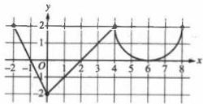
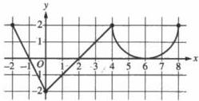

<!-- Page 1 -->

2023

AP®

# AP® Calculus BC
## Sample Student Responses and Scoring Commentary

### Inside:

Free-Response Question 4

- ☑ Scoring Guidelines
- ☑ Student Samples
- ☑ Scoring Commentary

© 2023 College Board. College Board, Advanced Placement, AP, AP Central, and the acorn logo are registered trademarks of College Board. Visit College Board on the web: collegeboard.org.

AP Central is the official online home for the AP Program: apcentral.collegeboard.org.

<!-- Page 2 -->

AP® Calculus AB/BC 2023 Scoring Guidelines

## Part B (AB or BC): Graphing calculator not allowed

### Question 4

9 points

#### General Scoring Notes

The model solution is presented using standard mathematical notation.

Answers (numeric or algebraic) need not be simplified. Answers given as a decimal approximation should be correct to three places after the decimal point. Within each individual free-response question, at most one point is not earned for inappropriate rounding.

The function \( f \) is defined on the closed interval \([-2, 8]\) and satisfies \( f(2) = 1 \). The graph of \( f' \), the derivative of \( f \), consists of two line segments and a semicircle, as shown in the figure.

|  Model Solution | Scoring  |
| --- | --- |
|  (a) Does \( f \) have a relative minimum, a relative maximum, or neither at \( x = 6 \)? Give a reason for your answer.  |   |
|  \( f'(x) > 0 \) on (2, 6) and \( f'(x) > 0 \) on (6, 8).\( f'(x) \) does not change sign at \( x = 6 \), so there is neither a relative maximum nor a relative minimum at this location. | Answer with reason 1 point  |

##### Scoring notes:

- A response that declares \( f'(x) \) does not change sign at \( x = 6 \), so neither, is sufficient to earn the point.
- A response does not have to present intervals on which \( f'(x) \) is positive or negative, but if any are given, they must be correct. Any presented intervals may include none, one, or both endpoints.
- A response that declares \( f'(x) > 0 \) before and after \( x = 6 \) does not earn the point.

Total for part (a)

1 point

© 2023 College Board

<!-- Page 3 -->

AP® Calculus AB/BC 2023 Scoring Guidelines

(b) On what open intervals, if any, is the graph of $f$ concave down? Give a reason for your answer.

The graph of $f$ is concave down on $(-2, 0)$ and $(4, 6)$ because $f'$ is decreasing on these intervals.

|  Intervals | **1 point**  |
| --- | --- |
|  Reason | **1 point**  |

**Scoring notes:**

- The first point is earned only by an answer of $(-2, 0)$ and $(4, 6)$, or these intervals including one or both endpoints.
- A response must earn the first point to be eligible for second point.
- To earn the second point a response must correctly discuss the behavior of $f'$ or the slopes of $f'$.
- Special case: A response that presents exactly one of the two correct intervals with a correct reason earns 1 out of 2 points.

**Total for part (b) 2 points**

(c) Find the value of $\lim_{x \to 2} \frac{6f(x) - 3x}{x^2 - 5x + 6}$, or show that it does not exist. Justify your answer.

Because $f$ is differentiable at $x = 2$, $f$ is continuous at $x = 2$, so $\lim_{x \to 2} f(x) = f(2) = 1$.

$$\lim_{x \to 2} (6f(x) - 3x) = 6 \cdot 1 - 3 \cdot 2 = 0$$

$$\lim_{x \to 2} (x^2 - 5x + 6) = 0$$

Limits of numerator and denominator **1 point**

Because $\lim_{x \to 2} \frac{6f(x) - 3x}{x^2 - 5x + 6}$ is of indeterminate form $\frac{0}{0}$,

L'Hospital's Rule can be applied.

Uses L'Hospital's Rule **1 point**

Answer **1 point**

Using L'Hospital's Rule,

$$\lim_{x \to 2} \frac{6f(x) - 3x}{x^2 - 5x + 6} = \lim_{x \to 2} \frac{6f'(x) - 3}{2x - 5} = \frac{6 \cdot 0 - 3}{2 \cdot 2 - 5} = 3.$$

**Scoring notes:**

- The first point is earned by the presentation of two separate limits for the numerator and denominator.
- A response that presents a limit explicitly equal to $\frac{0}{0}$ does not earn the first point.
- The second point is earned by applying L'Hospital's Rule, that is, by presenting at least one correct derivative in the limit of a ratio of derivatives.
- The third point is earned for the correct answer with supporting work.

**Total for part (c) 3 points**

© 2023 College Board

<!-- Page 4 -->

AP® Calculus AB/BC 2023 Scoring Guidelines

(d) Find the absolute minimum value of $f$ on the closed interval $[-2, 8]$. Justify your answer.

$$f'(x) = 0 \Rightarrow x = -1, \ x = 2, \ x = 6$$

The function $f$ is continuous on $[-2, 8]$, so the candidates for the location of an absolute minimum for $f$ are $x = -2$, $x = -1$, $x = 2$, $x = 6$, and $x = 8$.

|  $x$ | $f(x)$  |
| --- | --- |
|  $-2$ | $3$  |
|  $-1$ | $4$  |
|  $2$ | $1$  |
|  $6$ | $7 - \pi$  |
|  $8$ | $11 - 2\pi$  |

Considers $f'(x) = 0$ 1 point

Justification 1 point

Answer 1 point

The absolute minimum value of $f$ is $f(2) = 1$.

# Scoring notes:

- To earn the first point a response must state $f' = 0$ or equivalent. Listing the zeros of $f'$ is not sufficient.
- A response that presents any error in evaluating $f$ at any critical point or endpoint will not earn the justification point.
- A response need not present the value of $f(-1)$ provided $x = -1$ is eliminated because it is the location of a local maximum. A response need not present the value of $f(6)$ provided $x = 6$ is eliminated by reference to part (a) or eliminated through analysis.
- A response need not present the value of $f(8)$ provided there is a presentation that argues $f'(x) \ge 0$ for $x > 2$ and, therefore, $f(8) > f(2)$.
- A response that does not consider both endpoints does not earn the justification point.
- The answer point is earned only for indicating that the minimum value is 1. It is not earned for noting that the minimum occurs at $x = 2$.

Total for part (d) 3 points

Total for question 4 9 points

© 2023 College Board

<!-- Page 5 -->

1 of 2

Sample 4A

4

4

4

4

4

NO CALCULATOR ALLOWED

4

4

4

4

4

Answer QUESTION 4 parts (a) and (b) on this page.

Graph of \( f' \)

Response for question 4(a)

f has neither a relative max. or min. at x=b since there is no sign change on  \( f^{1} \)  at x=b.

Response for question 4(b)

S is concave down \( ^{0} \) (-2,0) and (4,6) because

\( S'(x) \) is decreasing on those intervals

Page 10

Use a pencil or a pen with black or dark blue ink. Do NOT write your name. Do NOT write outside the box.

0027329

Q5218/10

<!-- Page 6 -->

2 of 2

Sample 4A

4 4 4 4 4 NO CALCULATOR ALLOWED 4 4 4 4 4

Answer QUESTION 4 parts (c) and (d) on this page.

Response for question 4(c)

$$\lim_{x \to 2} \frac{6f(x) - 3x}{x^2 - 5x + 6}$$

$$\lim_{x \to 2} 6f(x) - 3x = 0$$
$$\lim_{x \to 2} x^2 - 5x + 6 = 0$$

Since f is differentiable and therefore contious at x=2

L'Hospital's Rule applies

$$\lim_{x \to 2} \frac{6f'(x) - 3}{2x - 5} = \frac{-3}{-1} = \boxed{3}$$

Response for question 4(d)

$$\text{Critical values}$$
$$f'(x) = 0 \text{ at.}$$
$$-1, 2, 6$$
$$\begin{array}{l|l} x & f(x) \\ -2 & 1 - \int_{-2}^{2} g(x) dx = 1 - (-2) = 3 \\ -1 & 1 - \int_{-1}^{2} g(x) dx = 1 - -3 = 4 \\ 2 & 1 \\ 6 & 1 + \int_{2}^{6} g(x) dx = 1 + 2 + (4 - x) = 7 - x \\ 8 & 1 + \int_{2}^{8} g(x) dx = 1 + 2 + (8 - 2x) = 11 - 2x \end{array}$$
$$\frac{1}{4} x^2$$

The absolute min value of f on [-2, 8] is at x=2

and is equal to 1.

Page 11

Use a pencil or a pen with black or dark blue ink. Do NOT write your name. Do NOT write outside the box.

Q5216/11

<!-- Page 7 -->

1 of 2

Sample 4B

Answer QUESTION 4 parts (a) and (b) on this page.

Graph of f'

Response for question 4(a)

At x=6, f does not have relative minimum nor relative maximum because f'' does not change sign, meaning f does not change from increasing to decreasing nor decreasing to increasing.

Response for question 4(b)

+le interval

f is concave down on (-2,0) U(4,6) because f' is decreasing, meaning f'' is negative.

Page 10

Use a pencil or a pen with black or dark blue ink. Do NOT write your name. Do NOT write outside the box.

0015407

Q8171/10

<!-- Page 8 -->

2 of 2

Sample 4B

4 4 4 4 4 NO CALCULATOR ALLOWED 4 4 4 4 4

Answer QUESTION 4 parts (c) and (d) on this page.

Response for question 4(c)

$$\lim_{x \to 2} \frac{6f(x) - 3x}{x^2 - 5x + 6} = \frac{6f(2) - 3 \times 2}{2^2 - 5 \times 2 + 6} = \frac{6 \times 1 - 6}{4 - 10 + 6} = \frac{0}{0}$$

$$\lim_{x \to 2} \frac{6f'(x) - 3}{2x - 5} = \frac{6f'(2) - 3}{2 \times 2 - 5} = \frac{6 \times 0 - 3}{4 - 5} = \frac{-3}{-1} = 3$$

Response for question 4(d)

The absolute minimum value is at x = 2 because f!

changes from negative to positive.

f(2) = 1 The absolute minimum value is 1.

Also, f(-2) = f(0) because the positive

area and negative area canceled out, and f kept
decreasing on (0, 2) according to the negative f' on
the interval, so a absolute.

Page 11

Use a pencil or a pen with black or dark blue ink. Do NOT write your name. Do NOT write outside the box.

Q5171/11

<!-- Page 9 -->

1 of 2

Sample 4C

4 4 4 4 4 NO CALCULATOR ALLOWED 4 4 4 4 4

Answer QUESTION 4 parts (a) and (b) on this page.

Graph of f'

f(2) = 1

Response for question 4(a)

Neither. Since f'(6)=0, f does have

an extrema of α=6, but since f''(6)=0, as

well, f(6) must be an inflection point.

Response for question 4(b)

For f(x) to be concave down, f''(x)

must be less than 0. Based on the given

graph of f', the graph of f is concave down on the

intervals -2<x<0 and 4<x<6 because on

these intervals, f''(x) < 0.

Page 10

Use a pencil or a pen with black or dark blue ink. Do NOT write your name. Do NOT write outside the box.

0049699

Q5178/10

<!-- Page 10 -->

2 of 2

Sample 4C

4

4

4

4

4

NO CALCULATOR ALLOWED

4

4

4

4

4

Answer QUESTION 4 parts (c) and (d) on this page.

Response for question 4(c)

$$f(x) = x - 2, 0 \le x \le 4$$

$$\lim_{x \to 2} \frac{6f(x) - 3x}{x^2 - 5x + 6} = \lim_{x \to 2} \frac{3(2f(x) - x)}{(x - 3)(x - 2)} \xrightarrow{\sim 2f'(2)}_{(x - 3)} = 0$$

Response for question 4(d)

$$\text{Min} \to f'(x) = 0, f''(x) > 0$$

$$f'(2) = 0$$

$$f''(2) = 1 \to 1 > 0$$

$$f(2) = 1$$

Endpoints

$$f(-2) = f(2) - \int_{-2}^{2} f'(x) dx$$

$$= 1 - (3 - 1)$$

$$f(-2) = (-1)$$

$$= 1 - 2$$

$$= -1$$

$$A = \frac{\pi r^2}{2}$$

$$A_{sc} = \frac{4\pi}{2} - 2\pi$$

$$f(8) = f(2) + \int_{2}^{8} f'(x) dx$$

$$= 1 + (2 + (8 - 2\pi)) = 11 - 2\pi$$

Page 11

Use a pencil or a pen with black or dark blue ink. Do NOT write your name. Do NOT write outside the box.

Q5178/11

<!-- Page 11 -->

AP® Calculus AB/BC 2023 Scoring Commentary

# Question 4

Note: Student samples are quoted verbatim and may contain spelling and grammatical errors.

# Overview

In this problem the graph of $f'$, which consists of a semicircle and two line segments on the interval $-2 \le x \le 8$, is provided. It is given that $f$ is defined on the closed interval $[-2, 8]$, and that $f(2) = 1$.

In part (a) students were asked to reason whether $f$ has a relative minimum, relative maximum, or neither at $x = 6$. A correct response will use the given graph to reason that $f'$ does not change signs at $x = 6$, although $f'(6) = 0$. Therefore $f$ has neither a relative maximum nor a relative minimum at this point.

In part (b) students were asked to find all open intervals where $f$ is concave down. A correct response will reason that a function is concave down when its first derivative is decreasing, and therefore $f$ is concave down on the intervals $(-2, 0)$ and $(4, 6)$.

In part (c) students were asked to find $\lim_{x \to 2} \frac{6f(x) - 3x}{x^2 - 5x + 6}$ or to show that this limit does not exist (and to justify their answer). A correct response will report that as $x$ approaches 2, both the numerator and denominator of this ratio approach 0, and so L'Hospital's Rule applies. Using L'Hospital's Rule, the limit is shown to be 3.

In part (d) students were asked to find the absolute minimum value of $f$ on the closed interval $[-2, 8]$ with a justification for their answer. A correct response will indicate the possible candidates for the location of the absolute minimum are the interval endpoints and the critical points $x = -1$, $x = 2$, and $x = 6$. A response could then reference work from part (a) to eliminate $x = 6$ as the location of a relative (or absolute) minimum, and could use the fact that the graph of $f'$ changes from positive to negative at $x = -1$ in order to argue that a relative maximum occurs at $x = -1$. In addition, the given graph of $f'$ indicates that $f'(x) \ge 0$ for $x > 2$, so the endpoint $x = 8$ cannot be the location of the absolute minimum value. The value of $f(2)$ is given in the stem of the problem, and using geometry, $f(-2) = 1 + \int_2^{-2} f'(x) \, dx = 3$. Therefore, the absolute minimum value of $f$ on this closed interval is $f(2) = 1$. (Alternatively, a response could evaluate the function $f$ at each of these five points and conclude that the absolute minimum is $f(2) = 1$.)

Sample: 4A

Score: 9

The response earned 9 points: 1 point in part (a), 2 points in part (b), 3 points in part (c), and 3 points in part (d).

In part (a) the response earned the point with a correct conclusion of no relative maximum or minimum and correct reasoning that there is no sign change for $f'(x)$ at $x = 6$.

In part (b) the response earned 2 points. The first point was earned with correct presentation of the intervals of concavity. The second point was earned with correct reasoning that $f'(x)$ is decreasing on these intervals.

In part (c) the response earned 3 points. The first point was earned with correct presentation of limits of the numerator and denominator. The second point was earned because the ratio of derivatives presented is correct. The third point was earned with a correct answer.

© 2023 College Board.

Visit College Board on the web: collegeboard.org.

<!-- Page 12 -->

AP® Calculus AB/BC 2023 Scoring Commentary

## Question 4 (continued)

In part (d) the response earned 3 points. The first point was earned with the consideration of $f'(x) = 0$. The response earned the second point with a correct analysis with a Candidates Test. The response earned the third point with a correct answer of 1.

**Sample: 4B**

**Score: 6**

The response earned 6 points: 1 point in part (a), 2 points in part (b), 2 points in part (c), and 1 point in part (d).

In part (a) the response earned the point with a correct conclusion of no relative maximum or minimum and correct reasoning that $f'(x)$ does not change signs at $x = 6$.

In part (b) the response earned 2 points. The first point was earned with correct presentation of the intervals of concavity. The second point was earned with correct reasoning that $f'(x)$ is decreasing.

In part (c) the response earned 2 points. The first point was not earned because the response does not present limits of the numerator and denominator. The second point was earned because the ratio of derivatives presented is correct. The third point was earned with a correct answer.

In part (d) the response earned 1 point. The first point was earned with the consideration of $f'(x)$ changing signs from negative to positive at $x = 2$. The response did not earn the second point because there is no analysis with the endpoints or the elimination of interior points as possible minimums. The response is not eligible for the third point.

**Sample: 4C**

**Score: 2**

The response earned 2 points: no points in part (a), 1 point in part (b), no points in part (c), and 1 point in part (d).

In part (a) the response did not earn the point because the reasoning that there must be an inflection point at $f(6)$ is insufficient to earn the point.

In part (b) the response earned 1 point. The first point was earned with correct presentation of the intervals of concavity. The second point was not earned because the reasoning is based solely on $f''(x) < 0$.

In part (c) the response earned no points. The first point was not earned because the response does not present limits of the numerator and denominator. The second point was not earned because the ratio of derivatives presented is incorrect. The response is not eligible for the third point.

In part (d) the response earned 1 point. The first point was earned with the consideration of $f'(x) = 0$ in the first line. The response did not earn the second point because there is no analysis with the critical values $x = -1$, $x = 2$, and $x = 6$. The response is ineligible for the third point.

© 2023 College Board.  
Visit College Board on the web: collegeboard.org.
