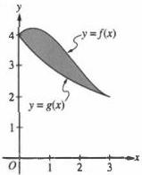
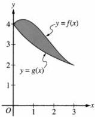
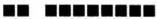

<!-- Page 1 -->

2023

AP®

# AP® Calculus BC
## Sample Student Responses and Scoring Commentary

### Inside:

Free-Response Question 5

- ☑ Scoring Guidelines
- ☑ Student Samples
- ☑ Scoring Commentary

© 2023 College Board. College Board, Advanced Placement, AP, AP Central, and the acorn logo are registered trademarks of College Board. Visit College Board on the web: collegeboard.org.

AP Central is the official online home for the AP Program: apcentral.collegeboard.org.

<!-- Page 2 -->

AP® Calculus AB/BC 2023 Scoring Guidelines

### Part B (BC): Graphing calculator not allowed

#### Question 5

9 points

#### General Scoring Notes

The model solution is presented using standard mathematical notation.

Answers (numeric or algebraic) need not be simplified. Answers given as a decimal approximation should be correct to three places after the decimal point. Within each individual free-response question, at most one point is not earned for inappropriate rounding.

The graphs of the functions $f$ and $g$ are shown in the figure for $0 \leq x \leq 3$. It is known that $g(x) = \frac{12}{3 + x}$ for $x \geq 0$. The twice-differentiable function $f$, which is not explicitly given, satisfies $f(3) = 2$ and $\int_{0}^{3} f(x) \, dx = 10$.

|  Model Solution | Scoring  |
| --- | --- |
|  (a) Find the area of the shaded region enclosed by the graphs of $f$ and $g$.  |   |
|  Area = $\int_{0}^{3} (f(x) - g(x)) \, dx = \int_{0}^{3} f(x) \, dx - \int_{0}^{3} g(x) \, dx$ | Integrand 1 point  |
|  $= 10 - \int_{0}^{3} \frac{12}{3 + x} \, dx = 10 - 12[\ln|3 + x|]_{0}^{3}$ | Antiderivative of $g(x)$ 1 point  |
|  $= 10 - 12(\ln 6 - \ln 3) = 10 - 12(\ln 2)$ | Answer 1 point  |

#### Scoring notes:

- The first point is earned for any of the integrands $f(x) - g(x)$, $g(x) - f(x)$, $|f(x) - g(x)|$, or $|g(x) - f(x)|$ in any definite integral. If the limits are incorrect, the response does not earn the third point.

© 2023 College Board

<!-- Page 3 -->

AP® Calculus AB/BC 2023 Scoring Guidelines

- The first point is earned with an implied integrand for $f$ and explicit integrand for $g$, such as $10 - \int_0^3 g(x) \, dx$.
- The second point is earned for finding $a \int \frac{dx}{3 + x} = a \cdot \ln |3 + x|$ or $a \cdot \ln (3 + x)$.
- A response is eligible for the third point only if it has earned the first 2 points. The third point is earned only for the correct answer. The answer does not need to be simplified; however, if simplification is attempted, it must be correct.
- A response is not eligible for the third point with incorrect limits of integration for $u$-substitution, for example, $\int_0^3 \frac{12}{3 + x} \, dx = \int_0^3 \frac{12}{u} \, du = 12[\ln(x + 3)]_0^3$.
- A response with incorrect communication, such as “Area = $\int_0^3 (g(x) - f(x)) \, dx = 10 - 12(\ln 2)$,” does not earn the third point. However, a response of “$\int_0^3 (g(x) - f(x)) \, dx = 12(\ln 2) - 10$, so the area is $10 - 12(\ln 2)$” earns all 3 points.

Total for part (a) 3 points

(b) Evaluate the improper integral $\int_0^\infty (g(x))^2 \, dx$, or show that the integral diverges.

|  $\int_0^\infty (g(x))^2 \, dx = \lim_{b \to \infty} \int_0^b \frac{144}{(3 + x)^2} \, dx$ | Limit notation | 1 point  |
| --- | --- | --- |
|  $= \lim_{b \to \infty} \left( -\frac{144}{(3 + x)} \Big|_0^b \right)$ | Antiderivative | 1 point  |
|  $= \lim_{b \to \infty} \left( -\frac{144}{3 + b} + \frac{144}{3} \right) = 48$ | Answer | 1 point  |

# Scoring notes:

- To earn the first point a response must correctly use limit notation throughout the problem and not include arithmetic with infinity, for example, $\left[ -\frac{144}{3 + x} \right]_0^\infty$ or $-\frac{144}{3 + \infty} + 48$.
- The second point can be earned by finding an antiderivative of the form $-\frac{a}{(3 + x)}$ for $a > 0$, from an indefinite or improper integral, with or without correct limit notation. If $a \neq 144$, the response does not earn the third point.
- The third point is earned only for an answer of 48 (or equivalent).
- A response is not eligible for the third point with incorrect limits of integration for $u$-substitution, for example, $\lim_{b \to \infty} \int_0^b \frac{144}{u^2} \, du = \lim_{b \to \infty} \left[ -\frac{144}{3 + x} \right]_0^b$.

Total for part (b) 3 points

© 2023 College Board

<!-- Page 4 -->

AP® Calculus AB/BC 2023 Scoring Guidelines

(c)

Let $h$ be the function defined by $h(x) = x \cdot f'(x)$. Find the value of $\int_0^3 h(x) \, dx$.

|  Using integration by parts, $u = x \quad dv = f'(x) \, dx$ $du = dx \quad v = f(x)$ | $u$ and $dv$ | **1 point**  |
| --- | --- | --- |
|  $\int h(x) \, dx = \int x \cdot f'(x) \, dx = x \cdot f(x) - \int f(x) \, dx$ | $\int h(x) \, dx$ $= x \cdot f(x) - \int f(x) \, dx$ | **1 point**  |
|  $\int_0^3 h(x) \, dx = \int_0^3 x \cdot f'(x) \, dx = x \cdot f(x) \big|_0^3 - \int_0^3 f(x) \, dx$ $= (3 \cdot f(3) - 0 \cdot f(0)) - 10 = 3 \cdot 2 - 0 - 10 = -4$ | Answer | **1 point**  |

# Scoring notes:

- The first and second points are earned with an implied $u$ and $dv$ in the presence of

$$x \cdot f(x) - \int f(x) \, dx \text{ or } x \cdot f(x) \big|_0^3 - 10.$$

- Limits of integration may be present, omitted, or partially present in the work for the first and second points.

- The tabular method may be used to show integration by parts. In this case, the first point is earned by having columns (labeled or unlabeled) that begin with $x$ and $f'(x)$. The second point is earned for

$$x \cdot f(x) - \int f(x) \, dx.$$

- The third point is earned only for the correct answer and can only be earned if the first 2 points were earned.

Total for part (c) 3 points

Total for question 5 9 points

© 2023 College Board

<!-- Page 5 -->

1 of 2

Sample 5A

5 5 5 5 5 NO CALCULATOR ALLOWED 5 5 5 5 5

Answer QUESTION 5 part (a) on this page.

Response for question 5(a)

$$\int_{0}^{3} f(x) - g(x) \, dx = \int_{0}^{3} f(x) \, dx - \int_{0}^{3} \frac{12}{3+x} \, dx$$
$$= 10 - (12 \ln |3 + x|) \Bigg|_{0}^{3}$$
$$= \boxed{10 - (12 \ln 6 - 12 \ln 3)}$$

Page 12

Use a pencil or a pen with black or dark blue ink. Do NOT write your name. Do NOT write outside the box.

0015000

Q8217/12

<!-- Page 6 -->

2 of 2

Sample 5A

5 5 5 5 5 NO CALCULATOR ALLOWED 5 5 5 5 5

Answer QUESTION 5 parts (b) and (c) on this page.

Response for question 5(b)

$$b) \int_{0}^{\infty} \left(\frac{12}{3+x}\right)^2 dx = 144 \cdot \int_{0}^{\infty} (3+x)^{-2} dx$$

$$144 \cdot \lim_{a \to \infty} \int_{0}^{a} (3+x)^{-2} dx = 144 \cdot \lim_{a \to \infty} \left(-(3+x)^{-1}\right) \Big|_{0}^{a}$$

$$= 144 \cdot \lim_{a \to \infty} \left(-\frac{1}{3+x}\right) \Big|_{0}^{a} = 144 \cdot \lim_{a \to \infty} \left(-\frac{1}{3+a} - \left(-\frac{1}{3+a}\right)\right)$$
$$= 144 \cdot \frac{1}{3} = \boxed{48}$$

Response for question 5(c)

$$\int_{0}^{3} h(x) dx = \int_{0}^{3} x f'(x) dx$$
$$u = x \quad dv = f'(x) dx$$
$$du = dx \quad v = f(x)$$
$$= x \cdot f(x) \Big|_{0}^{3} - \int_{0}^{3} f(x) dx$$
$$= 3 \cdot 2 - 10 = \boxed{-4}$$

Page 13

Use a pencil or a pen with black or dark blue ink. Do NOT write your name. Do NOT write outside the box.

Q5217/13

<!-- Page 7 -->

1 of 2

Sample 5B

5

5

5

5

5

NO CALCULATOR ALLOWED

5

5

5

5

5

Answer QUESTION 5 part (a) on this page.

Response for question 5(a)

$$area = \frac{\int_{0}^{3} f(x) dx}{10} - \frac{\int_{0}^{3} g(x) dx}{\sqrt{}}$$

$$\left[ 12 \ln 13 + x \right] \Bigg|_{0}^{3} = 12 \ln 6 - 12 \ln 3$$

$$10 - 12 \ln 6 + 12 \ln 3$$

$$area = 10 + 12 (\ln 3 - \ln 6)$$

Page 12

Use a pencil or a pen with black or dark blue ink. Do NOT write your name. Do NOT write outside the box.

0004086

Q5178/12

<!-- Page 8 -->

2 of 2

Sample 5B

5 5 5 5 NO CALCULATOR ALLOWED 5 5 5 5 5

Answer QUESTION 5 parts (b) and (c) on this page.

Response for question 5(b)

$$\lim_{b \to \infty} \int_0^b \left(\frac{12}{3+x}\right)^2 dx \to \lim_{b \to \infty} \int_0^b \frac{144}{(3+x)^2} dx \quad \begin{array}{l} v=3+x \\ dv=dx \end{array}$$

d

$$\lim_{b \to \infty} -\int_0^b 144 v^{-2} dv$$

$$0 + \frac{144}{3}$$
$$\lim_{b \to \infty} -[-144 v^{-1}] \Big|_0^b$$
$$\lim_{b \to \infty} -[-\frac{144}{3+x}] \Big|_0^b$$

Response for question 5(c)

$$\int_0^3 x \cdot f'(x) dx$$

$$\downarrow$$
$$x \cdot f(x) - \int_0^4 f'(x) dx$$

$$[x \cdot f(x) - f(x)] \Big|_0^3 = 2f(3) + f(0)$$

$$4 + 4 = \boxed{8}$$

Page 13

Use a pencil or a pen with black or dark blue ink. Do NOT write your name. Do NOT write outside the box.

Q5178/13

<!-- Page 9 -->

1 of 2

Sample 5C

5 5 5 5 5 NO CALCULATOR ALLOWED 5 5 5 5 5

Answer QUESTION 5 part (a) on this page.

Response for question 5(a)

$$\int_{0}^{3} p(x) - g(x) dx = Area$$

$$\int_{0}^{3} g(x) dx = \int_{0}^{3} \frac{12}{3+x} dx = 12 \ln |3+x| \Bigg|_{0}^{3} = 12 \ln |6| - 12 \ln |6|$$

$$\frac{12 \int_{0}^{3} \frac{12}{3+x} dx}{10 - 12 \ln |6| = Area} [12 \ln |3+3|] - [12 \ln |3+0|]$$

$$10 - 12 \ln |6| = Area \quad 12 \ln |6| - 12 \ln |3| = \ln |3|$$

$$10 - \ln |3| = Area$$

Page 12

Use a pencil or a pen with black or dark blue ink. Do NOT write your name. Do NOT write outside the box.

0077626

Q5178/12

<!-- Page 10 -->

2 of 2

Sample 5C

5 5 5 5 5 NO CALCULATOR ALLOWED 5 5 5 5 5

Answer QUESTION 5 parts (b) and (c) on this page.

Response for question 5(b)

$$\int_{0}^{\infty} (g(x))^2 dx$$
$$\lim_{b \to \infty} \int_{0}^{b} (g(x))^2 dx$$

$$\lim_{b \to \infty} \int_{0}^{b} (\frac{12}{3+x})^2 dx$$

$$\frac{12}{3+x} \cdot \frac{12}{3+x} = \frac{144}{9+x^2+6x}$$

$$\lim_{b \to \infty} \int_{0}^{b} \frac{144}{x^2+6x+9} dx$$

$$\lim_{b \to \infty} 144 \int_{0}^{b} \frac{1}{x^2+6x+9} dx$$

$$\lim_{b \to \infty} 144 \ln|x^2+6x+9|/0 = [144(b^2+6b+9)] - [\ln(0^2+6+9)] =$$

$$\ln|\infty^2+6(\omega)+9|$$

$$\ln|\infty^2+6(\omega)+9 = \ln|\infty|=\infty$$

$$\infty - (\ln|0^2+6(\omega)+9)(\omega)=\infty \therefore$$

divergent

Since the budget

$$\infty = \infty \text{ in budget } T_d$$

$$= \text{divergent}$$

Response for question 5(c)

$$h(x) = x \cdot f^1(x)$$

$$\int_{0}^{3} h(x) dx$$
$$\int_{0}^{3} x \cdot f^1(x) dx$$
$$\times \int_{0}^{3} f^1(x) dx$$

$$x \cdot f(x) \Big|_{0}^{3}$$

NH

$$[3(\phi(2))]_{1.2} - [0(\phi(0))]_{0} \cong 6$$

Page 13

Use a pencil or a pen with black or dark blue ink. Do NOT write your name. Do NOT write outside the box.

Q5178/13

<!-- Page 11 -->

AP® Calculus BC 2023 Scoring Commentary

# Question 5

Note: Student samples are quoted verbatim and may contain spelling and grammatical errors.

# Overview

In this problem students were given a figure showing a shaded region bounded by the graphs of functions $f$ and $g$ for $0 \leq x \leq 3$. Students were told that $g(x) = \frac{12}{3 + x}$ for $x \geq 0$ and that $f$ is differentiable with $f(3) = 2$ and $\int_0^3 f(x) \, dx = 10$.

In part (a) Students were asked to find the area of the shaded region. This requires setting up and evaluating $\int_0^3 (f(x) - g(x)) \, dx$. To evaluate, a student will need to separate into two integrals, $\int_0^3 f(x) \, dx - \int_0^3 g(x) \, dx$, and find an antiderivative for the function $g$. A correct response will provide an answer of $10 - 12(\ln|3 + x|)|_0^3 = 10 - 12(\ln 6 - \ln 3)$.

In part (b) students were asked to evaluate the improper integral $\int_0^\infty (g(x))^2 \, dx$ or to show that the integral diverges. A correct response will employ correct limit notation to rewrite the improper integral with a variable upper limit, find the correct antiderivative ($\int \frac{144}{(3 + x)^2} \, dx = -\frac{144}{(3 + x)}$), and continue the correct limit notation to find a value of 48.

In part (c) students were asked to find the value of $\int_0^3 h(x) \, dx$ given that $h(x) = x \cdot f'(x)$. A correct response will recognize the need to use integration by parts to find $\int_0^3 h(x) \, dx = x \cdot f(x)|_0^3 - \int_0^3 f(x) \, dx = 6 - 0 - 10 = -4$.

Sample: 5A

Score: 9

The response earned 9 points: 3 points in part (a), 3 points in part (b), and 3 points in part (c).

In part (a) the response earned the first point with the correct definite integral at the start of line 1. The response earned the second point with the correct antiderivative of $g(x)$ in line 2. The response earned the third point with the correct boxed answer in line 3. Numerical simplification is not required.

In part (b) the response earned the first point with the correct use of limit notation in the expression on the left in line 2 and the consistent and correct use of the limiting process to the end of the response. The response earned the second point with the correct antiderivative on the right in line 2. The response would have earned the third point with the correct answer of $144 \cdot \frac{1}{3}$ in line 4. In this case, the response correctly simplifies to the answer of 48 in line 4 and earned the third point.

© 2023 College Board.

Visit College Board on the web: collegeboard.org.

<!-- Page 12 -->

AP® Calculus BC 2023 Scoring Commentary

## Question 5 (continued)

In part (c) the response earned the first point with the correct identification of $u$ and $dv$ in line 1 to the right. The response earned the second point with the correct application of integration by parts in line 2. The response would have earned the third point with the answer of $3 \cdot 2 - 10$ in line 3. In this case, the response correctly simplifies to the answer of $-4$ in line 3 and earned the third point.

**Sample: 5B**

**Score: 5**

The response earned 5 points: 3 points in part (a), 2 points in part (b), and no points in part (c).

In part (a) the response earned the first point with the difference of definite integrals in line 1. The response earned the second point with the correct antiderivative of $g(x)$ in line 2. The response would have earned the third point with the expression in line 3. In this case, the response correctly simplifies and earned the third point with the boxed answer in line 4.

In part (b) the response earned the first point with the correct use of limit notation in the expression on the left in line 1 and the consistent, correct use of the limiting process to the end of the response. The response earned the second point with the correct antiderivative of the $u$-substitution integrand in line 3. The response is not eligible for the third point because the response uses incorrect bounds of integration on the $u$-substitution integral in line 2.

In part (c) the response did not earn the first point because no expressions for $u$ and $dv$ have been clearly identified. The response did not earn the second point because the potential application of integration by parts on line 2 is incorrect. The response did not earn the third point because the answer is not correct.

**Sample: 5C**

**Score: 2**

The response earned 2 points: 2 points in part (a), no points in part (b), and no points in part (c).

In part (a) the response earned the first point with the correct definite integral in line 1. The response earned the second point with the correct antiderivative of $g(x)$ at the end of line 2. The response evaluates the integral of $g(x)$ correctly; however, the simplification at the end of line 4 is not correct. The response did not earn the third point because the answer is not correct.

In part (b) the response did not earn the first point. The response correctly uses limit notation in line 2; however, the response omits the limit in line 7 on the right and, thus, has not correctly used the limiting process for the entire response. The response did not earn the second point because the antiderivative in line 7 is not correct. The response did not earn the third point because the answer is not correct.

In part (c) the response did not earn the first, second, and third points because the response does not use integration by parts and the answer is not correct.

© 2023 College Board.

Visit College Board on the web: collegeboard.org.
