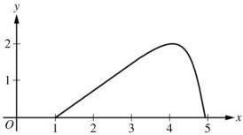
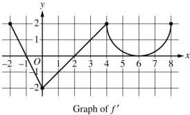
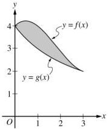

<!-- Page 1 -->

2023

# AP® Calculus BC
## Scoring Guidelines

© 2023 College Board. College Board, Advanced Placement, AP, AP Central, and the acorn logo are registered trademarks of College Board. Visit College Board on the web: collegeboard.org.

AP Central is the official online home for the AP Program: apcentral.collegeboard.org.

<!-- Page 2 -->

AP® Calculus AB/BC 2023 Scoring Guidelines

## Part A (AB or BC): Graphing calculator required

### Question 1

9 points

#### General Scoring Notes

The model solution is presented using standard mathematical notation.

Answers (numeric or algebraic) need not be simplified. Answers given as a decimal approximation should be correct to three places after the decimal point. Within each individual free-response question, at most one point is not earned for inappropriate rounding.

|  \( t \)(seconds) | 0 | 60 | 90 | 120 | 135 | 150  |
| --- | --- | --- | --- | --- | --- | --- |
|  \( f(t) \)(gallons per second) | 0 | 0.1 | 0.15 | 0.1 | 0.05 | 0  |

A customer at a gas station is pumping gasoline into a gas tank. The rate of flow of gasoline is modeled by a differentiable function f, where  \( f(t) \)  is measured in gallons per second and t is measured in seconds since pumping began. Selected values of  \( f(t) \)  are given in the table.

|  Model Solution | Scoring  |   |
| --- | --- | --- |
|  (a) Using correct units, interpret the meaning of \( \int_{60}^{135} f(t) dt \) in the context of the problem. Use a right Riemann sum with the three subintervals [60, 90], [90, 120], and [120, 135] to approximate the value of \( \int_{60}^{135} f(t) dt \).  |   |   |
|  \( \int_{60}^{135} f(t) dt \) represents the total number of gallons of gasoline pumped into the gas tank from time \( t = 60 \) seconds to time \( t = 135 \) seconds. | Interpretation with units | 1 point  |
|  \( \int_{60}^{135} f(t) dt \)\( \approx f(90)(90 - 60) + f(120)(120 - 90) + f(135)(135 - 120) \)\( = (0.15)(30) + (0.1)(30) + (0.05)(15) = 8.25 \) | Form of Riemann sum | 1 point  |
|   |  Answer | 1 point  |

##### Scoring notes:

- To earn the first point the response must reference gallons of gasoline added/pumped and the time interval \( t = 60 \) to \( t = 135 \).
- To earn the second point at least five of the six factors in the Riemann sum must be correct.
- If there is any error in the Riemann sum, the response does not earn the third point.
- A response of \((0.15)(30) + (0.1)(30) + (0.05)(15)\) earns both the second and third points, unless there is a subsequent error in simplification, in which case the response would earn only the second point.

© 2023 College Board

<!-- Page 3 -->

AP® Calculus AB/BC 2023 Scoring Guidelines

- A response that presents a correct value with accompanying work that shows the three products in the Riemann sum but does not show all six of the factors and/or the sum process, does not earn the second point but does earn the third point. For example, responses of either 4.5 + 3.0 + 0.75 or (0.15)(30), 0.1(30), 0.05(15) → 8.25 earn the third point but not the second.
- A response of f(90)(90 - 60) + f(120)(120 - 90) + f(135)(135 - 120) = 8.25 earns both the second and the third points.
- A response that presents an answer of only 8.25 does not earn either the second or third point.
- A response that provides a completely correct left Riemann sum with accompanying work, f(60)(30) + f(90)(30) + f(120)(15) = 9, or (0.1)(30) + (0.15)(30) + (0.1)(15) earns 1 of the last 2 points. A response with any errors or missing factors in a left Riemann sum earns neither of the last 2 points.

Total for part (a) 3 points

(b) Must there exist a value of c, for 60 < c < 120, such that f'(c) = 0? Justify your answer.

f is differentiable. ⇒ f is continuous on [60, 120].

$$\frac{f(120) - f(60)}{120 - 60} = \frac{0.1 - 0.1}{60} = 0$$

By the Mean Value Theorem, there must exist a c, for 60 < c < 120, such that f'(c) = 0.

f(120) - f(60) = 0 1 point

Answer with justification 1 point

# Scoring notes:

- To earn the first point a response must present either f(120) - f(60) = 0, 0.1 - 0.1 = 0 (perhaps as the numerator of a quotient), or f(60) = f(120).
- To earn the second point a response must:
  - have earned the first point,
  - state that f is continuous because f is differentiable (or equivalent), and
  - answer “yes” in some way.
- A response may reference either the Mean Value Theorem or Rolle’s Theorem.
- A response that references the Intermediate Value Theorem cannot earn the second point.

Total for part (b) 2 points

(c) The rate of flow of gasoline, in gallons per second, can also be modeled by

$$g(t) = \left(\frac{t}{500}\right) \cos\left(\left(\frac{t}{120}\right)^2\right)$$ for 0 ≤ t ≤ 150. Using this model, find the average rate of flow of gasoline over the time interval 0 ≤ t ≤ 150. Show the setup for your calculations.

$$\frac{1}{150 - 0} \int_{0}^{150} g(t) \, dt$$

$$= 0.0959967$$

Average value formula 1 point

Answer 1 point

© 2023 College Board

<!-- Page 4 -->

AP® Calculus AB/BC 2023 Scoring Guidelines

The average rate of flow of gasoline, in gallons per second, is 0.096 (or 0.095).

# Scoring notes:

The exact value of \(\frac{1}{150}\int_0^{150}g(t)dt\) is \(\frac{12}{125}\sin \left(\frac{25}{16}\right)\)
- A response may present the average value formula in single or multiple steps. For example, the following response earns both points: \(\int_0^{150} g(t) dt = 14.399504\) so the average rate is 0.0959967.
- A response that presents the average value formula in multiple steps but provides incorrect or incomplete communication (e.g., \(\int_0^{150} g(t) dt = \frac{14.399504}{150} = 0.0959967\)) earns 1 out of 2 points.
- A response of \(\int_0^{150} g(t) dt = 0.0959967\) does not earn either point.
- Degree mode: A response that presents answers obtained by using a calculator in degree mode does not earn the first point it would have otherwise earned. The response is generally eligible for all subsequent points (unless no answer is possible in degree mode or the question is made simpler by using degree mode). In degree mode, \(\frac{1}{150}\int_0^{150}g(t)dt = 0.149981\) or 0.002618.

Total for part (c) 2 points

(d) Using the model g defined in part (c), find the value of g'(140). Interpret the meaning of your answer in the context of the problem.

|  g'(140) ≈ -0.004908 | g'(140) | 1 point  |
| --- | --- | --- |
|  g'(140) = -0.005 (or -0.004) |  |   |
|  The rate at which gasoline is flowing into the tank is decreasing at a rate of 0.005 (or 0.004) gallon per second per second at time t = 140 seconds. | Interpretation | 1 point  |

# Scoring notes:

The exact value of \( g^{\prime}(140) \) is \( \frac{1}{500}\cos \left(\frac{49}{36}\right) - \frac{49}{9000}\sin \left(\frac{49}{36}\right) \).
The value of \( g^{\prime}(140) \) may appear only in the interpretation.
To be eligible for the second point a response must present some numerical value for \( g^{\prime}(140) \).
- To earn the second point the interpretation must include "the rate of flow of gasoline is changing at a rate of [the declared value of \( g'(140) \)]" and "at \( t = 140 \)" (or equivalent).
- An interpretation of "decreasing at a rate of \(-0.005\) or "increasing at a rate of \(0.005\) does not earn the second point.
- Degree mode: In degree mode, \( g'(140) = 0.001997 \) or 0.00187.

Total for part (d) 2 points

Total for question 1 9 points

© 2023 College Board

<!-- Page 5 -->

AP® Calculus AB/BC 2023 Scoring Guidelines

## Part A (BC): Graphing calculator required

### Question 2

9 points

#### General Scoring Notes

The model solution is presented using standard mathematical notation.

Answers (numeric or algebraic) need not be simplified. Answers given as a decimal approximation should be correct to three places after the decimal point. Within each individual free-response question, at most one point is not earned for inappropriate rounding.

For \(0 \leq t \leq \pi\), a particle is moving along the curve shown so that its position at time \(t\) is \((x(t), y(t))\), where \(x(t)\) is not explicitly given and \(y(t) = 2\sin t\). It is known that \(\frac{dx}{dt} = e^{\cos t}\). At time \(t = 0\), the particle is at position \((1, 0)\).

|  Model Solution | Scoring  |   |
| --- | --- | --- |
|  (a) Find the acceleration vector of the particle at time \( t = 1 \). Show the setup for your calculations.  |   |   |
|  \( x''(1) = \frac{d}{dt} \left( e^{\cos t} \right) \bigg|_{t=1} = -1.444407 \)\( y(t) = 2\sin t \Rightarrow y'(t) = 2\cos t \)\( y''(1) = \frac{d}{dt} (2\cos t) \bigg|_{t=1} = -1.682942 \)The acceleration vector at time \( t = 1 \) is\( a(1) = \langle -1.444, -1.683 \text{ (or } -1.682 \rangle \). | \( x''(1) \) with setup | 1 point  |
|   |  \( y''(1) \) with setup | 1 point  |

##### Scoring notes:

• The exact answer is  \( \langle x''(1), y''(1)\rangle = \left\langle -e^{\cos 1} \sin 1, -2 \sin 1 \right\rangle \) .
- \(\left\langle -e^{\cos t} \sin t, -2 \sin t \right\rangle\) together with an incorrect or missing evaluation at \(t = 1\) earns 1 of the 2 points.

© 2023 College Board

<!-- Page 6 -->

AP® Calculus AB/BC 2023 Scoring Guidelines

- A response of $\left\langle -e^{\cos t} \sin t, -2 \sin t \right\rangle = \left\langle -e^{\cos 1} \sin 1, -2 \sin 1 \right\rangle$ or equivalent earns only 1 of the 2 points because it equates an expression to a numerical value.
- An unsupported correct acceleration vector earns 1 of the 2 points.
- The acceleration vector may be presented with other symbols, for example ( , ) or [ , ].
- The components may be listed separately, as long as they are labeled.
- Degree mode: A response that presents answers obtained by using a calculator in degree mode does not earn the first point it would have otherwise earned. The response is generally eligible for all subsequent points (unless no answer is possible in degree mode or the question is made simpler by using degree mode). In degree mode, $x''(1) = -0.000828$ or $-0.047433$ and $y''(1) = -0.000609$ or $-0.034905$. A response that presents one of these values with correct setups earns 1 of the 2 points.

Total for part (a) 2 points

(b) For $0 \le t \le \pi$, find the first time $t$ at which the speed of the particle is 1.5. Show the work that leads to your answer.

$$\text{Speed} = \sqrt{\left(\frac{dx}{dt}\right)^2 + \left(\frac{dy}{dt}\right)^2} = \sqrt{\left(e^{\cos t}\right)^2 + (2 \cos t)^2}$$

$$0 \le t \le \pi \text{ and } \sqrt{\left(e^{\cos t}\right)^2 + (2 \cos t)^2} = 1.5$$

$$\Rightarrow t = 1.254472, t = 2.358077$$

The first time at which the speed of the particle is 1.5 is $t = 1.254$.

$$\sqrt{\left(e^{\cos t}\right)^2 + (2 \cos t)^2} = 1.5 \quad \text{1 point}$$

Answer 1 point

# Scoring notes:

- A response with an implied equation is eligible for both points. For example, a response of “Speed $= \sqrt{\left(e^{\cos t}\right)^2 + (2 \cos t)^2}$ and is first equal to 1.5 at $t = 1.254$” earns both points.

- $\sqrt{\left(\frac{dx}{dt}\right)^2 + \left(\frac{dy}{dt}\right)^2} = 1.5$ earns the first point. Speed $= 1.5$ by itself does not earn the first point. Both of these responses are eligible to earn the second point.

- A response need not consider the value $t = 2.358077$.

- A response of $t = 1.254$ alone does not earn either point.

- A response with a parenthesis error(s) in either $\left(e^{\cos t}\right)^2$ or $(2 \cos t)^2$ does not earn the first point but does earn the second point for the correct answer. Note: $\sqrt{\frac{dx^2}{dt} + \frac{dy^2}{dt}}$ is not considered a parenthesis error.

© 2023 College Board

<!-- Page 7 -->

AP® Calculus AB/BC 2023 Scoring Guidelines

- Degree mode: In degree mode, $$\sqrt{\left(e^{\cos t}\right)^2 + (2\cos t)^2} = 1.5$$ has no solution for $$0 \leq t \leq \pi$$.

A response that finds no time $$t$$ at which the speed of the particle is 1.5 cannot be assumed to be working in degree mode.

Total for part (b)

2 points

(c) Find the slope of the line tangent to the path of the particle at time $$t = 1$$. Find the $$x$$-coordinate of the position of the particle at time $$t = 1$$. Show the work that leads to your answers.

$$\frac{dy}{dx} = \frac{dy/dt}{dx/dt} = \frac{2\cos t}{e^{\cos t}}$$

$$\left. \frac{dy}{dx} \right|_{t=1} = \frac{2\cos 1}{e^{\cos 1}} = 0.629530$$

The slope of the line tangent to the curve at $$t = 1$$ is 0.630 (or 0.629).

$$x(1) = x(0) + \int_0^1 \frac{dx}{dt} dt = 1 + \int_0^1 e^{\cos t} dt = 3.341575$$

The $$x$$-coordinate of the position at $$t = 1$$ is 3.342 (or 3.341).

Slope with supporting work

1 point

$$\int_0^1 e^{\cos t} dt$$

1 point

$$x(1)$$

1 point

# Scoring notes:

- To earn the first point, the response must communicate $$\frac{dy}{dx} = \frac{dy/dt}{dx/dt}$$; for example:

$$\circ \quad \frac{dy}{dx} = \frac{2\cos 1}{e^{\cos 1}}$$

$$\circ \quad \frac{dy/dt}{dx/dt} = 0.63$$

$$\circ \quad x'(1) = 1.716526, \ y'(1) = 1.080605, \text{slope} = 0.63$$

$$\circ \quad \frac{dy}{dt} = 2\cos t, \text{slope} = 0.63$$

- A response may import an incorrect expression for $$y'(t)$$ or value of $$y'(1)$$ from part (a), provided it was declared in part (a).
- The second point is earned for a response that presents the definite integral $$\int_0^1 e^{\cos t} dt$$ or $$\int_0^1 \frac{dx}{dt} dt$$ with or without the initial condition.

© 2023 College Board

<!-- Page 8 -->

AP® Calculus AB/BC 2023 Scoring Guidelines

- For the second point, if the differential is missing:

○ $$\int_{0}^{1} e^{\cos t}$$ earns the second point and is eligible for the third point.

○ $$x(1) = \int_{0}^{1} e^{\cos t}$$ earns the second point but is not eligible for the third point.

○ $$x(1) = 1 + \int_{0}^{1} e^{\cos t}$$ earns the second point and is eligible for the third point.

○ $$x(1) = \int_{0}^{1} e^{\cos t} + 1$$ does not earn the second point but earns the third point for the correct answer.

- The third point is not earned for a response that presents an incorrect statement, such as

$$x(1) = \int_{0}^{1} e^{\cos t} dt = 1 + 2.342.$$

- Degree mode: In degree mode, $$\frac{dy}{dx} = 0.735759$$ or 0.012841 and $$1 + \int_{0}^{1} e^{\cos t} dt = 3.718144$$.

Total for part (c) 3 points

(d) Find the total distance traveled by the particle over the time interval $$0 \leq t \leq \pi$$. Show the setup for your calculations.

|  $$\int_{0}^{\pi} \sqrt{(e^{\cos t})^2 + (2\cos t)^2} \, dt$$ | Integral | 1 point  |
| --- | --- | --- |
|  = 6.034611 | Answer | 1 point  |
|  The total distance traveled by the particle over $$0 \leq t \leq \pi$$ is 6.035 (or 6.034). |  |   |

# Scoring notes:

- The first point is earned for presenting the correct integrand in a definite integral.
- Parentheses errors were assessed in part (b) and, therefore, will not affect the scoring in part (d).
- If the integrand is an incorrect speed function imported from part (b), the response earns the first point and does not earn the second point.
- An unsupported answer of 6.035 (or 6.034) does not earn either point.
- Degree mode: In degree mode, the total distance is 10.596835 or 8.536161.

Total for part (d) 2 points

Total for question 2 9 points

© 2023 College Board

<!-- Page 9 -->

AP® Calculus AB/BC 2023 Scoring Guidelines

## Part B (AB or BC): Graphing calculator not allowed

### Question 3

9 points

#### General Scoring Notes

The model solution is presented using standard mathematical notation.

Answers (numeric or algebraic) need not be simplified. Answers given as a decimal approximation should be correct to three places after the decimal point. Within each individual free-response question, at most one point is not earned for inappropriate rounding.

A bottle of milk is taken out of a refrigerator and placed in a pan of hot water to be warmed. The increasing function $M$ models the temperature of the milk at time $t$, where $M(t)$ is measured in degrees Celsius ($^{\circ}\mathrm{C}$) and $t$ is the number of minutes since the bottle was placed in the pan. $M$ satisfies the differential equation $\frac{dM}{dt} = \frac{1}{4}(40 - M)$. At time $t = 0$, the temperature of the milk is $5^{\circ}\mathrm{C}$. It can be shown that $M(t) < 40$ for all values of $t$.

Model Solution

Scoring

(a)

A slope field for the differential equation $\frac{dM}{dt} = \frac{1}{4}(40 - M)$ is shown. Sketch the solution curve through the point $(0, 5)$.

Solution curve

1 point

Scoring notes:

- The solution curve must pass through the point $(0, 5)$, extend reasonably close to the left and right edges of the rectangle, and have no obvious conflicts with the given slope lines.
- Only portions of the solution curve within the given slope field are considered.
- The solution curve must lie entirely below the horizontal line segments at $M = 40$.

Total for part (a)

1 point

© 2023 College Board

<!-- Page 10 -->

AP® Calculus AB/BC 2023 Scoring Guidelines

(b) Use the line tangent to the graph of M at t = 0 to approximate M(2), the temperature of the milk at time t = 2 minutes.

|  $$\left. \frac{dM}{dt} \right|_{t=0} = \frac{1}{4}(40 - 5) = \frac{35}{4}$$ | $$\left. \frac{dM}{dt} \right|_{t=0}$$ | 1 point  |
| --- | --- | --- | --- | --- |
|  The tangent line equation is $$y = 5 + \frac{35}{4}(t - 0)$$. $$M(2) \approx 5 + \frac{35}{4} \cdot 2 = 22.5$$ The temperature of the milk at time t = 2 minutes is approximately 22.5° Celsius. | Approximation | 1 point  |

# Scoring notes:

- The value of the slope may appear in a tangent line equation or approximation.
- A response of $$5 + \frac{35}{4} \cdot 2$$ is the minimal response to earn both points.
- A response of $$\frac{1}{4}(40 - 5)$$ earns the first point. If there are any subsequent errors in simplification, the response does not earn the second point.
- In order to earn the second point the response must present an approximation found by using a tangent line that:
  - passes through the point (0, 5) and
  - has slope $$\frac{35}{4}$$ or a nonzero slope that is declared to be the value of $$\frac{dM}{dt}$$.
- An unsupported approximation does not earn the second point.
- The approximation need not be simplified, but the response does not earn the second point if the approximation is simplified incorrectly.

Total for part (b) 2 points

(c) Write an expression for $$\frac{d^2M}{dt^2}$$ in terms of M. Use $$\frac{d^2M}{dt^2}$$ to determine whether the approximation from part (b) is an underestimate or an overestimate for the actual value of M(2). Give a reason for your answer.

|  $$\frac{d^2M}{dt^2} = -\frac{1}{4} \frac{dM}{dt} = -\frac{1}{4} \left( \frac{1}{4}(40 - M) \right) = -\frac{1}{16}(40 - M)$$ | $$\frac{d^2M}{dt^2}$$ | 1 point  |
| --- | --- | --- |
|  Because M(t) < 40, $$\frac{d^2M}{dt^2} < 0$$, so the graph of M is concave down. Therefore, the tangent line approximation of M(2) is an overestimate. | Overestimate with reason | 1 point  |

© 2023 College Board

<!-- Page 11 -->

AP® Calculus AB/BC 2023 Scoring Guidelines

# Scoring notes:

- The first point is earned for either $$\frac{d^2M}{dt^2} = -\frac{1}{4}\left(\frac{1}{4}(40 - M)\right)$$ or $$\frac{d^2M}{dt^2} = -\frac{1}{16}(40 - M)$$ (or equivalent). A response that presents any subsequent simplification error does not earn the second point.
- A response that presents an expression for $$\frac{d^2M}{dt^2}$$ in terms of $$\frac{dM}{dt}$$ but fails to continue to an expression in terms of $$M$$ (i.e., $$\frac{d^2M}{dt^2} = -\frac{1}{4}\frac{dM}{dt}$$) does not earn the first point but is eligible for the second point.
- If the response presents an expression for $$\frac{d^2M}{dt^2}$$ that is incorrect, the response is eligible for the second point only if the expression is a nonconstant linear function that is negative for $$5 < M < 40$$.
  - Special case: A response that presents $$\frac{d^2M}{dt^2} = \frac{1}{16}(40 - M)$$ does not earn the first point but is eligible to earn the second point for a consistent answer and reason.
- To earn the second point a response must include $$\frac{d^2M}{dt^2} < 0$$, or $$\frac{dM}{dt}$$ is decreasing, or the graph of $$M$$ is concave down, as well as the conclusion that the approximation is an overestimate.
- A response that presents an argument based on $$\frac{d^2M}{dt^2}$$ or concavity at a single point does not earn the second point.

Total for part (c)

2 points

(d) Use separation of variables to find an expression for $$M(t)$$, the particular solution to the differential equation $$\frac{dM}{dt} = \frac{1}{4}(40 - M)$$ with initial condition $$M(0) = 5$$.

|  $$\frac{dM}{40 - M} = \frac{1}{4} dt$$ $$\int \frac{dM}{40 - M} = \int \frac{1}{4} dt$$ | Separates variables | 1 point  |
| --- | --- | --- |
|  $$-\ln|40 - M| = \frac{1}{4}t + C$$ | Finds antiderivatives | 1 point  |
|  $$-\ln|40 - 5| = 0 + C \Rightarrow C = -\ln 35$$ $$M(t) < 40 \Rightarrow 40 - M > 0 \Rightarrow |40 - M| = 40 - M$$ $$-\ln(40 - M) = \frac{1}{4}t - \ln 35$$ $$\ln(40 - M) = -\frac{1}{4}t + \ln 35$$ | Constant of integration and uses initial condition | 1 point  |

© 2023 College Board

<!-- Page 12 -->

AP® Calculus AB/BC 2023 Scoring Guidelines

$$40 - M = 35e^{-t/4}$$

$$M = 40 - 35e^{-t/4}$$

Solves for M

1 point

# Scoring notes:

- A response with no separation of variables earns 0 out of 4 points.
- A response that presents an antiderivative of $-\ln(40 - M)$ without absolute value symbols is eligible for all 4 points.
- A response with no constant of integration can earn at most the first 2 points.
- A response is eligible for the third point only if it has earned the first 2 points.

○ Special Case: A response that presents $+\ln(40 - M) = \frac{t}{4} + C$ (or equivalent) does not earn the second point, is eligible for the third point, but not eligible for the fourth.

- An eligible response earns the third point by correctly including the constant of integration in an equation and substituting 0 for t and 5 for M.
- A response is eligible for the fourth point only if it has earned the first 3 points.
- A response earns the fourth point only for an answer of $M = 40 - 35e^{-t/4}$ or equivalent.

|   | **Total for part (d)** | **4 points**  |
| --- | --- | --- |
|   | **Total for question 3** | **9 points**  |

© 2023 College Board

<!-- Page 13 -->

AP® Calculus AB/BC 2023 Scoring Guidelines

## Part B (AB or BC): Graphing calculator not allowed

### Question 4

9 points

#### General Scoring Notes

The model solution is presented using standard mathematical notation.

Answers (numeric or algebraic) need not be simplified. Answers given as a decimal approximation should be correct to three places after the decimal point. Within each individual free-response question, at most one point is not earned for inappropriate rounding.

The function \( f \) is defined on the closed interval \([-2, 8]\) and satisfies \( f(2) = 1 \). The graph of \( f' \), the derivative of \( f \), consists of two line segments and a semicircle, as shown in the figure.

|  Model Solution | Scoring  |
| --- | --- |
|  (a) Does \( f \) have a relative minimum, a relative maximum, or neither at \( x = 6 \)? Give a reason for your answer.  |   |
|  \( f'(x) > 0 \) on (2, 6) and \( f'(x) > 0 \) on (6, 8).\( f'(x) \) does not change sign at \( x = 6 \), so there is neither a relative maximum nor a relative minimum at this location. | Answer with reason 1 point  |

##### Scoring notes:

- A response that declares \( f'(x) \) does not change sign at \( x = 6 \), so neither, is sufficient to earn the point.
- A response does not have to present intervals on which \( f'(x) \) is positive or negative, but if any are given, they must be correct. Any presented intervals may include none, one, or both endpoints.
- A response that declares \( f'(x) > 0 \) before and after \( x = 6 \) does not earn the point.

Total for part (a)

1 point

© 2023 College Board

<!-- Page 14 -->

AP® Calculus AB/BC 2023 Scoring Guidelines

(b) On what open intervals, if any, is the graph of $f$ concave down? Give a reason for your answer.

The graph of $f$ is concave down on $(-2, 0)$ and $(4, 6)$ because $f'$ is decreasing on these intervals.

|  Intervals | **1 point**  |
| --- | --- |
|  Reason | **1 point**  |

**Scoring notes:**

- The first point is earned only by an answer of $(-2, 0)$ and $(4, 6)$, or these intervals including one or both endpoints.
- A response must earn the first point to be eligible for second point.
- To earn the second point a response must correctly discuss the behavior of $f'$ or the slopes of $f'$.
- Special case: A response that presents exactly one of the two correct intervals with a correct reason earns 1 out of 2 points.

**Total for part (b) 2 points**

(c) Find the value of $\lim_{x \to 2} \frac{6f(x) - 3x}{x^2 - 5x + 6}$, or show that it does not exist. Justify your answer.

Because $f$ is differentiable at $x = 2$, $f$ is continuous at $x = 2$, so $\lim_{x \to 2} f(x) = f(2) = 1$.

$$\lim_{x \to 2} (6f(x) - 3x) = 6 \cdot 1 - 3 \cdot 2 = 0$$

$$\lim_{x \to 2} (x^2 - 5x + 6) = 0$$

Limits of numerator and denominator **1 point**

Because $\lim_{x \to 2} \frac{6f(x) - 3x}{x^2 - 5x + 6}$ is of indeterminate form $\frac{0}{0}$,

L'Hospital's Rule can be applied.

Uses L'Hospital's Rule **1 point**

Answer **1 point**

Using L'Hospital's Rule,

$$\lim_{x \to 2} \frac{6f(x) - 3x}{x^2 - 5x + 6} = \lim_{x \to 2} \frac{6f'(x) - 3}{2x - 5} = \frac{6 \cdot 0 - 3}{2 \cdot 2 - 5} = 3.$$

**Scoring notes:**

- The first point is earned by the presentation of two separate limits for the numerator and denominator.
- A response that presents a limit explicitly equal to $\frac{0}{0}$ does not earn the first point.
- The second point is earned by applying L'Hospital's Rule, that is, by presenting at least one correct derivative in the limit of a ratio of derivatives.
- The third point is earned for the correct answer with supporting work.

**Total for part (c) 3 points**

© 2023 College Board

<!-- Page 15 -->

AP® Calculus AB/BC 2023 Scoring Guidelines

(d) Find the absolute minimum value of $f$ on the closed interval $[-2, 8]$. Justify your answer.

$$f'(x) = 0 \Rightarrow x = -1, \ x = 2, \ x = 6$$

The function $f$ is continuous on $[-2, 8]$, so the candidates for the location of an absolute minimum for $f$ are $x = -2$, $x = -1$, $x = 2$, $x = 6$, and $x = 8$.

|  $x$ | $f(x)$  |
| --- | --- |
|  $-2$ | $3$  |
|  $-1$ | $4$  |
|  $2$ | $1$  |
|  $6$ | $7 - \pi$  |
|  $8$ | $11 - 2\pi$  |

Considers $f'(x) = 0$ 1 point

Justification 1 point

Answer 1 point

The absolute minimum value of $f$ is $f(2) = 1$.

# Scoring notes:

- To earn the first point a response must state $f' = 0$ or equivalent. Listing the zeros of $f'$ is not sufficient.
- A response that presents any error in evaluating $f$ at any critical point or endpoint will not earn the justification point.
- A response need not present the value of $f(-1)$ provided $x = -1$ is eliminated because it is the location of a local maximum. A response need not present the value of $f(6)$ provided $x = 6$ is eliminated by reference to part (a) or eliminated through analysis.
- A response need not present the value of $f(8)$ provided there is a presentation that argues $f'(x) \ge 0$ for $x > 2$ and, therefore, $f(8) > f(2)$.
- A response that does not consider both endpoints does not earn the justification point.
- The answer point is earned only for indicating that the minimum value is 1. It is not earned for noting that the minimum occurs at $x = 2$.

Total for part (d) 3 points

Total for question 4 9 points

© 2023 College Board

<!-- Page 16 -->

AP® Calculus AB/BC 2023 Scoring Guidelines

### Part B (BC): Graphing calculator not allowed

#### Question 5

9 points

#### General Scoring Notes

The model solution is presented using standard mathematical notation.

Answers (numeric or algebraic) need not be simplified. Answers given as a decimal approximation should be correct to three places after the decimal point. Within each individual free-response question, at most one point is not earned for inappropriate rounding.

The graphs of the functions $f$ and $g$ are shown in the figure for $0 \leq x \leq 3$. It is known that $g(x) = \frac{12}{3 + x}$ for $x \geq 0$. The twice-differentiable function $f$, which is not explicitly given, satisfies $f(3) = 2$ and $\int_{0}^{3} f(x) \, dx = 10$.

|  Model Solution | Scoring  |
| --- | --- |
|  (a) Find the area of the shaded region enclosed by the graphs of $f$ and $g$.  |   |
|  Area = $\int_{0}^{3} (f(x) - g(x)) \, dx = \int_{0}^{3} f(x) \, dx - \int_{0}^{3} g(x) \, dx$ | Integrand 1 point  |
|  $= 10 - \int_{0}^{3} \frac{12}{3 + x} \, dx = 10 - 12[\ln|3 + x|]_{0}^{3}$ | Antiderivative of $g(x)$ 1 point  |
|  $= 10 - 12(\ln 6 - \ln 3) = 10 - 12(\ln 2)$ | Answer 1 point  |

#### Scoring notes:

- The first point is earned for any of the integrands $f(x) - g(x)$, $g(x) - f(x)$, $|f(x) - g(x)|$, or $|g(x) - f(x)|$ in any definite integral. If the limits are incorrect, the response does not earn the third point.

© 2023 College Board

<!-- Page 17 -->

AP® Calculus AB/BC 2023 Scoring Guidelines

- The first point is earned with an implied integrand for $f$ and explicit integrand for $g$, such as $10 - \int_0^3 g(x) \, dx$.
- The second point is earned for finding $a \int \frac{dx}{3 + x} = a \cdot \ln |3 + x|$ or $a \cdot \ln (3 + x)$.
- A response is eligible for the third point only if it has earned the first 2 points. The third point is earned only for the correct answer. The answer does not need to be simplified; however, if simplification is attempted, it must be correct.
- A response is not eligible for the third point with incorrect limits of integration for $u$-substitution, for example, $\int_0^3 \frac{12}{3 + x} \, dx = \int_0^3 \frac{12}{u} \, du = 12[\ln(x + 3)]_0^3$.
- A response with incorrect communication, such as “Area = $\int_0^3 (g(x) - f(x)) \, dx = 10 - 12(\ln 2)$,” does not earn the third point. However, a response of “$\int_0^3 (g(x) - f(x)) \, dx = 12(\ln 2) - 10$, so the area is $10 - 12(\ln 2)$” earns all 3 points.

Total for part (a) 3 points

(b) Evaluate the improper integral $\int_0^\infty (g(x))^2 \, dx$, or show that the integral diverges.

|  $\int_0^\infty (g(x))^2 \, dx = \lim_{b \to \infty} \int_0^b \frac{144}{(3 + x)^2} \, dx$ | Limit notation | 1 point  |
| --- | --- | --- |
|  $= \lim_{b \to \infty} \left( -\frac{144}{(3 + x)} \Big|_0^b \right)$ | Antiderivative | 1 point  |
|  $= \lim_{b \to \infty} \left( -\frac{144}{3 + b} + \frac{144}{3} \right) = 48$ | Answer | 1 point  |

# Scoring notes:

- To earn the first point a response must correctly use limit notation throughout the problem and not include arithmetic with infinity, for example, $\left[ -\frac{144}{3 + x} \right]_0^\infty$ or $-\frac{144}{3 + \infty} + 48$.
- The second point can be earned by finding an antiderivative of the form $-\frac{a}{(3 + x)}$ for $a > 0$, from an indefinite or improper integral, with or without correct limit notation. If $a \neq 144$, the response does not earn the third point.
- The third point is earned only for an answer of 48 (or equivalent).
- A response is not eligible for the third point with incorrect limits of integration for $u$-substitution, for example, $\lim_{b \to \infty} \int_0^b \frac{144}{u^2} \, du = \lim_{b \to \infty} \left[ -\frac{144}{3 + x} \right]_0^b$.

Total for part (b) 3 points

© 2023 College Board

<!-- Page 18 -->

AP® Calculus AB/BC 2023 Scoring Guidelines

(c)

Let $h$ be the function defined by $h(x) = x \cdot f'(x)$. Find the value of $\int_0^3 h(x) \, dx$.

|  Using integration by parts, $u = x \quad dv = f'(x) \, dx$ $du = dx \quad v = f(x)$ | $u$ and $dv$ | **1 point**  |
| --- | --- | --- |
|  $\int h(x) \, dx = \int x \cdot f'(x) \, dx = x \cdot f(x) - \int f(x) \, dx$ | $\int h(x) \, dx$ $= x \cdot f(x) - \int f(x) \, dx$ | **1 point**  |
|  $\int_0^3 h(x) \, dx = \int_0^3 x \cdot f'(x) \, dx = x \cdot f(x) \big|_0^3 - \int_0^3 f(x) \, dx$ $= (3 \cdot f(3) - 0 \cdot f(0)) - 10 = 3 \cdot 2 - 0 - 10 = -4$ | Answer | **1 point**  |

# Scoring notes:

- The first and second points are earned with an implied $u$ and $dv$ in the presence of

$$x \cdot f(x) - \int f(x) \, dx \text{ or } x \cdot f(x) \big|_0^3 - 10.$$

- Limits of integration may be present, omitted, or partially present in the work for the first and second points.

- The tabular method may be used to show integration by parts. In this case, the first point is earned by having columns (labeled or unlabeled) that begin with $x$ and $f'(x)$. The second point is earned for

$$x \cdot f(x) - \int f(x) \, dx.$$

- The third point is earned only for the correct answer and can only be earned if the first 2 points were earned.

Total for part (c) 3 points

Total for question 5 9 points

© 2023 College Board

<!-- Page 19 -->

AP® Calculus AB/BC 2023 Scoring Guidelines

## Part B (BC): Graphing calculator not allowed

### Question 6

9 points

#### General Scoring Notes

The model solution is presented using standard mathematical notation.

Answers (numeric or algebraic) need not be simplified. Answers given as a decimal approximation should be correct to three places after the decimal point. Within each individual free-response question, at most one point is not earned for inappropriate rounding.

The function $f$ has derivatives of all orders for all real numbers. It is known that $f(0) = 2$, $f'(0) = 3$,

$$f''(x) = -f(x^2), \text{ and } f'''(x) = -2x \cdot f'(x^2).$$

|  Model Solution | Scoring  |
| --- | --- |
|  (a) Find $f^{(4)}(x)$, the fourth derivative of $f$ with respect to $x$. Write the fourth-degree Taylor polynomial for $f$ about $x = 0$. Show the work that leads to your answer.  |   |
|  $f^{(4)}(x) = -2 \cdot f'(x^2) + (-2x)f''(x^2) \cdot 2x$ | Form of product rule 1 point  |
|   | $f^{(4)}(x)$ 1 point  |
|  $f''(0) = -f(0) = -2$ | Two terms of polynomial 1 point  |
|  $f'''(0) = -2(0) \cdot f'(0) = 0$ |   |
|  $f^{(4)}(0) = -2 \cdot f'(0) + 0 \cdot f''(0) \cdot 0 = -2 \cdot 3 + 0 = -6$ | Remaining terms 1 point  |
|  The fourth-degree Taylor polynomial for $f$ about $x = 0$ is $T_4(x) = 2 + 3x + \frac{-2}{2!}x^2 + \frac{0}{3!}x^3 + \frac{-6}{4!}x^4$ $= 2 + 3x - x^2 - \frac{1}{4}x^4$ |   |

#### Scoring notes:

- The first point is earned for a correct fourth derivative or for $f^{(4)}(x) = -2 \cdot f'(x^2) + (-2x)f''(x^2)$.
- The second point is earned only for a completely correct expression for $f^{(4)}(x)$.
- A response that earns the first point but not the second may evaluate the presented expression for $f^{(4)}(x)$ at $x = 0$ and use the consistent nonzero value in computing the coefficient of $x^4$ in the fourth-degree Taylor polynomial.
- A polynomial that includes a nonzero third-degree term, any terms of degree greater than four, or $+ \ldots$ does not earn the fourth point.

Total for part (a)

4 points

© 2023 College Board

<!-- Page 20 -->

AP® Calculus AB/BC 2023 Scoring Guidelines

(b) The fourth-degree Taylor polynomial for $f$ about $x = 0$ is used to approximate $f(0.1)$. Given that $\left|f^{(5)}(x)\right| \leq 15$ for $0 \leq x \leq 0.5$, use the Lagrange error bound to show that this approximation is within $\frac{1}{10^5}$ of the exact value of $f(0.1)$.

By the Lagrange error bound,

$$\begin{array}{l} \left| T _ {4} (0. 1) - f (0. 1) \right| \leq \frac {\max _ {0 \leq x \leq 0 . 1} \left| f ^ {(5)} (x) \right|}{5 !} \cdot (0. 1) ^ {5} \\ \leq \frac {1 5}{1 2 0} \cdot \frac {1}{1 0 ^ {5}} \leq \frac {1}{1 0 ^ {5}} \\ \end{array}$$

Form of error bound

1 point

Shows $|\text{Error}| \leq \frac{1}{10^5}$

1 point

# Scoring notes:

- The first point is earned for $\frac{\max_{0 \leq x \leq 0.1} \left| f^{(5)}(x) \right|}{5!} \cdot (0.1)^5$ or $\frac{15}{5!} (0.1)^5$. Subsequent errors in simplification will not earn the second point.
- To earn the second point a response must communicate the inequality $\text{Error} \leq \frac{15}{5!} \cdot (0.1)^5 \leq \frac{1}{10^5}$.
- A response that states $\text{Error} = \frac{15}{5!} \cdot (0.1)^5$ or $\text{Error} = \frac{1}{10^5}$ does not earn the second point.

Total for part (b)

2 points

(c) Let $g$ be the function such that $g(0) = 4$ and $g'(x) = e^x f(x)$. Write the second-degree Taylor polynomial for $g$ about $x = 0$.

$$g ^ {\prime \prime} (x) = e ^ {x} \cdot f (x) + e ^ {x} \cdot f ^ {\prime} (x)$$

$$g ^ {\prime} (0) = e ^ {0} \cdot f (0) = 2$$

$$g ^ {\prime \prime} (0) = e ^ {0} \cdot f (0) + e ^ {0} \cdot f ^ {\prime} (0) = 2 + 3 = 5$$

The second-degree Taylor polynomial for $g$ about $x = 0$ is

$$T _ {2} (x) = 4 + 2 x + \frac {5}{2} x ^ {2}.$$

$g''(x)$

1 point

First two terms of polynomial

1 point

Taylor polynomial

1 point

# Scoring notes:

- The first point is earned for $g''(x) = e^x \cdot f(x) + e^x \cdot f'(x)$, $g''(0) = e^0 \cdot f(0) + e^0 \cdot f'(0)$, or $g''(0) = f(0) + f'(0)$.
- A presented polynomial of the form $4 + 2x + ax^2$ earns the second point with or without any supporting work for the first two terms.
- A response that earned neither the first nor the second point only earns the third point for a polynomial of the form $a + bx + \frac{c}{2}x^2$, where $c \neq 0$ is declared to be $g''(0)$.
- A presented polynomial with no support for the coefficient of $x^2$ does not earn the third point.

© 2023 College Board

<!-- Page 21 -->

AP® Calculus AB/BC 2023 Scoring Guidelines

- A polynomial that includes any terms of degree greater than two, or + ..., does not earn the third point.
- Alternate solution:

$$e^x = 1 + x + \frac{x^2}{2} + \cdots$$

$$e^x f(x) = \left(1 + x + \frac{x^2}{2} + \cdots\right)\left(2 + 3x - x^2 + \cdots\right) = 2 + 5x + \cdots$$

$$g(x) = \int e^x f(x) \, dx = C + 2x + \frac{5}{2}x^2 + \cdots$$

$$g(0) = 4 \Rightarrow C = 4$$

$$g(x) \approx 4 + 2x + \frac{5}{2}x^2$$

○ A response that is using this alternate solution method earns the first point for $e^x f(x) = 2 + 5x + \cdots$, the second point for any two correct terms in a second-degree polynomial, and the third point for a completely correct second-degree Taylor polynomial with supporting work.
○ Note: There is not enough information to conclude that $f(x)$ is equal to its Maclaurin series on its interval of convergence. The second and third lines of the alternate solution are being accepted as identifications of the Maclaurin series for $e^x f(x)$ and $g(x)$, respectively.

Total for part (c)

3 points

Total for question 6

9 points

© 2023 College Board
