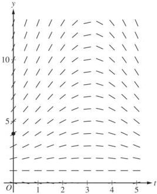
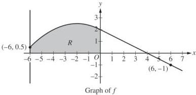

<!-- Page 1 -->

2024

# AP® Calculus BC
## Free-Response Questions

© 2024 College Board. College Board, Advanced Placement, AP, AP Central, and the acorn logo are registered trademarks of College Board. Visit College Board on the web: collegeboard.org.

AP Central is the official online home for the AP Program: apcentral.collegeboard.org.

<!-- Page 2 -->

AP® Calculus BC 2024 Free-Response Questions

# CALCULUS BC

## SECTION II, Part A

Time—30 minutes

2 Questions

A GRAPHING CALCULATOR IS REQUIRED FOR THESE QUESTIONS.

© 2024 College Board.

Visit College Board on the web: collegeboard.org.

2

GO ON TO THE NEXT PAGE.

<!-- Page 3 -->

AP® Calculus BC 2024 Free-Response Questions

|  t(minutes) | 0 | 3 | 7 | 12  |
| --- | --- | --- | --- | --- |
|  C(t)(degrees Celsius) | 100 | 85 | 69 | 55  |

1. The temperature of coffee in a cup at time \( t \) minutes is modeled by a decreasing differentiable function \( C \), where \( C(t) \) is measured in degrees Celsius. For \( 0 \leq t \leq 12 \), selected values of \( C(t) \) are given in the table shown.

(a) Approximate \( C'(5) \) using the average rate of change of \( C \) over the interval \( 3 \leq t \leq 7 \). Show the work that leads to your answer and include units of measure.

(b) Use a left Riemann sum with the three subintervals indicated by the data in the table to approximate the value of \(\int_0^{12}C(t)dt\). Interpret the meaning of \(\frac{1}{12}\int_0^{12}C(t)dt\) in the context of the problem.

(c) For \(12 \leq t \leq 20\), the rate of change of the temperature of the coffee is modeled by \(C'(t) = \frac{-24.55e^{0.01t}}{t}\), where \(C'(t)\) is measured in degrees Celsius per minute. Find the temperature of the coffee at time \(t = 20\). Show the setup for your calculations.

(d) For the model defined in part (c), it can be shown that \( C''(t) = \frac{0.2455e^{0.01t}(100 - t)}{t^2} \). For \( 12 < t < 20 \), determine whether the temperature of the coffee is changing at a decreasing rate or at an increasing rate. Give a reason for your answer.

Write your responses to this question only on the designated pages in the separate Free Response booklet. Write your solution to each part in the space provided for that part.

© 2024 College Board.

Visit College Board on the web: collegeboard.org.

3

GO ON TO THE NEXT PAGE.

<!-- Page 4 -->

AP® Calculus BC 2024 Free-Response Questions

2. A particle moving along a curve in the $xy$-plane has position $(x(t), y(t))$ at time $t$ seconds, where $x(t)$ and $y(t)$ are measured in centimeters. It is known that $x'(t) = 8t - t^2$ and $y'(t) = -t + \sqrt{t^{1.2} + 20}$. At time $t = 2$ seconds, the particle is at the point $(3, 6)$.
(a) Find the speed of the particle at time $t = 2$ seconds. Show the setup for your calculations.
(b) Find the total distance traveled by the particle over the time interval $0 \le t \le 2$. Show the setup for your calculations.
(c) Find the $y$-coordinate of the position of the particle at the time $t = 0$. Show the setup for your calculations.
(d) For $2 \le t \le 8$, the particle remains in the first quadrant. Find all times $t$ in the interval $2 \le t \le 8$ when the particle is moving toward the $x$-axis. Give a reason for your answer.

Write your responses to this question only on the designated pages in the separate Free Response booklet. Write your solution to each part in the space provided for that part.

© 2024 College Board.

Visit College Board on the web: collegeboard.org.

4

GO ON TO THE NEXT PAGE.

<!-- Page 5 -->

AP® Calculus BC 2024 Free-Response Questions

END OF PART A

© 2024 College Board.
Visit College Board on the web: collegeboard.org.

5

<!-- Page 6 -->

AP® Calculus BC 2024 Free-Response Questions

# CALCULUS BC

## SECTION II, Part B

Time—1 hour

4 Questions

NO CALCULATOR IS ALLOWED FOR THESE QUESTIONS.

© 2024 College Board.

Visit College Board on the web: collegeboard.org.

6

<!-- Page 7 -->

AP® Calculus BC 2024 Free-Response Questions

3. The depth of seawater at a location can be modeled by the function $H$ that satisfies the differential equation $\frac{dH}{dt} = \frac{1}{2}(H - 1)\cos\left(\frac{t}{2}\right)$, where $H(t)$ is measured in feet and $t$ is measured in hours after noon ($t = 0$). It is known that $H(0) = 4$.

(a) A portion of the slope field for the differential equation is provided. Sketch the solution curve, $y = H(t)$, through the point $(0, 4)$.

(b) For $0 < t < 5$, it can be shown that $H(t) > 1$. Find the value of $t$, for $0 < t < 5$, at which $H$ has a critical point. Determine whether the critical point corresponds to a relative minimum, a relative maximum, or neither a relative minimum nor a relative maximum of the depth of seawater at the location. Justify your answer.

(c) Use separation of variables to find $y = H(t)$, the particular solution to the differential equation

$$\frac{dH}{dt} = \frac{1}{2}(H - 1)\cos\left(\frac{t}{2}\right) \text{ with initial condition } H(0) = 4.$$

Write your responses to this question only on the designated pages in the separate Free Response booklet. Write your solution to each part in the space provided for that part.

© 2024 College Board.

Visit College Board on the web: collegeboard.org.

7

GO ON TO THE NEXT PAGE.

<!-- Page 8 -->

AP® Calculus BC 2024 Free-Response Questions

4. The graph of the differentiable function $f$, shown for $-6 \leq x \leq 7$, has a horizontal tangent at $x = -2$ and is linear for $0 \leq x \leq 7$. Let $R$ be the region in the second quadrant bounded by the graph of $f$, the vertical line $x = -6$, and the $x$- and $y$-axes. Region $R$ has area 12.

(a) The function $g$ is defined by $g(x) = \int_0^x f(t) \, dt$. Find the values of $g(-6)$, $g(4)$, and $g(6)$.

(b) For the function $g$ defined in part (a), find all values of $x$ in the interval $0 \leq x \leq 6$ at which the graph of $g$ has a critical point. Give a reason for your answer.

(c) The function $h$ is defined by $h(x) = \int_{-6}^x f'(t) \, dt$. Find the values of $h(6)$, $h'(6)$, and $h''(6)$. Show the work that leads to your answers.

Write your responses to this question only on the designated pages in the separate Free Response booklet. Write your solution to each part in the space provided for that part.

© 2024 College Board.
Visit College Board on the web: collegeboard.org.

8

GO ON TO THE NEXT PAGE.

<!-- Page 9 -->

AP® Calculus BC 2024 Free-Response Questions

|  x | 0 | π | 2π  |
| --- | --- | --- | --- |
|  f'(x) | 5 | 6 | 0  |

5. The function $f$ is twice differentiable for all $x$ with $f(0) = 0$. Values of $f'$, the derivative of $f$, are given in the table for selected values of $x$.

(a) For $x \geq 0$, the function $h$ is defined by $h(x) = \int_0^x \sqrt{1 + (f'(t))^2} \, dt$. Find the value of $h'(\pi)$. Show the work that leads to your answer.

(b) What information does $\int_0^\pi \sqrt{1 + (f'(x))^2} \, dx$ provide about the graph of $f$?

(c) Use Euler's method, starting at $x = 0$ with two steps of equal size, to approximate $f(2\pi)$. Show the computations that lead to your answer.

(d) Find $\int (t + 5)\cos\left(\frac{t}{4}\right) \, dt$. Show the work that leads to your answer.

Write your responses to this question only on the designated pages in the separate Free Response booklet. Write your solution to each part in the space provided for that part.

© 2024 College Board.

Visit College Board on the web: collegeboard.org.

9

GO ON TO THE NEXT PAGE.

<!-- Page 10 -->

AP® Calculus BC 2024 Free-Response Questions

6. The Maclaurin series for a function $f$ is given by $\sum_{n=1}^{\infty} \frac{(n+1)x^n}{n^2 6^n}$ and converges to $f(x)$ for all $x$ in the interval of convergence. It can be shown that the Maclaurin series for $f$ has a radius of convergence of 6.

(a) Determine whether the Maclaurin series for $f$ converges or diverges at $x = 6$. Give a reason for your answer.
(b) It can be shown that $f(-3) = \sum_{n=1}^{\infty} \frac{(n+1)(-3)^n}{n^2 6^n} = \sum_{n=1}^{\infty} \frac{n+1}{n^2} \left(-\frac{1}{2}\right)^n$ and that the first three terms of this series sum to $S_3 = -\frac{125}{144}$. Show that $\left|f(-3) - S_3\right| < \frac{1}{50}$.
(c) Find the general term of the Maclaurin series for $f'$, the derivative of $f$. Find the radius of convergence of the Maclaurin series for $f'$.
(d) Let $g(x) = \sum_{n=1}^{\infty} \frac{(n+1)x^{2n}}{n^2 3^n}$. Use the ratio test to determine the radius of convergence of the Maclaurin series for $g$.

Write your responses to this question only on the designated pages in the separate Free Response booklet. Write your solution to each part in the space provided for that part.

© 2024 College Board.

Visit College Board on the web: collegeboard.org.

10

GO ON TO THE NEXT PAGE.

<!-- Page 11 -->

AP® Calculus BC 2024 Free-Response Questions

STOP

END OF EXAM

© 2024 College Board.
Visit College Board on the web: collegeboard.org.

11
