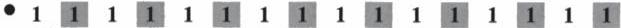
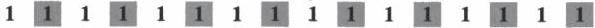
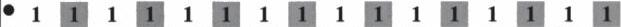
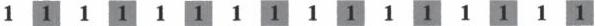
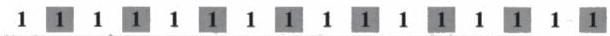

<!-- Page 1 -->

2024

AP

# AP® Calculus BC
## Sample Student Responses and Scoring Commentary

### Inside:

Free-Response Question 1

- ☑ Scoring Guidelines
- ☑ Student Samples
- ☑ Scoring Commentary

© 2024 College Board. College Board, Advanced Placement, AP, AP Central, and the acorn logo are registered trademarks of College Board. Visit College Board on the web: collegeboard.org.

AP Central is the official online home for the AP Program: apcentral.collegeboard.org.

<!-- Page 2 -->

AP® Calculus AB/BC 2024 Scoring Guidelines

## Part A (AB or BC): Graphing calculator required

### Question 1

9 points

#### General Scoring Notes

The model solution is presented using standard mathematical notation.

Answers (numeric or algebraic) need not be simplified. Answers given as a decimal approximation should be correct to three places after the decimal point. Within each individual free-response question, at most one point is not earned for inappropriate rounding.

|  \( t \)(minutes) | 0 | 3 | 7 | 12  |
| --- | --- | --- | --- | --- |
|  \( C(t) \)(degrees Celsius) | 100 | 85 | 69 | 55  |

The temperature of coffee in a cup at time t minutes is modeled by a decreasing differentiable function C, where  \( C(t) \)  is measured in degrees Celsius. For  \( 0 \leq t \leq 12 \) , selected values of  \( C(t) \)  are given in the table shown.

|  Model Solution | Scoring  |   |
| --- | --- | --- |
|  (a) Approximate \( C'(5) \) using the average rate of change of \( C \) over the interval \( 3 \leq t \leq 7 \). Show the work that leads to your answer and include units of measure.  |   |   |
|  \( C'(5) \approx \frac{C(7) - C(3)}{7 - 3} = \frac{69 - 85}{4} = -4 \) degrees Celsius per minute | Estimate with supporting work | 1 point  |
|   |  Units | 1 point  |

##### Scoring notes:

• To earn the first point a response must include a difference and a quotient as the supporting work.
- \(\frac{-16}{7 - 3}, \frac{69 - 85}{7 - 3}\), or \(\frac{69 - 85}{4}\) is sufficient to earn the first point.
- A response that presents only units without a numerical approximation for \( C'(5) \) does not earn the second point.
- The second point is also earned for “degrees per minute” attached to a numerical value.

Total for part (a) 2 points

© 2024 College Board

<!-- Page 3 -->

AP® Calculus AB/BC 2024 Scoring Guidelines

(b) Use a left Riemann sum with the three subintervals indicated by the data in the table to approximate the value of $$\int_{0}^{12} C(t) \, dt$$. Interpret the meaning of $$\frac{1}{12} \int_{0}^{12} C(t) \, dt$$ in the context of the problem.

|  $$\int_{0}^{12} C(t) \, dt \approx (3 - 0) \cdot C(0) + (7 - 3) \cdot C(3) + (12 - 7) \cdot C(7)$$ $$= 3 \cdot 100 + 4 \cdot 85 + 5 \cdot 69 = 985$$ | Form of left Riemann sum | 1 point  |
| --- | --- | --- |
|   |  Estimate | 1 point  |
|  $$\frac{1}{12} \int_{0}^{12} C(t) \, dt$$ is the average temperature of the coffee (in degrees Celsius) over the interval from $$t = 0$$ to $$t = 12$$. | Interpretation | 1 point  |

# Scoring notes:

- Read “=” as “≈” for the first point.
- To earn the first point at least five of the six factors in the Riemann sum must be correct. If any of the six factors is incorrect, the response does not earn the second point.
- A response of $$(3 - 0) \cdot C(0) + (7 - 3) \cdot C(3) + (12 - 7) \cdot C(7)$$ earns the first point. Values must be pulled from the table to earn the second point.
- A response of $$3 \cdot 100 + 4 \cdot 85 + 5 \cdot 69$$ earns both the first and second points, unless there is a subsequent error in simplification, in which case the response would earn only the first point.
- A completely correct right Riemann sum (e.g., $$3 \cdot 85 + 4 \cdot 69 + 5 \cdot 55$$) earns 1 of the first 2 points. An unsupported answer of 806 does not earn either of the first 2 points.
- Units will not affect scoring for the second point.
- To earn the third point the interpretation must include both “average temperature” and the time interval. The response need not include a reference to units. However, if incorrect units are given in the interpretation, the response does not earn the third point.

Total for part (b) 3 points

(c) For $$12 \leq t \leq 20$$, the rate of change of the temperature of the coffee is modeled by

$$C'(t) = \frac{-24.55e^{0.01t}}{t}$$, where $$C'(t)$$ is measured in degrees Celsius per minute. Find the temperature of the coffee at time $$t = 20$$. Show the setup for your calculations.

|  $$C(20) = C(12) + \int_{12}^{20} C'(t) \, dt$$ | Integral | 1 point  |
| --- | --- | --- |
|   |  Uses initial condition | 1 point  |
|  $$= 55 - 14.670812 = 40.329188$$ | Answer | 1 point  |
|  The temperature of the coffee at time $$t = 20$$ is 40.329 degrees Celsius. |  |   |

© 2024 College Board

<!-- Page 4 -->

AP® Calculus AB/BC 2024 Scoring Guidelines

# Scoring notes:

- The first point is earned for a definite integral with integrand $C'(t)$. If the limits of integration are incorrect, the response does not earn the third point.
- A linkage error such as $C(20) = \int_{12}^{20} C'(t) \, dt = 55 - 14.670812$ or
$\int_{12}^{20} C'(t) \, dt = -14.670812 = 40.329188$ earns the first 2 points but does not earn the third point.
- Missing differential ($dt$):

○ Unambiguous responses of $C(20) = C(12) + \int_{12}^{20} C'(t)$ or $C(20) = 55 + \int_{12}^{20} C'(t)$ earn the first 2 points and are eligible for the third point.
○ Ambiguous responses of $C(20) = \int_{12}^{20} C'(t) + C(12)$ or $C(20) = \int_{12}^{20} C'(t) + 55$ do not earn the first point, earn the second point, and earn the third point if the given numeric answer is correct. If there is no numeric answer given, these responses do not earn the third point.

- The second point is earned for adding $C(12)$ or 55 to a definite integral with a lower limit of 12, either symbolically or numerically.
- The third point is earned for an answer of $55 - 14.671$ or $-14.671 + 55$ with no additional simplification, provided there is some supporting work for these values.
- An answer of just 40.329 with no supporting work does not earn any points.

Total for part (c) 3 points

(d)

For the model defined in part (c), it can be shown that $C''(t) = \frac{0.2455e^{0.01t}(100 - t)}{t^2}$. For

$12 < t < 20$, determine whether the temperature of the coffee is changing at a decreasing rate or at an increasing rate. Give a reason for your answer.

Because $C''(t) > 0$ on the interval $12 < t < 20$, the rate of change in the temperature of the coffee, $C'(t)$, is increasing on this interval.

That is, on the interval $12 < t < 20$, the temperature of the coffee is changing at an increasing rate.

Answer with reason 1 point

# Scoring notes:

- This point is earned only for a correct answer with a correct reason that references the sign of the second derivative of $C$.
- A response that provides a reason based on the evaluation of $C''(t)$ at a single point does not earn this point.
- A response that uses ambiguous pronouns (such as “It is positive, so increasing”) does not earn this point.
- A response does not need to reference the interval $12 < t < 20$ to earn the point.

Total for part (d) 1 point

Total for question 1 9 points

© 2024 College Board

<!-- Page 5 -->

1 of 2

Sample 1A

1 1 1 1 1 1 1 1 1 1 1 1 1 1 1 1 1 1

Answer QUESTION 1 parts (a) and (b) on this page.

|  t (minutes) | 0 | 3 | 7 | 12  |
| --- | --- | --- | --- | --- |
|  C(t) (degrees Celsius) | 100 | 85 | 69 | 55  |

Response for question 1(a)

$$C'(5) = \frac{69 - 85}{7 - 3} = -4 \text{ degrees Celsius per minute}$$

$$\frac{f(b) - f(a)}{b - a}$$

Response for question 1(b)

$$3(100) + 4(85) + 5(69) = 985 \text{ degrees Celsius}$$

$$\frac{1}{12} \int_{0}^{12} C(t)$$ is the average temperature over the interval

from 0 min to 12 min

Page 4

Use a pencil or a pen with black or dark blue ink. Do NOT write your name. Do NOT write outside the box.

Q5228/4

<!-- Page 6 -->

2 of 2

Sample 1A

Answer QUESTION 1 parts (c) and (d) on this page.

Response for question 1(c)

$$55 + \int_{12}^{20} C'(t) dt = 40.32^\circ \text{ degrees Celsius}$$

Response for question 1(d)

The temp of the coffee is changing at an increasing rate because $C''(t)$ is + over the interval $12 < t < 20$

Page 5

Use a pencil or a pen with black or dark blue ink. Do NOT write your name. Do NOT write outside the box.

0068559

Q5228/5

<!-- Page 7 -->

1 of 2

Sample 1B

Answer QUESTION 1 parts (a) and (b) on this page.

|  t(minutes) | 0 | 3 | 7 | 12  |
| --- | --- | --- | --- | --- |
|  C(t)(degrees Celsius) | 100 | 85 | 69 | 55  |

Response for question 1(a)

\[
\begin{array}{l} \frac {f (b) - f (a)}{b - a} = \frac {6 9 - 8 5}{7 - 3} = \frac {- 1 6}{4} = - 4 \\ \text { MVT } \quad \frac {7 + 3}{2} = 1 0 \quad c ^ {\prime} (5) \approx - 4 \text { degrees } c ^ {\circ} / \text { minute } \\ \end{array}
\]

Response for question 1(b)

\[
\int_ {0} ^ {1 2} c (t) d t
\]

\[
\approx 3 (1 0 0) + 4 (8 5) + 5 (6 9)
\]

\[
\approx 9 8 5
\]

\[
\frac {1}{1 2} \int_ {0} ^ {1 2} c (t) d t
\]

\[
\approx 8 2. 0 8 3 3 3 3 3 3 ^ {\circ} c
\]

This is the average temperature of the coffee from 0 to 12 minutes

Page 4

Use a pencil or a pen with black or dark blue ink. Do NOT write your name. Do NOT write outside the box.

Q5220/4

<!-- Page 8 -->

2 of 2

Sample 1B

Answer QUESTION 1 parts (c) and (d) on this page.

Response for question 1(c)

$$c'(t) = \frac{-24.55e^{0.01t}}{\sqrt{12} - \frac{-24.55e^{0.01t}}{\sqrt{12}}} \tag{1c}$$

Response for question 1(d)

$$c''(t) = \frac{0.2455e^{0.01t}(100-t)}{\sqrt{2}} \tag{1d}$$ $$c''(16) = \frac{0.2455e^{0.01(16)}(100-16)}{(16)^2}$$ $$= 0.0945318015$$

Increasing rate since c''(16) is positive and in the given interval.

Page 5

Use a pencil or a pen with black or dark blue ink. Do NOT write your name. Do NOT write outside the box.

0116605

Q5223/5

<!-- Page 9 -->

1 of 2

Sample 1C

Answer QUESTION 1 parts (a) and (b) on this page.

|  t(minutes) | 0 | 3 | 7 | 12  |
| --- | --- | --- | --- | --- |
|  C(t)(degrees Celsius) | 100 | 85 | 69 | 55  |

Response for question 1(a)

\[
\frac {6 9 - 8 5}{7 - 3} = \frac {- 1 6}{4} = - 4 d e g r e s c o l c h s
\]

Response for question 1(b)

\[
(3 \cdot 1 0 0) + (4 \cdot 8 5) + (5 \cdot 6 9)
\]

\[
3 0 0 + 3 4 0 + 3 4 5
\]

\[
9 8 5
\]

\[
\frac {1}{1 2} \int_ {0} ^ {1 2} l (t) \text {   is   the   coverage   }
\]

\[
\text {   role   of   changes   for   }
\]

\[
\text { degrees   colcs   over }
\]

\[
1 2 \text { minutes   of   time }
\]

Page 4

Use a pencil or a pen with black or dark blue ink. Do NOT write your name. Do NOT write outside the box.

Q5224/4

<!-- Page 10 -->

2 of 2

Sample 1C

Answer QUESTION 1 parts (c) and (d) on this page.

Response for question 1(c)

$$C'(x) = \frac{-24.55e^{0.01(20)}}{20}$$

$$\approx -1.499 \text{ colors}$$

Response for question 1(d)

$$C''(t)$$ is changing at an increasing rate as the equation $$\int_{12}^{20} C''(t) dt$$ ends up as a positive rate

Page 5

Use a pencil or a pen with black or dark blue ink. Do NOT write your name. Do NOT write outside the box.

0123122

0224/5

<!-- Page 11 -->

AP® Calculus AB/BC 2024 Scoring Commentary

# Question 1

Note: Student samples are quoted verbatim and may contain spelling and grammatical errors.

# Overview

In this question students were given a table of times t in minutes, 0 ≤ t ≤ 12, and values of a decreasing differentiable function C(t) that models the temperature, in degrees Celsius, of coffee in a cup.

In part (a) students were asked to approximate the value of C'(5) using the average rate of change of C over the interval 3 ≤ t ≤ 7 and to include correct units with their answer. A correct response will use values from the given table to calculate C'(5) ≈ (C(7) - C(3)) / (7 - 3) = (69 - 85) / 4 = -4 degrees Celsius per minute.

In part (b) students were asked to approximate the value of ∫₀¹² C(t) dt using a left Riemann sum with the three subintervals indicated by the values in the given table. Then students were asked to interpret the meaning of 1/12 ∫₀¹² C(t) dt in the context of the problem. A correct response would present the left Riemann Sum setup and the approximation (e.g., (3 - 0) · C(0) + (7 - 3) · C(3) + (12 - 7) · C(7) = 985). A correct response would also indicate that 1/12 ∫₀¹² C(t) dt represents the average temperature of the coffee, in degrees Celsius, over the time interval from t = 0 to t = 12.

In part (c) C'(t) = (-24.55e^(0.01t)) / t was introduced as a function that models the rate of change of the coffee's temperature, in degrees Celsius per minute, over the time interval 12 ≤ t ≤ 20. Students were asked to find the temperature of the coffee at time t = 20. A correct response would provide the setup C(20) = C(12) + ∫₁₂²⁰ C'(t) dt then use a calculator to add the value C(12) = 55 to the value of integral and report a temperature of 40.329 degrees Celsius.

In part (d) students were given C''(t) = (0.2455e^(0.01t)(100 - t)) / t², the derivative of the model introduced in part (c), and asked to determine whether the temperature of the coffee was changing at a decreasing rate or at an increasing rate for 12 < t < 20. A correct response would observe that the given function, C''(t), is positive on the interval 12 < t < 20, and therefore the rate of change of the temperature of the coffee, C'(t), is increasing on this interval.

© 2024 College Board.

Visit College Board on the web: collegeboard.org.

<!-- Page 12 -->

AP® Calculus AB/BC 2024 Scoring Commentary

## Question 1 (continued)

**Sample: 1A**

**Score: 9**

The response earned 9 points: 2 points in part (a), 3 points in part (b), 3 points in part (c), and 1 point in part (d).

In part (a) the response would have earned the first point in line 1 with the expression $\frac{69 - 85}{7 - 3}$ with no simplification. Because no simplification error is made, the response earned the first point. The response earned the second point for the correct units, “degrees Celsius per minute.”

In part (b) the response earned the first point in line 1 with $3(100) + 4(85) + 5(69)$ and would have earned the second point with no simplification. Because no simplification error is made, the response earned the second point. The units reported in line 1, “degrees Celsius,” although incorrect, do not affect scoring. The response earned the third point for “the average temperature over the interval from 0 min to 12 min” in lines 2 and 3.

In part (c) the response earned the first point with $\int_{12}^{20} C'(t) \, dt$. The response earned the second point with the sum of 55 and the definite integral. The response earned the third point with the correct answer of 40.329.

In part (d) the response earned the point with the correct conclusion “The temp of the coffee is changing at an increasing rate” and the statement “$C''(t)$ is +.”.

**Sample: 1B**

**Score: 6**

The response earned 6 points: 2 points in part (a), 3 points in part (b), 1 point in part (c), and no points in part (d).

In part (a) the response would have earned the first point in line 1 with the expression $\frac{69 - 85}{7 - 3}$ with no simplification. Because no simplification error is made, the response earned the first point. The response earned the second point because of the correct units in line 2.

In part (b) the response earned the first point in line 2 with $3(100) + 4(85) + 5(69)$ and would have earned the second point with no simplification. Because no simplification error is made, the response earned the second point. The third point was earned for the phrase “average temperature of the coffee from 0 to 12 minutes” in lines 6 and 7.

In part (c) the response earned the first point with the definite integral that appears in line 2. The response did not earn the second point because the initial condition is never used. The response did not earn the third point because the stated answer is incorrect.

In part (d) the response did not earn the point because the reasoning is based on the evaluation of $C''(t)$ at a single point.

© 2024 College Board.

Visit College Board on the web: collegeboard.org.

<!-- Page 13 -->

AP® Calculus AB/BC 2024 Scoring Commentary

## Question 1 (continued)

**Sample: 1C**

**Score: 3**

The response earned 3 points: 1 point in part (a), 2 points in part (b), no points in part (c), and no points in part (d).

In part (a) the response would have earned the first point in line 1 with the expression $$\frac{69 - 85}{7 - 3}$$ with no simplification. Because no simplification error is made, the response earned the first point. The second point is not earned because the units “degrees Celsius” are incorrect.

In part (b) the response earned the first point in line 1 on the left with $$(3 \cdot 100) + (4 \cdot 85) + (5 \cdot 69)$$ and would have earned the second point with no simplification. Because no simplification error is made, the response earned the second point in line 3. The third point is not earned because the interpretation includes the phrase “average rate of change.”.

In part (c) the response earned no points because no definite integral is presented.

In part (d) the response did not earn the point because the response states “$$C''(t)$$ is changing at an increasing rate” instead of $$C(t)$$.

© 2024 College Board.

Visit College Board on the web: collegeboard.org.
