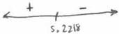

<!-- Page 1 -->

2024

AP

# AP® Calculus BC
## Sample Student Responses and Scoring Commentary

### Inside:

Free-Response Question 2

- ☑ Scoring Guidelines
- ☑ Student Samples
- ☑ Scoring Commentary

© 2024 College Board. College Board, Advanced Placement, AP, AP Central, and the acorn logo are registered trademarks of College Board. Visit College Board on the web: collegeboard.org.

AP Central is the official online home for the AP Program: apcentral.collegeboard.org.

<!-- Page 2 -->

AP® Calculus AB/BC 2024 Scoring Guidelines

## Part A (BC): Graphing calculator required

### Question 2

9 points

#### General Scoring Notes

The model solution is presented using standard mathematical notation.

Answers (numeric or algebraic) need not be simplified. Answers given as a decimal approximation should be correct to three places after the decimal point. Within each individual free-response question, at most one point is not earned for inappropriate rounding.

A particle moving along a curve in the \(xy\)-plane has position \((x(t), y(t))\) at time \(t\) seconds, where \(x(t)\) and \(y(t)\) are measured in centimeters. It is known that \(x'(t) = 8t - t^2\) and \(y'(t) = -t + \sqrt{t^{1.2} + 20}\). At time \(t = 2\) seconds, the particle is at the point (3, 6).

|  Model Solution | Scoring  |   |
| --- | --- | --- |
|  (a) Find the speed of the particle at time \( t = 2 \) seconds. Show the setup for your calculations.  |   |   |
|  \( \sqrt{(x'(2))^2 + (y'(2))^2} \) | Setup for speed | 1 point  |
|  = 12.3048506 | Answer | 1 point  |
|  The speed of the particle at time \( t = 2 \) seconds is 12.305 (or 12.304 ) centimeters per second. |  |   |

##### Scoring notes:

- The first point is earned for the expression \(\sqrt{(x'(2))^2 + (y'(2))^2}\), \(\sqrt{(x'(t))^2 + (y'(t))^2}\), or equivalent.
- A response that presents just the exact answer, \(\sqrt{144 + \left(-2 + \sqrt{2^{1.2} + 20}\right)^2}\), earns both points.
- The second point is earned only for the answer 12.305 (or 12.304) regardless of whether the first point is earned.
- A response that includes a linkage error, such as
\(\sqrt{(x'(t))^2 + (y'(t))^2} = \sqrt{144 + (-2 + \sqrt{2^{1.2} + 20})^2}\) or \(\sqrt{(x'(t))^2 + (y'(t))^2} = 12.305\) (or 12.304), earns at most 1 of the 2 points.
- Missing or incorrect units will not affect scoring in this part.

Total for part (a) 2 points

© 2024 College Board

<!-- Page 3 -->

AP® Calculus AB/BC 2024 Scoring Guidelines

(b) Find the total distance traveled by the particle over the time interval 0 ≤ t ≤ 2. Show the setup for your calculations.

|  $$\int_{0}^{2}\sqrt{(x'(t))^{2}+(y'(t))^{2}}\,dt$$ | Integral | 1 point  |
| --- | --- | --- |
|  = 15.901715 | Answer | 1 point  |
|  The total distance traveled by the particle over the time interval 0 ≤ t ≤ 2 is 15.902 (or 15.901) centimeters. |  |   |

# Scoring notes:

- The first point is earned only for an integral of $$\int_{0}^{2}\sqrt{(x'(t))^{2}+(y'(t))^{2}}\,dt$$ (or the mathematical equivalent), with or without the differential.
  - Note: $$\int_{0}^{2}\sqrt{x'(t)^{2}+y'(t)^{2}}\,dt$$ is not read as a parenthesis error.
- The second point is earned only for an answer of 15.902 (or 15.901), regardless of whether the first point is earned.
- Missing or incorrect units will not affect scoring in this part.

Total for part (b) 2 points

(c) Find the y-coordinate of the position of the particle at the time t = 0. Show the setup for your calculations.

|  $$y(0) = 6 + \int_{2}^{0} y'(t) \,dt = 6 - 7.173613 = -1.173613$$ The y-coordinate of the position of the particle at time t = 0 is -1.174 (or -1.173). | Definite integral | 1 point  |
| --- | --- | --- |
|   |  Uses initial condition | 1 point  |
|   |  Answer | 1 point  |

# Scoring notes:

- An answer of -1.174 (or -1.173) with no supporting work does not earn any points.
- The first point is earned for either of the definite integrals $$\int_{2}^{0} y'(t) \,dt$$ or $$\int_{0}^{2} y'(t) \,dt$$.
- The second point is earned for any of:

- $$y(2) \pm \int_{2}^{0} y'(t) \,dt, \ 6 \pm \int_{2}^{0} y'(t) \,dt,$$
- $$y(2) \pm \int_{0}^{2} y'(t) \,dt, \ 6 \pm \int_{0}^{2} y'(t) \,dt,$$
- $$y(2) \pm 7.173613, \text{ or } 6 \pm 7.173613.$$

- A response that attempts to evaluate $$\int y'(t) \,dt$$ does not earn the first or the third point.

- Such a response can earn the second point by attempting to solve for the constant of integration by presenting an expression as an antiderivative for $$y'(t)$$, evaluating this expression at t = 2, and setting this expression equal to 6.

© 2024 College Board

<!-- Page 4 -->

AP® Calculus AB/BC 2024 Scoring Guidelines

- A response that reverses the limits of integration, e.g., $y(0) = 6 + \int_{0}^{2} y'(t) \, dt$ or $6 + 7.173613$, earns the second point but does not earn the third point.
- In order to earn the third point, a response must have earned at least 1 of the first 2 points.
- A response containing any linkage error can earn at most 2 of the 3 points. For example:

○ Equating two unequal quantities: $\int_{2}^{0} y'(t) \, dt = -1.174$, $\int_{2}^{0} y'(t) \, dt = 6 - 7.173613$,

$6 + \int_{0}^{2} y'(t) \, dt = 6 - 7.173613$, or $6 + \int_{0}^{2} y'(t) \, dt = 6 + 7.173613 = -1.173613$

○ Equating an expression to a numerical value: $y(t) = 6 + \int_{2}^{0} y'(t) \, dt = -1.174$

- Missing differentials ($dt$):

○ Unambiguous responses of $y(2) + \int_{2}^{0} y'(t)$, $y(2) - \int_{0}^{2} y'(t)$, $6 + \int_{2}^{0} y'(t)$, or $6 - \int_{0}^{2} y'(t)$ earn the first 2 points and would earn the third point for the correct numerical answer.
○ Unambiguous responses of $y(2) + \int_{0}^{2} y'(t)$ or $6 + \int_{0}^{2} y'(t)$ with reversed limits of integration and missing differential earn the first 2 points but cannot earn the third point.
○ Ambiguous responses of $\int_{2}^{0} y'(t) + y(2)$, $-\int_{0}^{2} y'(t) + y(2)$, $\int_{2}^{0} y'(t) + 6$, or $-\int_{0}^{2} y'(t) + 6$ earn the first point, do not earn the second point, but do earn the third point if a correct numeric answer is provided. If no numeric answer is given, none of these responses earn the third point.
○ Ambiguous responses of $\int_{0}^{2} y'(t) + y(2)$ or $\int_{0}^{2} y'(t) + 6$ with reversed limits of integration and no differential earn 1 out of 3 points.

- If a response provides work for both the $x$- and $y$-coordinates, the work for the $x$-coordinate will not affect scoring.

- However, a response that reports only a completely correct $x$-coordinate of the particle's position at time $t = 0$ with all supporting work, e.g., $x(0) = 3 + \int_{2}^{0} x'(t) \, dt = -\frac{31}{3} = -10.333$, earns 2 out of 3 points.

Total for part (c) 3 points

© 2024 College Board

<!-- Page 5 -->

AP® Calculus AB/BC 2024 Scoring Guidelines

(d) For 2 ≤ t ≤ 8, the particle remains in the first quadrant. Find all times t in the interval 2 ≤ t ≤ 8 when the particle is moving toward the x-axis. Give a reason for your answer.

|  Because y(t) > 0 when 2 ≤ t ≤ 8, the particle will be moving toward the x-axis when y'(t) < 0. This occurs when 5.222 (or 5.221) < t < 8. | Considers sign of y'(t) | 1 point  |
| --- | --- | --- |
|   |  Answer with reason | 1 point  |

# Scoring notes:

- The first point can be earned by stating y'(t) = 0, y'(t) < 0, y'(t) > 0, or t = 5.222 (or 5.221).

Note: y'(t) may be written as dy/dt.

- The second point cannot be earned without the first.
- To earn the second point, a response must identify the correct interval (and no additional intervals in [2, 8]) and explicitly state the need for y'(t) < 0. The interval can be open, closed, or half-open.

Total for part (d) 2 points

Total for question 2 9 points

© 2024 College Board

<!-- Page 6 -->

1 of 2

Sample 2A

2 2 2 2 2 2 2 2 2 2 2 2 2 2 2 2 2

Answer QUESTION 2 parts (a) and (b) on this page.

Response for question 2(a)

$$x'(2) = 8(2) - 2^2 = 12$$

$$y'(2) = -2 + \sqrt{2^{1.2} + 20} = 2.7220$$

$$\text{speed: } \sqrt{(x'(2))^2 + (y'(2))^2} = \sqrt{12^2 + 2.7220^2} = 12.3049 \frac{\text{cm}}{\text{sec}}$$

Response for question 2(b)

$$\int_0^2 \sqrt{(\frac{dx}{dt})^2 + (\frac{dy}{dt})^2} \, dt = 15.9017 \text{ cm}$$

Page 6

Use a pencil or a pen with black or dark blue ink. Do NOT write your name. Do NOT write outside the box.

Q5229/6

<!-- Page 7 -->

2 of 2

Sample 2A

2 2 2 2 2 2 2 2 2 2 2 2 2 2 2 2

Answer QUESTION 2 parts (c) and (d) on this page.

Response for question 2(c)

$$y(2) = 6$$

$$y(2) = y(0) + \int_{0}^{2} y'(t) dt$$

$$6 = y(0) + 7.1736$$

$$y(0) = -1.1736$$

Response for question 2(d)

moving toward x axis means $y'(t)$ is negative

$$y'(t) = 0 \text{ at } t = 5.2218$$

The particle is moving towards

the x-axis when $y'(t)$ is

negative, which occurs when

$$5.2218 < t \le 8.$$

Page 7

Use a pencil or a pen with black or dark blue ink. Do NOT write your name. Do NOT write outside the box.

0029663

Q922B7

<!-- Page 8 -->

1 of 2

Sample 2B

2 2 2 2 2 2 2 2 2 2 2 2 2 2 2 2 2

Answer QUESTION 2 parts (a) and (b) on this page.

Response for question 2(a)

a.

$$\sqrt{(x'(2))^2 + (y'(2))^2} \approx 12.896 \text{ cm/s}$$

Response for question 2(b)

$$\begin{array}{l} \sum_{0}^{2} x'(t) dt = \frac{40}{3} \\ \sum_{0}^{2} y'(t) dt \approx 7.173613 \\ \sqrt{(\frac{40}{3})^2 + (7.173613)^2} \approx 15.141 \text{ cm} \end{array}$$

Page 6

Use a pencil or a pen with black or dark blue ink. Do NOT write your name. Do NOT write outside the box.

Q5228/6

<!-- Page 9 -->

2 of 2

Sample 2B

Answer QUESTION 2 parts (c) and (d) on this page.

Response for question 2(c)

$$6 - \int_{0}^{2} (-t + \sqrt{t^{1/2} + 20}) dt \approx -1.174$$

Response for question 2(d)

$$y'(t) = \text{vertical velocity of}$$

$$y'(t) \leqslant 0 \quad [5.222, 8]$$

particle

when $$y'(t)$$ is negative, the

particle is moving down and

toward x-axis. Therefore,

particle is moving toward

$$x - axis \approx 5.222 < t \leqslant 8.$$

Page 7

Use a pencil or a pen with black or dark blue ink. Do NOT write your name. Do NOT write outside the box.

0006591

Q5228/7

<!-- Page 10 -->

1 of 2

Sample 2C

2 2 2 2 2 2 2 2 2 2 2 2 2 2 2 2 2

Answer QUESTION 2 parts (a) and (b) on this page.

Response for question 2(a)

$$\text{Speed} = \sqrt{(y'(t))^2 + (y'(t))^2}$$

$$= \sqrt{(x'(t))^2 + (y'(t))^2}$$

$$= \sqrt{(t^2) + (2,722)^2}$$

$$= 12,305$$

$$\begin{aligned} x'(t) &= 8(2)-(2)^2 \\ &= 16 - 4 \\ &= 12 \end{aligned}$$

$$\begin{aligned} y'(t) &= -2 + \sqrt{2^{1/2} + 20} \\ &= 2,722 \end{aligned}$$

Response for question 2(b)

$$TOT = \int_{a}^{b} |v(t)| dt$$

$$= \int_{0}^{2} \left| \frac{y'(t)}{x'(t)} \right| dt$$

Page 6

Use a pencil or a pen with black or dark blue ink. Do NOT write your name. Do NOT write outside the box.

Q5228/6

<!-- Page 11 -->

2 of 2

Sample 2C

Answer QUESTION 2 parts (c) and (d) on this page.

Response for question 2(c)

$$\int y^{(t)} dt = y^{(t)}$$
$$y^{(t)} = \frac{1}{3} t^2 +$$

$$(t^{1/2} + 2\omega)^{1/2}$$

$$\frac{2}{3} (t^{1/2} + 2\omega)^{3/2}$$

Response for question 2(d)

The particle approaches the x-axis when $y^{(t)} < 0$ in the first quadrant.

Page 7

Use a pencil or a pen with black or dark blue ink. Do NOT write your name. Do NOT write outside the box.

0023370

Q8228/7

<!-- Page 12 -->

AP® Calculus BC 2024 Scoring Commentary

## Question 2

Note: Student samples are quoted verbatim and may contain spelling and grammatical errors.

### Overview

In this question students were told a particle was moving along a curve in the $xy$-plane with position $(x(t), y(t))$ at time $t$ seconds. Students were also given expressions for $x'(t)$ and $y'(t)$ and were told that the particle was at the point $(3, 6)$ at time $t = 2$.

In part (a) students were asked to find the speed of the particle at time $t = 2$ seconds. A correct response would provide the setup $\sqrt{(x'(2))^2 + (y'(2))^2}$ and use a calculator to find the numerical value 12.305 (or 12.304).

In part (b) students were asked to find the total distance traveled by the particle over the time interval $0 \le t \le 2$. A correct response would present the setup $\int_0^2 \sqrt{(x'(t))^2 + (y'(t))^2} \, dt$ and use a calculator to find the value 15.902 (or 15.901).

In part (c) students were asked to find the $y$-coordinate of the position of the particle at time $t = 0$. A correct response would provide the setup $y(0) = 6 + \int_2^0 y'(t) \, dt$ and use a calculator to find the value $-1.174$ (or $-1.173$).

In part (d) students were told that the particle remains in the first quadrant during the time interval $2 \le t \le 8$ and were asked to find all times in this interval when the particle is moving toward the $x$-axis. A correct response would consider the sign of $y'(t)$ and answer that because $y'(t) < 0$ on this time interval, the particle will be moving toward the $x$-axis.

### Sample: 2A

### Score: 9

The response earned 9 points: 2 points in part (a), 2 points in part (b), 3 points in part (c), and 2 points in part (d).

In part (a) the response earned the first point with the expression $\sqrt{(x'(2))^2 + (y'(2))^2}$ on line 3. The response earned the second point with the expression $\sqrt{12^2 + 2.7220^2}$ with no subsequent errors in simplification. Note that the expression $\sqrt{12^2 + 2.7220^2}$ alone would have earned both points. The units, though correct, are not required to earn the second point.

In part (b) the response earned the first point with the definite integral $\int_0^2 \sqrt{\left(\frac{dx}{dt}\right)^2 + \left(\frac{dy}{dt}\right)^2} \, dt$. The response earned the second point with the boxed value of 15.9017. The units, although correct, are not required to earn the second point.

In part (c) the response earned the first point for the definite integral $\int_0^2 y'(t) \, dt$ in line 2. The response earned the second point for using the initial condition in the equation $y(2) = y(0) + \int_0^2 y'(t) \, dt$ in line 2. The response earned the third point with the boxed statement $y(0) = -1.1736$ in line 4.

© 2024 College Board.

Visit College Board on the web: collegeboard.org.

<!-- Page 13 -->

AP® Calculus BC 2024 Scoring Commentary

### Question 2 (continued)

In part (d) the response earned the first point for the statement “ $y'(t)$ is negative” at the end of line 1, and is eligible to earn the second point. The response earned the second point for the correct interval with the reason “when $y'(t)$ is negative” given in the paragraph at the bottom right. The second point may be earned with a half open interval, as given in this response.

**Sample: 2B**

**Score: 6**

The response earned 6 points: 1 point in part (a), no points in part (b), 3 points in part (c), and 2 points in part (d).

In part (a) the response earned the first point with the correct expression for speed at time $t = 2$,

$\sqrt{(x'(2))^2 + (y'(2))^2}$. The response presents an incorrect value for the speed at time $t = 2$ and did not earn the second point.

In part (b) the response does not present the correct definite integral and does not present the correct answer, thus did not earn either point.

In part (c) the response earned the first point with the definite integral $\int_0^2 (-t + \sqrt{t^{1.2} + 20}) \, dt$. The response earned the second point with the expression $6 - \int_0^2 (-t + \sqrt{t^{1.2} + 20}) \, dt$, demonstrating use of the initial condition. The response earned the third point with the presentation of the correct value $-1.174$.

In part (d) the response earned the first point with the statement $y'(t) < 0$ in line 2, and is eligible to earn the second point. The response earned the second point with the correct interval $(5.222, 8]$ and reason $y'(t) < 0$ both given in line 2, and no subsequent incorrect statements.

**Sample: 2C**

**Score: 2**

The response earned 2 points: 1 point in part (a), no points in part (b), no points in part (c), and 1 point in part (d).

In part (a) the response earned the first point in line 1 for the expression $\sqrt{(x'(t))^2 + (y'(t))^2}$. The response did not earn the second point. The response has a linkage error between line 1 and line 2, thus is eligible to earn at most 1 of the 2 points.

In part (b) the response did not earn the first point because the response presents a definite integral with an incorrect integrand in line 2. The response does not present the correct value for distance, and did not earn the second point.

In part (c) the response does not include a definite integral, and did not earn the first point. The second point was not earned because, although the response attempts to present an expression for the antiderivative of $y'(t)$ in the last line, the response does not include a constant of integration. Without an attempt to solve for the constant of integration at $t = 2$, the response cannot earn the second point. Neither of the first two points has been earned, so the response is not eligible to earn the third point.

In part (d) the response earned the first point for the statement $y'(t) < 0$ in line 1. The response did not earn the second point because the correct interval is not presented.

© 2024 College Board.

Visit College Board on the web: collegeboard.org.
