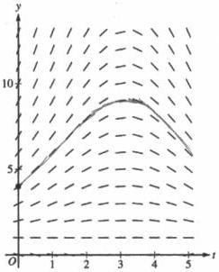
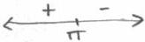
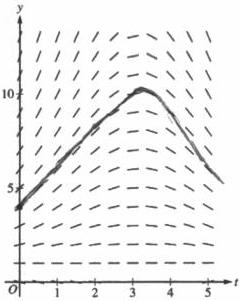
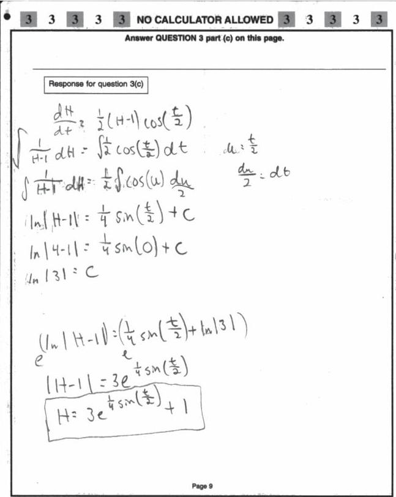
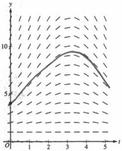
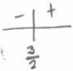
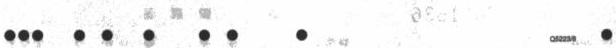

<!-- Page 1 -->

2024

AP

# AP® Calculus BC
## Sample Student Responses and Scoring Commentary

### Inside:

Free-Response Question 3

- ☑ Scoring Guidelines
- ☑ Student Samples
- ☑ Scoring Commentary

© 2024 College Board. College Board, Advanced Placement, AP, AP Central, and the acorn logo are registered trademarks of College Board. Visit College Board on the web: collegeboard.org.

AP Central is the official online home for the AP Program: apcentral.collegeboard.org.

<!-- Page 2 -->

AP® Calculus AB/BC 2024 Scoring Guidelines

## Part B (AB or BC): Graphing calculator not allowed

### Question 3

9 points

#### General Scoring Notes

The model solution is presented using standard mathematical notation.

Answers (numeric or algebraic) need not be simplified. Answers given as a decimal approximation should be correct to three places after the decimal point. Within each individual free-response question, at most one point is not earned for inappropriate rounding.

The depth of seawater at a location can be modeled by the function \( H \) that satisfies the differential equation \( \frac{dH}{dt} = \frac{1}{2}(H - 1)\cos \left(\frac{t}{2}\right) \), where \( H(t) \) is measured in feet and \( t \) is measured in hours after noon (\( t = 0 \)). It is known that \( H(0) = 4 \).

|  Model Solution | Scoring  |
| --- | --- |

(a) A portion of the slope field for the differential equation is provided. Sketch the solution curve, \( y = H(t) \), through the point (0, 4).

Solution curve

1 point

#### Scoring notes:

- The solution curve must pass through the point  \( (0, 4) \) , extend to at least t = 4.5, and have no obvious conflicts with the given slope lines.
- Only portions of the solution curve within the given slope field are considered.

Total for part (a) 1 point

© 2024 College Board

<!-- Page 3 -->

AP® Calculus AB/BC 2024 Scoring Guidelines

(b) For 0 < t < 5, it can be shown that H(t) > 1. Find the value of t, for 0 < t < 5, at which H has a critical point. Determine whether the critical point corresponds to a relative minimum, a relative maximum, or neither a relative minimum nor a relative maximum of the depth of seawater at the location. Justify your answer.

|  Because H(t) > 1, then dH/dt = 0 implies cos(t/2) = 0. This implies that t = π is a critical point. | Considers sign of dH/dt | 1 point  |
| --- | --- | --- |
|   |  Identifies t = π | 1 point  |
|  For 0 < t < π, dH/dt > 0 and for π < t < 5, dH/dt < 0. Therefore, t = π is the location of a relative maximum value of H. | Answer with justification | 1 point  |

# Scoring notes:

- The first point is earned for considering dH/dt = 0, dH/dt > 0, dH/dt < 0, cos(t/2) = 0, cos(t/2) > 0, or cos(t/2) < 0.
- The second point is earned for identifying t = π, with or without supporting work. A response may consider H = 1 or t = 1 as potential critical points without penalty.
- The third point cannot be earned without the first point. The third point is earned only for a correct justification and a correct answer of “relative maximum.”
- The justification can be shown by determining the sign of dH/dt (or cos(t/2)) at a single value in 0 < t < π and at a single value in π < t < 5. It is not necessary to state that dH/dt does not change sign on these intervals.
- The third point can also be earned by using the Second Derivative Test. For example:

$$\frac{d^2H}{dt^2} = \frac{1}{2}(H - 1)\left(-\frac{1}{2}\sin\left(\frac{t}{2}\right)\right) + \cos\left(\frac{t}{2}\right) \cdot \frac{1}{2} \cdot \frac{dH}{dt}$$

$$\left. \frac{d^2H}{dt^2} \right|_{t=\pi} < 0$$

Therefore, t = π is the location of a relative maximum value of H.

Total for part (b) 3 points

© 2024 College Board

<!-- Page 4 -->

AP® Calculus AB/BC 2024 Scoring Guidelines

(c) Use separation of variables to find $y = H(t)$, the particular solution to the differential equation

$$\frac{dH}{dt} = \frac{1}{2}(H - 1)\cos\left(\frac{t}{2}\right) \text{ with initial condition } H(0) = 4.$$

|  $$\frac{dH}{H - 1} = \frac{1}{2}\cos\left(\frac{t}{2}\right)dt$$ | Separation of variables | 1 point  |
| --- | --- | --- |
|  $$\int \frac{dH}{H - 1} = \int \frac{1}{2}\cos\left(\frac{t}{2}\right)dt$$ $$\Rightarrow \ln|H - 1| = \sin\left(\frac{t}{2}\right) + C$$ | One antiderivative | 1 point  |
|   |  Second antiderivative | 1 point  |
|  $$\ln|4 - 1| = \sin\left(\frac{0}{2}\right) + C \Rightarrow C = \ln 3$$ Because $H(0) = 4$, $H > 1$, so $|H - 1| = H - 1$. $$\ln(H - 1) = \sin\left(\frac{t}{2}\right) + \ln 3$$ | Constant of integration and uses initial condition | 1 point  |
|  $$H - 1 = e^{\sin(t/2) + \ln 3} = 3e^{\sin(t/2)}$$ $$H(t) = 1 + 3e^{\sin(t/2)}$$ | Solves for $H$ | 1 point  |

# Scoring notes:

- A response with no separation of variables earns 0 out of 5 points.
- A response that presents $\int \frac{dH}{H - 1} = \ln(H - 1)$ without absolute value symbols earns that antiderivative point.
- A response with no constant of integration can earn at most the first 3 points.
- A response is eligible for the fourth point only if it has earned the first point and at least 1 of the 2 antiderivative points.
- An eligible response earns the fourth point by correctly including the constant of integration in an equation and substituting 0 for $t$ and 4 for $H$.
- A response is eligible for the fifth point only if it has earned the first 4 points.
- A response earns the fifth point only for an answer of $H(t) = 1 + 3e^{\sin(t/2)}$ or a mathematically equivalent expression for $H(t)$ such as $H(t) = 1 + e^{\sin(t/2) + \ln 3}$.
- A response does not need to argue that $|H - 1| = H - 1$ in order to earn the fifth point.
- Special case: A response that presents an incorrect separation of variables of $\frac{1}{2} \cdot \frac{dH}{H - 1} = \cos\left(\frac{t}{2}\right)dt$ does not earn the first point or the fifth point but is eligible for the 2 antiderivative points. If the response earns at least 1 of the 2 antiderivative points, then the response is eligible for the fourth point.

Total for part (c) 5 points

Total for question 3 9 points

© 2024 College Board

<!-- Page 5 -->

1 of 2

Sample 3A

3 3 3 3 3 NO CALCULATOR ALLOWED 3 3 3 3 3

Answer QUESTION 3 parts (a) and (b) on this page.

Response for question 3(a)

Response for question 3(b)

$$H > 1$$

$$\frac{dH}{dt} = 0$$

$$0 = \frac{1}{2}(H-1)\cos(\frac{\pi}{2})$$

$$0 = \cos(\frac{\pi}{2})$$

$$t = \pi, 3\pi$$

H has a critical point at $$\pi$$ on the interval $$0 < t < 5$$, and the point is a relative maximum because H' changes from positive to negative at $$t = \pi$$.

Page 8

Use a pencil or a pen with black or dark blue ink. Do NOT write your name. Do NOT write outside the box.

Q5294/8

<!-- Page 6 -->

2 of 2

Sample 3A

3 3 3 3 3 NO CALCULATOR ALLOWED 3 3 3 3 3

Answer QUESTION 3 part (c) on this page.

Response for question 3(c)

$$\frac{dH}{dt} = \frac{1}{2}(H-1) \cos(\frac{\pi}{2})$$

$$dH \cdot \frac{1}{\frac{1}{2}(H-1)} = \cos(\frac{\pi}{2})dt$$

$$dH \cdot \frac{2}{H-1} = \cos(\frac{\pi}{2})dt$$

$$dH \int \frac{2dH}{H-1} = \int \cos(\frac{\pi}{2})dt$$

$$H \cdot 2\ln|H-1| = 2\sin(\frac{\pi}{2}) + C$$

$$2\ln|3| = 2\sin(0) + C$$

$$2\ln|3| = C$$

$$\ln|H-1| = \sin(\frac{\pi}{2}) + \ln|3|$$

$$H-1 = e^{\sin\frac{\pi}{2} + \ln3}$$

$$H = e^{\sin\frac{\pi}{2} + \ln3} + 1$$

Page 9

Use a pencil or a pen with black or dark blue ink. Do NOT write your name. Do NOT write outside the box.

Q3234/9

<!-- Page 7 -->

1 of 2

Sample 3B

3

3

3

3

3

NO CALCULATOR ALLOWED

3

3

3

3

3

Answer QUESTION 3 parts (a) and (b) on this page.

Response for question 3(a)

Response for question 3(b)

$$\frac{dH}{dt} = \frac{1}{2}(H-1) \cos(\frac{t}{2})$$
$$\frac{dH}{dt} = \frac{1}{2}(H-1) \cos(\frac{t}{2})$$
$$\frac{dH}{dt} = \frac{1}{2}(H-1) \cos(0)$$
$$\frac{dH}{dt} = \frac{3}{2} \cos \cos$$

$$0 = \frac{1}{2}(H-1) \cos(\frac{t}{2})$$

H has no critical point.

Page 8

Use a pencil or a pen with black or dark blue ink. Do NOT write your name. Do NOT write outside the box.

Q5233/8

<!-- Page 8 -->

2 of 2

Sample 3B

Use a pencil or a pen with black or dark blue ink. Do NOT write your name. Do NOT write outside the box.

Q8223/9

● ● ● ● ● ● ● ● ●

<!-- Page 9 -->

1 of 2

Sample 3C

3 3 3 3 3 NO CALCULATOR ALLOWED 3 3 3 3 3

Answer QUESTION 3 parts (a) and (b) on this page.

Response for question 3(a)

Response for question 3(b)

$$\frac{dH}{2}(H-1)\cos(\frac{\pi}{2})$$

$$\frac{1}{2}(H-1)\cos(\frac{0}{2})$$

$$\frac{1}{2}(H-1)\pi\cos(\frac{1}{2})$$

$$\frac{1}{2}(H-1)1$$

$$\ln\frac{1}{2}(3) = \frac{3}{2}$$

$$\frac{3}{2}$$ is a

relative

minimum

Page 8

Use a pencil or a pen with black or dark blue ink. Do NOT write your name. Do NOT write outside the box.

<!-- Page 10 -->

2 of 2

Sample 3C

3 3 3 3 3 NO CALCULATOR ALLOWED 3 3 3 3 3

Answer QUESTION 3 part (c) on this page.

Response for question 3(c)

$$\frac{dH}{dt} = \frac{1}{2}(H-1) \cos(\frac{t}{2}) \quad H(0)=4$$

$$\int \frac{dH}{(H-1)} = \int \frac{1}{2} \cos(\frac{t}{2})$$

$$\int \frac{1}{2} \sin(\frac{0}{2})$$

$$\sin(0)$$

$$\frac{1}{2} \cdot 1 + C$$

$$\ln|H-1| = \frac{1}{2} + C$$

$$\ln|0-1|$$

$$\ln|-1|$$

$$1 = \frac{1}{2} + C$$

$$1 - \frac{1}{2} + C = 4$$

$$\frac{2}{2} - \frac{1}{2}$$

$$= \frac{1}{2} + C = 4 - \frac{1}{2}$$

$$C = \frac{8}{2} - \frac{1}{2}$$

$$C = \frac{7}{2}$$

Page 9

Use a pencil or a pen with black or dark blue ink. Do NOT write your name. Do NOT write outside the box.

Q5229/9

<!-- Page 11 -->

AP® Calculus AB/BC 2024 Scoring Commentary

### Question 3

Note: Student samples are quoted verbatim and may contain spelling and grammatical errors.

### Overview

In this question students were told that the depth of sea water, in feet, could be modeled by the function $H$ which satisfies the differential equation $\frac{dH}{dt} = \frac{1}{2}(H - 1)\cos\left(\frac{t}{2}\right)$, where $t$ is measured in hours after noon. Furthermore, $H(0) = 4$, and so at noon the depth of the seawater is 4 feet.

In part (a) students were given a slope field for the differential equation and asked to sketch the solution curve through the point $(0, 4)$. A correct response will draw a curve that passes through the point $(0, 4)$, follows the indicated slope segments, and extends to at least $t = 4.5$.

In part (b) students were told that $H(t) > 1$ and asked to find the value of $t$ in $0 < t < 5$ at which $H$ has a critical point. Then the students were asked to determine whether this critical point is the location of a relative minimum, a relative maximum, or neither a relative minimum nor a relative maximum of the seawater depth. A correct response would first determine that $\left.\frac{dH}{dt}\right|_{t=\pi} = 0$ and therefore the critical point in $0 < t < 5$ occurs when $t = \pi$. Because $\frac{dH}{dt}$ changes from positive to negative at $t = \pi$, this critical point is the location of a relative maximum value of $H$.

In part (c) students were asked to use the separation of variables technique to find an expression for the particular solution to the differential equation $\frac{dH}{dt} = \frac{1}{2}(H - 1)\cos\left(\frac{t}{2}\right)$ with initial condition $H(0) = 4$. A correct response will separate the variables $H$ and $t$, integrate, use the initial condition to find the value of the constant of integration, and arrive at a solution of $H(t) = 1 + 3e^{\sin(t/2)}$.

### Sample: 3A

### Score: 9

The response earned 9 points: 1 point in part (a), 3 points in part (b), and 5 points in part (c).

In part (a) the response earned the point with a correct sketch of $H$.

In part (b) the response earned the first point with $\frac{dH}{dt} = 0$. The response earned the second point by identifying $\pi$ in line 5. The response earned the third point with the statement “the point is a relative maximum because $H'$ changes from positive to negative at $t = \pi$.”

In part (c) the response earned the first point with an acceptable separation of variables in line 2. The second and third points are earned with correct antiderivatives in line 5. The fourth point is earned with the constant of integration appearing in line 5 and the initial condition being used correctly in line 6. The fifth point is earned with a mathematically equivalent expression for $H(t)$ in line 10.

© 2024 College Board.

Visit College Board on the web: collegeboard.org.

<!-- Page 12 -->

AP® Calculus AB/BC 2024 Scoring Commentary

### Question 3 (continued)

**Sample: 3B**

**Score: 5**

The response earned 5 points: 1 point in part (a), 1 point in part (b), and 3 points in part (c).

In part (a) the response earned the point with a correct sketch of $H$.

In part (b) the response earned the first point with the equation $0 = \frac{1}{2}(H - 1)\cos\left(\frac{t}{2}\right)$ in line 1 on the right. The second and third points were not earned.

In part (c) the response earned the first point with a correct separation of variables in line 2. The second point was earned with a correct antiderivative on the left side of the equation in line 4. The third point was not earned because the antiderivative on the right side of the equation in line 4 is incorrect. The response is eligible for the fourth point. The fourth point was earned with the constant of integration appearing in line 4 and the initial condition used correctly in line 5. The response is not eligible for the fifth point.

**Sample: 3C**

**Score: 3**

The response earned 3 points: 1 point in part (a), no points in part (b), and 2 points in part (c).

In part (a) the response earned the point with a correct sketch of $H$.

In part (b) the first point was not earned because the response does not consider the sign of $\frac{dH}{dt}$. The second point was not earned because $t = \pi$ is not identified. The response is not eligible for the third point.

In part (c) the response earned the first point with an acceptable separation of variables in line 2. The second point was earned with a correct antiderivative on the left side of the equation in line 6. The third point was not earned because there is not a correct antiderivative for $\frac{1}{2}\cos\left(\frac{t}{2}\right)$. The fourth point was not earned because the initial condition is not used correctly: 0 is substituted for $H$ instead of 4. The response is not eligible for the fifth point.

© 2024 College Board.

Visit College Board on the web: collegeboard.org.
