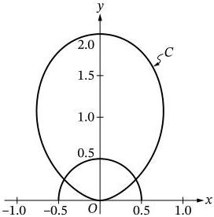
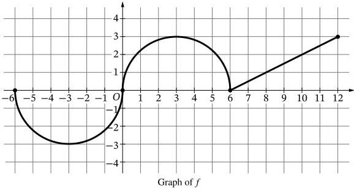

<!-- Page 1 -->

2025

# AP® Calculus BC
## Free-Response Questions

© 2025 College Board. College Board, Advanced Placement, AP, AP Central, and the acorn logo are registered trademarks of College Board. Visit College Board on the web: collegeboard.org.

AP Central is the official online home for the AP Program: apcentral.collegeboard.org.

<!-- Page 2 -->

AP CALCULUS BC 2025 • FREE-RESPONSE QUESTIONS

## CALCULUS BC
## SECTION II PART A
## TIME – 30 MINUTES

### Directions:

Section II, Part A has 2 free-response questions and lasts 30 minutes.

**A graphing calculator is required for the questions on this part of the exam.** You may use a handheld graphing calculator or the calculator available in this application. **Make sure your calculator is in radian mode.**

You may use the available paper for scratch work, but you must write your answers in the free-response booklet. In the free-response booklet, write your solution to each part of each question in the space provided for that part. For questions that have sub-parts, be sure to label those clearly in your solution. Use a pencil or a pen with black or dark blue ink.

You are permitted to use your calculator to solve an equation, find the derivative of a function at a point, or calculate the value of a definite integral. However, you must clearly indicate the setup of your question, namely the equation, function, or integral you are using. If you use other built-in features or programs, you must show the mathematical steps necessary to produce your results.

Show all of your work, even though a question may not explicitly remind you to do so. Clearly label any functions, graphs, tables, or other objects that you use. Justifications require that you give mathematical reasons and that you verify the needed conditions under which relevant theorems, properties, definitions, or tests are applied. Your work will be scored on the correctness and completeness of your methods as well as your answers. Answers without supporting work will usually not receive credit.

Your work must be expressed in standard mathematical notation rather than calculator syntax. For example, $\int_1^5 x^2 dx$ may not be written as $\text{fnInt}(X^2, X, 1, 5)$.

Unless otherwise specified, answers (numeric or algebraic) need not be simplified. If you use decimal approximations in calculations, your work will be scored on accuracy. Unless otherwise specified, your final answers should be accurate to three places after the decimal point.

Unless otherwise specified, the domain of a function $f$ is assumed to be the set of all real numbers $x$ for which $f(x)$ is a real number.

You can go back and forth between questions in this part until time expires. The clock will turn red when 5 minutes remain—**the proctor will not give you any time updates or warnings.**

Note: This exam was originally administered digitally. It is presented here in a format optimized for teacher and student use in the classroom.

© 2025 College Board.

Visit College Board on the web: collegeboard.org

2

<!-- Page 3 -->

AP CALCULUS BC 2025 • FREE-RESPONSE QUESTIONS

1. An invasive species of plant appears in a fruit grove at time $t = 0$ and begins to spread. The function $C$ defined by $C(t) = 7.6 \arctan(0.2t)$ models the number of acres in the fruit grove affected by the species $t$ weeks after the species appears. It can be shown that $C'(t) = \frac{38}{25 + t^2}$.

(Note: Your calculator should be in radian mode.)

A. Find the average number of acres affected by the invasive species from time $t = 0$ to time $t = 4$ weeks. Show the setup for your calculations.
B. Find the time $t$ when the instantaneous rate of change of $C$ equals the average rate of change of $C$ over the time interval $0 \leq t \leq 4$. Show the setup for your calculations.
C. Assume that the invasive species continues to spread according to the given model for all times $t > 0$. Write a limit expression that describes the end behavior of the rate of change in the number of acres affected by the species. Evaluate this limit expression.
D. At time $t = 4$ weeks after the invasive species appears in the fruit grove, measures are taken to counter the spread of the species. The function $A$, defined by $A(t) = C(t) - \int_4^t 0.1 \cdot \ln(x) dx$, models the number of acres affected by the species over the time interval $4 \leq t \leq 36$. At what time $t$, for $4 \leq t \leq 36$, does $A$ attain its maximum value? Justify your answer.

© 2025 College Board.

Visit College Board on the web: collegeboard.org

3

<!-- Page 4 -->

AP CALCULUS BC 2025 • FREE-RESPONSE QUESTIONS

2. Curve C is defined by the polar equation $r(\theta) = 2 \sin^2 \theta$ for $0 \leq \theta \leq \pi$. Curve C and the semicircle $r = \frac{1}{2}$ for $0 \leq \theta \leq \pi$ are shown in the xy-plane.

(Note: Your calculator should be in radian mode.)

A. Find the rate of change of $r$ with respect to $\theta$ at the point on curve C where $\theta = 1.3$. Show the setup for your calculations.
B. Find the area of the region that lies inside curve C but outside the graph of the polar equation $r = \frac{1}{2}$. Show the setup for your calculations.
C. It can be shown that $\frac{dx}{d\theta} = 4 \sin \theta \cos^2 \theta - 2 \sin^3 \theta$ for curve C. For $0 \leq \theta \leq \frac{\pi}{2}$, find the value of $\theta$ that corresponds to the point on curve C that is farthest from the y-axis. Justify your answer.
D. A particle travels along curve C so that $\frac{d\theta}{dt} = 15$ for all times $t$. Find the rate at which the particle's distance from the origin changes with respect to time when the particle is at the point where $\theta = 1.3$. Show the setup for your calculations.

END OF PART A

© 2025 College Board.

Visit College Board on the web: collegeboard.org

4

<!-- Page 5 -->

AP CALCULUS BC 2025 • FREE-RESPONSE QUESTIONS

## SECTION II PART B

# **Directions:**

Section II, Part B has 4 free-response questions and lasts 1 hour.

# **A calculator is not allowed for this part of the exam.**

You may use the available paper for scratch work, but you must write your answers in the free-response booklet. In the free-response booklet, write your solution to each part of each question in the space provided for that part. For questions that have sub-parts, be sure to label those clearly in your solution. Use a pencil or a pen with black or dark blue ink.

Show all of your work, even though a question may not explicitly remind you to do so. Clearly label any functions, graphs, tables, or other objects that you use. Justifications require that you give mathematical reasons and that you verify the needed conditions under which relevant theorems, properties, definitions, or tests are applied. Your work will be scored on the correctness and completeness of your methods as well as your answers. Answers without supporting work will usually not receive credit.

Your work must be expressed in standard mathematical notation rather than calculator syntax. For example, $\int_1^5 x^2 dx$ may not be written as $\text{fnInt}(X^2, X, 1, 5)$.

Unless otherwise specified, answers (numeric or algebraic) need not be simplified. If you use decimal approximations in calculations, your work will be scored on accuracy. Unless otherwise specified, your final answers should be accurate to three places after the decimal point.

Unless otherwise specified, the domain of a function $f$ is assumed to be the set of all real numbers $x$ for which $f(x)$ is a real number.

You can go back and forth between questions in this part until time expires. The clock will turn red when 5 minutes remain—**the proctor will not give you any time updates or warnings.**

© 2025 College Board.

Visit College Board on the web: collegeboard.org

5

<!-- Page 6 -->

AP CALCULUS BC 2025 • FREE-RESPONSE QUESTIONS

3. A student starts reading a book at time $t = 0$ minutes and continues reading for the next 10 minutes. The rate at which the student reads is modeled by the differentiable function $R$, where $R(t)$ is measured in words per minute. Selected values of $R(t)$ are given in the table shown.

|  $t$ (minutes) | 0 | 2 | 8 | 10  |
| --- | --- | --- | --- | --- |
|  $R(t)$ (words per minute) | 90 | 100 | 150 | 162  |

A. Approximate $R'(1)$ using the average rate of change of $R$ over the interval $0 \leq t \leq 2$. Show the work that leads to your answer. Indicate units of measure.
B. Must there be a value $c$, for $0 < c < 10$, such that $R(c) = 155$? Justify your answer.
C. Use a trapezoidal sum with the three subintervals indicated by the data in the table to approximate the value of $\int_0^{10} R(t)dt$. Show the work that leads to your answer.
D. A teacher also starts reading at time $t = 0$ minutes and continues reading for the next 10 minutes. The rate at which the teacher reads is modeled by the function $W$ defined by $W(t) = -\frac{3}{10}t^2 + 8t + 100$, where $W(t)$ is measured in words per minute. Based on the model, how many words has the teacher read by the end of the 10 minutes? Show the work that leads to your answer.

© 2025 College Board.

Visit College Board on the web: collegeboard.org

6

<!-- Page 7 -->

AP CALCULUS BC 2025 • FREE-RESPONSE QUESTIONS

4. The continuous function $f$ is defined on the closed interval $-6 \leq x \leq 12$. The graph of $f$, consisting of two semicircles and one line segment, is shown in the figure.

Let $g$ be the function defined by $g(x) = \int_6^x f(t)dt$.

A. Find $g'(8)$. Give a reason for your answer.
B. Find all values of $x$ in the open interval $-6 < x < 12$ at which the graph of $g$ has a point of inflection. Give a reason for your answer.
C. Find $g(12)$ and $g(0)$. Label your answers.
D. Find the value of $x$ at which $g$ attains an absolute minimum on the closed interval $-6 \leq x \leq 12$. Justify your answer.

© 2025 College Board.

Visit College Board on the web: collegeboard.org

7

<!-- Page 8 -->

AP CALCULUS BC 2025 • FREE-RESPONSE QUESTIONS

5. Let $y = f(x)$ be the particular solution to the differential equation $\frac{dy}{dx} = (3 - x)y^2$ with initial condition $f(1) = -1$.

A. Find $f''(1)$, the value of $\frac{d^2y}{dx^2}$ at the point $(1, -1)$. Show the work that leads to your answer.
B. Write the second-degree Taylor polynomial for $f$ about $x = 1$.
C. The second-degree Taylor polynomial for $f$ about $x = 1$ is used to approximate $f(1.1)$. Given that $|f'''(x)| \leq 60$ for all $x$ in the interval $1 \leq x \leq 1.1$, use the Lagrange error bound to show that this approximation differs from $f(1.1)$ by at most 0.01.
D. Use Euler's method, starting at $x = 1$ with two steps of equal size, to approximate $f(1.4)$. Show the work that leads to your answer.

© 2025 College Board.

Visit College Board on the web: collegeboard.org

8

<!-- Page 9 -->

AP CALCULUS BC 2025 • FREE-RESPONSE QUESTIONS

6. The Taylor series for a function $f$ about $x = 4$ is given by

$$\sum_{n=1}^{\infty} \frac{(x-4)^{n+1}}{(n+1)3^n} = \frac{(x-4)^2}{2 \cdot 3} + \frac{(x-4)^3}{3 \cdot 3^2} + \frac{(x-4)^4}{4 \cdot 3^3} + \dots + \frac{(x-4)^{n+1}}{(n+1)3^n} + \dots \text{ and converges to } f(x) \text{ on its interval of convergence.}$$

- A. Using the ratio test, find the interval of convergence of the Taylor series for $f$ about $x = 4$. Justify your answer.
- B. Find the first three nonzero terms and the general term of the Taylor series for $f'$, the derivative of $f$, about $x = 4$.
- C. The Taylor series for $f'$ described in part B is a geometric series. For all $x$ in the interval of convergence of the Taylor series for $f'$, show that $f'(x) = \frac{x-4}{7-x}$.
- D. It is known that the radius of convergence of the Taylor series for $f$ about $x = 4$ is the same as the radius of convergence of the Taylor series for $f'$ about $x = 4$. Does the Taylor series for $f'$ described in part B converge to $f'(x) = \frac{x-4}{7-x}$ at $x = 8$? Give a reason for your answer.

**STOP**
**END OF EXAM**

© 2025 College Board.
Visit College Board on the web: collegeboard.org

9
