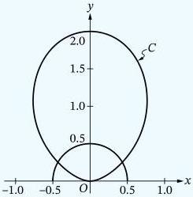
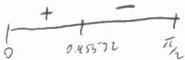
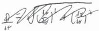
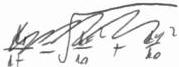

<!-- Page 1 -->

2025

AP

# AP® Calculus BC
## Sample Student Responses and Scoring Commentary

**Inside:**

**Free-Response Question 2**

- ☑ Scoring Guidelines
- ☑ Student Samples
- ☑ Scoring Commentary

© 2025 College Board. College Board, Advanced Placement, AP, AP Central, and the acorn logo are registered trademarks of College Board. Visit College Board on the web: collegeboard.org.

AP Central is the official online home for the AP Program: apcentral.collegeboard.org.

<!-- Page 2 -->

AP® Calculus AB/BC 2025 Scoring Guidelines

### Part A (BC): Graphing calculator required

#### Question 2

9 points

##### General Scoring Notes

- The model solution is presented using standard mathematical notation.
- Answers (numeric or algebraic) need not be simplified. Answers given as a decimal approximation should be accurate to three places after the decimal point. Within each individual free-response question, at most one point is not earned for inappropriate rounding.

Curve \( C \) is defined by the polar equation \( r(\theta) = 2\sin^2\theta \) for \( 0 \leq \theta \leq \pi \). Curve \( C \) and the semicircle \( r = \frac{1}{2} \) for \( 0 \leq \theta \leq \pi \) are shown in the \( xy \)-plane.

(Note: Your calculator should be in radian mode.)

|   | Model Solution | Scoring  |   |
| --- | --- | --- | --- |
|  A | Find the rate of change of \( r \) with respect to \( \theta \) at the point on curve \( C \) where \( \theta = 1.3 \). Show the setup for your calculations.  |   |   |
|   | \( \left.\frac{dr}{d\theta}\right|_{\theta=1.3} = 1.031003 \)The rate of change of \( r \) with respect to \( \theta \) at the point on curve \( C \) where \( \theta = 1.3 \) is 1.031. | Answer with setup | Point 1 (P1)  |

© 2025 College Board

<!-- Page 3 -->

AP® Calculus AB/BC 2025 Scoring Guidelines

### Scoring Notes for Part A

- An exact answer of $\left.\frac{dr}{d\theta}\right|_{\theta=1.3} = 4\sin(1.3)\cos(1.3)$ earns P1.
- To earn P1, a response must indicate differentiation of $r$ and provide the correct answer. A reported answer should be accurate to three places after the decimal point, rounded or truncated. An inappropriately rounded answer does not earn the point.

○ Examples of responses with correct communication include $\left.\frac{dr}{d\theta}\right|_{\theta=1.3} = 1.031$ and $r'(1.3) = 1.031$.

○ Responses with incorrect communication, such as $r'(\theta) = 1.031$, $r' = 1.031$, or $\frac{dr}{d\theta} = 1.031$, are sufficient to earn P1.

B

Find the area of the region that lies inside curve $C$ but outside the graph of the polar equation $r = \frac{1}{2}$. Show the setup for your calculations.

For $0 \le \theta \le \pi$, $r(\theta) = \frac{1}{2}$ for $\theta = \theta_1 = \frac{\pi}{6} = 0.523599$ and $\theta = \theta_2 = \frac{5\pi}{6} = 2.617994$.

$$\frac{1}{2} \int_{\theta_1}^{\theta_2} \left( (r(\theta))^2 - \left(\frac{1}{2}\right)^2 \right) d\theta$$

$$= 2.066769$$

The area is 2.067 (or 2.066).

Integrand including $\left(r(\theta)\right)^2$ Point 2 (P2)

Integrand Point 3 (P3)

Answer Point 4 (P4)

### Scoring Notes for Part B

- P2 is earned for a definite integral including $(r(\theta))^2$, such as $\int_a^b \left( (r(\theta))^2 - \left(\frac{1}{2}\right)^2 \right) d\theta$ or $\int_a^b (r(\theta))^2 d\theta$, with or without the differential $d\theta$.

- P3 is earned for a definite integral (or integrals) with a correct integrand, such as $\int_a^b \left( (r(\theta))^2 - \left(\frac{1}{2}\right)^2 \right) d\theta$ or $\int_a^b (r(\theta))^2 d\theta - \int_c^d \left(\frac{1}{2}\right)^2 d\theta$, with or without the differential $d\theta$.

- The limits $\theta_1 = \frac{\pi}{6} = 0.523599$ and $\theta_2 = \frac{5\pi}{6} = 2.617994$ and the factor $\frac{1}{2}$ are assessed in P4, not in P2 or P3.

- P4 is earned for the correct answer, with or without supporting work. A reported answer should be accurate to three places after the decimal point, rounded or truncated. An inappropriately rounded answer does not earn the point, unless an earlier point was not earned due to inappropriate rounding.

© 2025 College Board

<!-- Page 4 -->

AP® Calculus AB/BC 2025 Scoring Guidelines

- Incorrect or unclear communication between the correct integral and the correct answer is treated as scratch work and is not considered in scoring. For example:

$$\circ \int_{\pi/6}^{5\pi/6} \left( (r(\theta))^2 - \left(\frac{1}{2}\right)^2 \right) d\theta = 4.133538 \text{ so the area is } 2.067.$$

Note: This response earns P2 and P3 for the integral. It also earns P4 for the correct answer.

$$\circ \int_{\pi/6}^{5\pi/6} \left( (r(\theta))^2 - \left(\frac{1}{2}\right)^2 \right) d\theta = 2.067$$

Note: This response earns P2 and P3 for the integral. It also earns P4 for the correct answer. (In this instance, incorrect linkage is not considered in scoring.)

- Special case: An indefinite integral with a correct integrand does not earn P2, earns P3, and is eligible to earn P4 with a correct answer.
- A response of $$\int_{\pi/6}^{\pi/2} \left( (r(\theta))^2 - \left(\frac{1}{2}\right)^2 \right) d\theta = 2.067$$, using the symmetry of the region, earns P2, P3, and P4.

C

It can be shown that $$\frac{dx}{d\theta} = 4\sin\theta\cos^2\theta - 2\sin^3\theta$$ for curve C. For $$0 \le \theta \le \frac{\pi}{2}$$, find the value of $$\theta$$ that corresponds to the point on curve C that is farthest from the y-axis. Justify your answer.

For $$0 \le \theta \le \frac{\pi}{2}$$, the curve C is in the first quadrant. Thus, a point on the curve will be farthest away from the y-axis when the x-coordinate attains its maximum value. This will either occur when $$\frac{dx}{d\theta} = 0$$ or at an endpoint of the interval

$$0 \le \theta \le \frac{\pi}{2}.$$

$$\frac{dx}{d\theta} = 0$$

$$\Rightarrow \theta = 0.955317$$

|  $$\theta$$ | $$x(\theta) = r(\theta)\cos\theta$$  |
| --- | --- |
|  0 | 0  |
|  0.955317 | 0.769800  |
|  $$\frac{\pi}{2}$$ | 0  |

Therefore, the value of $$\theta$$ for which the point on the curve is farthest from the y-axis is 0.955.

Considers $$\frac{dx}{d\theta} = 0$$

Point 5 (P5)

Justification

Point 6 (P6)

Answer with supporting work

Point 7 (P7)

© 2025 College Board

<!-- Page 5 -->

AP® Calculus AB/BC 2025 Scoring Guidelines

# Scoring Notes for Part C

- P5 is earned for considering $$\frac{dx}{d\theta} = 0$$. P5 is not earned by just presenting $$\theta = 0.955317$$.

A response that discusses the sign of $$\frac{dx}{d\theta}$$ changing or uses the phrase “critical points of $$x(\theta)$$” also earns P5.

- The value $$\theta = 0.955317$$ might be presented as $$\arccos\left(\frac{1}{\sqrt{3}}\right)$$, $$\arcsin\left(\sqrt{\frac{2}{3}}\right)$$, or $$\arctan(\sqrt{2})$$.

- To earn P6 using a candidates test, a response must make a global argument by correctly evaluating $$x(\theta)$$ at $$\theta = 0$$, $$\theta = 0.955317$$, and $$\theta = \frac{\pi}{2}$$. The evaluations must be correct to the first digit after the decimal, rounded or truncated.

- Alternate justifications:

  - $$\frac{dx}{d\theta} > 0$$ for $$0 < \theta < 0.955$$, and $$\frac{dx}{d\theta} < 0$$ for $$0.955 < \theta < \frac{\pi}{2}$$. Therefore, $$\theta = 0.955$$ is the location of the absolute maximum for $$x(\theta)$$ on the interval $$0 \leq \theta \leq \frac{\pi}{2}$$.

  - Because $$\frac{dx}{d\theta}$$ changes sign from positive to negative at $$\theta = 0.955$$ (this might be presented as “$$\frac{dx}{d\theta} > 0$$ for $$\theta < 0.955$$, and $$\frac{dx}{d\theta} < 0$$ for $$\theta > 0.955$$”), it is the location of a relative maximum for $$x(\theta)$$. And because $$\theta = 0.955$$ is the only critical point of $$x(\theta)$$ in the interval $$0 \leq \theta \leq \frac{\pi}{2}$$, it is the location of the absolute maximum for $$x(\theta)$$ on the interval.

  - Because $$\left.\frac{dx}{d\theta}\right|_{\theta=0.955} = 0$$ and $$\left.\frac{d^2x}{d\theta^2}\right|_{\theta=0.955} < 0$$, $$\theta = 0.955$$ is the location of a relative maximum for $$x(\theta)$$. And because $$\theta = 0.955$$ is the only critical point of $$x(\theta)$$ in the interval $$0 \leq \theta \leq \frac{\pi}{2}$$, it is the location of the absolute maximum for $$x(\theta)$$ on the interval.

- A response that presents only a local argument (such as a First Derivative Test or a Second Derivative Test) or an incorrect global argument does not earn P6 but is eligible for P7 with the correct answer. A reported answer should be accurate to three places after the decimal point, rounded or truncated. An inappropriately rounded answer does not earn the point, unless an earlier point was not earned due to inappropriate rounding.

© 2025 College Board

<!-- Page 6 -->

AP® Calculus AB/BC 2025 Scoring Guidelines

D

A particle travels along curve C so that $$\frac{d\theta}{dt} = 15$$ for all times t. Find the rate at which the particle's distance from the origin changes with respect to time when the particle is at the point where $$\theta = 1.3$$. Show the setup for your calculations.

$$\left. \frac{dr}{dt} \right|_{\theta=1.3} = \left( \frac{dr}{d\theta} \cdot \frac{d\theta}{dt} \right) \Bigg|_{\theta=1.3} = 1.031003 \cdot 15 = 15.465041$$

The particle's distance from the origin changes at a rate of 15.465.

$$\frac{dr}{d\theta} \cdot \frac{d\theta}{dt}$$

Point 8 (P8)

Answer

Point 9 (P9)

### Scoring Notes for Part D

- To earn P8, $$\frac{dr}{d\theta} \cdot \frac{d\theta}{dt}$$ can be presented either symbolically or numerically.
- P8 might be earned in one or more steps.
- A response of 1.031·15 or [answer from part A]·15 earns both P8 and P9.
- P9 is earned for the correct answer, with or without supporting work. A reported answer should be accurate to three places after the decimal point, rounded or truncated. An inappropriately rounded answer does not earn the point, unless an earlier point was not earned due to inappropriate rounding.

© 2025 College Board

<!-- Page 7 -->

Sample 2A 1 of 2

Q2 Q2 Q2 Q2 Q2 Q2 Q2 Q2 Q2 Q2 Q2 Q2

Answer QUESTION 2 PARTS A and B on this page.

PART A

$$r \frac{dr}{dt} = 2 \sin \theta^2$$

$$\frac{dr}{dt} = \text{us} \text{ using } \cos \theta \text{ @ } \theta = 1.3 \approx$$

$$\frac{dr}{dt} \approx 4 \sin(1.3) \cdot \ln(1.3) \approx 1.031$$

PART B

$$2 \sin^2 \theta = \frac{1}{2}$$

$$A = \frac{1}{2} \int_{\pi/6}^{5\pi/6} [2 \sin^2 \theta]^2 d\theta - \frac{1}{2} \int_{\pi/6}^{5\pi/6} [\frac{1}{2}]^2 d\theta$$

$$\sin^2 \theta = \frac{1}{4}$$

$$\ln \theta = \frac{1}{2}$$

$$\theta = \pi/6, 5\pi/6$$

$$A \approx 2.06677 \text{ units}^2$$

Page 6

Use a pencil or a pen with black or dark blue ink. Do NOT write your name. Do NOT write outside the box.

Q5525/06

<!-- Page 8 -->

Sample 2A 2 of 2

Q2

Q2

Q2

Q2

Q2

Q2

Q2

Q2

Q2

Q2

Q2

Q2

Answer QUESTION 2 PARTS C and D on this page.

# PART C

$$45.16 \cos^2 \theta - 25.17 \theta = 0$$

$$@ \theta = 0.95532 < \pi/2$$

$$\theta = 2.48628 > \pi/2$$

$$\theta = \pi > \pi/2$$

$$x = 25.17 \cos \theta$$

contribute test

$$x(0) \approx 0$$

$$x(0.95532) \approx 0.7648$$

$$x(\frac{\pi}{2}) \approx 0$$

By the first diameter test, the

hiteness x from the y-axis is at a

max @ θ = 0.95532 b/c for zero zero positive

to negative, moving x you from increasing

to decreasing, and x(0.95532) is more drastic on

contribute test for 0 ≤ θ ≤ π/2

# PART D

$$y = 25.17^\circ \theta$$

$$\frac{dy}{dt} = 45.16 \cdot \cos \theta \cdot \frac{d\theta}{dt}$$

$$\frac{dy}{dt}(1.3) = 45.17(1.3) \cdot \cos(1.3) \cdot 15$$

$$\approx 1.031 \cdot 15$$

Page 7

Use a pencil or a pen with black or dark blue ink. Do NOT write your name. Do NOT write outside the box.

0165830

Q5685/07

<!-- Page 9 -->

Sample 2B 1 of 2

Q2 Q2 Q2 Q2 Q2 Q2 Q2 Q2 Q2 Q2 Q2

Answer QUESTION 2 PARTS A and B on this page.

PART A

$$r(\theta) = 2 \sin^2 \theta$$

$$\frac{dr}{d\theta} = 4 \sin \theta \cos \theta$$

$$\frac{dr}{d\theta} \quad r'(0) = 4 \sin \theta \cos \theta$$
$$r'(1.3) = 1.031$$

$$\frac{r'(0.7) \sin \theta}{r'(1.3) = 3.854}$$

PART B

$$\frac{1}{2} \int_{0}^{\pi} (2 \sin^2 \theta)^2 d\theta = \frac{1}{2} \int_{\frac{\pi}{6}}^{\frac{5\pi}{6}} (\frac{1}{2})^2 d\theta = \frac{5\pi}{12}$$

$$2 \sin^2 \theta = \frac{1}{2}$$
$$\sin^2 \theta = \frac{1}{4}$$
$$\sin \theta = \frac{1}{2}$$
$$\frac{\pi}{6} \frac{5\pi}{6}$$

Page 6

Use a pencil or a pen with black or dark blue ink. Do NOT write your name. Do NOT write outside the box.

Q5526/06

<!-- Page 10 -->

Sample 2B 2 of 2

Q2 Q2 Q2 Q2 Q2 Q2 Q2 Q2 Q2 Q2 Q2

Answer QUESTION 2 PARTS C and D on this page.

PART C

$$4 \sin \theta \cos^2 \theta - 7 \sin^3 \theta = 0$$

$$2 \sin \theta \cos^2 \theta - \sin^3 \theta = 0$$

$$2 \sin \theta \cos^2 \theta = \sin^3 \theta$$

$$0 \quad 2 \cos^2 \theta = \sin^2 \theta$$

PART D

$$\frac{d\theta}{dt} = 15$$
$$\frac{dr}{dt} = 24 \sin \theta \cos \theta \frac{d\theta}{dt} = 15$$
15.465

Page 7

Use a pencil or a pen with black or dark blue ink. Do NOT write your name. Do NOT write outside the box.

0078269

Q5685/07

<!-- Page 11 -->

Sample 2C 1 of 2

Q2 Q2 Q2 Q2 Q2 Q2 Q2 Q2 Q2 Q2 Q2

Answer QUESTION 2 PARTS A and B on this page.

PART A

$$r(\theta) = 2 \sin^2 \theta$$

$$\left. \frac{dr}{d\theta} \right|_{\theta=1.3} = 1.031$$

PART B

$$\int_{\pi/6}^{-\pi/6} ((r(\theta))^2 - (\frac{1}{2})) d\theta$$

$$\frac{1}{2} = 2 \sin^2 \theta$$

$$= 0.2065$$

$$\theta = -\frac{4}{6}, \frac{7}{6}$$

Page 6

Use a pencil or a pen with black or dark blue ink. Do NOT write your name. Do NOT write outside the box.

● ● ● ● ● ● ● ●

Q5625/06

<!-- Page 12 -->

Sample 2C 2 of 2

Q2 Q2 Q2 Q2 Q2 Q2 Q2 Q2 Q2 Q2 Q2

Answer QUESTION 2 PARTS C and D on this page.

PART C

$$\frac{ds}{dt} = 4 \sin \theta \cos^2 \theta - 2 \sin^2 \theta$$

The particle is

PART D

$$\frac{d\theta}{dt} = 15$$

$$\theta = 1.3$$

Page 7

Use a pencil or a pen with black or dark blue ink. Do NOT write your name. Do NOT write outside the box.

0085636

Q5526/07

<!-- Page 13 -->

AP CALCULUS BC 2025 • SCORING COMMENTARY

## Question 2

**Note:** Student samples are quoted verbatim and may contain spelling and grammatical errors.

### Overview

**NEW for 2025:** The question overviews can be found in the *Chief Reader Report on Student Responses* on AP Central.

### Sample: 2A

**Score: 9 (1-1-1-1-1-1-1-1-1)**

The response earned 9 points: 1 point in part A, 3 points in part B, 3 points in part C, and 2 points in part D.

In part A the response earned **P1** in the last line for a correct answer of $4\sin(1.3)\cos(1.3)$ along with a correct decimal approximation of that and identifying it as the derivative of $r$.

In part B the response earned **P2** in line 1 for presenting a definite integral including $(r(\theta))^2$. The response earned **P3** in line 1 for presenting definite integrals with correct integrands. The response earned **P4** because the boxed answer is correct.

In part C the response earned **P5** in line 1 for setting $\frac{dx}{d\theta}$ equal to 0. The response earned **P6** because the presented justification makes a correct global argument using the candidates test. The response earned **P7** because a correct answer is presented with supporting work.

In part D the response earned **P8** in line 2 because a correct product of derivatives is presented. The response earned **P9** for the answer $4\sin(1.3)\cdot\cos(1.3)\cdot15$ along with a correct decimal approximation of that in the last line.

### Sample: 2B

**Score: 6 (1-1-1-0-1-0-0-1-1)**

The response earned 6 points: 1 point in part A, 2 points in part B, 1 part in part C, and 2 points in part D.

In part A the response earned **P1** in line 4 for a correct answer identified as $r'(1.3)$.

In part B the response earned **P2** in line 1 for a definite integral including $(r(\theta))^2$. The response earned **P3** in line 1 for definite integrals with correct integrands. The response did not earn **P4** because the circled answer is incorrect.

In part C the response earned **P5** in line 1 for setting $\frac{dx}{d\theta}$ equal to 0. The response did not earn **P6** because no justification is presented. The response did not earn **P7** because the presented answer of 0 is incorrect.

In part D the response earned **P8** in line 2 because a correct product of derivatives is presented. The response earned **P9** in line 3 because a correct answer is presented.

© 2025 College Board.

Visit College Board on the web: collegeboard.org.

<!-- Page 14 -->

AP CALCULUS BC 2025 • SCORING COMMENTARY

## Question 2 (continued)

**Sample: 2C**

**Score: 2 (1-1-0-0-0-0-0-0-0)**

The response earned 2 points: 1 point in part A, 1 point in part B, 0 points in part C, and 0 points in part D.

In part A the response earned **P1** in line 2 for presenting a correct answer and identifying it as the derivative of $r$ at $\theta = 1.3$.

In part B the response earned **P2** in line 1 for presenting a definite integral including $(r(\theta))^2$. The response did not earn **P3** because the presented integrand is incorrect as $\frac{1}{2}$ is not squared. The response did not earn **P4** because the presented answer is incorrect.

In part C the response did not earn **P5** because $\frac{dx}{d\theta} = 0$ is not considered. The response did not earn **P6** because no justification is presented. The response did not earn **P7** because no answer is presented.

In part D the response did not earn **P8** because no product of derivatives is presented. The response did not earn **P9** because no answer is presented.

© 2025 College Board.

Visit College Board on the web: collegeboard.org.
